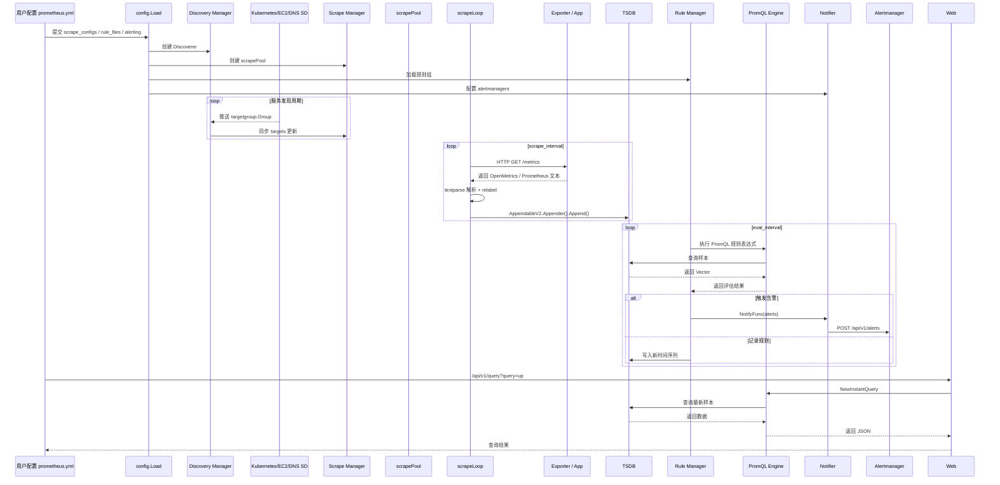

# Prometheus 整体架构分析

> 文档类型：解决方案思考 / 源码架构分析  
> 分析对象：Prometheus v3.13.0（浅克隆自 GitHub 官方仓库）  
> 适用读者：运维专家、技术架构师、AI 应用开发工程师  
> 目标：理解 Prometheus 整体设计，评估二次开发难度与可行切入点

---

## 1. 项目概览

### 1.1 项目定位

Prometheus 是 CNCF 孵化的开源系统与服务监控平台，采用**拉取模型（Pull Model）**采集指标，提供多维数据模型、PromQL 查询语言、告警规则与通知机制。其设计哲学强调：

- **单机自治**：单个 Prometheus Server 即可独立完成采集、存储、查询、告警
- **多维数据模型**：时间序列由 metric name + 一组 label key/value 唯一标识
- **Pull over Push**：默认通过 HTTP 主动抓取被监控端点
- **服务发现驱动**：支持 Kubernetes、Consul、EC2、DNS 等动态目标发现

### 1.2 版本与技术栈

| 项目 | 内容 |
|------|------|
| 项目名称 | Prometheus |
| 版本 | v3.13.0（`VERSION`） |
| 编程语言 | Go 1.25.8（`go.mod`） |
| 构建工具 | Makefile + promu |
| 前端 | React 实现的 Web UI |
| 协议 | HTTP/1.1、HTTP/2、gRPC（Remote Write/Read）、OpenMetrics、OTLP |
| 运行模式 | Server 模式 / Agent 模式 |

### 1.3 仓库规模感知

基于本地实际拉取的源码统计（`/Users/chenrt/S-03Python/03 AIopsAgent-study/CNCF_Monitor/prometheus`）：

| 指标 | 数值 |
|------|------|
| 顶层目录 | 24 个 |
| 二级以内目录 | 136 个 |
| 文件总数 | 约 1,700 个 |
| Go 源文件 | 约 725 个 |
| Go 代码行数 | 约 365,849 行 |
| 服务发现实现 | 25 种以上 |

> 说明：虽然本地为 `--depth 1` 克隆（git 历史仅保留最新提交），但源码文件本身是完整的，规模和实际发行版 v3.13.0 一致。代码量已达到中大型基础设施项目的水平。

核心目录包括：

- `cmd/prometheus/`：服务端主入口
- `cmd/promtool/`：命令行工具（规则检查、TSDB 分析、调试）
- `config/`：配置解析与校验
- `discovery/`：服务发现机制集合（25+ 种实现）
- `scrape/`：指标抓取与解析
- `tsdb/`：时序数据库实现
- `storage/`：存储抽象与远程读写
- `promql/`：PromQL 查询引擎
- `rules/`：告警与记录规则管理
- `notifier/`：告警通知分发
- `model/`：核心数据模型（labels、histogram、value、textparse 等）
- `prompb/`：Protocol Buffers 定义（Remote Write/Read、类型定义）
- `schema/`：schema 定义
- `template/`：告警模板
- `tracing/`：分布式追踪
- `util/`：通用工具库
- `web/`：HTTP API 与 Web UI
- `plugins/`：编译期插件注册
- `scripts/`：构建与发布脚本
- `compliance/`：合规性测试
- `internal/tools/`：内部工具依赖

---

## 2. 目录结构与模块职责

```
prometheus/
├── .github/                 # GitHub Actions、Issue 模板、PR 模板
├── cmd/
│   ├── prometheus/          # Prometheus Server 主程序入口
│   └── promtool/            # 命令行工具（规则校验、TSDB 工具、查询调试）
├── compliance/              # 合规性测试（go.mod 子模块）
├── config/                  # prometheus.yml 配置解析与校验
├── discovery/               # 服务发现抽象与具体实现（25+ 种）
│   ├── targetgroup/         # TargetGroup 数据模型
│   ├── manager.go           # Discovery Manager：统一管理所有 Discoverer
│   ├── registry.go          # Discoverer 注册表
│   ├── refresh/             # 周期性刷新发现机制基座
│   ├── kubernetes/          # K8s 服务发现
│   ├── aws/                 # AWS EC2/ECS/ElastiCache/Lightsail/RDS/MSK
│   ├── azure/、gce/          # 公有云服务发现
│   ├── consul/、dns/、file/、http/  # 常见服务发现
│   ├── moby/                # Docker / Docker Swarm
│   ├── nomad/、openstack/、oci/、puppetdb/
│   ├── hetzner/、ionos/、linode/、scaleway/、stackit/
│   ├── outscale/、ovhcloud/、triton/、uyuni/、vultr/
│   ├── eureka/、marathon/、runit/、supervisord/（相关）
│   ├── xds/                 # Envoy xDS / Kuma
│   └── zookeeper/
├── docs/                    # 官方 Markdown 文档
├── documentation/           # 文档示例与构建辅助
├── internal/tools/          # 内部工具依赖（go.mod 子模块）
├── model/                   # 核心数据模型
│   ├── labels/              # Label 集合与匹配器
│   ├── histogram/           # Native Histogram
│   ├── textparse/           # 指标文本解析（Prometheus/OpenMetrics/Protobuf）
│   ├── value/               # Sample 值类型
│   ├── exemplar/            # Exemplar 链路追踪样本
│   ├── metadata/            # Metric 元数据
│   ├── relabel/             # Relabel 规则
│   ├── rulefmt/             # 规则文件格式
│   └── timestamp/           # 时间戳工具
├── notifier/                # 告警通知器
├── plugins/                 # 编译期插件注册（云服务 SDK 等）
├── prompb/                  # Protocol Buffers 定义
│   ├── remote.proto、remote.pb.go  # Remote Write/Read
│   └── types.proto、types.pb.go    # 类型定义
├── promql/                  # PromQL 查询引擎
│   ├── engine.go            # 查询执行引擎
│   ├── parser/              # PromQL 解析器与 AST
│   ├── promqltest/          # PromQL 测试框架
│   └── value.go、functions.go  # 值类型与函数
├── rules/                   # 规则引擎
│   ├── manager.go           # Rule Manager：规则组评估调度
│   ├── group.go             # 规则组
│   ├── alerting.go          # 告警规则
│   ├── recording.go         # 记录规则
│   └── rule.go              # 规则基类
├── schema/                  # Schema 定义
├── scrape/                  # 指标抓取核心
│   ├── manager.go           # Scrape Manager：管理 scrape pool
│   ├── scrape.go            # scrapePool / scrapeLoop 实现
│   ├── target.go            # Target 模型与 relabel 处理
│   ├── clientprotobuf.go    # Protobuf 抓取客户端
│   └── metrics.go           # Scrape 自身指标
├── scripts/                 # 构建、发布、检查脚本
├── storage/                 # 存储抽象层
│   ├── interface.go         # Appendable / Queryable / Storage 接口
│   ├── remote/              # Remote Write / Remote Read 实现
│   └── buffer.go、fanout.go、merge.go  # 存储辅助实现
├── template/                # 告警通知模板
├── tracing/                 # OpenTelemetry 分布式追踪
├── tsdb/                    # 本地时序数据库
│   ├── db.go                # TSDB 入口与配置
│   ├── head.go              # 内存中的 Head 块
│   ├── block.go             # 持久化 Block
│   ├── wal/、wlog/           # Write-Ahead Log
│   ├── chunks/、chunkenc/    # Chunk 存储与编码（XOR、直方图）
│   ├── index/               # 倒排索引
│   ├── agent/               # Agent 模式存储
│   └── fileutil/、tsdbutil/  # 文件与 TSDB 工具
├── util/                    # 通用工具库
│   ├── compression/         # 压缩抽象
│   ├── documentcli/         # CLI 文档生成
│   ├── features/            # 特性开关
│   ├── logging/             # JSON 失败日志
│   ├── osutil/、pool/、runtime/
│   └── stats/、strutil/、zeropool/
└── web/                     # HTTP API 与 Web UI
    ├── api/、web.go、handler  # HTTP 路由与 API
    └── ui/                  # React 前端（web/ui/）
```

---

## 3. 启动流程

Prometheus Server 的启动入口为 [`cmd/prometheus/main.go`](file:///Users/chenrt/S-03Python/03 AIopsAgent-study/CNCF_Monitor/prometheus/cmd/prometheus/main.go#L368)。

### 3.1 启动阶段

```
1. 命令行参数解析（kingpin）
   └── 配置 config.file、web.listen-address、storage.tsdb.* 等
2. 特性开关处理（--enable-feature）
   └── exemplar-storage、native-histograms、concurrent-rule-eval 等
3. 日志、指标、tracing 初始化
4. 配置加载（config.Load）
   └── 解析 prometheus.yml，包含 global、scrape_configs、rule_files、alerting 等
5. TSDB / Agent 存储初始化
   └── tsdb.Open() 或 agent.Open()
6. 核心管理器初始化
   ├── Discovery Manager
   ├── Scrape Manager
   ├── Rule Manager
   ├── Notifier
   └── Query Engine
7. Web 服务启动
   └── 监听 0.0.0.0:9090，暴露 /query、/api/v1/*、/graph 等
8. 通过 oklog/run 统一调度各组件生命周期
9. 等待信号（SIGHUP 重载、SIGTERM 优雅退出）
```

### 3.2 关键对象关系

```
main()
 ├── flagConfig              # CLI 参数聚合
 ├── config.Load()           # YAML 配置解析
 ├── tsdb.Open()             # 本地 TSDB
 ├── discovery.NewManager()  # 服务发现管理器
 ├── scrape.NewManager()     # 抓取管理器（依赖 storage.Appendable）
 ├── rules.NewManager()      # 规则管理器（依赖 PromQL Engine + Notifier）
 ├── notifier.NewManager()   # 通知管理器
 ├── promql.NewEngine()      # 查询引擎
 └── web.New()               # Web/API 层
```

---

## 4. 核心模块详解

### 4.1 服务发现（discovery）

**核心文件**：[`discovery/discovery.go`](file:///Users/chenrt/S-03Python/03 AIopsAgent-study/CNCF_Monitor/prometheus/discovery/discovery.go#L35)、[`discovery/manager.go`](file:///Users/chenrt/S-03Python/03 AIopsAgent-study/CNCF_Monitor/prometheus/discovery/manager.go#L90)

**核心抽象**：

```go
// Discoverer 是所有服务发现机制的通用接口
type Discoverer interface {
    Run(ctx context.Context, up chan<- []*targetgroup.Group)
}
```

**职责**：

- 将配置中的 `scrape_configs[].service_discovery_configs` 转换为具体的 Discoverer
- 每个 Discoverer 异步运行，通过 channel 推送 `targetgroup.Group`
- Discovery Manager 聚合所有 Discoverer 的输出，合并后分发给订阅者（Scrape Manager）

**已实现的发现机制**：

Kubernetes、AWS EC2/ECS/ElastiCache/Lightsail/RDS/MSK、Azure、GCE、Consul、DNS、File、Docker Swarm、Nomad、OpenStack、OVHcloud、Scaleway、Linode、Triton、Vultr、PuppetDB、HTTP SD、Zookeeper 等。

### 4.2 数据采集（scrape）

**核心文件**：[`scrape/manager.go`](file:///Users/chenrt/S-03Python/03 AIopsAgent-study/CNCF_Monitor/prometheus/scrape/manager.go#L51)、[`scrape/scrape.go`](file:///Users/chenrt/S-03Python/03 AIopsAgent-study/CNCF_Monitor/prometheus/scrape/scrape.go#L82)

**职责**：

- 接收 Discovery Manager 推送的 target group
- 为每个 job 维护一个 `scrapePool`
- 每个 target 对应一个 `scrapeLoop`，按 `scrape_interval` 周期性 HTTP 抓取
- 抓取结果经过 `textparse` 解析后，通过 `storage.Appendable` 写入 TSDB
- 支持 relabel、指标丢弃、TLS、OAuth、服务账户等认证

**关键类型**：

| 类型 | 职责 |
|------|------|
| `Manager` | 管理所有 scrapePool |
| `scrapePool` | 对应一个 scrape job，管理一组 target |
| `scrapeLoop` | 对应一个 target，周期性抓取与追加 |
| `Target` | 代表一个被监控端点 |

### 4.3 时序存储（tsdb / storage）

**核心文件**：[`storage/interface.go`](file:///Users/chenrt/S-03Python/03 AIopsAgent-study/CNCF_Monitor/prometheus/storage/interface.go#L82)、[`tsdb/db.go`](file:///Users/chenrt/S-03Python/03 AIopsAgent-study/CNCF_Monitor/prometheus/tsdb/db.go#L75)

**核心抽象**：

```go
type Storage interface {
    SampleAndChunkQueryable   // 查询能力
    Appendable                // 追加能力（V1，即将移除）
    AppendableV2              // 追加能力（V2，推荐）
    StartTime() (int64, error)
    Close() error
}
```

**TSDB 存储结构**：

```
TSDB
 ├── Head（内存）
 │   ├── 最近写入的样本
 │   ├── WAL（Write-Ahead Log）
 │   └── mmapped chunks
 └── Blocks（磁盘）
     ├── 2 小时一个 block（默认）
     ├── 每个 block 包含 chunks、index、meta.json
     └── 后台 compaction 合并小 block
```

**关键特性**：

- 默认 15 天数据保留
- XOR 浮点数压缩
- Native Histogram 支持
- Out-of-order 样本支持（可配置）
- Exemplar 追踪支持

### 4.4 查询引擎（promql）

**核心文件**：[`promql/engine.go`](file:///Users/chenrt/S-03Python/03 AIopsAgent-study/CNCF_Monitor/prometheus/promql/engine.go#L59)

**职责**：

- 解析 PromQL 表达式（`promql/parser`）
- 生成抽象语法树（AST）
- 调用 `storage.Queryable` 读取样本
- 执行向量选择、聚合、二元运算、函数、子查询等
- 支持 instant query 与 range query

**关键指标**：

- `query_timeout`：查询超时
- `query.max-samples`：最大样本数限制
- `query.lookback-delta`：默认 5 分钟回查窗口

### 4.5 规则引擎（rules）

**核心文件**：[`rules/manager.go`](file:///Users/chenrt/S-03Python/03 AIopsAgent-study/CNCF_Monitor/prometheus/rules/manager.go#L99)

**职责**：

- 加载 `rule_files` 中的告警规则（alerting rules）与记录规则（recording rules）
- 按规则组（group）周期性评估
- 告警规则触发后生成 Alert，通过 `NotifyFunc` 传递给 Notifier
- 记录规则结果写回 TSDB

**关键类型**：

| 类型 | 职责 |
|------|------|
| `Manager` | 规则组生命周期管理 |
| `Group` | 一组规则，共享评估间隔 |
| `AlertingRule` | 告警规则定义与评估 |
| `RecordingRule` | 记录规则定义与评估 |

### 4.6 告警通知（notifier）

**核心文件**：[`notifier/manager.go`](file:///Users/chenrt/S-03Python/03 AIopsAgent-study/CNCF_Monitor/prometheus/notifier/manager.go#L53)

**职责**：

- 接收 Rule Manager 生成的 Alert
- 按 `alerting.alertmanagers` 配置将告警批量发送至 Alertmanager
- 支持 relabel、外部标签、批量大小控制
- 维护告警队列与重试机制

### 4.7 Web 层与 API

**核心目录**：`web/`

**职责**：

- 提供 HTTP API（`/api/v1/query`、`/api/v1/query_range`、`/api/v1/targets` 等）
- 提供 Web UI（`/graph`、状态页、配置页）
- 支持 Remote Write Receiver、OTLP Receiver
- 管理 /metrics 自身指标暴露

---

## 5. 典型数据流：从发现到告警

以下是一次完整的监控数据生命周期，使用 Mermaid 序列图描述：



---

## 6. 关键接口与扩展点

Prometheus 提供了多个稳定的扩展接口，适合二次开发：

| 扩展点 | 接口/机制 | 适用场景 | 难度 |
|--------|-----------|----------|------|
| 自定义服务发现 | `discovery.Discoverer` | 对接内部 CMDB、注册中心 | 中 |
| 自定义 Collector（node_exporter） | `collector.Collector` | 暴露自定义系统指标 | 低 |
| Remote Write | `storage.Appendable` / `remote.WriteStorage` | 将数据转发到长期存储 | 中 |
| Remote Read | `storage.Queryable` | 让 Prometheus 查询外部存储 | 中 |
| 告警接收器 | Alertmanager HTTP API | 自定义告警路由与通知 | 低 |
| PromQL 函数扩展 | 修改 parser + engine | 新增查询函数 | 高 |
| TSDB 存储后端 | 实现 `storage.Storage` | 替换本地存储 | 高 |
| Web UI 插件 | React 前端 | 自定义可视化 | 中 |

### 6.1 服务发现扩展示例

```go
// 实现一个自定义 Discoverer
type MyDiscoverer struct{}

func (d *MyDiscoverer) Run(ctx context.Context, up chan<- []*targetgroup.Group) {
    // 1. 从内部 CMDB 拉取目标
    // 2. 组装 []*targetgroup.Group
    // 3. 推送到 up channel
}
```

### 6.2 Remote Write 扩展

`storage/remote/` 已内置 Kafka、Azure AD、Google IAM、SigV4 等认证，二次开发主要集中在：

- 自定义 `queue_manager` 的队列与重试策略
- 自定义 `WriteStorage` 以适配私有协议

---

## 7. 依赖分析

从 [`go.mod`](file:///Users/chenrt/S-03Python/03 AIopsAgent-study/CNCF_Monitor/prometheus/go.mod) 可见 Prometheus 的核心依赖：

| 依赖 | 用途 |
|------|------|
| `prometheus/client_golang` | 自身指标暴露、HTTP handler |
| `prometheus/common` | 配置模型、日志、版本、HTTP 工具 |
| `prometheus/exporter-toolkit` | Web TLS / 认证 |
| `oklog/run` | 组件生命周期管理 |
| `kingpin/v2` | CLI 参数解析 |
| `gogo/protobuf` | Protobuf 序列化 |
| `klauspost/compress` | gzip/zstd 压缩 |
| `fsnotify` | 配置文件热重载监听 |
| `k8s.io/client-go` | Kubernetes 服务发现 |
| AWS/Azure/GCP/Consul/Nomad SDK | 多云服务发现 |
| OpenTelemetry Collector | OTLP 接收与转换 |

**评估**：依赖多为云原生生态标准库，更新活跃，文档完善，风险可控。

---

## 8. 二次开发难度评估

| 维度 | 等级 | 说明 |
|------|------|------|
| 代码规模 | **高** | 本地源码约 725 个 Go 文件、36.5 万行 Go 代码，模块众多，属于中大型基础设施项目 |
| 技术栈熟悉度 | **中-高** | 需掌握 Go、Prometheus 数据模型、TSDB、PromQL、HTTP/gRPC |
| 模块耦合度 | **中** | 核心模块通过接口解耦，但配置、启动流程耦合较紧 |
| 扩展机制 | **中** | 服务发现、Remote Write/Read、Collector 扩展较成熟 |
| 测试与调试 | **中** | 单元测试丰富，但完整集成测试需搭建多组件环境 |
| 文档完整度 | **高** | 官方文档、源码注释、设计提案（proposals）齐全 |
| 社区活跃度 | **高** | CNCF 毕业项目，PR/Issue 活跃，版本迭代快 |

### 8.1 整体难度评级

**综合评级：中高**

Prometheus 代码成熟、结构清晰，适合有 Go 基础和监控领域经验的团队进行二次开发。但直接修改核心引擎（PromQL、TSDB）门槛较高，建议从扩展点开始。

---

## 9. 建议的切入点与风险点

### 9.1 推荐切入点（由易到难）

1. **自定义服务发现**（难度：中）
   - 实现 `discovery.Discoverer` 接口
   - 将内部 CMDB / 注册中心接入 Prometheus
   - 参考：`discovery/file/`、`discovery/http/`

2. **自定义 Exporter Collector**（难度：低）
   - 在 node_exporter 中新增 `collector.Collector`
   - 适合暴露特定硬件或中间件指标
   - 参考：`node_exporter/collector/`（同仓库下）

3. **Remote Write 适配器**（难度：中）
   - 修改 `storage/remote/client.go` 或自定义 WriteStorage
   - 将数据转发到企业级存储或消息队列

4. **告警增强**（难度：中）
   - 在 Rule Manager 或 Notifier 层增加告警聚合、静默、路由逻辑

### 9.2 高风险区域

| 区域 | 风险 | 原因 |
|------|------|------|
| `tsdb/` | **高** | 存储格式、WAL、compaction 影响数据一致性与性能 |
| `promql/engine.go` | **高** | 查询引擎改动影响所有查询语义与性能 |
| `scrape/scrape.go` | **中** | 抓取协议、解析逻辑改动影响数据采集准确性 |
| `config/config.go` | **中** | 配置变更涉及向后兼容与大量测试 |

### 9.3 建议学习路径

1. 先阅读 `README.md` 与 `docs/` 中的架构图
2. 从 `cmd/prometheus/main.go` 跟踪启动流程
3. 精读 `discovery/discovery.go`、`scrape/manager.go`、`storage/interface.go` 三个接口
4. 选择一个简单 Discoverer（如 `discovery/file`）完整走读
5. 跟踪一次 `scrapeLoop` 从 HTTP 请求到 TSDB Append 的完整链路
6. 阅读 PromQL 官方文档与 `promql/engine.go` 的查询执行流程
7. 通过 `make test` 跑通单元测试，建立调试环境

---

## 10. 小结

Prometheus 是一个分层清晰、接口明确的云原生监控系统：

- **发现层**负责动态维护目标
- **采集层**负责周期性拉取与解析
- **存储层**负责高效时序数据持久化
- **查询层**负责 PromQL 执行
- **规则层**负责告警与记录规则评估
- **通知层**负责告警外发

对于二次开发，**优先选择扩展点而非修改核心引擎**。服务发现、Remote Write、Collector 是最可行的切入点；TSDB 与 PromQL 引擎改动需谨慎评估。

---

## 附录：相关源码文件速查

| 模块 | 关键文件 |
|------|----------|
| 入口 | [`cmd/prometheus/main.go`](file:///Users/chenrt/S-03Python/03 AIopsAgent-study/CNCF_Monitor/prometheus/cmd/prometheus/main.go) |
| 配置 | [`config/config.go`](file:///Users/chenrt/S-03Python/03 AIopsAgent-study/CNCF_Monitor/prometheus/config/config.go) |
| 服务发现接口 | [`discovery/discovery.go`](file:///Users/chenrt/S-03Python/03 AIopsAgent-study/CNCF_Monitor/prometheus/discovery/discovery.go) |
| 服务发现管理 | [`discovery/manager.go`](file:///Users/chenrt/S-03Python/03 AIopsAgent-study/CNCF_Monitor/prometheus/discovery/manager.go) |
| 抓取管理 | [`scrape/manager.go`](file:///Users/chenrt/S-03Python/03 AIopsAgent-study/CNCF_Monitor/prometheus/scrape/manager.go) |
| 抓取实现 | [`scrape/scrape.go`](file:///Users/chenrt/S-03Python/03 AIopsAgent-study/CNCF_Monitor/prometheus/scrape/scrape.go) |
| 存储接口 | [`storage/interface.go`](file:///Users/chenrt/S-03Python/03 AIopsAgent-study/CNCF_Monitor/prometheus/storage/interface.go) |
| TSDB | [`tsdb/db.go`](file:///Users/chenrt/S-03Python/03 AIopsAgent-study/CNCF_Monitor/prometheus/tsdb/db.go) |
| 查询引擎 | [`promql/engine.go`](file:///Users/chenrt/S-03Python/03 AIopsAgent-study/CNCF_Monitor/prometheus/promql/engine.go) |
| 规则管理 | [`rules/manager.go`](file:///Users/chenrt/S-03Python/03 AIopsAgent-study/CNCF_Monitor/prometheus/rules/manager.go) |
| 告警通知 | [`notifier/manager.go`](file:///Users/chenrt/S-03Python/03 AIopsAgent-study/CNCF_Monitor/prometheus/notifier/manager.go) |
