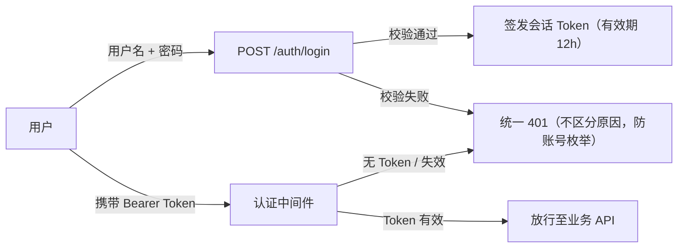

# Module 03: 网关与认证

> **PRD 状态**: `dev-ready`（Track B+ 增量 v1.2，2026-08-28 用户书面确认）
> **PRD 版本**: v1.4
> **产品版本覆盖**: MVP / v0.3 / v1.0
> **原型版本**: v1.1（Track B+ 增量免高保真原型，决策 44；PRD v1.4 为去历史化 + 章节结构对齐纯文档轮——正文内联决策标注迁 design-decisions，接口契约归 §6、验收归 §9、依赖归 §7，规格语义零变更、原型无需同步）
> **更新日期**: 2026-09-16
> **对应原型**: `docs/prototypes/module-03/`

> **模块类型**: 基础设施模块
> **依赖文档**: [00\_Global\_Architecture.md](../00_Global_Architecture.md)、[03\_Functional\_Architecture.md](../03_Functional_Architecture.md)
> **目标用户**: 运维架构师、所有平台用户

---

## 1. 模块目标

作为 MetricCenter 的统一入口与网关框架，提供 API 路由、查询代理、配置管理 API 转发能力，以及网关层的认证鉴权、多租户路由、请求级审计中间件。

MVP 阶段落地**轻量认证**：用户名 + 密码登录、会话 Token、认证中间件拒绝匿名请求；**不做授权与多租户隔离**（无角色 / 权限点 / 租户数据隔离，所有登录用户等价），属已知风险，依赖部署网络隔离兜底。v1.0 阶段由本模块提供完整网关层鉴权与审计能力；用户/角色/租户/权限策略的生命周期管理由 [Module\_06](Module_06_Multi_Tenant.md) 负责。

> **与 Module 08 的边界**：告警状态查询 `/api/v1/alerts` 由 Gateway 代理到 Prometheus；功能 Owner 为 [Module 08: 告警规则管理](Module_08_Alertmanager_Notification_Management.md)。

---

## 2. 用户故事

- OPS-03：通过统一入口执行 PromQL 查询
- M03-OPS-08：通过统一入口管理采集配置
- ARCH-01：未来需要支持多租户（v1.0）
- ARCH-05：未来需要管理用户权限与角色（v1.0）

---

## 3. 核心功能

| 功能 | 说明 | 优先级 |
|------|------|--------|
| 统一入口 | 所有请求通过 Gateway 进入 | P0 |
| 查询代理 | 将查询请求转发到 Prometheus，统一返回格式 | P0 |
| 配置管理 API 路由 | 将配置相关请求路由到 `platform/config/` | P0 |
| 轻量认证（登录 + 会话 + 认证中间件） | 用户名/密码登录、Token 签发与校验、拒绝匿名请求；用户数据由 Module\_06 维护 | P0（MVP，决策 44） |
| 授权 / RBAC 中间件 | 网关层角色 / 权限点 / SSO 校验 | P2（v1.0） |
| 多租户路由 | 根据租户身份路由或注入 tenant label；租户数据由 Module\_06 维护 | P2（MVP 不做） |
| 请求级审计 | 记录关键请求、操作与查询事件；审计日志展示/归档由 Module\_06 负责 | P2（MVP 不做） |
| Ingestion Gateway 框架 | 为 Module\_10 提供可挂载路由/中间件能力，具体 Remote Write 业务逻辑由 Module\_10 实现 | P1（v0.3，随 Module\_10 一并后移） |

---

## 4. 核心流程

### 4.1 认证流程（MVP）

**机制约定**：

- 密码 bcrypt 哈希存储（用户模型见 [Module\_06](Module_06_Multi_Tenant.md) §5.3）；任何接口 / 日志不返回明文或哈希；
- Token 为不透明随机串，服务端 `sessions` 表存储，有效期 12 小时，过期 / 登出 / 改密 / 用户被禁用即失效；
- 认证中间件：除 `POST /auth/login` 与 `/api/v1/health*` 外，所有 `/api/*` 请求须携带有效 Token（`Authorization: Bearer <token>`），否则 401；**中间件只认证、不授权**（无角色 / 权限点校验）；
- 初始管理员 `admin` 由后端启动 migration upsert 预置（幂等，与平台统一种子机制一致），初始密码为部署配置项（默认 `admin123`），首次登录引导改密；
- 前端：登录页 + 路由守卫（未登录跳登录页，成功后回跳原页面）+ Token 本地存储（localStorage），401 响应统一跳登录页。

> Track B+ 安全敏感能力，开发必须过 security-reviewer（密码哈希、会话管理、时序攻击面）。

### 4.2 权限模型（v1.0 阶段预留）

> MVP 不启用本权限模型（所有登录用户等价，无授权隔离）；决策依据见 design-decisions 决策 44。

角色定义与权限策略由 [Module\_06](Module_06_Multi_Tenant.md) 维护。本模块仅按角色策略执行网关层鉴权。

| 角色 | 权限 |
|------|------|
| platform\_admin | 管理租户、用户、全局配置 |
| tenant\_admin | 管理租户内用户、发现源、采集目标 |
| operator | 查看目标、执行查询、配置告警 |
| viewer | 只读访问指标与看板 |

---

## 5. 数据模型

本模块不定义独立业务实体：用户 / 租户 / 角色数据由 [Module\_06](Module_06_Multi_Tenant.md) 维护，审计日志归档由 Module\_06 负责。本模块仅持有服务端会话凭证：

| 字段 | 类型 | 必填 | UI 展示名 | 说明 |
|------|------|------|-----------|------|
| token | string | ✅ | — | 不透明随机串，`Authorization: Bearer <token>` 携带 |
| user\_id | string | ✅ | — | 关联 [Module\_06](Module_06_Multi_Tenant.md) 用户模型 |
| expires\_at | datetime | ✅ | — | 签发时间 + 12 小时；过期 / 登出 / 改密 / 用户被禁用即失效 |

---

## 6. 接口设计

| 方法 | 路径 | 说明 |
|------|------|------|
| POST | `/api/v2/platform/auth/login` | 用户名 + 密码登录；成功返回 `{token, expires_at, user}` 并写 LoginLog；失败返回统一 401（不区分账号不存在 / 密码错误，防账号枚举）并写 LoginLog |
| POST | `/api/v2/platform/auth/logout` | 登出，服务端会话失效 |
| GET | `/api/v2/platform/auth/me` | 返回当前登录用户信息（`username` / `display_name` / `tenant_id`） |
| PUT | `/api/v2/platform/auth/password` | 当前用户自助改密（校验旧密码；改密后旧会话失效） |

认证中间件运行时行为（放行清单、Token 校验、401 语义）见 §4.1「机制约定」；登录成功 / 失败均写 LoginLog（M06 §5.4）。

---

## 7. 依赖

- `platform/gateway/`
- `platform/gateway/auth/`（MVP 轻量认证中间件）
- `platform/models/`

---

## 8. 数据模型状态机

本模块无可状态机管理的长生命周期实体：会话（`sessions`）为短生命周期凭证——签发后 12 小时内有效，过期 / 登出 / 改密 / 用户被禁用即失效，无中间状态流转（失效语义见 §4.1 机制约定）；会话数据本身不做状态回写与展示。

---

## 9. 验收标准

- [ ] 所有前端请求通过 Gateway 统一入口
- [ ] 查询请求正确代理到 Prometheus
- [ ] 配置管理 API 正确路由到 `platform/config/`
- [ ] {P0} MVP 落地轻量认证：`POST /api/v2/platform/auth/login` 成功返回 Token，失败统一 401 不区分原因；`logout` / `me` / `auth/password` 可用
- [ ] {P0} 匿名请求（除登录与健康检查外）被认证中间件拒绝并返回 401；持有效 Token 可正常访问
- [ ] {P0} 密码 bcrypt 哈希存储；Token 不透明、服务端可失效（登出 / 过期 / 改密 / 用户禁用）
- [ ] {P0} 无授权隔离：中间件只认证不授权，所有登录用户等价（MVP 已知风险，依赖部署网络隔离兜底）
- [ ] {P1} 登录成功 / 失败均写 LoginLog（M06 §5.4）

---

## 10. 术语映射

| 术语 | 英文 / 代码标识 | 说明 |
|------|-----------------|------|
| 轻量认证 | lightweight auth | MVP 认证形态：用户名 + 密码登录 + 会话 Token + 认证中间件，无授权隔离 |
| 会话 Token | session token | 服务端 `sessions` 表存储的不透明随机串，有效期 12 小时 |
| 认证中间件 | auth middleware | 网关层全局中间件，只认证、不授权 |
| 种子账号 | seed account | 后端启动 migration upsert 预置的初始管理员 `admin` |

---

## 11. 前端交互契约

- **登录页**：用户名 + 密码表单；提交调用 `POST /api/v2/platform/auth/login`，成功存储 Token 并回跳原页面，失败展示统一错误提示（不区分账号不存在 / 密码错误）。
- **路由守卫**：未登录访问受保护页面跳登录页；登录成功后回跳原页面。
- **Token 存储**：localStorage；`POST /auth/logout` / 改密 / 401 时清除。
- **401 统一处理**：任意业务接口返回 401 时清除本地 Token 并跳登录页。

---

## Change Log

| 版本 | 日期 | 变更类型 | 变更内容 | 影响范围 | 产品版本影响 | 状态 |
|------|------|----------|----------|----------|--------------|------|
| v1.4 | 2026-09-16 | 精简 | 去历史化 + 章节对齐 11 章模板：正文 6 处决策标注迁 DD；接口契约归 §6、权限模型归 §4.2、验收归 §9、依赖归 §7，新增 §5/§8/§10/§11 承接 | 全文 | 文档自身 | 待确认 |
| v1.3 | 2026-09-02 | 修改 | v0.2 范围收敛（与产品负责人确认）：统一入口 / Ingestion 路由后移 v0.3，Edge Sync Agent 直连拉取配置；MVP 轻量认证不变 | 头部产品版本覆盖、3 核心功能 | v0.3 | 待确认 |
| v1.2 | 2026-08-28 | 新增 | 决策 44 落版（Track B+ 免高保真原型）：MVP 落地轻量认证（登录 / 会话 / 中间件），新增 §4.0 设计与认证验收；§1 修订为「轻量认证、无授权隔离」 | 1 模块目标、3 核心功能、4 权限模型、5 依赖、6 验收标准 | MVP | 待确认（dev-ready） |
