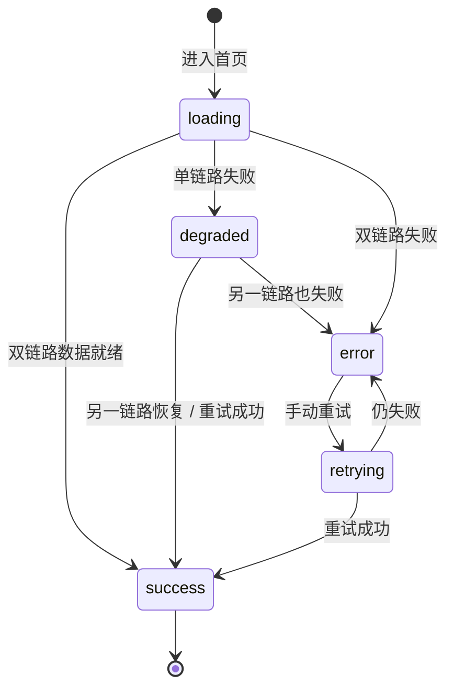

# Module 05: 自定义前端门户

> **PRD 状态**: `dev-ready`（Track B 增量 v1.5，2026-09-14 用户书面确认设计意见与首页内容重构 as-built 回填；原型验证豁免，记录见 `docs/05-execution-records/module-05/design-decisions.md`「Track B 豁免记录」与「决策 72 补丁」）
> **PRD 版本**: v1.5
> **产品版本覆盖**: MVP / v0.3 / v1.0
> **原型版本**: v1.2.1（**已对齐 v1.5**：六步指引 / Dashboard 布局 / 视觉 Token 规范 / 指标卡资产口径 + 告警卡承载最新告警列表 / 「查看全部 →」深链；原型入口 `docs/prototypes/module-05/`）
> **更新日期**: 2026-09-14
> **对应原型**: `docs/prototypes/module-05/`

> **模块类型**: 核心能力模块
> **依赖文档**: [00_Global_Architecture.md](../00_Global_Architecture.md)、[03_Functional_Architecture.md](../03_Functional_Architecture.md)、[Module_01: 监控策略与指标管理](Module_01_Metric_Collection_Center.md)、[Module_07: 监控对象管理](Module_07_Monitoring_Object_Management.md)、[Module_09: 网域与边缘配置中心](Module_09_Network_Domain_and_Edge_Config_Center.md)
> **目标用户**: 运维工程师、业务研发工程师

---

## 1. 模块目标

提供门户化的 Web 界面，替代原生 Prometheus UI，让非专家用户也能轻松使用指标查询与采集管理功能。本模块为前端页面组织与交互设计层，不重新定义后端能力边界，所有业务规则以后端模块 PRD 为准。

MVP 阶段聚焦配置管理、指标查询、采集状态展示，**不引入复杂 Dashboard 编辑器**。首页采用**两阶段交付**：

- **{MVP} 首页 MVP 子集**：**系统快速入口**（核心功能页快捷卡片）、**使用指引**（六步开箱动线：登记网域 → 导入资源 → 建采集 Job → 下发 → 配置告警通知 → 查指标/看告警，第 6 步深链 `/query` 自定义查询页或 `/alert-status`）、**关键指标卡（6 张纯资产/治理进度口径：资源总数 / 已监控 / 采集 Job / 已纳管网域 / 待确认草稿 / 采集覆盖率，每张右上角 ⓘ 中文口径注释，见 §3.1）**、**告警状态卡（AM 治理态「通知中」为主数字、承载最新 10 条告警列表，首页唯一告警入口，见 §3.1）**。本阶段不做轻量实时图表，不提供「进入可视化大屏」快捷入口（豁免至 v0.3）。
- **{v0.3} 可视化增强**：**可视化大屏页**（Grafana iframe 嵌入 + 预置仪表盘模板，不自研面板编辑器，**作为一级导航菜单**）与首页概览 Dashboard 升级（ECharts/AntV 轻量实时图表 + 采集覆盖率聚合卡片，消费 Module_02 查询接口）；概览页顶部提供「进入可视化大屏」快捷入口。Grafana 自身配置由一体化交付包安装期 provisioning 下发，数据源红线与三层归属见 [Module_02 §1 可视化边界](Module_02_Query_Center.md)。

---

## 2. 用户故事

- OPS-01：通过 Web 门户查看所有采集目标状态
- OPS-03：在门户中执行 PromQL 查询
- M05-OPS-06：查看应用服务的拨测结果
- M05-OPS-07：在资源列表中识别「已监控 / 未监控」实例
- M05-OPS-08：配置 CI 类型与 Exporter 模板的绑定关系
- DEV-01：查看我负责服务的指标数据

---

## 3. 核心功能

| 页面 | 功能 | 后端 Owner | 优先级 |
|------|------|------------|--------|
| 资源管理页 | 主机 / 中间件 / 应用服务资源的 CRUD、Excel 导入；展示 `instance_name` / `hostname` 作为可读名；支持按资源类型编辑 ResourceLabel；展示「已监控 / 未监控」badge | Module 07 | P0 |
| 标签模板页 | 按资源类型配置 Resource 字段 → Label 的映射（`resource_field` / `composite` / `prometheus_builtin` / `cmdb_field {v0.4+}`） | Module 07 | P0 |
| CI-Exporter 映射页 | 维护 CI 类型 ↔ Exporter 模板绑定：默认端口、metrics_path、scheme、标签模板引用 | Module 01 | P0 |
| 采集 Job 页 | Job 创建/编辑、CI-Exporter 模板选择、实例选择、标签模板关联 | Module 01 | P0 |
| 实例选择 / 拨测配置页 | 手动勾选监控实例、Blackbox 拨测目标与模块配置 | Module 01 | P0 |
| 规则编辑页 | 类 YAML 表单编辑告警/记录规则，PromQL 校验，指标实时预览 | Module 01 | P0 |
| 配置预览 / 下发页 | 实时预览生成的 `prometheus.yml`，diff 对比当前生效版本，人工确认后下发 | Module 09 | P0 |
| 配置版本 / 回滚页 | 查看历史配置版本与下发记录，回滚到指定版本 | Module 09 | P1（v0.2） |
| 目标状态页 | 查看所有采集目标状态、拨测结果 | Module 02 | P0 |
| 查询页 | PromQL 编辑器、查询结果（表格/JSON/简单折线） | Module 02 | P0 |
| 告警状态页 | 查看当前告警列表（代理 `/api/v1/alerts`） | Module 08 | P1 |
| 网域管理页 | 网域注册、Token 管理、Edge Agent 状态、租户-网域关联展示 {v0.2} | Module 09 | P0（v0.2） |
| 监控源登记册页 | 外部 Prometheus / Zabbix / 云监控接入管理 | Module 10 | P0（集成模式） |
| 首页 / Dashboard | 平台默认落地页。**{MVP}（决策 72 / 72-1 / 72-2）**：系统快速入口（核心功能页快捷卡片）+ 使用指引（六步开箱动线：登记网域 → 导入资源 → 建采集 Job → 下发 → 配置告警通知 → 查指标/看告警，决策 72-1）+ 告警状态数字（AM 治理态为主、Prom firing/pending 为辅，带空态引导）；保留既有平台统计卡（资源总数 / 待确认草稿 / 已纳管网域 / 最近下发）。**{v0.3}（决策 51）**：升级概览 Dashboard（轻量实时图表、采集覆盖率聚合卡片），概览页顶部提供显眼的「进入可视化大屏」快捷入口（卡片 / 按钮） | Module 01/06/08/09/10（数据） | P0（MVP 子集）/ P1（v0.3 升级） |
| 可视化大屏页（Grafana 嵌入） | **一级导航菜单第 2 位**，Grafana iframe 嵌入承载可视化大屏（决策 51）：不自研拖拽面板编辑器；预置仪表盘模板（按 CI 类型：主机 / MySQL / 拨测可用性等）随一体化交付包 provisioning 下发，用户克隆模板后自由修改；数据源红线 = 必须指向 M02 查询代理（禁止直连 Prometheus，见 Module_02 §1 可视化边界）；页面提供「配置告警」深链回 M08 告警中心；大屏页支持全屏 / 新窗口打开模式，适配投屏/电视墙场景 | Module 02/05 | P0（v0.3） |
| 系统设置页 | CMDB Provider 配置、CI 类型映射、状态映射字典、发现源配置、用户/角色/租户管理 | Module 04/06/07/09 | P2（MVP 不做） |

> **系统设置页职责细分**：
> - CMDB Provider、CI 类型映射、待分类 CI 队列、状态映射字典 → [Module 04](Module_04_Custom_Discovery.md)
> - 租户 / 用户 / 角色 / 权限 → [Module 06](Module_06_Multi_Tenant.md)
> - 标签模板管理入口 → [Module 07](Module_07_Monitoring_Object_Management.md)
> - 网域 / Edge Agent 生命周期 → [Module 09](Module_09_Network_Domain_and_Edge_Config_Center.md)

### 3.1 关键前端交互

#### ResourceLabel 编辑（资源详情页 / 批量编辑）

- Label 列表按 `source` 展示徽章：`system`（模板生成）、`user`（用户手动）、`cmdb {v0.4+}`（CMDB 同步）。
- `system` 和 `cmdb` 来源的 label **默认只读**；用户可通过新增同名 key 的 `user` label 进行覆盖（遵循 `cmdb` > `user` > `system` 优先级）。
- 手动新增 label 时：
  - key 校验：小写字母、数字、下划线；禁止以 `__` 开头；禁止与 Prometheus 内置 label（`instance`、`job`、`scheme`、`__address__` 等）同名。
  - 当输入的 key 已存在 `source=cmdb` 的 label 时，实时提示“该 key 将由 CMDB 覆盖，建议更换”。
  - 当输入的 key 已存在 `source=system` 的 label 时，提示“将覆盖模板生成的 label”。

#### 标签模板页

- 字段来源下拉选项：
  - `resource_field`：Resource 模型字段（MVP 主要来源）
  - `composite`：组合字段（如 `instance_ip:port` → `instance`）
  - `prometheus_builtin`：Prometheus 内置字段
  - `cmdb_field {v0.4+}`：CMDB 字段，v0.4 前置灰或隐藏
- 每个映射行展示目标 Label、来源字段、transform 规则、启用状态。

#### CI-Exporter 映射页

- 表格展示 `resource_type` ↔ Exporter 模板绑定关系：Exporter 名称、默认端口、metrics_path、scheme、标签模板引用。
- 支持为同一 CI 类型配置多个 Exporter 模板（如 Linux host 同时绑定 node_exporter 与 process-exporter），但仅有一个为默认模板。
- 新增 / 编辑绑定关系时，自动填充 Exporter 指标库中的常用指标与默认采集参数。

#### 状态映射字典配置页（P2）

- 表格展示 `source_status` → `target_status` 规则，支持按资源类型过滤。
- 提供“测试映射”功能：输入任意状态字符串，返回映射结果。
- 内置规则禁止删除但可禁用；自定义规则可增删改。

#### CMDB 同步配置页（P2 / v0.4+）

- **Provider 配置**：BlueKing / HTTP / Nacos 接入参数、轮询周期（默认 15 分钟）、事件订阅开关。
- **CI 类型映射表**：BlueKing `bk_obj_id` → MetricCenter `resource_type`，支持启用/禁用、按网域覆盖。
- **待分类 CI 队列**：展示未映射/禁用/字段缺失的 CI 列表，支持查看原始数据、映射到现有类型、忽略。

#### 可视化大屏（Grafana 嵌入）交互契约（v0.3）

- **嵌入方式**：门户「监控大屏」菜单打开内嵌页，iframe 加载 Grafana（部署期开启 anonymous 或对接平台 SSO）；Grafana  datasource 由交付包 provisioning 预置为 M02 查询代理（`metric-center:8080`），**数据源不可改指 Prometheus 直连**（租户/网域注入红线，见 Module_02 §1）。
- **预置模板**：按 CI 类型（主机 / MySQL / 拨测可用性等）预置仪表盘，随交付包 provisioning 下发为**只读**；用户「另存为 / 克隆」后获得可自由编辑的副本，平台升级覆盖模板不影响用户副本。
- **自由度边界**：不锁定 Grafana UI——用户可新建/编辑自有 dashboard、使用全部 Grafana 原生能力；平台不管控用户自版面。
- **版面引导**：模板与引导文案按平台治理标签组织下钻层级——网域（`network_domain`）→ 业务（`biz`）→ 应用（`app`）→ 实例（`resource_id` / `instance`），技术上以 dashboard variables 实现（`label_values()` 查询走 M02 代理）。
- **告警动线衔接**：大屏页提供「配置告警」入口深链回门户 M08 告警中心；告警规则与通知配置**不在 Grafana 侧进行**（组件选型见 Module_08）。
- **Dashboard-as-Code 治理**（API 管 dashboard / 版本化 / 按租户分发）为 M11 预留，v0.4+ 评估，v0.3 不实现。

#### 首页（MVP 子集）交互契约

- **页面结构**（自上而下）：
  1. **标题区**：`MetricCenter 概览` 主标题 + 副标题（中性文案，描述本页视野，如「欢迎回到 MetricCenter，这里汇总监控资源、采集任务与告警的整体运行情况」；**不写**「按下方指引」等与实际内容不符的指代）。
  2. **关键指标卡区**：6 张纯资产/治理进度卡片（资源总数 / 已监控 / 采集 Job / 已纳管网域 / 待确认草稿 / 采集覆盖率），6 列网格（`Row gutter={[16,16]}`、`xl=4`），每张右上角 `ⓘ` 中文口径注释；**不含任何告警数字**（告警表达全部收敛到告警状态卡，见第 3 项）；卡内横向排版（图标 32px 在左、数字 24px/700 与标签 13px 在右），装饰性图标统一品牌青 `#0ECDEB`。
  3. **告警状态卡**（左侧约 40% 宽，首页唯一告警入口）：主数字 = AM 治理态「通知中」（红色语义），并列「已静默 / 已抑制」；分隔后展示**最新 10 条告警列表**（表头：级别 / 告警名 / 实例名 / 相对时间 / 状态；单行五列左右贴边撑满、行间细分隔线，`resource_name` 为空显示 `-`）；底部 11px 灰字参考行「Prometheus 原始求值 · 触发中 N / 求值中 M」（仅参考，不作行动对象）+ 标题右侧「查看全部 →」深链 `/alert-status`（附次级入口「配置告警通知」）。
  4. **系统快速入口区**（右侧或下方）：5 个核心功能页快捷卡片（资源管理 / 采集 Job / 配置预览下发 / 指标查询 / 告警状态），图标 + 名称 + 一句描述，hover 态高亮。
  5. **使用指引区**：六步开箱动线 Steps 组件（登记网域 → 导入资源 → 建采集 Job → 下发 → 配置告警通知 → 查指标/看告警），每步配深链；第 5 步深链 `/alert-config`，第 6 步深链 `/query` 或 `/alert-status`。
  6. **最近下发记录表**：继续展示 `dashboard.summary.recent_deployments` 前 5 条，表格列精简为「变更单号 / 网域 / 状态 + 时间」；标题右侧加「查看全部 →」深链 `/deployments`。
- **关键指标卡口径**：

  | # | 卡片 | 口径 | 数据来源 | 失败态 |
  |---|------|------|----------|--------|
  | 1 | 资源总数 | M07 五类资源表行数之和 | `dashboard/summary.resource_count`（已有） | `-` |
  | 2 | 已监控 | 被 ≥1 个 `enabled=true` 且 `draft_status='ready'` 且 `job_type=standard` 的采集 Job 覆盖的资源数（去重） | `dashboard/summary.monitored_count`（新增） | `-` |
  | 3 | 采集 Job | 未软删 ScrapeJob 总数；副行「启用 N」= 其中 `enabled=true` 数 | `scrape_job_count` / `scrape_job_enabled_count`（新增） | `-` |
  | 4 | 已纳管网域 | M06 `is_monitored=true` 网域数 | `dashboard/summary.domain_count`（已有） | `-` |
  | 5 | 待确认草稿 | M09 `status=pending` 配置草稿数 | `dashboard/summary.pending_draft_count`（已有） | `-` |
  | 6 | 采集覆盖率 | `已监控 ÷ 资源总数`，取整百分数；`resource_count=0` 显示 `-` | 前端派生（已监控 + 资源总数） | `-` |

  **口径注释（右上角 `ⓘ`，中文用户语言）**：资源总数＝已导入平台的监控资源总数（主机/数据库/中间件/应用/拨测目标五类合计）；已监控＝至少被一个已启用的采集任务覆盖到的资源数；采集 Job＝采集任务总数，「启用」为当前正在生效的任务数；已纳管网域＝已纳入平台监控的网域数量；待确认草稿＝已生成配置草稿、但还没人工确认下发的变更数量；采集覆盖率＝已监控资源数 ÷ 资源总数，反映当前纳管进度。
- **告警状态数字**：
  - **主数字 = AM 治理态「通知中」**（`active`，红色语义）；并列「已静默 / 已抑制」；Prom 当前触发（firing / pending）**仅作 11px 灰字参考行**（触发中 / 求值中），不作行动对象。治理层是用户主视图，点击跳转 `/alert-status`。
  - **数据来源**：前端直调两个既有只读接口取数组长度计数——Prom 触发告警接口（firing/pending）与 AM 通知状态接口（通知四态，见 §6）；两接口均无分页，前端 `alertStatusApi` 已封装。门户侧在 `platform/dashboard/summary` 新增 `monitored_count` / `scrape_job_count` / `scrape_job_enabled_count` 三个计数字段（增字段、向后兼容），供指标卡 2/3 使用；接口语义不变，契约快照见 `api-contract-snapshot.md`。
  - **`unprocessed` 裁剪**：AM `unprocessed` 不计数、不进列表；仅当 N>0 时显示一行 11px 灰字「另有 N 条告警仍在计算通知状态」（Tooltip：告警刚进入通知队列，系统还在计算是否通知、通知给谁）。页面**任何位置不出现「待处理」字样**（`promAlertStateLabel.pending` 展示为「求值中」）。
  - **空态引导**：未挂载 AM 通知配置时 `alerting:` 段不生成，AM 数字恒为 0——此时卡片展示「尚未挂载通知配置，去配置 →」深链 `/alert-config`；告警列表区展示「取数失败，暂无法展示最新告警」（按源降级，不渲染 0）。
- **系统快速入口**：核心功能页快捷卡片（资源管理 / 采集 Job / 配置预览下发 / 指标查询 / 告警状态），入口集合以 MVP 已上线页面为限。
- **使用指引**：六步开箱动线：登记网域 → 导入资源 → 建采集 Job → 下发 → **配置告警通知** → 查指标/看告警；每步配深链与完成态标识；**第 5 步「配置告警通知」深链 `/alert-config`；第 6 步「查指标 / 看告警」深链 `/query` 自定义查询页或 `/alert-status`**。配套要求：`QueryPage` 组件挂入 `/query` 路由并补齐最小 PromQL 查询能力（输入框 + 结果表格/JSON，调用 M02 `/api/v1/query` 代理，不复用 Prometheus UI）。
- **视觉 Token 规范**：
  - 色彩收敛：品牌青 `#0ECDEB` 仅用于主按钮 / 关键图标 / 链接；功能色（成功绿 / 告警红 / 警告橙）仅用于状态语义，不用于装饰性图标；**指标卡装饰图标统一品牌青，红色语义收敛到告警状态卡**。
  - 卡片规范：圆角 8px、默认阴影 `0 1px 2px rgba(0,0,0,0.06)`、hover 阴影 `0 4px 12px rgba(0,0,0,0.08)`、指标卡内边距 `16px 18px`。
  - 间距体系：页面内边距 24px；卡片 gutter 16px；标题与内容间距 12px。
  - 字体层级：页面标题 `Title level={3}`；区块标题 `Title level={5}`；数字 24px/700；辅助说明 14px `colorTextSecondary`。
  - 图标尺寸：快捷入口 40px，指标卡 32px，统一使用 `@ant-design/icons`。
  - 指标卡卡内排版：图标在左、数字与标签在右（横向），6 列网格下单卡内容区约 130px，横向排版更饱满、数字更突出。
- **菜单拆分联动**：若后续采纳「告警中心（治理视图） vs 触发排障」拆菜单方案，首页告警卡跳转目标指向治理视图，两者在设计提案层对齐，避免首页链接二次改动。

#### 首页与可视化大屏导航层级（v0.3）

> **版本注记**：本节的大屏导航与快捷入口均为 **v0.3 生效**；MVP 阶段首页不提供「进入可视化大屏」快捷入口（豁免），「首页」一级菜单位置不变。

- **一级导航结构**：首页（默认落地）为第 1 位，「可视化大屏」独立为第 2 位一级菜单；其余功能模块（资源 / 采集 / 查询 / 告警 / 配置 / 系统设置）按既定顺序排列。
- **命名可发现性**：一级菜单名使用「**可视化大屏**」而非「监控大屏」，名称自带「可视化」关键词，降低新用户寻找成本。
- **首页子菜单**：首页仅保留两个子页——**概览 Dashboard**（默认 Tab）与**使用引导**；不在首页下重复挂载「可视化大屏」。
- **首页 → 大屏快捷入口**：概览 Dashboard 顶部（首屏视觉焦点区域）提供「进入可视化大屏」大卡片 / 主按钮，作为一级菜单之外的第二入口；引导新用户开箱后可直达大屏，也兼容老用户「登录就想看大屏」的习惯。
- **大屏全屏动线**：从一级菜单或首页快捷入口进入可视化大屏后，提供全屏/退出全屏按钮，适配控制室电视墙 / 大屏投屏场景；全屏模式隐藏门户侧边栏与顶部导航，iframe 铺满可视区域。

---

## 4. 核心流程

### 4.1 首页开箱动线（六步引导流程）

平台落地页面向新用户的连续开箱动线：

登记网域 → 导入资源 → 建采集 Job → 下发配置 → 配置告警通知 → 查指标 / 看告警。

- 每步需配置深链与完成态标识。
- 第 5 步「配置告警通知」深链 `/alert-config`；第 6 步「查指标 / 看告警」深链 `/query` 自定义查询页或 `/alert-status`。
- 配套项：`QueryPage` 组件挂入 `/query` 路由并补齐最小 PromQL 查询能力（输入框 + 结果表格/JSON，调用 M02 `/api/v1/query` 代理，不复用 Prometheus UI）。

### 4.2 告警状态卡数据流与服务降级

首页告警状态卡采用前端直调量部署心，数据来自两个只读接口的数组长度计数：`/api/v1/alerts`（Prom firing/pending）与 `/api/v2/platform/alertmanager/alerts`（AM 通知四态）。

- **主数字**：AM 治理态「通知中」（`active`），并列「已静默 / 已抑制」；Prom firing/pending 仅作 11px 灰字参考行（触发中 / 求值中），不作行动对象。
- **`unprocessed` 裁剪**：不计数、不进列表；仅当 N>0 时显示一行 11px 灰字「另有 N 条告警仍在计算通知状态」。
- **空态引导**：未挂载 AM 通知配置时 `alerting:` 段不生成，AM 数字恒为 0——卡片展示「尚未挂载通知配置，去配置 →」深链 `/alert-config`。
- **服务降级**：数据取数失败时对应卡片显示 `-`（不显示 0）；单链路失败 warning 局部降级、双链路失败 error + 重试。

### 4.3 导航层级与访问流

- **一级导航**：首页（默认落地页，第 1 位）、「可视化大屏」（第 2 位一级菜单）；其余功能模块按既定顺序排列。一级菜单名使用「可视化大屏」，自带「可视化」关键词、便于新用户发现。
- **首页子菜单**：仅保留「概览 Dashboard」（默认 Tab）与「使用引导」两个子页，不在首页下重复挂载「可视化大屏」。
- **首页 → 大屏快捷入口**：概览 Dashboard 顶部首屏视觉焦点提供「进入可视化大屏」大卡片 / 主按钮，作为一级菜单之外的第二入口（MVP 阶段不提供此快捷入口，v0.3 提供）。
- **大屏全屏动线**：进入可视化大屏后提供全屏 / 退出全屏按钮，适配投屏 / 电视墙场景；全屏模式隐藏门户侧边栏与顶部导航，iframe 铺满可视区域。

### 4.4 技术选型

- 前端框架：React 18 + TypeScript；构建工具：Vite；UI 组件库：Ant Design 5.x。
- 状态管理：React Query（服务端状态）+ Zustand（客户端状态）；HTTP 客户端：Fetch / Axios。
- 图表：MVP 阶段仅简单折线（ECharts 轻量版）；v0.3 起轻量实时图表用 ECharts / AntV（消费 Module_02 `query_range`）。
- 可视化大屏（v0.3）：Grafana iframe 嵌入，datasource / 预置模板经一体化交付包 provisioning 静态下发；门户仅承载入口、引导与深链。

---

## 5. 数据模型

### 5.1 首页概览数据模型（dashboard summary 计数字段）

首页关键指标卡由平台概览接口的计数字段驱动；`monitored_count` / `scrape_job_count` / `scrape_job_enabled_count` 为门户侧新增（向后兼容，接口语义不变）。

| 字段 | 类型 | 必填 | UI 展示名 | 说明 |
|------|------|------|-----------|------|
| resource_count | int | 必填 | 资源总数 | M07 五类资源表行数之和；空库返回 0 |
| monitored_count | int | 必填 | 已监控 | 被 ≥1 个 `enabled=true` 且 `draft_status='ready'` 且 `job_type=standard` 的采集 Job 覆盖的资源数（去重）；`monitored_count ≤ resource_count`，软删资源不计入 |
| scrape_job_count | int | 必填 | 采集 Job | 未软删 ScrapeJob 总数 |
| scrape_job_enabled_count | int | 必填 | 启用 Job | 其中 `enabled=true` 数 |
| domain_count | int | 必填 | 已纳管网域 | `is_monitored=true` 网域数 |
| pending_draft_count | int | 必填 | 待确认草稿 | `status=pending` 配置草稿数 |

口径注释（指标卡右上角 `ⓘ`，中文）：资源总数＝已导入平台的监控资源总数（主机/数据库/中间件/应用/拨测目标五类合计）；已监控＝至少被一个已启用的采集任务覆盖到的资源数；采集 Job＝采集任务总数，「启用」为当前正在生效的任务数；已纳管网域＝已纳入平台监控的网域数量；待确认草稿＝已生成配置草稿、但还没人工确认下发的变更数量；采集覆盖率＝已监控资源数 ÷ 资源总数，反映当前纳管进度。

### 5.2 视觉 Token 规范

- **色彩**：品牌青 `#0ECDEB` 用于主按钮 / 关键图标 / 链接；功能色（成功绿 / 告警红 / 警告橙）用于状态语义；指标卡装饰图标统一品牌青，红色语义收敛到告警状态卡。
- **卡片规范**：圆角 8px、默认阴影 `0 1px 2px rgba(0,0,0,0.06)`、hover 阴影 `0 4px 12px rgba(0,0,0,0.08)`、指标卡内边距 `16px 18px`。
- **间距体系**：页面内边距 24px；卡片 gutter 16px；标题与内容间距 12px。
- **字体层级**：页面标题 `Title level={3}`；区块标题 `Title level={5}`；数字 24px/700；辅助说明 14px `colorTextSecondary`。
- **图标尺寸**：快捷入口 40px，指标卡 32px，统一使用 `@ant-design/icons`。

---

## 6. 接口设计（前端数据消费）

| 接口 | 方法 | 用途 | 消费页面 |
|------|------|------|----------|
| `/api/v1/alerts`（Module_02 代理） | GET | Prom 当前 firing / pending 计数与列表 | 首页告警状态卡参考行；告警状态页 |
| `/api/v2/platform/alertmanager/alerts`（Module_08 代理） | GET | AM 通知四态计数与最新告警列表 | 首页告警状态卡；告警状态页 |
| `/api/v2/platform/dashboard/summary` | GET | 首页指标卡计数字段（`monitored_count` / `scrape_job_count` / `scrape_job_enabled_count` 为门户侧新增字段） | 首页关键指标卡 |
| `/api/v1/query`（Module_02 代理） | GET | PromQL 实时查询 | `/query` 查询页 |

---

## 7. 依赖

- `ui-custom/web/`（前端工程）
- `platform/gateway/`（API 网关与代理）
- 数据接口依赖：Module_01（采集 Job 状态）、Module_02（查询 / 触发告警代理）、Module_07（资源清单）、Module_08（Alertmanager 通知状态代理）、Module_09（网域 / 配置草稿 / 下发记录）

---

## 8. 数据模型状态机

### 8.1 首页概览数据加载状态（服务降级）

首页概览数据由多条链路聚合，单条链路失败仅局部降级、不阻塞整体页面。

- success＝正常展示；degraded＝warning 局部降级（失败卡片显示 `-`，不显示 0）；error＝error + 重试。
- 点击各卡片 / 列表的「查看全部 →」从降级态可直达对应功能页。

---

## 9. 验收标准

- [ ] {MVP，P0} 首页提供系统快速入口区（资源管理 / 采集 Job / 配置预览下发 / 指标查询 / 告警状态快捷卡片），采用图标 + 名称 + 描述的卡片网格，点击可正确跳转对应页面
- [ ] {MVP，P0} 首页提供使用指引区，按六步开箱动线（登记网域 → 导入资源 → 建采集 Job → 下发 → 配置告警通知 → 查指标/看告警）展示并配深链；第 5 步深链 `/alert-config`，第 6 步深链 `/query` 或 `/alert-status`
- [ ] {MVP，P0} 首页展示告警治理态大卡片：主数字为 AM 治理态「通知中」，次要行为已静默 / 已抑制，并列展示 Prom firing/pending；数据来自前端直调 `/api/v1/alerts` 与 `/api/v2/platform/alertmanager/alerts` 计数，无新增后端接口；未挂载 AM 通知配置时展示空态引导（「尚未挂载通知配置，去配置 →」深链 `/alert-config`）
- [ ] {MVP，P0} 首页按视觉 Token 规范呈现：卡片圆角 8px、统一阴影与间距、图标尺寸统一、色彩收敛（品牌青仅用于主按钮/关键图标，功能色仅用于状态语义）
- [ ] {MVP，P0} 首页关键指标卡为 6 张纯资产/治理进度口径（资源总数 / 已监控 / 采集 Job / 已纳管网域 / 待确认草稿 / 采集覆盖率），**不出现任何告警数字**；每张卡右上角 ⓘ 可读出中文口径注释；卡内横向排版（图标在左、数字与标签在右），6 列网格
- [ ] {MVP，P0} 已监控 = 至少被 1 个 `enabled=true` 且 `draft_status='ready'` 且 `job_type=standard` 的采集 Job 覆盖的资源数（去重）；采集覆盖率 = 已监控 ÷ 资源总数（取整百分数，`resource_count=0` 显示 `-`）
- [ ] {MVP，P0} `GET /api/v2/platform/dashboard/summary` 新增 `monitored_count` / `scrape_job_count` / `scrape_job_enabled_count` 三字段（向后兼容）；空库返回 0、软删 Job/资源不计入、`monitored_count ≤ resource_count`
- [ ] {MVP，P0} 告警状态卡为首页唯一告警入口：主数字 = AM 治理态「通知中」（`active`），并列「已静默 / 已抑制」；展示最新 10 条告警列表（表头 级别/告警名/实例名/相对时间/状态，单行五列左右贴边撑满，行间细分隔线），`resource_name` 为空显示 `-`；Prom firing/pending 仅作 11px 灰字参考行（触发中 / 求值中），页面不出现「待处理」字样
- [ ] {MVP，P0} `unprocessed` 不计数、不进列表；仅在 N>0 时出现一行灰字「另有 N 条告警仍在计算通知状态」
- [ ] {MVP，P0} 告警状态卡与最近下发记录**标题右侧各有「查看全部 →」深链**（分别 `/alert-status`、`/deployments`）；首页两块列表均不引入分页器
- [ ] {MVP，P0} 数据取数失败时对应卡片显示 `-`（不显示 0）；单链路失败 warning 局部降级、双链路失败 error + 重试，均保留
- [ ] {MVP} 副标题描述本页视野的中性文案，不出现与实际内容不符的指代
- [ ] {MVP，P0} `/query` 路由挂载自定义 QueryPage，提供最小 PromQL 查询能力（输入框 + 结果表格/JSON），调用 M02 `/api/v1/query` 代理接口
- [ ] {MVP} 首页不提供「进入可视化大屏」快捷入口与轻量实时图表（豁免至 v0.3）
- [ ] {v0.3} 可视化大屏页作为一级菜单（第 2 位，名称为「可视化大屏」）可正常 iframe 嵌入 Grafana；Grafana datasource 指向 M02 查询代理（非 Prometheus 直连）；预置仪表盘模板只读、可克隆为可编辑副本，平台升级覆盖模板不影响用户副本；支持全屏/退出全屏模式
- [ ] {v0.3} 首页升级为概览 Dashboard（轻量图表、采集覆盖率聚合卡片），并提供显眼的「进入可视化大屏」快捷入口（MVP 已交付快速入口 / 使用指引 / 告警数字，v0.3 在其基础上叠加，豁免项同步解除）
- [ ] {v0.3} 可视化大屏页提供「配置告警」深链回门户告警中心（Module_08）；告警配置不在 Grafana 侧进行

- [ ] 可以通过 Web 门户管理三类资源，资源列表展示 `instance_name` / `hostname` 与「已监控 / 未监控」badge
- [ ] 可以配置标签模板，字段来源包含 `resource_field` / `composite` / `prometheus_builtin`
- [ ] 可以在资源详情页查看并编辑 ResourceLabel，`system` / `cmdb` 来源 label 只读，`user` label 受 key 校验与冲突提示
- [ ] 可以配置 CI 类型 ↔ Exporter 模板映射
- [ ] 可以配置采集 Job、实例选择、Blackbox 拨测配置
- [ ] 可以在规则编辑页使用类 YAML 表单编辑规则，并获得 PromQL 校验与指标预览
- [ ] 可以在配置预览页查看 `prometheus.yml` 草稿，通过 diff 对比后人工确认下发
- [ ] 可以查看配置版本历史与下发记录，支持回滚到历史版本
- [ ] 可以查看采集目标列表和拨测结果
- [ ] 可以在查询页执行 PromQL 并查看结果
- [ ] 可以查看当前告警状态
- [ ] 可以管理网域、查看 Edge Agent 在线状态与配置同步状态

## 10. 术语映射

| 术语 | 定义 |
|------|------|
| 关键指标卡 | 首页纯资产 / 治理进度口径的 6 张统计卡，不含告警数字 |
| AM 治理态「通知中」 | Alertmanager 通知状态 `active`，作为首页告警状态卡主数字 |
| unprocessed | Alertmanager 尚未完成通知计算的状态；首页不计数、不进列表，仅 N>0 时灰字附注 |
| 采集覆盖率 | 已监控资源数 ÷ 资源总数，首页指标卡 6 |
| 六步开箱动线 | 从登记网域到查指标 / 看告警的首页引导步骤链 |
| 可视化大屏 | Grafana iframe 嵌入页，一级导航第 2 位菜单 |
| 服务降级 | 首页数据链单 / 双链路失败时的局部或整体降级展示 |

---

## 11. 前端交互契约

### 11.1 页面状态矩阵

| 菜单 | 页面 | 访问形态 | 版本 |
|------|------|----------|------|
| 首页 | 概览 Dashboard | 默认落地页，导航第 1 位 | MVP |
| 首页 / 使用引导 | 引导子页 | 首页子菜单 | MVP |
| 可视化大屏 | Grafana 嵌入页 | 一级导航第 2 位 | v0.3 |

### 11.2 全局行为规则

- 一级导航第 1 位固定「首页」，第 2 位「可视化大屏」（v0.3）。
- 首页概览数据按多链路聚合加载，单链路失败仅局部降级；加载失败显示 `-` 并支持重试。
- 告警信息只通过告警状态卡入口进入，其余位置不展示告警数字。

### 11.3 概览 Dashboard 页

**用户任务**：概览平台监控资源、采集任务与告警的整体运行情况。

入口与路径：落地页 / 一级导航「首页」首屏；子 Tab「概览 Dashboard」默认选中。

布局与列设计：自上而下为标题区、关键指标卡区（6 列网格）、告警状态卡、系统快速入口区、使用指引区、最近下发记录表；告警状态卡内置最新 10 条告警列表（表头级别 / 告警名 / 实例名 / 相对时间 / 状态，单行五列撑满）。

关键交互规则：6 张指标卡右上角 `ⓘ` 提供中文口径注释；告警卡标题右侧「查看全部 →」深链 `/alert-status`，最近下发记录表标题右侧深链 `/deployments`，两块列表不引入分页器；快捷入口卡片 hover 态高亮；空态时引导配置动作。

状态与边界：指标卡无数据时显示 `-`；未挂载 AM 通知配置时告警卡展示「尚未挂载通知配置，去配置 →」；unprocessed 不计数不进列表。

跨模块跳转：资源管理 / 采集 Job / 配置预览下发 / 指标查询 / 告警状态快捷卡片与深链分别跳转对应功能模块页。

### 11.4 可视化大屏页（v0.3）

**用户任务**：以可视化大屏形式查看指标看板，并配置告警。

入口与路径：一级导航「可视化大屏」；或首页概览顶部「进入可视化大屏」快捷入口。

布局与列设计：页面 iframe 承载 Grafana，全屏模式下隐藏门户侧边栏与顶部导航、iframe 铺满可视区域。

关键交互规则：支持全屏 / 退出全屏、新窗口打开，适配投屏 / 电视墙；Grafana 预置模板只读、用户克隆后自由编辑；页面提供「配置告警」深链回门户告警中心。

状态与边界：Grafana datasource 锁定 M02 查询代理，数据源不可改指 Prometheus 直连；告警规则与通知配置不在 Grafana 侧进行。

跨模块跳转：「配置告警」深链回 [Module_08](Module_08_Alertmanager_Notification_Management.md) 告警中心；数据源依赖 [Module_02](Module_02_Query_Center.md) 查询代理。

---

## Change Log

| 版本 | 日期 | 变更类型 | 变更内容 | 影响范围 | 产品版本影响 | 状态 |
|------|------|----------|----------|----------|--------------|------|
| v1.5 | 2026-09-14 | 修订 | 首页内容重构回填：指标卡收敛为 6 张纯资产/治理进度口径，告警状态卡作首页唯一告警入口，概览接口新增三个计数字段。 | 首页信息架构、指标口径、验收标准 | MVP | dev-ready |
| v1.4 | 2026-09-14 | 修订 | 使用指引由五步扩展为六步（新增「配置告警通知」步），QueryPage 采用自定义轻量实现，新增视觉 Token 规范。 | 首页信息架构、视觉规范、验收标准 | MVP | dev-ready |
| v1.3 | 2026-09-14 | 新增 | 首页两阶段交付落版：MVP 子集（快速入口 + 使用指引 + 告警状态数字），轻量图表与「进入可视化大屏」快捷入口豁免至 v0.3。 | 首页信息架构、验收标准 | MVP | 设计中 |
> 完整 Change Log 历史（v1.0 ~ v1.2）见 `docs/05-execution-records/module-05/design-decisions.md`「Change Log（完整历史）」。
