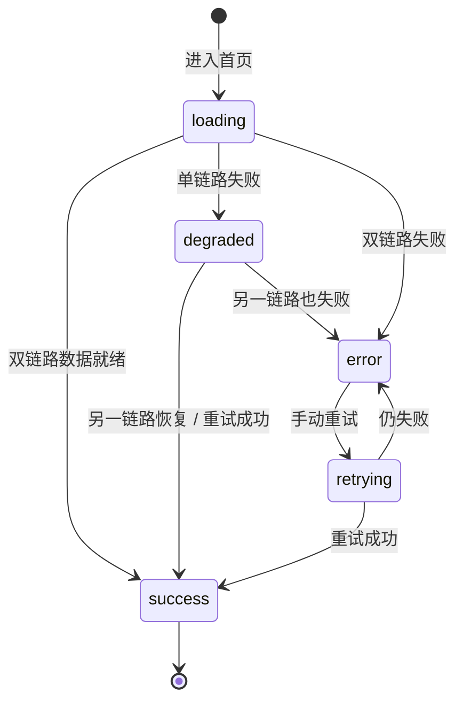

# Module 05: 自定义前端门户

> **PRD 状态**: `dev-ready`（Track B 增量 v1.8，2026-09-19 用户确认 L1 五类一行与拨测态势面板方案（决策 93）；原型验证豁免，记录见 `docs/05-execution-records/module-05/design-decisions.md`「Track B 豁免记录」与「决策 88 / 89 / 90 / 91 / 93」）
> **PRD 版本**: v1.8
> **产品版本覆盖**: MVP / v0.3 / v1.0
> **原型版本**: v1.5（**已对齐 v1.8（决策 93）**：L0 全局态势五卡（新增「拨测」卡）/ L1 采集覆盖五卡一行（CSS grid，子类封顶 3 条 +「更多 +N」聚合，不含告警数字）/ L2 应用覆盖明细表（覆盖率升序，含未归类行，不含告警数字）/ L3 拨测态势面板（异常排前标红、分页、业务域必填应用可选、空态引导配置）/ 告警状态卡 + 使用指引整宽一行；**删除「按应用查看」入口卡**；原型入口 `docs/prototypes/module-05/`）
> **更新日期**: 2026-09-19
> **对应原型**: `docs/prototypes/module-05/`

> **模块类型**: 核心能力模块
> **依赖文档**: [00_Global_Architecture.md](../00_Global_Architecture.md)、[03_Functional_Architecture.md](../03_Functional_Architecture.md)、[Module_01: 监控策略与指标管理](Module_01_Metric_Collection_Center.md)、[Module_07: 监控对象管理](Module_07_Monitoring_Object_Management.md)、[Module_09: 网域与边缘配置中心](Module_09_Network_Domain_and_Edge_Config_Center.md)
> **目标用户**: 运维工程师、业务研发工程师

---

## 1. 模块目标

> 决策依据：design-decisions.md（决策 72 / 72-1 / 72-2 / 72-3 / 73 / 91 / 93）

提供门户化的 Web 界面，替代原生 Prometheus UI，让非专家用户也能轻松使用指标查询与采集管理功能。本模块为前端页面组织与交互设计层，不重新定义后端能力边界，所有业务规则以后端模块 PRD 为准。

**核心职责**：

1. **首页概览**：平台默认落地页，总览资源覆盖、拨测可用性与告警待办。
2. **资源与标签界面**：资源维护、Excel 导入、监控标签编辑与标签模板配置。
3. **采集配置界面**：CI 类型 ↔ 采集器映射、采集 Job、实例选择与拨测配置。
4. **下发与回滚界面**：配置预览、diff 对比、人工确认下发与版本回滚。
5. **查询与告警查看**：自定义表达式查询页、告警状态页。
6. **可视化大屏**：Grafana iframe 嵌入的监控大屏入口（{v0.3}）。

**MVP 边界**：

| 范围 | 内容 | 承接 |
|------|------|------|
| 做 | 首页概览：全局态势 / 采集覆盖 / 应用覆盖 / 拨测态势 / 告警状态 / 使用指引 | 本模块 |
| 做 | 资源管理、标签模板、CI-Exporter 映射、采集 Job、下发确认、查询页、告警状态页界面 | 本模块（业务规则由 M01 / M07 / M08 / M09 PRD 承载） |
| 不做 | Dashboard 面板编辑器、轻量实时图表、「进入可视化大屏」快捷入口 | {v0.3} 起 Grafana iframe 与概览升级承载 |
| 不做 | 后端业务规则与数据契约 | M01 / M02 / M07 / M08 等后端模块 PRD |

各页面布局、交互规则与状态处理统一见 §11；告警数据流见 §4.2。

---
## 2. 用户故事

- OPS-01：通过 Web 门户查看所有采集目标状态
- OPS-03：在门户中执行 PromQL 查询
- M05-OPS-06：查看应用服务的拨测结果
- M05-OPS-07：在资源列表中识别「已监控 / 未监控」实例
- M05-OPS-08：配置 CI 类型与 Exporter 模板的绑定关系
- DEV-01：查看我负责服务的指标数据

---

## 3. 核心功能

| 页面 | 功能 | 后端 Owner | 优先级 | 交付版本 |
|------|------|------------|--------|----------|
| 资源管理页 | 主机 / 中间件 / 应用服务资源的 CRUD、Excel 导入；展示实例名 / 主机名作为可读名；支持按资源类型编辑监控标签；展示「已监控 / 未监控」badge | Module 07 | P0 | MVP |
| 标签模板页 | 按资源类型配置「资源字段 → 监控标签」映射（资源字段 / 组合字段 / 采集端内置字段 / CMDB 字段 {v0.4+}） | Module 07 | P0 | MVP |
| CI-Exporter 映射页 | 维护 CI 类型 ↔ 采集器模板绑定：默认端口、采集路径、协议、标签模板引用 | Module 01 | P0 | MVP |
| 采集 Job 页 | Job 创建 / 编辑、采集器模板选择、实例选择、标签模板关联 | Module 01 | P0 | MVP |
| 实例选择 / 拨测配置页 | 手动勾选监控实例、拨测目标与探测模块配置 | Module 01 | P0 | MVP |
| 规则编辑页 | 类 YAML 表单编辑告警 / 记录规则，表达式校验，指标实时预览 | Module 01 | P0 | MVP |
| 配置预览 / 下发页 | 实时预览生成结果，与当前生效版本 diff 对比，人工确认后下发 | Module 09 | P0 | MVP |
| 配置版本 / 回滚页 | 查看历史配置版本与下发记录，回滚到指定版本 | Module 09 | P1 | {v0.2} |
| 目标状态页 | 查看所有采集目标状态、拨测结果 | Module 02 | P0 | MVP |
| 查询页 | 表达式编辑器、查询结果（表格 / JSON / 简单折线） | Module 02 | P0 | MVP |
| 告警状态页 | 查看当前告警列表与处理进度 | Module 08 | P1 | MVP |
| 网域管理页 | 网域注册、Token 管理、Edge Agent 状态、租户-网域关联展示 | Module 11 | P0 | {v0.2} |
| 监控源登记册页 | 外部 Prometheus / Zabbix / 云监控接入管理 | Module 10 | P0 | 集成模式 |
| 首页 / Dashboard | 平台默认落地页：一屏总览资源覆盖态势、拨测可用性与告警待办，并为新用户提供六步开箱引导——回答「哪些资源还没被监控、哪些拨测异常、有多少告警待处理」。告警数字两点收口（仅 L0 告警卡与告警状态卡承载）；拨测不计入资源总数与覆盖率。页面布局 / 交互 / 状态细则见 §11.3，告警数据流见 §4.2 | Module 01/06/08/09/10（数据） | P0（MVP 子集） | MVP；实时图表与快捷入口 {v0.3} |
| 可视化大屏页（Grafana 嵌入） | 一级导航第 2 位，Grafana iframe 承载监控大屏：预置仪表盘模板随交付包下发（只读、可克隆编辑），不自研面板编辑器；数据源锁定 M02 查询代理；提供「配置告警」深链回告警中心。页面交互细则见 §11.4 | Module 02/05 | P0 | {v0.3} |
| 系统设置页 | CMDB Provider 配置、CI 类型映射、状态映射字典、发现源配置、用户 / 角色 / 租户管理 | Module 04/06/07/09 | P2 | 后续版本 |

> **系统设置页职责细分**：
> - CMDB Provider、CI 类型映射、待分类 CI 队列、状态映射字典 → [Module 04](Module_04_Custom_Discovery.md)
> - 租户 / 用户 / 角色 / 权限 → [Module 06](Module_06_Multi_Tenant.md)
> - 标签模板管理入口 → [Module 07](Module_07_Monitoring_Object_Management.md)
> - 网域 / Edge Agent 接入生命周期 → [Module 11](Module_11_Edge_Access_and_Agent_Delivery.md)

### 3.1 关键前端交互

各页面的交互契约（布局 / 列设计 / 关键交互 / 状态与边界 / 跨模块跳转）统一由 §11 前端交互契约承载（11.3 ~ 11.9 每页一节）；本节为指向各页契约的索引，页面级契约以 §11 为唯一权威；本模块功能与页面的对应关系见 §3 功能表。

- 概览 Dashboard → §11.3；告警数据流与服务降级 → §4.2；L0 指标卡口径 → §5.1。
- 可视化大屏页 → §11.4；导航层级与访问流 → §4.3。
- 资源管理页（含监控标签编辑）→ §11.5；标签模板页 → §11.6；CI-Exporter 映射页 → §11.7。
- 状态映射字典配置页 → §11.8；CMDB 同步配置页 → §11.9。

---

## 4. 核心流程

### 4.1 首页开箱动线（六步引导流程）

平台落地页面向新用户的连续开箱动线：

登记网域 → 导入资源 → 建采集 Job → 下发配置 → 配置告警通知 → 查指标 / 看告警。

- 每步需配置深链与完成态标识。
- 第 5 步「配置告警通知」深链 `/alert-config`；第 6 步「查指标 / 看告警」深链 `/query` 自定义查询页或 `/alert-status`。
- 配套项：`QueryPage` 组件挂入 `/query` 路由并补齐最小 PromQL 查询能力（输入框 + 结果表格/JSON，调用 M02 `/api/v1/query` 代理，不复用 Prometheus UI）。

### 4.2 告警状态卡数据流与服务降级

首页告警数据来自三个只读接口：`/api/v1/alerts`（Prometheus 当前触发告警，承载「当前未恢复」计数与「最新告警」列表）、`/api/v2/platform/alertmanager/alerts`（AM 通知四态）与 `/api/v1/alerts/history`（M02 历史告警，当日 / 近 7 天计数与列表行 2 告警内容）。

- **当前未恢复计数**：取 `/api/v1/alerts` 中当前处于触发态的条目，总条数即 L0 第 4 卡数字（含已静默 / 已抑制）；无 `resource_category` 的条目（拨测目标、聚合规则、用户自写规则）并入总数。「最新告警」列表取同接口按触发时间倒序的全量 8 条。口径关系：**当前未恢复 = 通知中（AM `active`）+ 已静默 + 已抑制**——静默 / 抑制的告警仍处于触发态、只是暂缓通知，不等于恢复；当日 / 近 7 天为历史累计（含已恢复），两者时间范畴不同、并存不互替。
- **主数字（告警状态卡）**：当日告警 / 近 7 天告警（按 `fired_at` 计数，含已恢复；「近 7 天」取服务端返回的窗口总量，取数窗口为整 7 天、步长由服务端按窗口兜底并在响应回显）；AM 治理态「通知中」（`active`，红色语义）与「已静默 · 已抑制」为次级数字；Prom 求值态仅作 11px 灰字参考行（求值中），不作行动对象。
- **`unprocessed` 裁剪**：不计数、不进列表；仅当 N>0 时显示一行 11px 灰字「另有 N 条告警仍在计算通知状态」。
- **空态引导**：未挂载 AM 通知配置时 `alerting:` 段不生成，AM 数字恒为 0——此时卡片展示「尚未挂载通知配置，去配置 →」深链 `/alert-config`。
- **服务降级**：取数失败时对应数字显示 `-`（不显示 0）；AM / Prom / history 三条链路各自独立降级，单链路失败 warning 局部降级、双链路失败 error + 重试；当前未恢复链路失败时 L0 第 4 卡与「最新告警」列表同步降级为 `-`（列表区展示「取数失败，暂无法展示最新告警」）。

### 4.3 导航层级与访问流

- **一级导航**：首页（默认落地页，第 1 位）、「可视化大屏」（第 2 位一级菜单）；其余功能模块按既定顺序排列。一级菜单名使用「可视化大屏」，自带「可视化」关键词、便于新用户发现。
- **首页子菜单**：仅保留「概览 Dashboard」（默认 Tab）与「使用引导」两个子页，不在首页下重复挂载「可视化大屏」。
- **首页 → 大屏快捷入口**：概览 Dashboard 顶部首屏视觉焦点提供「进入可视化大屏」大卡片 / 主按钮，作为一级菜单之外的第二入口（MVP 阶段不提供此快捷入口，v0.3 提供）。
- **大屏全屏动线**：进入可视化大屏后提供全屏 / 退出全屏按钮，适配投屏 / 电视墙场景；全屏模式隐藏门户侧边栏与顶部导航，iframe 铺满可视区域。

### 4.4 技术选型

- 前端框架：React 18 + TypeScript；构建工具：Vite；UI 组件库：Ant Design 5.x。
- 状态管理：React Query（服务端状态）+ Zustand（客户端状态）；HTTP 客户端：Fetch / Axios。
- 图表：MVP 阶段仅简单折线（ECharts 轻量版）；v0.3 起轻量实时图表用 ECharts / AntV（消费 Module_02 `query_range`）。
- 可视化大屏（v0.3）：Grafana iframe 嵌入，datasource / 预置模板经一体化交付包 provisioning 静态下发；门户仅承载入口、引导与深链。

---

## 5. 数据模型

### 5.1 首页概览数据模型（dashboard summary 响应字段）

首页各层级卡片与明细表由平台概览接口的**计数字段**与**分组聚合字段**共同驱动；分组聚合字段为门户侧新增（向后兼容，既有字段语义不变）。

| 字段 | 类型 | 必填 | UI 展示名 | 说明 |
|------|------|------|-----------|------|
| resource_count | int | ✅ | 资源总数 | M07 五类资源表行数之和；**不含拨测目标**；空库返回 0 |
| monitored_count | int | ✅ | 已纳入监控 | 被 ≥1 个 `enabled=true` 且 `draft_status='ready'` 且 `job_type=standard` 的采集 Job 覆盖的资源数（去重）；`monitored_count ≤ resource_count`，软删资源不计入 |
| scrape_job_count | int | ✅ | 采集 Job | 未软删 ScrapeJob 总数 |
| scrape_job_enabled_count | int | ✅ | 启用 Job | 其中 `enabled=true` 数 |
| domain_count | int | ✅ | 已纳管网域 | `is_monitored=true` 网域数 |
| pending_draft_count | int | ✅ | 待确认草稿 | `status=pending` 配置草稿数 |
| by_category | array | ✅ | 仅技术信息 | 按 `resource_category` 分组的资源分布，驱动 L1 五张资源类型卡；每项含 `resource_category` / `resource_count` / `monitored_count` / `coverage_rate`。**不含告警数**——本接口不承担任何告警计数 |
| by_category[].by_subtype | array | ✅ | 采集类型子类 | 卡内子类明细行；每项含 `subtype` / `resource_count` / `monitored_count` / `coverage_rate`。子类键：主机取操作系统类型、数据库取 `database_type`、中间件取 `middleware_type`、其他监控目标取端点类型；**应用服务为空数组**（不按语言 / 框架拆分子类） |
| by_app | array | ✅ | 仅技术信息 | 按应用归属分组的资源分布，驱动 L2 应用明细表；每项含 `app_code` / `app_name` / `biz_code` / `resource_count` / `monitored_count` / `coverage_rate`。**不含告警数**（同上） |
| unclassified_resource_count | int | ✅ | 未归类实例 | 未标注应用归属的资源数，驱动 L2「未归类应用」行 |
| unclassified_monitored_count | int | ✅ | 未归类已采实例 | 上项中已被采集任务覆盖的资源数 |
| probe_target_count | int | ✅ | 拨测目标数 | `job_type=blackbox` 采集 Job 的拨测目标总数（不计入 `resource_count`） |
| probe_target_abnormal_count | int | ✅ | 拨测异常数 | 当前探测失败的拨测目标数 |
| probe_targets | array | ✅ | 仅技术信息 | 拨测目标全量明细，驱动 L3 拨测态势面板；每项含 `target_url` / `probe_status`（`up` / `down`）/ `biz_code` / `biz_name` / `app_code` / `app_name`（可空）/ `last_probe_time`。排序由前端按「异常优先 + 最近拨测倒序」处理，接口不承担排序 |

- L0 全局态势消费 `resource_count` / `monitored_count` / `probe_target_count` / `probe_target_abnormal_count` 与由其派生的整体覆盖率；当前未恢复告警数来自告警接口，不属于本接口。
- L1 资源类型区消费 `by_category`（含 `by_subtype`）；五类 `resource_count` 之和等于 `resource_count`。
- L2 应用覆盖明细消费 `by_app` 与 `unclassified_*`，不含告警数字。
- L3 拨测态势面板消费 `probe_targets` 明细；`last_probe_time` 为 blackbox 探测结果最近一次回传时间（口径由 Module_01 承载，本模块只消费）；`biz_code` 必填、`app_code` 可空（拨测归属定则，决策 93）。
- **告警计数归属**：全平台唯一的「当前未恢复」数字在 L0 第 4 卡，由 `/api/v1/alerts` 条目数得到（含已静默 / 已抑制），L1 / L2 不展示告警数字；`dashboard/summary` 的计数字段与分组字段**均不含告警字段**。
- **L0 指标卡口径（ⓘ Tooltip 文案依据）**：资源总数＝已导入平台的五类监控资源合计（不含拨测目标）；已纳入监控＝至少被一个已启用的采集任务覆盖到的资源数；整体覆盖率＝已纳入监控 ÷ 资源总数；当前未恢复告警＝此刻仍在触发、尚未恢复的告警条数（含已静默 / 已抑制——仍触发只是暂缓通知、不等于恢复）；拨测＝当前探测失败的拨测目标数。取数失败统一显示 `-`。
- **拨测计费边界**：拨测目标不属于 M07 资源台账对象——不计入资源总数与整体覆盖率的分子分母、不在 L1 占任何子类；拨测告警并入 L0 当前未恢复总数；全量明细由 `probe_targets` 承载，覆盖率统计按采集 Job 类型区分。

### 5.2 视觉 Token 规范

视觉 Token 与视觉规格已归位至 §11.2 全局行为规则（视觉规范不属数据模型章），本节仅保留指针。

---

## 6. 接口设计（前端数据消费）

| 接口 | 方法 | 用途 | 消费页面 |
|------|------|------|----------|
| `/api/v1/alerts`（Module_02 代理） | GET | Prometheus 当前触发告警列表；首页取其条目总数得 L0「当前未恢复」数字与「最新告警」列表（L1 / L2 不再分组展示告警） | 首页 L0 告警卡与「最新告警」列表；告警状态卡；告警状态页 |
| `/api/v1/alerts/history`（Module_02） | GET | 历史告警（`fired_at` / `resolved_at` / `summary`）；首页按 `fired_at` 计数当日 / 近 7 天告警，列表行 2 消费 `summary` 展示告警具体内容 | 首页告警状态卡；告警历史页（M08） |
| `/api/v2/platform/alertmanager/alerts`（Module_08 代理） | GET | AM 通知四态计数与最新告警列表 | 首页告警状态卡；告警状态页 |
| `/api/v2/platform/dashboard/summary` | GET | 首页 L0 计数字段与 L1 / L2 / L3 分组聚合字段（本版新增 `probe_targets[]` 明细；v1.7 已新增 `by_category` / `by_app` / `unclassified_*` / `probe_target_*`） | 首页 L0 / L1 / L2 / L3 |
| `/api/v1/query`（Module_02 代理） | GET | PromQL 实时查询 | `/query` 查询页 |

## 7. 依赖

- `ui-custom/web/`（前端工程）
- `platform/gateway/`（API 网关与代理）
- 数据接口依赖：Module_01（采集 Job 状态）、Module_02（查询 / 触发告警代理）、Module_07（资源清单）、Module_08（Alertmanager 通知状态代理）、Module_09（配置草稿 / 下发记录）、Module_11（网域纳管 / Edge Agent 状态）

---

## 8. 数据模型状态机

### 8.1 首页概览数据加载状态（服务降级）

首页概览数据由多条链路聚合，单条链路失败仅局部降级、不阻塞整体页面。

- success＝正常展示；degraded＝warning 局部降级（失败卡片显示 `-`，不显示 0）；error＝error + 重试。
- 点击各卡片 / 列表的「查看全部 →」从降级态可直达对应功能页。

---

## 9. 验收标准

- [ ] {MVP，P0} 首页自上而下呈现六段：L0 全局态势五卡、L1 采集覆盖区（5 张资源类型卡一行排布，子类明细封顶 3 条 +「更多 +N」聚合，不含告警数字）、L2 应用覆盖明细表、L3 拨测态势面板（整宽）、整宽告警状态卡、整宽使用指引一行；不出现「按应用查看」入口卡
- [ ] {MVP，P0} L0 第 4 卡「当前未恢复」取 Prometheus 当前触发态告警总数；第 5 卡「拨测」主数字为当前探测异常数（0 时中性色），副行展示拨测目标总数并声明不计入台账；告警数字仅出现在 L0 第 4 卡（当前未恢复 = 通知中 + 已静默 + 已抑制）与告警状态卡（历史累计 + 治理态 + 最新告警明细），L1 / L2 不展示告警数字
- [ ] {MVP，P0} L1 每张资源类型卡给出该类型已采数 / 总数 / 覆盖率 / 未采数，卡内列采集类型子类明细行（子类名 + 已采数/总数 · 覆盖率，低于 70% 用橙色警示，最多 3 条）；应用服务卡不列子类并明示不按语言 / 框架拆分；分类录入为 0 时保留卡位并显示「去录入」出口
- [ ] {MVP，P0} L1 子类行与「更多 +N」点击跳转资源清单页并按资源类型与子类预筛选
- [ ] {MVP，P0} 拨测目标不计入资源总数与覆盖率的分子分母；拨测告警并入 L0「当前未恢复」总数
- [ ] {MVP，P0} L3 拨测态势面板 5 列（拨测目标 / 状态 / 业务域 / 应用 / 最近拨测时间），异常固定排最前（浅红底 + 红 Badge）、同状态按最近拨测倒序，每页 5 行分页；业务域必填、应用可空（空显 `-`）；0 拨测目标时整卡替换为空态引导并提供「去配置拨测任务」深链
- [ ] {MVP，P0} L2 应用覆盖明细按覆盖率升序排列并含应用名称 / 简称 / 业务域 / 实例 / 已采 / 覆盖率 / 操作列（不含告警数字）；未标注应用归属的实例聚合为「未归类应用」行置底并提供「去补填」入口
- [ ] {MVP，P0} 告警状态卡保留四格统计条（当日 / 近 7 天 / 通知中 / 已静默·已抑制，每格 `ⓘ` 用户语言释义，口径公式与按角色读法收进评审说明区）与「最新告警」8 条两行制列表（当前未恢复全量明细、按触发时间倒序）、列表每页 5 行；「近 7 天」取服务端窗口总量且取数窗口为整 7 天
- [ ] {MVP，P0} `GET /api/v2/platform/dashboard/summary` 在既有字段上新增 `by_category`（含 `by_subtype`）/ `by_app` / `unclassified_resource_count` / `unclassified_monitored_count` / `probe_target_count` / `probe_target_abnormal_count` / `probe_targets[]`，向后兼容；空库返回 0，`by_category` 五类之和等于资源总数
- [ ] {MVP，P0} 已纳入监控 = 至少被 1 个已启用且配置已就绪的标准采集任务覆盖的资源数（去重）；覆盖率 = 已纳入监控 ÷ 资源总数（取整百分数，资源总数为 0 时显示 `-`）
- [ ] {MVP，P0} 数据取数失败时对应数字显示 `-`（不显示 0）；单链路失败局部降级并提示 warning、双链路失败提示 error 并提供重试
- [ ] {MVP，P0} `/query` 路由挂载自定义 QueryPage，提供最小 PromQL 查询能力（输入框 + 结果表格/JSON），调用 M02 查询代理接口
- [ ] {MVP} 首页不提供「进入可视化大屏」快捷入口与轻量实时图表（豁免至 {v0.3}）
- [ ] {v0.3} 可视化大屏页作为一级菜单（第 2 位）可正常 iframe 嵌入 Grafana；Grafana datasource 指向 M02 查询代理；预置仪表盘模板只读、可克隆为可编辑副本；支持全屏 / 退出全屏
- [ ] {v0.3} 可视化大屏页提供「配置告警」深链回门户告警中心（Module_08）；告警配置不在 Grafana 侧进行

- [ ] 可以通过 Web 门户管理三类资源，资源列表展示 `instance_name` / `hostname` 与「已监控 / 未监控」badge
- [ ] 可以配置标签模板，字段来源包含 `resource_field` / `composite` / `prometheus_builtin`
- [ ] 可以在资源详情页查看并编辑 ResourceLabel，`system` / `cmdb` 来源 label 只读，`user` label 受 key 校验与冲突提示
- [ ] 可以配置 CI 类型 ↔ Exporter 模板映射
- [ ] 可以配置采集 Job、实例选择、Blackbox 拨测配置
- [ ] 可以在规则编辑页使用类 YAML 表单编辑规则，并获得 PromQL 校验与指标预览
- [ ] 可以在配置预览页查看 `prometheus.yml` 草稿，通过 diff 对比后人工确认下发
- [ ] 可以查看配置版本历史与下发记录，支持回滚到历史版本
- [ ] 可以查看采集目标列表和拨测结果
- [ ] 可以在查询页执行 PromQL 并查看结果
- [ ] 可以查看当前告警状态
- [ ] 可以管理网域、查看 Edge Agent 在线状态与配置同步状态

## 10. 术语映射

| 术语 | 定义 |
|------|------|
| L0 全局态势 | 首页首段五张 KPI 卡（资源总数 / 已纳入监控 / 整体覆盖率 / 当前未恢复告警 / 拨测） |
| 采集覆盖卡（资源类型卡） | 首页 L1 按资源类型组织的卡片（区标题「采集覆盖」），只承载该类型采集覆盖进度，不含告警数字 |
| 采集类型子类 | 资源类型卡内的细粒度类型行（如 Linux、MySQL、Kafka），点击可下钻到资源清单 |
| 当前未恢复告警 | Prometheus 当前仍处于触发态的告警（含已静默 / 已抑制），首页 L0 第 4 卡与「最新告警」列表口径；当前未恢复 = 通知中 + 已静默 + 已抑制，与当日 / 近 7 天历史累计口径不同 |
| 最新告警 | 告警状态卡内的明细列表：当前未恢复告警按触发时间倒序的全量 8 条（两行制、每页 5 行），不是当日历史累计的明细 |
| 当日告警 | 今日 0 点起触发过的告警条数（含已恢复），按历史告警接口的触发时间计数，告警状态卡主数字之一 |
| 近 7 天告警 | 近 7 天内触发过的告警条数（含已恢复），取服务端返回的窗口总量，告警状态卡主数字之一 |
| 拨测目标 | 拨测类采集任务的探测目标；不属于资源台账，不计入资源总数与覆盖率；归属规则为业务域必填、应用可选 |
| 拨测态势面板 | 首页 L3 整宽面板，全量呈现拨测目标明细（状态 / 业务域 / 应用 / 最近拨测时间），异常排前标红、每页 5 行分页 |
| AM 治理态「通知中」 | Alertmanager 通知状态 `active`，告警状态卡统计条第三格（红色语义） |
| unprocessed | Alertmanager 尚未完成通知计算的状态；不计数、不进列表，仅 N>0 时灰字附注 |
| 采集覆盖率 | 已纳入监控的资源数 ÷ 资源总数 |
| 六步开箱动线 | 从登记网域到查指标 / 看告警的首页引导步骤链 |
| 可视化大屏 | Grafana iframe 嵌入页，一级导航第 2 位菜单 |
| 服务降级 | 首页数据链单 / 双链路失败时的局部或整体降级展示 |

## 11. 前端交互契约

### 11.1 页面状态矩阵

| 菜单 | 页面 | 访问形态 | 版本 |
|------|------|----------|------|
| 首页 | 概览 Dashboard | 默认落地页，导航第 1 位 | MVP |
| 首页 / 使用引导 | 引导子页 | 首页子菜单 | MVP |
| 可视化大屏 | Grafana 嵌入页 | 一级导航第 2 位 | v0.3 |

### 11.2 全局行为规则

- 一级导航第 1 位固定「首页」，第 2 位「可视化大屏」（v0.3）。
- 首页概览数据按多链路聚合加载，单链路失败仅局部降级；加载失败显示 `-` 并支持重试。
- 告警信息只通过 L0 第 4 卡（当前未恢复总数 + 最新告警明细）与告警状态卡（历史累计 + 治理态）两点承载，其余位置（L1 / L2）不展示告警数字。
- 提示分区（三受众人）：用户可见文案讲人话、不含「决策 X / PRD X.X / {vX.Y}」等实现层引用；口径公式、按角色读法、决策清单等**评审释义**统一收进原型评审说明区（ReviewNote，默认折叠，右上角开关统一控制显隐）；实现细节进代码注释与 PRD 技术层。
- 视觉 Token（默认皮肤「火山青」）：品牌青 `#0ECDEB` 仅用于主按钮 / 关键图标 / 链接；功能色（成功绿 / 告警红 / 警告橙）仅用于状态语义，不用于装饰性图标；告警红色语义收敛到 L0 告警卡与告警状态卡，覆盖率低于 70% 的子类行用橙色警示。客户专属配色由皮肤机制在运行时整体替换 token 承载，实现禁止在模块顶层快照色值；皮肤开关位于「系统与平台管理 · 外观设置」。
- 视觉规格：卡片圆角 8px（资源类型卡 12px）、默认阴影 `0 1px 2px rgba(0,0,0,0.06)`、hover 阴影 `0 4px 12px rgba(0,0,0,0.08)`；页面内边距 24px、卡片间距 16px；数字统一等宽字体；首页按自然文档流滚动，不强制压缩至单屏。

### 11.3 概览 Dashboard 页

**用户任务**：一眼看清平台纳入了多少监控资源、各类资源与各应用的覆盖进度、拨测端点可用性，以及此刻有没有待处理的告警。

入口与路径：落地页 / 一级导航「首页」首屏；侧边栏子 Tab「概览 Dashboard」默认选中。

布局与列设计：自上而下六段，层级由粗到细——
1. L0 全局态势：五张 KPI 卡一行（资源总数 / 已纳入监控 / 整体覆盖率 / 当前未恢复告警 / 拨测），窄屏回落 3+2、单列；每张右上角 ⓘ 用户语言口径注释（口径见 §5.1）。
2. L1 采集覆盖区：资源类型五卡一行；卡内为类型名、已采数与总数、覆盖率进度条与未采数、采集类型子类明细；子类覆盖率低于 70% 用橙色警示。
3. L2 应用覆盖明细表：6 列（应用名称 / 业务域 / 实例 / 已采 / 覆盖率 / 操作），应用简称随名称次要展示；按覆盖率升序，缺口最大的排最前；未归类应用行置底。
4. L3 拨测态势面板：整宽 5 列（拨测目标 / 状态 / 业务域 / 应用 / 最近拨测时间）；异常排最前标红，同状态按最近拨测倒序；每页 5 行分页；卡头摘要「拨测目标 N · 正常 K · 异常 M」。
5. 告警状态卡：四格统计条（当日 / 近 7 天 / 通知中 / 已静默·已抑制，各格 ⓘ 用户语言释义）+「最新告警」8 条两行制明细（行 1 级别 Tag + 告警名 + 相对时间 + 状态，行 2 实例 · 告警内容）。
6. 使用指引：与告警状态卡同排一行两卡等高（宽 1 : 1.6），六步动线纵向 Steps，每步配深链。页面不设「按应用查看」入口卡。

关键交互规则：
- 子类行与「更多 +N」（子类封顶 3 条）点击进入资源清单页并按资源类型与子类预筛选；分类录入为 0 时保留卡位，子类区显示「暂无录入 · 去录入 →」。
- 应用明细行操作「补齐监控 / 看明细」，未归类行「去补填」；拨测面板「应用」列可空显示 `-`，卡头「拨测任务管理 →」深链采集 Job 页。
- 「最新告警」为当前未恢复告警的全量 8 条（最新的排最前，含已静默 / 已抑制；口径见 §4.2），每页 5 行（首页 5 行 + 第 2 页 3 行）；告警状态卡「查看全部 →」进入告警状态页。

状态与边界：接口失败对应数字显示 `-`（不显示 0）；空库时资源类型卡保留卡位并展示「去导入资源 →」空态引导；拨测 0 目标时整卡替换为「去配置拨测任务」引导态；未挂载告警通知配置时展示「尚未挂载通知配置，去配置 →」；通知计算中的告警仅在 N>0 时灰字附注。单链路失败局部降级 warning、双链路失败 error 并支持重试。其余状态见 §11.1。

跨模块跳转：子类行与应用明细跳转 [Module_07](Module_07_Monitoring_Object_Management.md) 资源清单（携带类型 / 子类 / 应用筛选）；告警卡与告警明细跳转 [Module_08](Module_08_Alertmanager_Notification_Management.md) 告警状态页；拨测面板与空态引导跳转 [Module_01](Module_01_Metric_Collection_Center.md) 采集 Job 列表。

### 11.4 可视化大屏页（v0.3）

**用户任务**：在大屏 / 投屏场景下查看监控看板，并能从大屏回到门户配置告警。

入口与路径：一级导航「可视化大屏」（第 2 位）；或首页概览顶部「进入可视化大屏」快捷入口（MVP 不提供）。

布局与列设计：页面 iframe 承载 Grafana；提供全屏 / 退出全屏与新窗口打开，全屏模式隐藏门户侧边栏与顶部导航、iframe 铺满可视区域，适配控制室电视墙 / 投屏。

关键交互规则：预置仪表盘模板随交付包 provisioning 下发为只读，用户「另存为 / 克隆」获得可自由编辑副本，平台升级覆盖模板不影响用户副本；不锁定 Grafana 原生能力，用户可新建 / 编辑自有看板；模板按治理标签组织下钻层级（网域 → 业务 → 应用 → 实例，经看板变量实现）；页面提供「配置告警」深链回门户告警中心；告警规则与通知配置不在 Grafana 侧进行。

状态与边界：Grafana 数据源由交付包 provisioning 预置为 M02 查询代理，不可改指 Prometheus 直连（租户 / 网域注入红线）。其余状态见 §11.1。

跨模块跳转：「配置告警」深链回 [Module_08](Module_08_Alertmanager_Notification_Management.md) 告警中心；数据源依赖 [Module_02](Module_02_Query_Center.md) 查询代理；看板即代码治理（API 管看板 / 版本化 / 按租户分发）为 Module_11 预留，{v0.4+} 评估。

### 11.5 资源管理页

**用户任务**：维护主机 / 中间件 / 应用服务资源台账并管理其监控标签，判断一个资源是否已被监控。

入口与路径：一级导航「资源管理」；首页采集覆盖卡子类行与「更多 +N」、应用覆盖明细「补齐监控 / 去补填」均携带筛选进入。

布局与列设计：资源列表展示可读名（实例名 / 主机名）与「已监控 / 未监控」badge；资源详情页含监控标签列表；支持 Excel 批量导入与批量编辑。

关键交互规则：标签按来源徽章区分——模板生成（system）、用户手动（user）、CMDB 同步（{v0.4+}）；模板与 CMDB 来源默认只读，用户可通过新增同名 key 的 user 标签覆盖（生效优先级 CMDB > user > system）。新增标签时即时校验 key：小写字母 / 数字 / 下划线，禁止双下划线开头、禁止与采集端内置标签同名；同名冲突时实时提示「该 key 将由 CMDB 覆盖，建议更换」或「将覆盖模板生成的标签」。

状态与边界：key 校验失败阻断提交并就地提示。其余状态见 §11.1。

跨模块跳转：资源数据与标签语义见 [Module_07](Module_07_Monitoring_Object_Management.md)；首页入口见 §11.3。

### 11.6 标签模板页

**用户任务**：为每类资源配置「资源字段 → 监控标签」的生成规则，让采集到的目标自带业务标识。

入口与路径：一级导航「标签模板」；资源管理页与 CI-Exporter 映射页引用模板结果。

布局与列设计：按资源类型分组；每个映射行展示目标标签、来源字段、转换规则与启用状态。

关键交互规则：来源字段四类——资源模型字段（MVP 主要来源）、组合字段（如「IP:端口 → 实例名」）、采集端内置字段、CMDB 字段（{v0.4+}，上线前置灰或隐藏）；映射规则保存后对新采集目标生效。

状态与边界：{v0.4+} 来源在字段上线前置灰不可选。其余状态见 §11.1。

跨模块跳转：模板与资源标签的派生关系见 [Module_07](Module_07_Monitoring_Object_Management.md)。

### 11.7 CI-Exporter 映射页

**用户任务**：为每类 CI 类型选择采集器模板并设定默认采集参数，不必逐个实例手写采集配置。

入口与路径：一级导航「采集配置」区；采集 Job 创建时引用映射结果。

布局与列设计：表格展示 CI 类型 ↔ 采集器模板绑定关系（采集器名称、默认端口、采集路径、协议、标签模板引用）。

关键交互规则：同一 CI 类型可绑定多个采集器模板（如 Linux 主机同时绑节点与进程采集器），仅一个为默认；新增 / 编辑绑定时自动填充该采集器的常用指标与默认采集参数。

状态与边界：暂无特殊状态。其余状态见 §11.1。

跨模块跳转：采集器模板库与采集参数语义见 [Module_01](Module_01_Metric_Collection_Center.md)。

### 11.8 状态映射字典配置页（P2）

**用户任务**：把外部系统的原始状态字样映射为平台统一状态，保证列表与告警口径一致。

入口与路径：系统设置 → 状态映射字典（P2，MVP 不做）。

布局与列设计：表格展示「来源状态 → 平台状态」规则，支持按资源类型过滤。

关键交互规则：提供「测试映射」——输入任意状态字符串即时返回映射结果；内置规则禁止删除但可禁用，自定义规则可增删改。

状态与边界：暂无特殊状态。其余状态见 §11.1。

跨模块跳转：状态字典语义见 [Module_04](Module_04_Custom_Discovery.md)。

### 11.9 CMDB 同步配置页（P2 / v0.4+）

**用户任务**：接入 CMDB 数据源并维护「CMDB 模型 → 平台资源类型」的映射，让资产数据自动进入平台。

入口与路径：系统设置 → CMDB 同步（P2 / {v0.4+}，MVP 不做）。

布局与列设计：三个区块——数据源接入配置（BlueKing / HTTP / Nacos 接入参数、轮询周期默认 15 分钟、事件订阅开关）；CI 类型映射表（CMDB 模型 → 平台资源类型，支持启用 / 禁用、按网域覆盖）；待分类 CI 队列。

关键交互规则：待分类队列展示未映射 / 已禁用 / 字段缺失的 CI，支持查看原始数据、映射到现有类型或忽略。

状态与边界：字段缺失的 CI 进入待分类队列，不阻塞其余数据同步。其余状态见 §11.1。

跨模块跳转：CMDB Provider 语义见 [Module_04](Module_04_Custom_Discovery.md)。

---

## Change Log

| 版本 | 日期 | 变更类型 | 变更内容 | 影响范围 | 产品版本影响 | 状态 |
|------|------|----------|----------|----------|--------------|------|
| v1.8 | 2026-09-19 | 修订 | 决策 93 首页版式与拨测面板：L0 五卡（新增拨测）、L1 五类一行（子类封顶 3 + 更多+N）、删除按应用入口卡、L3 拨测态势面板（异常排前 / 分页 / 业务域必填应用可选 / 空态引导）、summary 新增 `probe_targets[]`；告警数字两点收口（详版见 design-decisions）；章节归位（§1 三段化、§3.1 契约迁 §11、§3 表补交付版本列）。 | 首页信息架构、概览接口明细字段、拨测口径、验收标准 | MVP | dev-ready |
| v1.7 | 2026-09-19 | 修订 | 决策 91 首页三层重构：L0/L1/L2 分级下钻、拨测不计入台账口径、告警按「未恢复」分层表达；回填外观设置与默认皮肤说明。 | 首页信息架构、概览接口分组字段、告警口径、验收标准 | MVP | dev-ready |
| v1.6 | 2026-09-18 | 修订 | 决策 73 首页视觉密度与告警卡重构：指标卡纵向排版（30px/800 数字 + 44px 图标容器），告警卡四格统计条（当日 / 近 7 天告警为主数字，M02 history 前端计数）+ 最新 8 条两行制列表（含告警具体内容），快捷入口一行五列压扁，使用指引移入右列。 | 首页信息架构、视觉 Token、告警口径、验收标准 | MVP | dev-ready |
> 完整 Change Log 历史（v1.0 ~ v1.2）见 `docs/05-execution-records/module-05/design-decisions.md`「Change Log（完整历史）」。
