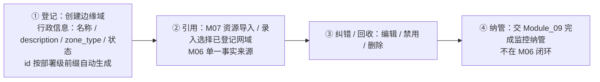
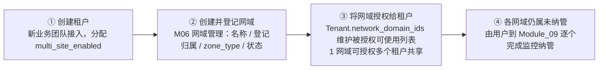
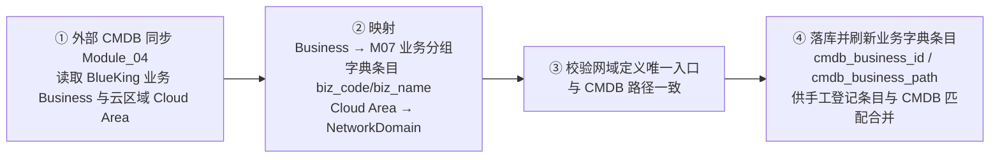
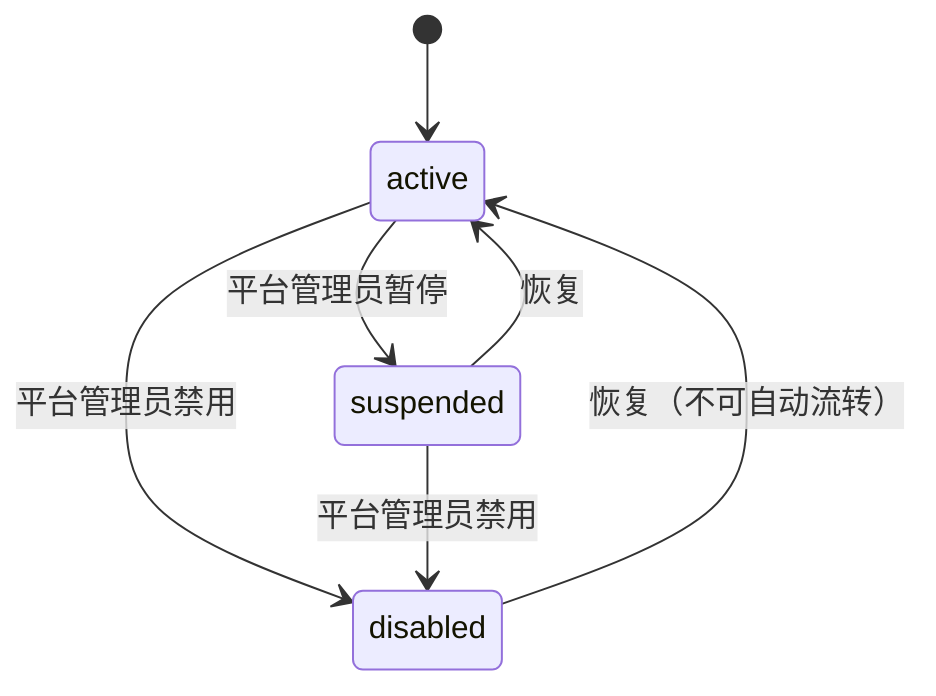
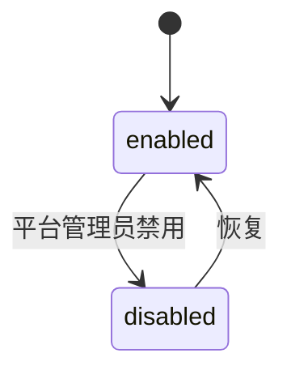

# Module 06: 系统与平台管理（含多租户）

> **PRD 状态**: `dev-ready`（Track B 增量 v2.6，2026-09-02 v0.2 范围收敛决策落版；v2.3 经用户书面确认）
> **PRD 版本**: v2.15
> **产品版本覆盖**: MVP / v0.2 / v0.4 / v1.0
> **原型版本**: v2.15（✅ 已同步决策 82——已纳管网域删除入口恢复可用 + 「删除网域（退场回收）」级联清退二次确认弹窗（含级联影响清单）/ 禁用弹窗补强（【重要】行政冻结提示）/ 「更多」菜单不可操作原因修正，见 `docs/prototypes/module-06/README.md` v2.15 变更说明；v2.14 已对齐 2026-09-14 引导条扁平化 / 表单改抽屉 / 判断口径澄清 / 列表列数治理 + 详情抽屉，见决策 80）
> **更新日期**: 2026-09-15
> **对应原型**: `docs/prototypes/module-06/`

> **模块类型**: 企业级能力模块
> **依赖文档**: [00_Global_Architecture.md](../00_Global_Architecture.md)、[03_Functional_Architecture.md](../03_Functional_Architecture.md)、[Module_03_Gateway_and_Auth.md](Module_03_Gateway_and_Auth.md)
> **目标用户**: 运维架构师、平台管理员

---

## 0. 需求背景与典型场景

### 这个模块解决什么问题

当监控平台从单团队走向多团队共用时，需要回答「谁能看哪些数据、谁能管哪些配置」。本模块提供租户与网域的行政边界管理，让不同运维团队在共享平台的同时保持数据隔离，并为平台级策略（存储、审计、配额）提供配置入口。

### 用户需求的演进过程

从 MVP 开发期的真实反馈看，平台管理的需求随着部署复杂度提升逐步暴露：

**阶段 1：单团队起步期——「先跑起来，不需要复杂权限」**
- 平台初期只有一个运维团队使用，无需多租户隔离
- 痛点：需要最基本的登录认证与用户管理，防止未授权访问
- 对应能力：MVP 单租户 `platform_admin` + 轻量认证（用户名/密码）+ `admin`/`user` 两级访问控制门

**阶段 2：多网域登记期——「需要把不同网络环境登记进来」**
- 用户需要管理多个隔离网域（如医院专网、政务外网），并让 M07/M09 能引用
- 痛点：网域定义分散在各模块，缺乏单一事实来源；登记后无法禁用/删除
- 对应能力：网域行政管理（创建/编辑/禁用/删除）+ 网域状态机（enabled/disabled）+ 禁用影响范围提示

**阶段 3：多租户扩展期——「其他团队也要用，但数据要隔离」**
- 平台引入第二、第三个运维团队，需要确保各团队只能看到自己网域的数据
- 痛点：Prometheus 原生无多租户概念，需要外部注入隔离标签
- 对应能力：租户-网域授权关联（v0.2）+ `multi_site_enabled` 多网域开关 + 数据隔离方案（单实例 + tenant label）

**阶段 4：治理完善期——「操作要有审计，资源要有限额」**
- 平台规模化后需要审计日志、资源配额、数据保留策略等平台级治理
- 痛点：关键操作无审计追踪、存储成本不可控、配额无限制
- 对应能力：审计日志（P2）+ 数据存储管理（P2）+ 资源配额（P2）

### 不同技术背景用户的痛点分层

同一个平台管理能力，不同角色的用户会提出完全不同的问题：

| 用户类型 | 典型问题 | 本模块的应对 |
|----------|----------|-------------|
| **平台管理员** | 「如何确保不同团队的数据完全隔离？」 | 租户-网域授权关联 + 查询注入隔离标签（M02 联动） |
| **运维架构师** | 「新增一个网域后，如何让它被监控平台识别？」 | 网域行政登记（M06）→ 监控纳管（M09）→ 配置下发（M09） |
| **安全审计员** | 「谁登录过系统？做过什么操作？」 | 登录日志（MVP）+ 审计日志（P2） |
| **普通运维** | 「我只有查看权限，为什么能看到管理菜单？」 | 轻量认证 + `admin`/`user` 两级访问控制门（H-2） |

### 典型场景（基于真实用户反馈）

| 场景 | 角色 | 触发条件 | 用户目标 | 成功标准 | 来源 |
|------|------|----------|----------|----------|------|
| 新团队接入平台 | 平台管理员 | 卫健委团队需要使用监控平台 | 创建租户并授权可用网域 | 租户创建成功，该团队只能看到被授权网域的数据 | 原始需求 |
| 登记边缘网域 | 平台管理员 | 新增一个医院专网环境 | 在平台登记该网域的行政信息 | 网域出现在 M07/M09 可选列表，可被引用 | 评审结论 E 组 |
| 禁用不再使用的网域 | 平台管理员 | 某医院专网下线 | 禁用该网域，防止新资源误入 | 禁用后新资源无法登记到该网域，存量资源不受影响 | dev-feedback #5 |
| 管理用户账号 | 平台管理员 | 新员工入职需要开通账号 | 创建用户并分配角色 | 用户可正常登录，权限符合预期 | 决策 44 |
| 查看登录日志 | 安全审计员 | 安全审计要求 | 查看用户登录行为 | 登录日志记录账号/时间/IP/成败结果 | 决策 44 |
| 多租户数据隔离 | 运维架构师 | 平台引入多租户 | 确保用户只能查询被授权网域的数据 | 查询自动注入 `tenant` + `network_domain`，越权返回空（标签键不带 `_id` 后缀，决策 68-5） | 决策 56 |

> 本模块覆盖的用户故事详见 [§2 用户故事](#2-用户故事)。

---

## 1. 模块目标

提供 MetricCenter **租户与平台级管理**能力，重点是租户生命周期、租户-网域关联、平台全局策略与数据存储管理。用户/角色/权限策略可能由外部统一身份认证（IAM/SSO）承接，本模块只定义数据契约与租户边界；网关层鉴权、请求级审计事件收集由 [Module_03](Module_03_Gateway_and_Auth.md) 负责。

### 核心职责

1. **租户管理**：维护租户生命周期；MVP 固定 `platform_admin` 单租户，完整生命周期 {v0.2}。
2. **租户-网域授权**：维护 1 租户 : N 网域的授权关联；网域可跨租户共享，授权 ≠ 拥有。
3. **网域行政管理**：网域的创建 / 编辑 / 禁用 / 删除与登记归属维护（M06 为网域行政 Owner）。
4. **用户与访问控制门**：租户内用户增删改查、重置密码；MVP 仅 `admin`/`user` 两级访问控制门，无业务角色体系。
5. **平台级策略入口**：数据存储管理、审计日志、资源配额、平台配置（P2）。

### MVP 边界

**MVP 做**：

- 以单租户 `platform_admin` 模式运行；`platform_admin` 为系统预置默认租户，登记持有 `default` 等部署级网域，未显式分配的租户 / 网域资源默认归属于该租户。
- 网域登记管理（创建 / 编辑 / 禁用，含区域属性 `zone_type`；`default` 管理域不可禁用）——M07 资源登记与 M09 监控纳管的网域引用由此闭环。
- 租户查看 / 编辑（仅 `platform_admin`，不开放新建，唯一租户禁止禁用）。
- 用户管理（租户内用户 CRUD + 重置密码）与登录日志查看。
- 轻量认证登录（用户名 + 密码 + 会话 Token，认证中间件拒绝匿名请求，由 [Module_03](Module_03_Gateway_and_Auth.md) 落地）。
- 初始管理员与种子数据由后端启动时 **migration upsert** 预置（`platform_admin` 租户、`default` 管理域、`admin` 账号，幂等、可重复执行）。

**MVP 不做 / 由谁承接**：

- 不开放新建租户、不提供唯一租户禁用入口；完整租户生命周期与租户-网域授权关联 {v0.2}。
- 无业务权限体系；仅以 `admin`/`user` 两级访问控制门（H-2）保护管理后台接口（用户 / 租户 / 登录日志管理），**无业务授权 / 租户数据隔离属已知风险**，依赖部署网络隔离（内网 / VPN）兜底；生产化前必须完成授权体系接入。
- 登录认证机制、网关鉴权、请求级审计事件收集由 [Module_03](Module_03_Gateway_and_Auth.md) 承接；网域监控纳管由 [Module_09](Module_09_Network_Domain_and_Edge_Config_Center.md) 承接。
- 角色 / 权限分配、审计与平台配置 {v1.0+} 或由外部 IAM/SSO 承接。

> 决策依据：MVP 租户 / 用户 / 网域范围见 `docs/05-execution-records/module-06/design-decisions.md`（决策 44 / 23 / 8）。

### 关键约束

MetricCenter 不存在跨租户的全局平台管理员身份。任何用户（包括 `platform_admin` 租户下的用户）都只能在所属租户及其**被授权使用**的网域范围内查看和管理资源；管理权限按租户作用域隔离。MVP 阶段所有资源都在 `platform_admin` 租户内可见，但**这不意味着存在跨租户的全局可见性**——该描述的是数据模型与设计目标，不代表 MVP 已启用授权拦截。

---

## 2. 用户故事

> 完整用户故事条目（角色 / 我希望 / 以便于）见**全局用户故事库 [01_User_Stories.md](../01_User_Stories.md) 4.9 节**；产品级用户故事使用产品编码（`ARCH-NN`），模块级故事使用模块命名空间编码（`M06-ROLE-NN`，全局唯一）。本模块仅在此列出编码与一句话摘要。

- **ARCH-01**：创建和管理租户，为不同团队隔离数据。
- **M06-ARCH-04**：为租户分配（授权使用）网域；网域为部署级资源、可跨租户共享，通过授权 scope 实现数据隔离。
- **ARCH-05**：管理用户权限与角色，控制数据访问范围（v1.0+ 或外部 IAM 承接）。

---

## 3. 核心功能

### 3.1 核心功能总表

| 功能 | 说明 | 优先级 | 交付版本 |
|------|------|--------|----------|
| **租户管理** | MVP 仅 `platform_admin` 单租户查看 / 编辑（不开放新建、唯一租户禁止禁用）；完整生命周期（创建 / 状态变更）后续开放 | P0 | MVP；完整生命周期 {v0.2} |
| **租户-网域关联** | 1 租户 : N 网域（授权使用）；网域为部署级资源、可跨租户共享 | P1 | {v0.2} |
| **用户管理** | 租户内用户增删改查、禁用 / 启用、重置密码（无业务角色体系，仅 `admin`/`user` 管理门）；登录认证见 [Module_03](Module_03_Gateway_and_Auth.md) | P0 | MVP |
| **角色与权限** | 角色 / 权限策略分配；或由外部 IAM/SSO 承接 | P2 | {v1.0+} / 外部化 |
| **数据隔离** | 租户只能查看本租户数据；依赖 Module_03 label 注入 | P2 | {v0.2} |
| **资源配额** | 限制租户的采集目标数、查询 QPS、存储时长 | P2 | {v0.4+} |
| **数据存储管理** | TSDB 状态查看、Retention、平台级 Remote Write 转发开关 | P2 | {v0.4+} |
| **审计日志** | 展示/归档关键操作、配置变更、登录日志；请求级审计事件由 Module_03 收集 | P2 | {v1.0+} |
| **平台配置** | 全局 scrape 策略限制、通知默认配置 | P2 | {v1.0+} |

### 3.2 租户与网域关系

租户-网域授权关联随 Module_09 v0.2 一起落地；MVP 阶段仅有 `platform_admin` 单租户。

- **1 个租户（Tenant）可被授权使用 N 个网域（NetworkDomain）；网域是部署级资源，可跨租户共享**。**授权 ≠ 拥有**——网域的登记所有权不随授权转移；`default` 等部署级域由 `platform_admin` 统一登记持有，授权是使用范围、不改变登记所有权，`platform_admin` 也不因此获得跨租户查看其他租户数据的能力。`network_domain_id` 必须全局唯一（部署级前缀 `<deploy_code>-<domain_code>`，见 5.2）。
- **租户级多网域开关**：`Tenant.multi_site_enabled` 是该租户是否允许被授权使用多个网域的**行政能力开关**（不控制 Module_09 页面入口显示/隐藏，入口由数据驱动：网域管理入口常驻展示所有已授权网域、Agent 状态入口由是否存在 EdgeAgent 实例决定）。`false` 时平台侧仅授权单个网域（通常为 `default`，M09 仍可查看其纳管状态）；`true` 时可为该租户登记授权多个网域。MVP 仅 `platform_admin`，v0.2+ 各租户独立配置。

| 关系 | 说明 | 示例 |
|------|------|------|
| 1 租户 : N 网域 | 一个租户可被授权使用多个隔离网域 | 卫健委 → 医院 A 专网、医院 B 专网 |
| 1 网域 : N 租户 | 单个网域可被多个租户授权使用（跨租户共享）；登记所有权归 `platform_admin`，授权 ≠ 拥有 | 医院 A 专网 ← 卫健委、疾控中心 |
| `default` 网域 | 部署级默认网域由 `platform_admin` 登记持有，可授权使用；未显式指定网域的资源默认落在 `default` | `default`（登记持有：`platform_admin`；授权使用：各租户） |

**M06 / M09 职责边界**：M06 是 `NetworkDomain` 的**行政 Owner**（创建 / 编辑 / 禁用 / 授权，只维护行政字段，不维护监控参数）；M09 是网域的**监控纳管 Owner**（标记已纳管、写监控参数、装采集节点、生成下发配置，不新建行政记录）。`Tenant.network_domain_ids` = 「被授权可使用的网域列表」，不等于已纳管（已纳管由 M09 的 `EdgeAgent` 与监控参数存在性决定）。多运维团队共享网域时，配置按「写权限（M06）→ 配置内容按租户命名空间分目录生成（M09）→ 下发动作只下发本租户包（M09）」三层隔离；MVP 单团队退化仅 `platform_admin` 租户，无跨团队覆盖。

**网域生命周期三动作**（语义权威；接口见 §6.2、验收判据见 §9、交互见 §11.2、状态流转见 §8）：

| 动作 | 语义 | 归属模块 | 对新资源 / 新纳管 | 对存量采集 | 可逆性 |
|------|------|---------|------------------|-----------|--------|
| **禁用**（`disabled`） | **行政冻结**——不准新入，不强制停旧 | M06 | 拒绝 | **不受影响、继续采集** | 可恢复启用 |
| **退纳管**（v0.2+） | **停止监控**——保留网域，清空纳管与凭据 | M09 | 网域仍为「未纳管」，可重新纳管 | **停止**（Token 废止、停止下发） | 可重新纳管 |
| **删除** | **退场回收**——从平台移除该网域 | M06 | —（网域已不存在） | **级联清退**（M09 废止 Token / 停止下发 / Agent 转离线） | 软删，不可自助恢复 |

三者**不可互相替代**：禁用管「能不能新建」（准入）、退纳管管「现有采集停不停」（运行）、删除管「还要不要这个网域」（存在性）；**删除包含级联清退**（等价于「退纳管 + 软删」一次完成），为终态动作、不经 `enabled → disabled`（见 §8）。

**网域地位与心智**：网域是**逻辑操作上下文与采集边界**，不是控制面层级（单租户内控制面仍为中心单一实例，网域不构成独立管理面）。心智原则「**接入可见、消费隐藏**」——网域是**部署拓扑属性，不是资产属性**，只在接入/部署时刻被感知，消费侧（M02/M05/M08）默认隐藏，仅作权限注入与可选下钻维度；`ip_cidrs` 支撑 M07 资源归属自动推导（见 5.2 / [Module_07 5.16.4](Module_07_Monitoring_Object_Management.md)）。

**唯一入口原则（单一事实来源）**：网域定义（名称 / 登记归属 / 授权租户 / `zone_type`）只在 M06 登记一次，下游模块（M07 资源导入/录入、M09 纳管、CMDB 同步）**只引用** `network_domain_id`，不在资源上冗余区域属性（[Module_07 5.4](Module_07_Monitoring_Object_Management.md)）。

**`zone_type`（网络分区，可选）**：网域的网络隔离/位置**分类标签**，**不影响采集、不下发、可留空**。字段模型、部署级字典（政务云安全分区 / 公有云 region）、UI 展示名与「不确定可留空」文案见 §5.2；用户侧一句话语义与双路由判断规则见 §11.2「登记前置判断」。禁止方向：不做死枚举、不赋予行为语义（如按 `zone_type` 决定通道/标签规则）。

**划域原则**：以**可达性同质性 + 故障自治单元**划域（一组目标能被同一组采集器同质地可达、且需独立配置下发/断网自治边界时才建独立网域；禁止按业务/团队建域）。K8s 按 CNI 选型：overlay CNI（Calico/Flannel）下 Pod 网段仅集群内可达 → **集群独立建域**（集群内 vmagent 作边缘采集节点，M09 零改动复用）；VPC 原生 CNI（Pod 直接分 VPC 子网 IP）下可达性同质 → 并入所在 VM 网域。多采集节点（分片/HA/多探测点）为域内细节、v0.4+ 演化不变。

**租户、网域、业务三者正交**：租户管权限边界、网域管采集边界、业务管监控对象分组，三者独立变化。网域由网络环境决定（登记制、低频固定），业务是组织管理维度（持续演进、可多业务共用同一网域）；每个资源有且仅有 **1 个网域归属 + 1 个业务归属**（多业务共用 1 网域、1 业务跨多网域均正常）。查询通过 `biz` + `network_domain` 标签组合过滤；**禁止把业务编码进网域命名，或把网域编码进业务命名**。业务字典与资源归属由 [Module_07](Module_07_Monitoring_Object_Management.md) 维护。

**网域用户侧定义 / 判断规则**（网域 = 一组网络互通机器的集合；中心能直连 → 归 `default`，访问不到 → 独立建域 + 装采集节点回传数据）见 §11.2「登记前置判断」（页首概念卡与新建表单据此呈现）。

### 3.3 租户、网域与 BlueKing CMDB 映射

本节映射关系在 v0.4+ 由 [Module_04](Module_04_Custom_Discovery.md) 同步时落地。

租户（Tenant）是**MetricCenter 内部的数据隔离与权限作用域单位**，对应一个运维团队/组织；业务（`biz_code` / `biz_name`）是**监控对象的分组维度**，对应 BlueKing CMDB 的业务（Business）。两者解耦，不可一一对应：

- MVP 单租户 `platform_admin` 即为一套部署的单一项目空间，承载全部业务；
- 多租户场景下，一个租户可查看/管理其被授权网域内的多个业务；业务是资源分组维度、不与租户绑定，同一业务下的资源可分布在不同租户授权使用的网域中（与网域-业务正交原则一致）；
- 业务字典与业务归属由 [Module_07](Module_07_Monitoring_Object_Management.md) 维护，`biz_code` 经标签模板映射为 `biz` 标签，具体见 Module_07 §5.15。

| MetricCenter 对象 | BlueKing CMDB 对象 | 映射规则 | 说明 |
|-------------------|-------------------|----------|------|
| Tenant | — | 行政维护 | 租户是 MetricCenter 内部权限边界，MVP 固定为 `platform_admin`；不与 BlueKing Business 强制映射 |
| Business（`biz_code` / `biz_name`） | Business（业务） | 1:1（编码） | BlueKing `bk_biz_id` / `bk_biz_name` 映射为 [Module_07](Module_07_Monitoring_Object_Management.md) 业务分组字典的 `biz_code` / `biz_name`；资源通过 `biz_code` 字段归属业务 |
| NetworkDomain | Cloud Area（云区域） | 1:1 | 网域对应蓝鲸云区域，行政字段由 [Module_06 §5.1](Module_06_Multi_Tenant.md#51-%E7%BD%91%E5%9F%9F%E5%90%8D%E8%B0%B1) 定义；监控纳管字段由 [Module_11](Module_11_Edge_Access_and_Agent_Delivery.md#51-networkdomain%E7%9B%91%E6%8E%A7%E7%BA%B3%E7%AE%A1%E5%AD%97%E6%AE%B5) 定义（三家共管口径见 Module_09 §5.1）；v0.4 同步落地时归属解析按四级链执行（字段映射 > 通道绑定 > IP 推导 > 待分配，见 [Module_07 5.16.4](Module_07_Monitoring_Object_Management.md)），本表映射即解析链第①级 |

**约束 {v1.0+}**：禁止绕过 CMDB 业务/模块路径直接在 MetricCenter 中定义业务归属；ITSM 服务目录必须通过显式 CMDB 业务/模块路径与监控对象关联。

三维度正交原则（租户管权限边界、网域管采集边界、业务管监控对象分组）详见 [3.2](#32-租户与网域关系)。

### 3.4 数据隔离方案

| 方案 | 优点 | 缺点 |
|------|------|------|
| 单实例 + tenant label | 成本低，部署简单 | 需要修改查询注入 label |
| 多实例隔离 | 完全隔离，安全性高 | 资源成本高，管理复杂 |

**建议第一版采用单实例 + tenant label 方案。**

在“单实例 + tenant label”方案下，查询需同时注入 `tenant` 与 `network_domain` 两个维度，确保租户只能看到其被授权使用的网域数据。**任何用户（包括 `platform_admin` 租户用户）都不应拥有 bypass 租户/网域隔离的能力**。

### 3.5 平台管理子能力

本节中的“平台管理”指 `platform_admin` 租户内可执行的配置与运维操作，作用于 `platform_admin` 租户及其登记持有的网域（如 `default`），不作用于其他租户。

#### 3.5.1 数据存储管理

| 功能 | 说明 |
|------|------|
| TSDB 状态查看 | 展示 Prometheus TSDB 状态（通过 `/api/v1/status/tsdb`），只读 |
| Retention 配置 | 设置数据保留周期 |
| Remote Write 转发开关 | 平台级开关：是否启用中心到长期存储的转发；具体 Edge Agent Remote Write 参数由 Module_09 负责，Ingestion Gateway 接收点由 Module_10 负责 |

#### 3.5.2 审计日志

| 功能 | 说明 |
|------|------|
| 操作记录 | 记录资源、配置、规则的增删改查 |
| 变更追踪 | 展示配置 Diff 与操作人 |
| 登录日志 | 记录用户登录行为 |

#### 3.5.3 平台配置

| 功能 | 说明 |
|------|------|
| 全局 scrape 策略限制 | 平台级最小/最大 `scrape_interval`、`scrape_timeout` 限制；具体 Job/模板默认值由 Module_01/07 定义 |
| 通知默认配置 | 默认接收人、告警模板 |

---

## 4. 核心流程

> 模块以**管理面操作**为主（租户/网域/平台配置的管理操作），核心流程为 v0.2+ 落地的行政管理链路；用户层流程与技术层时序可并存。

### 4.0 MVP 网域登记流程（MVP，闭环）

区别于 4.1 的 v0.2 全流程（含租户创建/授权），MVP 单租户下只做「网域登记」这一件事，四步闭环：

- **纠错与回收路径**：行政信息填错 → 直接编辑（登记归属除外）；误登记（尚未引用资源 / 未纳管）→ 直接删除；网域随业务下线需要回收 → **删除**（已纳管场景删除时级联清退 M09 纳管状态：废止 Token / 停止配置下发 / 采集节点转离线；**有 M07 资源引用时拒绝删除**——资源是有主数据，须先在 [Module_07](Module_07_Monitoring_Object_Management.md) 迁移或删除）；网域暂时不用但需保留登记 → **禁用**（行政冻结：拒绝新登记与新纳管，存量采集不受影响）；v0.2+ 如需「保留网域但停止采集」→ M09 **退纳管**。

### 4.1 租户与网域行政管理流程（v0.2）

1. **创建租户**：平台管理员创建租户，设置展示名与 `multi_site_enabled`（是否允许多网域）等能力。
2. **登记网域**：平台管理员在「网域管理」登记网域行政信息（名称、登记归属、`zone_type`、状态），`id` 按部署级前缀自动生成。
3. **授权网域**：将已登记网域授权给一个或多个租户使用（`Tenant.network_domain_ids` 维护「被授权可使用」列表）；网域为部署级资源、可跨租户共享，**授权 ≠ 拥有**。
4. **移交纳管**：行政登记与授权完成后，由 Module_09 选择网域进行监控纳管并下发配置；本模块不参与采集配置。

### 4.2 多网域能力开关决策（v0.2）

- 管理员在创建/编辑租户时设定 `multi_site_enabled`：
  - `false`（单网域）：平台侧仅授权单个网域（通常为 `default`），M09 仍可查看 `default` 网域及其纳管状态。
  - `true`（多网域）：可为该租户登记并授权多个网域，M09 逐个完成监控纳管。
- 该开关仅约束**行政能力**，不控制 M09 页面入口的显示/隐藏（M09 入口由数据驱动）。

### 4.3 CMDB 业务与网域映射同步流程（v0.4+）

---

## 5. 数据模型

### 5.1 租户（Tenant）

| 字段 | 类型 | 必填 | UI 展示名 | 说明 |
|------|------|------|----------|------|
| id | string | ✅ | 租户 ID | 租户唯一标识；建议全局唯一，且不编码外部 CMDB Business 语义 |
| name | string | ✅ | 租户名称 | 租户展示名 |
| network_domain_ids | []string | ❌ | 被授权网域 | {v0.2} 该租户被授权可使用的网域 ID 列表（**授权 ≠ 拥有**；网域为部署级资源，登记所有权归 `platform_admin`，授权不转移所有权）；由 M06 维护授权关系，不表示这些网域都已接入监控（已纳管状态由 M09 决定） |
| multi_site_enabled | bool | ✅ | 多网域能力 | 是否允许该租户**被授权使用多个网域**的行政能力开关；`false` 时平台侧仅授权单个网域（通常为 `default`），M09 仍可查看 `default` 网域及其纳管状态；`true` 时开放多网域授权与 Edge Agent 管理。该开关不控制 M09 页面入口显示/隐藏，M09 入口由数据驱动 |
| is_platform_admin | bool | ✅ | 平台默认租户 | 标记该系统预置租户（默认租户），用于承载 `default` 网域与平台级默认配置。**该字段不表示跨租户的超级管理员权限**；`platform_admin` 租户的用户与其他租户用户一样，只能访问本租户内的资源 |
| status | enum | ✅ | 状态 | active / suspended / disabled（`suspended` 为预留值，MVP 无操作入口，v0.2 落地时补接口与验收） |
| created_at | datetime | ✅ | 仅技术信息 | 创建时间 |
| updated_at | datetime | ✅ | 仅技术信息 | 更新时间 |

### 5.2 网域（NetworkDomain）行政字段

> **职责边界**：`NetworkDomain` 由三家共管——行政字段（本模块 [5.1](Module_06_Multi_Tenant.md#51-%E7%BD%91%E5%9F%9F%E5%90%8D%E8%B0%B1)）为 **Module_06 行政 Owner**；监控纳管字段（`channel` / `agent_type` / `remote_write_url` / `center_endpoint` / Token / 运行态字段）由 [Module_11](Module_11_Edge_Access_and_Agent_Delivery.md#51-networkdomain%E7%9B%91%E6%8E%A7%E7%BA%B3%E7%AE%A1%E5%AD%97%E6%AE%B5) 维护并填写；Module_09 只读消费 `channel`（配置产物形态）。本模块只维护以下行政字段，不重复声明纳管语义。

| 字段 | 类型 | 必填 | UI 展示名 | 说明 |
|------|------|------|----------|------|
| id | string | ✅ | 网域 ID | 网域唯一标识，必须全局唯一；采用部署级前缀生成，规则 = `<deploy_code>-<domain_code>`（`deploy_code` 为部署级标识，在部署配置中设定——配置文件或环境变量 `METRIC_CENTER_DEPLOY_CODE`，默认 `mc`；`default` 管理域为历史预置例外，无前缀） |
| name | string | ✅ | 网域名称 | 网域展示名 |
| description | string | ❌ | 描述 | 网域描述 |
| domain_type | enum | ✅ | 接入方式 | 管理域（`management`，如 `default`）/ 边缘域（`edge`）；管理域禁止删除。**用户侧叫法（决策 74 / 79）**：`management` = 「中心直连域」、`edge` = 「采集节点域」；用户侧只呈现只读「接入方式：中心直连域 / 采集节点域」（按网域自动推导、不可选择），模型枚举与后端术语不变 |
| zone_type | string | ❌ | 网络分区（可选） | 网络隔离/位置语义**分类标签**（不影响采集、不下发、可留空；决策 76），值集为部署级字典（政务云 = 安全分区：互联网区 / 政务外网区等；公有云 = region），见 [3.2](#32-租户与网域关系)；下拉数据来自 `GET /api/v2/platform/zone-types` 只读接口（见 6.2），不开放自由文本 |
| ip_cidrs | []string | ❌ | 网段（IP 段） | **v0.3（决策 52/58）**：该网域覆盖的 CIDR 列表（如 `10.20.0.0/16`），供 M07 资源导入 / CMDB 同步时按 IP 推导网域归属（四级解析链第③级）；**最长前缀优先**，同前缀跨网域冲突判「歧义」不猜测；可由管理员手工维护，也可由 M07「待分配队列」规则化动作一键生成（按未决 IP 聚合候选 CIDR 追加）；纯平台侧数据，不回写 CMDB、不要求 CMDB 加字段；MVP 不启用（资源网域仍手动选择） |
| tenant_id | string | ✅ | 登记归属 | 登记归属租户 ID（部署级登记方，MVP 固定 `platform_admin`）；表示网域由谁登记持有，不表示网域仅能由该租户使用——网域可授权多个租户共享（见 `authorized_tenant_ids`）。**创建后不可变更**（多租户场景如需调整登记归属，v0.2+ 走独立的归属转移动作，不通过普通编辑） |
| authorized_tenant_ids | []string | ❌ | 授权租户 | 被授权可使用该网域的租户 ID 列表（1 网域 : N 租户，可跨租户共享）；**可选，缺省 = 登记归属租户**（MVP 单租户下默认回填 `platform_admin`）；由 M06 维护授权关系，授权 ≠ 拥有，不等于已纳管 |
| status | enum | ✅ | 状态 | enabled / disabled |
| created_at | datetime | ✅ | 仅技术信息 | 创建时间 |
| updated_at | datetime | ✅ | 仅技术信息 | 更新时间 |

### 5.3 用户（User）{MVP}

> MVP 落地最小用户模型；**无业务角色 / 权限体系**（业务角色分配仍为 v1.0+ 或外部 IAM/SSO 承接），但基于安全整改（决策 44 + H-2）保留 **`admin` / `user` 两级访问控制门**（`RequireAdmin` 最小授权门，仅控制**管理后台接口**访问，非业务权限点、不做数据隔离）。用户必须挂靠租户（决策 8 第 4 条预留不变），MVP 固定 `platform_admin`。

| 字段 | 类型 | 必填 | UI 展示名 | 说明 |
|------|------|------|----------|------|
| id | string | ✅ | 用户 ID | 用户唯一标识 |
| tenant_id | string | ✅ | 仅技术信息 | 所属租户；MVP 固定 `platform_admin` |
| username | string | ✅ | 用户名 | 登录账号，全局唯一，创建后不可变更 |
| password_hash | string | ✅ | 仅技术信息 | bcrypt 哈希；任何接口 / 日志不得返回明文或哈希 |
| role | enum | ✅ | 角色 | `admin` / `user` 两级访问控制门（H-2，MVP）：`admin` 可访问管理后台（用户 / 租户 / 登录日志管理接口）；`user` 普通用户无管理权限。**非业务角色 / 权限体系**（业务角色 v1.0+ / 外部 IAM） |
| display_name | string | ✅ | 姓名 / 展示名 | 页面展示名 |
| status | enum | ✅ | 状态 | active / disabled；disabled 用户无法登录，已有会话失效 |
| last_login_at | datetime | ❌ | 最近登录 | 最近一次登录成功时间 |
| created_at | datetime | ✅ | 仅技术信息 | 创建时间 |
| updated_at | datetime | ✅ | 仅技术信息 | 更新时间 |

> **初始管理员**：`admin` 账号由后端启动时 migration upsert 预置（幂等，与决策 23 种子机制一致）；角色固定 `admin`（H-2）；初始密码为部署配置项（环境变量 `METRIC_CENTER_ADMIN_PASSWORD`，非生产缺省回退 `admin123`），首次登录引导改密。**生产模式安全约束（H-1）**：`METRIC_CENTER_ENV=production` 且未显式配置 `METRIC_CENTER_ADMIN_PASSWORD` 时，后端启动即失败终止，拒绝在生产环境携带弱默认凭据。
> **删除用户（会话安全）**：删除 = **软删除普通用户（`role=user`）并立即失效其全部会话**（`DeleteSessionsByUserID`）；为防误删唯一管理入口，`admin` 角色账号不提供删除（服务层返回 400「admin 账号不可删除，请用禁用替代」）。详见 §6.3 `DELETE /api/v2/platform/users/:id`。

### 5.4 登录日志（LoginLog）{MVP}

| 字段 | 类型 | 必填 | UI 展示名 | 说明 |
|------|------|------|----------|------|
| id | string | ✅ | 仅技术信息 | 记录唯一标识 |
| username | string | ✅ | 账号 | 本次登录使用的用户名（含失败尝试） |
| success | bool | ✅ | 结果 | 登录成功 / 失败 |
| ip | string | ❌ | 来源 IP | 客户端 IP |
| message | string | ❌ | 仅技术信息 | 登录结果描述。**防账号枚举（M-2）**：失败原因一律统一写入「用户名或密码错误」，不再区分「账号不存在 / 账号已禁用 / 密码错误」，避免 DB 泄露账号存在性 |
| created_at | datetime | ✅ | 时间 | 发生时间 |

---

## 6. 接口设计

> 租户管理 REST API 为 v0.2+ 落地；**网域管理-行政字段接口（6.2）MVP 提供登记能力**（评审结论 E 组）。MVP 阶段仅单租户 `platform_admin`，由 Module_03 网关统一鉴权。以下为接口骨架，作为前后端契约输入。

### 6.1 租户管理（MVP 落地单租户子集，v0.2 扩展完整生命周期）

> MVP 范围（决策 44）：仅开放 `GET` 列表 / 详情与 `PUT` 编辑（限 `platform_admin`）；**不开放 `POST` 新建租户、`PATCH` 状态变更**（唯一租户禁止禁用）。`POST` / `PATCH` 为 v0.2+ 契约预留。

| 方法 | 路径 | 说明 |
|------|------|------|
| GET | `/api/v2/platform/tenants` | 租户列表（分页 / 状态筛选） |
| POST | `/api/v2/platform/tenants` | 创建租户 |
| GET | `/api/v2/platform/tenants/:id` | 租户详情 |
| PUT | `/api/v2/platform/tenants/:id` | 编辑租户（含 `multi_site_enabled`） |
| PATCH | `/api/v2/platform/tenants/:id/status` | 禁用 / 恢复租户 |

### 6.2 网域管理-行政字段（MVP 提供登记，v0.2 扩展租户/配额）

| 方法 | 路径 | 说明 |
|------|------|------|
| GET | `/api/v2/platform/zone-types` | **部署级字典只读接口（MVP）**：返回启用中的网络区域类型字典项 `[{code, display_name, description}]`；数据源 = 部署配置文件预置字典；响应走统一 `{status, data, ...}` 格式 |
| GET | `/api/v2/platform/network-domains` | 网域列表（分页 / 按租户 / zone_type / `status` 筛选；M07 资源新增/编辑表单下拉消费本接口时应传 `status=enabled`，禁用/冻结网域不可作为新建资源归属） |
| POST | `/api/v2/platform/network-domains` | 登记网域（行政信息，`id` 自动生成；网域为部署级资源，登记归属固定 `platform_admin`，可授权多个租户共享，**创建时不校验网域只能归属一个租户**） |
| GET | `/api/v2/platform/network-domains/:id` | 网域详情 |
| PUT | `/api/v2/platform/network-domains/:id` | 编辑网域行政字段（`name` / `description` / `zone_type` / 授权租户；v0.3 起含 `ip_cidrs` 网段规则，决策 52）；**登记归属 `tenant_id` 创建后不可变更**，编辑请求不含该字段（v0.2+ 如需调整走独立的归属转移接口） |
| PATCH | `/api/v2/platform/network-domains/:id/status` | 启用 / 禁用网域（管理域不可禁用）。**禁用 = 行政冻结**：禁用时后端返回影响范围（该网域下 M07 资源数 / 已纳管 EdgeAgent 数），前端二次确认弹窗展示；禁用后不再接受新资源登记到该网域（M07 导入/录入校验拒绝）、不再接受新纳管；存量资源与采集配置**不受影响、继续采集**（是否停止采集由 M09 退纳管决定，不归 M06 禁用管）。**弹窗补强（决策 82-2）**：当该网域已纳管且存在在线 Agent 时，弹窗在影响范围之外追加固定提示「禁用为行政冻结：新资源登记与新纳管将被阻止，但**已接入的采集节点不会自动停止采集**；如需停止采集并回收网域请使用『删除』，如需保留网域仅停止采集见 v0.2+『退纳管』」——把「禁用不停采集」从隐性设计变为显式告知 |
| DELETE | `/api/v2/platform/network-domains/:id` | 删除网域（**退场回收**）：硬拒绝条件**收敛为「存在 M07 资源引用」单一条件**（资源是有主数据，删除报错须列出引用资源名单并引导前往 M07 迁移或删除）；**「已纳管 EdgeAgent」由硬拒绝改为级联清退（决策 82-1）**——删除前返回级联影响清单（该网域已纳管 → N 个采集节点将断连、凭据将废止），二次确认后执行：M06 软删网域（与 `BaseModel` 软删除体系一致）+ M09 侧**级联清退纳管状态**（废止 Token / 停止配置下发 / `EdgeAgent` 记录标记 retired；采集节点侧**不要求线下卸载**，Token 废止后心跳鉴权失败自然转离线）；`management`（`default`）管理域禁止删除 |

> 网域**监控纳管**及监控参数接口归属 Module_09，不进入本模块接口契约。

### 6.3 用户管理（MVP）与角色权限（v1.0+ 或外部 IAM）

> 登录 / 登出 / 会话校验接口由 [Module_03](Module_03_Gateway_and_Auth.md) 承接；本节为用户管理与登录日志查询接口。

| 方法 | 路径 | 说明 |
|------|------|------|
| GET | `/api/v2/platform/users` | 用户列表（MVP 单租户下简单分页） |
| POST | `/api/v2/platform/users` | 创建用户（初始密码由创建者设定，bcrypt 落库） |
| PUT | `/api/v2/platform/users/:id` | 编辑用户（`display_name`；`username` 不可变更） |
| PATCH | `/api/v2/platform/users/:id/status` | 启用 / 禁用用户；禁用后无法登录且已有会话失效 |
| PUT | `/api/v2/platform/users/:id/password` | 重置密码（管理员操作）；用户自助改密走 `PUT /api/v2/platform/auth/password`（见 Module_03） |
| DELETE | `/api/v2/platform/users/:id` | **删除用户（MVP 补充，决策 44 CRUD + H-2）**：**软删除普通用户（`role=user`）并立即失效其全部会话**（`DeletedAt` 软删 + `DeleteSessionsByUserID`）；`admin` 角色账号不可删除（返回 400「admin 账号不可删除，请用禁用替代」，防误删唯一管理入口）；需 `RequireAdmin` 授权门 |
| GET | `/api/v2/platform/login-logs` | 登录日志列表（按时间倒序，支持按账号 / 结果筛选） |

- 角色 / 权限策略可完全外包给统一身份认证（IAM/SSO）；落地形式由 Module_03 网关与外部身份源决定，本模块仅定义数据契约（租户内角色、`network_domain_id` scope 预留，v1.0+ 评审）。

---

## 7. 依赖

- `platform/gateway/tenant/`
- `platform/gateway/auth/`
- `platform/admin/user/`（MVP 用户管理）
- `platform/models/`
- [Module 03: 网关与认证](Module_03_Gateway_and_Auth.md)
- [Module 09: 网域与边缘配置中心](Module_09_Network_Domain_and_Edge_Config_Center.md)（网域监控纳管 Owner，`NetworkDomain` 完整数据模型）
- [Module 04: 自定义服务发现](Module_04_Custom_Discovery.md)（v0.4+ BlueKing CMDB 租户映射同步）

---

## 8. 数据模型状态机

集中定义本模块核心对象（租户 / 网域行政态）的状态流转，供后端实现与前后端契约对齐。监控纳管运行态（online/offline）由 Module_09 维护。

### 8.1 Tenant.status（租户状态）状态机

| 状态 | 含义 | 进入条件 | 后续流转 |
|------|------|---------|---------|
| active | 启用 | 创建或恢复 | 暂停 → suspended；禁用 → disabled |
| suspended | 暂停 | 平台管理员暂停 | 恢复 → active；禁用 → disabled |
| disabled | 禁用 | 平台管理员禁用 | 仅可恢复 → active（不可自动流转） |

### 8.2 NetworkDomain.status（网域状态）状态机

| 状态 | 含义 | 进入条件 | 后续流转 |
|------|------|---------|---------|
| enabled | 启用 | 登记创建/恢复 | 禁用 → disabled |
| disabled | 禁用 | 平台管理员禁用 | 恢复 → enabled；`management`（`default`）域禁止禁用 |
| `management`（默认 `default`） | 管理域 | 系统预置 | 禁止删除、禁止禁用；名称/描述可修改 |

删除不在本状态机内：删除是**终态动作**（软删，与 `BaseModel` 软删除体系一致），不经 `enabled → disabled` 流转——`disabled` 是**可恢复**的行政冻结态，删除是**不可自助恢复**的退场回收；故「禁用」与「删除」是两条独立路径，不可互推（deleted 记录不出现在列表与任何可选范围）。

---

## 9. 验收标准

> **分层说明**：验收标准分「用户验收」（用户能在界面感知 / 操作 / 验证，对应原型演示）与「技术验收」（后端机制 / 协议 / 数据契约可验证，对应后端测试与接口验收）。

### 9.1 用户验收（用户可感知与操作）

- [ ] {P0} MVP 阶段系统以单租户 `platform_admin` 模式运行，`platform_admin` 为系统预置默认租户，登记持有 `default` 网域，并遵循与其他租户相同的租户-网域隔离规则
- [ ] {P0} 不存在跨租户的全局管理员角色；`platform_admin` 租户管理员只能管理 `platform_admin` 租户及其登记持有的网域
- [ ] {P0} {v0.2} 租户内用户（含 `platform_admin` 租户用户）只能看到本租户及其被授权使用的网域内的目标和指标
- [ ] {P0} 「网域管理」页面可登记网域行政信息（名称 / 登记归属（MVP 固定 `platform_admin`）/ `zone_type` / 状态），并可启用/禁用网域；管理域（`default`）不可禁用（MVP 提供，2026-08-18 评审结论 E 组）
- [ ] {P0} 网域 `zone_type` 下拉数据来自 `GET /api/v2/platform/zone-types` 只读接口且只含启用项，不开放自由文本（MVP）
- [ ] {P0} **禁用网域 = 行政冻结**：禁用后拒绝新资源登记（M07 导入/录入校验）与新纳管（M09），存量资源与采集配置不受影响、继续采集；管理域（`default`）不可禁用（MVP）。二次确认弹窗影响范围展示与固定提示文案见 §11.2
- [ ] {P0} **网域删除 = 退场回收**：空网域可直接删除；已纳管但无 M07 资源引用的网域可删除（确认后级联清退，采集节点自动转离线）；**有 M07 资源引用时拒绝删除**并列出引用资源名单与 M07 跳转（引导先迁移或删除资源）；管理域（`default`）不可删除（MVP）。级联影响清单弹窗与入口置灰/提示文案见 §11.2
- [ ] {P0} 网域管理页首展示**网域引导条**：单块扁平容器（一句话定义 + 「中心能否直连」双路由卡 + 接入四步生命周期一次给全；不使用「Alert + 嵌套折叠面板」多层容器；原「三行拓扑示意」移入登记抽屉概念详解），可「收起」为单行并记 `localStorage`；空态为提问式引导「你的所有机器都能被平台中心直接访问吗？」（MVP）。双路由卡 / 拓扑归位见 §11.2
- [ ] {P0} 登记网域以**右侧 Drawer（抽屉）**承载；抽屉内第一问「这个区域的机器，平台中心能直接访问吗？」以**双选择卡**呈现并给出判断口径，选「能」为**硬劝阻终点**（提示无需新建网域、表单不展开、无继续填写路径）、选「访问不到」才展开行政登记字段（MVP）。抽屉分组 / 判断口径 / 身份说明与概念详解见 §11.2
- [ ] {P0} 网域创建成功后展示**行动卡**（结果弹窗：「还需 3 步产出数据」+ 直达 M09 纳管按钮），步骤文案与外层接入指引对齐（MVP）。行动卡结构与步骤措辞见 §11.2
- [ ] {P0} 网域列表「接入方式」列按用户侧叫法展示（中心直连域 / 采集节点域），不出现「管理域 / 边缘域 / Edge Sync Agent」字样（MVP）
- [ ] {P0} `zone_type` 以「网络分区（可选）」展示，表单提示「不确定可留空，仅用于分类筛选」，选项带部署级字典说明（政务云安全分区 / 公有云 region 含义）（MVP）
- [ ] {P0} 网域列表**列数治理**：默认仅展示扫读必需列（网域名称 / 接入方式 / 接入进度 / 状态 / 登记归属 / 授权租户 / 网络分区 / 操作，共 8 列），网域 ID、授权租户全量、网段（CIDR）、描述、创建与更新时间下沉**详情 Drawer**；行内授权租户标签最多 2 个 + 「+N」折叠（《前端标准》§9 列数治理 / 行内 Tag 上限）
- [ ] {P0} 网域列表**状态与操作层次**：状态列用 Badge + 文字（启用 / 禁用），禁用态补「冻结」语义说明；启用 / 禁用 / 删除等次要操作收进「更多」菜单，**不可操作原因仅在真实不可操作时给出**（系统预置域 → 「系统预置网域：不可禁用 / 删除」；有 M07 资源引用的网域 → 「存在资源引用，请先迁移或删除资源」——均为菜单内直接提示，不以点击后报错代替）；**已纳管网域的删除入口可用**（点击进入级联清退二次确认，见 §11.2「删除网域（退场回收）」条）；主行仅保留 主操作 + 编辑 + 更多
- [ ] {P0} {v0.2} 网域列表展示「接入进度」四态（已登记 → 已纳管 → 采集节点已上线 → 已出数据），以点阵 + 当前态文字呈现，四步明细与下一步说明入悬浮提示，**不在列内重复渲染「下一步：…」说明文字**；行内主操作 = 下一步动作且为全行唯一主按钮（已登记 → 去纳管跳 M09 预选该网域 / 已纳管未上线 → 安装采集节点（深链 M09）/ 节点已上线 → 去配置采集（跳 M01 预选该网域）/ 已出数据 → 查看采集任务）
- [ ] {P0} {v0.2} 1 个租户可被授权使用多个网域、1 个网域可授权多个租户共享（授权 ≠ 拥有）；界面可登记网域并授权给租户使用
- [ ] {P0} {v0.2} 网域创建/编辑表单可维护 `zone_type`（网络区域类型），选项来自部署级字典（政务云预置互联网区/政务外网区等，公有云预置 region 列表），不开放自由文本
- [ ] {P0} {v0.2} 网域定义为全平台唯一入口：M07 资源导入/录入、M09 纳管、CMDB 同步均只能引用已登记网域，不产生第二事实来源
- [ ] {P0} {v0.2} `multi_site_enabled=false` 时，平台侧仅授权该租户单个网域（通常为 `default`），租户仍可查看 `default` 网域及其纳管状态；`true` 时开放多网域授权
- [ ] {P0} 登录页可用用户名 + 密码登录；未登录访问任何页面跳转登录页（MVP，认证机制见 Module_03）
- [ ] {P0} 「租户管理」页可查看 / 编辑 `platform_admin` 租户（展示名、`multi_site_enabled`）；**无「新建租户」入口，无禁用入口**（MVP 单租户边界）
- [ ] {P0} 「用户管理」页可创建 / 编辑 / 禁用 / 启用用户并重置密码；被禁用用户无法登录（MVP）
- [ ] {P1} 「登录日志」可查看账号 / 时间 / 来源 IP / 成败结果（MVP）
- [ ] {P1} {v1.0+ / 外部 IAM} 支持租户内用户角色分配
- [ ] {P1} 关键操作记录审计日志（操作记录 / 变更追踪 / 登录日志）
- [ ] {P1} 可查看 TSDB 状态与 Retention 配置
- [ ] {P1} 可配置平台级 Remote Write 转发目标
- [ ] {P1} 可维护平台全局 scrape 默认值
- [ ] {P2} {v0.4+} 租户可查看其资源的业务分组与 BlueKing CMDB 业务映射（业务字典条目由 [Module_07](Module_07_Monitoring_Object_Management.md) 维护，`cmdb_business_id` / `cmdb_business_path` 落在业务字典条目上，由 M04 同步填充）

### 9.2 技术验收（后端机制 / 协议 / 数据契约可验证）

- [ ] {P0} `GET /api/v2/platform/zone-types` 返回启用中的字典项 `[{code, display_name, description}]`，数据源为部署配置文件预置字典，响应走统一 `{status, data, ...}` 格式（MVP）
- [ ] {P0} 网域 `id` 按 `<deploy_code>-<domain_code>` 生成，`deploy_code` 来自部署配置（配置文件或环境变量 `METRIC_CENTER_DEPLOY_CODE`，默认 `mc`）；`default` 管理域为历史预置例外、无前缀（MVP）
- [ ] {P0} 网域禁用为**冻结语义**：禁用后 M07 导入/录入校验拒绝新资源登记到该网域、M09 拒绝新纳管；存量资源与采集配置不受影响、继续采集；禁用接口返回影响范围（M07 资源数 / 已纳管 EdgeAgent 数）；`management`（`default`）域禁止禁用（MVP）
- [ ] {P0} 网域禁用**跨模块联动用例**：禁用后 M01 新建 Job 无法选择该域实例（选不到该网域 / 冻结域禁止新建 Job、存量 Job 禁止新增该域实例）、M09 不生成新变更单（存量下发与回滚不受影响）；恢复启用后重新可选、恢复生成变更单（MVP）
- [ ] {P0} 网域删除前置校验：**唯一硬拒绝条件 = 存在 M07 资源引用**（返回引用资源名单供 M07 跳转）；**无引用即允许删除**（已纳管场景由硬拒绝改为级联清退，原子性见下条）；采用软删（与 `BaseModel` 软删除体系一致）；`management`（`default`）域禁止删除（MVP）
- [ ] {P0} **网域删除级联清退**：删除已纳管网域时，M06 软删与 M09 纳管清退在**同一次请求**内完成，任一环节失败则整体回滚（不得出现「网域已删但 Token 仍有效 / 采集仍在回传」的中间态）；清退后该网域不出现在 M09 网域纳管页与采集节点状态页的**可选范围**中（既有 EdgeAgent 历史记录保留并标 `retired`，供审计）；采集节点侧无平台主动连接动作（Token 废止即失效，Agent 心跳鉴权失败自然离线）（MVP）
- [ ] {P0} 登记归属 `tenant_id` 创建后不可变更，编辑接口（PUT）不含该字段（MVP）
- [ ] {P0} `platform_admin` 租户与 `default` 管理域由后端启动时 migration upsert 保证存在，幂等可重复执行（MVP）
- [ ] {P0} {v0.2} `network_domain_id` 必须全局唯一，创建时支持部署级前缀校验
- [ ] {P0} {v0.2} 1 个网域可授权多个租户共享（1 网域 : N 租户授权关系，跨租户共享），创建/编辑时不校验网域只能归属一个租户；网域登记所有权归 `platform_admin`（部署级）
- [ ] {P0} {v0.2} `Tenant.network_domain_ids` 表示「被授权可使用的网域列表」，授权 ≠ 拥有，不等于已纳管；已纳管状态由 Module_09 的 `EdgeAgent` 实例与监控参数存在性决定
- [ ] {P1} 单实例 + tenant label 方案下，查询同时注入 `tenant` 与 `network_domain` 两个维度，确保租户只能看到其被授权使用网域的数据；任何用户（含 `platform_admin` 租户用户）不具备 bypass 租户/网域隔离的能力
- [ ] {P1} {v0.2} `multi_site_enabled` 为租户级行政能力开关：`false` 时平台侧仅授权该租户单个网域（通常为 `default`），但不影响 M09 对 `default` 网域的查看与纳管状态展示；该开关不控制 M09 页面入口显示/隐藏
- [ ] {P1} {v0.4+} **租户不与 BlueKing Business 强制映射**；BlueKing Business 映射为 [Module_07](Module_07_Monitoring_Object_Management.md) 业务分组字典条目（`biz_code` / `biz_name`），资源通过 `biz_code` 字段归属业务；`platform_admin` 租户不因此获得跨租户访问权限
- [ ] {P0} 初始管理员 `admin` 由后端启动时 migration upsert 预置，幂等可重复执行，角色固定 `admin`（MVP，与后端种子 upsert 机制一致）
- [ ] {P0} **生产模式拒绝默认管理员密码（H-1）**：`METRIC_CENTER_ENV=production` 且未配置 `METRIC_CENTER_ADMIN_PASSWORD` 时后端启动失败终止；非生产环境回退 `admin123`（MVP）
- [ ] {P0} 密码以 bcrypt 哈希存储；任何接口与日志不返回明文或哈希（MVP）
- [ ] {P0} `User` 模型含 `role`（admin/user）字段，DTO 输出 `role`；seed 与新建用户分别定角色（H-2，MVP）
- [ ] {P0} **管理后台 `RequireAdmin` 最小授权门（H-2，MVP）**：`/api/v2/platform/users*`、`/tenants*`、`/login-logs*` 接口仅 `admin` 角色可访问；普通 `user` 访问返回 403；**无业务角色 / 权限点体系**——不校验业务权限、不做租户数据隔离（两类授权分离：H-2 = 管理门，业务授权仍为 MVP 已知风险）
- [ ] {P0} 匿名请求（除登录接口与健康检查外）被认证中间件拒绝并返回 401；登录后持 Token 可正常访问（MVP，Module_03 落地）
- [ ] {P0} **登录失败进程内限流（M-1，MVP）**：同一用户名连续失败 5 次 / 15 分钟窗口 → 锁定 15 分钟，锁定期返回 429 `too_many_requests`，文案「尝试次数过多，请稍后再试」；成功登录解除失败计数；MVP 进程内单实例，跨实例一致性 v1.x
- [ ] {P0} **登录失败原因统一入库（M-2，MVP）**：LoginLog `message` 一律写入「用户名或密码错误」，不区分「账号不存在 / 账号已禁用 / 密码错误」，防账号枚举
- [ ] {P1} 登录成功 / 失败均落 LoginLog 记录（账号 / IP / 成败 / 时间）（MVP）
- [ ] {P1} **删除用户（MVP 补充）**：`DELETE /api/v2/platform/users/:id` 仅对 `role=user` 普通用户生效（软删并立即失效其全部会话）；`admin` 角色删除返回 400「admin 账号不可删除，请用禁用替代」（MVP）
- [ ] {P2} 关键管理操作可落审计日志，支持操作人 / 变更 Diff / 登录行为检索

---

## 10. 术语映射（用户词汇表）

> 后端术语 ↔ 用户语言的唯一权威对照（与 5.x 数据模型「UI 展示名」列一致）。用户可见文案、前端页面、接口文档均以本表对齐；「仅技术信息」术语只出现在技术层（折叠区 / 代码注释 / 接口契约），不作为用户界面文案。

| 后端术语 | 用户语言 | 说明 |
|---------|---------|------|
| `Tenant` | 租户 | 数据隔离与权限的作用域单位；MVP 单租户为 `platform_admin`，不直接对应 CMDB Business |
| `platform_admin` | 平台管理租户 / 默认租户 | 系统预置默认租户，承载 `default` 网域与平台级默认配置；不表示跨租户超级管理员 |
| `biz_code` / `biz_name` / `biz` | 业务 / 业务类型 | 监控对象的分组维度，对应 BlueKing CMDB Business；`biz_code` 为不可变编码（进 `biz` 标签）、`biz_name` 为展示名（可改、不进标签）；由 [Module_07](Module_07_Monitoring_Object_Management.md) 维护 |
| `NetworkDomain` | 网域 | 逻辑操作上下文与采集边界；M06 维护行政定义，M09 负责监控纳管 |
| `network_domain_ids` | 被授权网域 | 该租户被授权可使用的网域列表（授权 ≠ 拥有；不等于已纳管） |
| `authorized_tenant_ids` | 授权租户 | 被授权可使用该网域的租户列表（1 网域 : N 租户，可跨租户共享；授权 ≠ 拥有） |
| `multi_site_enabled` | 多网域能力 | 是否允许该租户被授权使用多个网域的行政开关 |
| `zone_type` | 网络分区（可选） | 网域的分类标签（不影响采集、可留空；决策 76）；政务云 = 安全分区（互联网区 / 政务外网区等），公有云 = region；部署级字典 |
| `domain_type` | 接入方式 | 管理域（`default`）/ 边缘域（行政分类，M06 维护）；**用户侧叫法（决策 74 / 79）**：中心直连域 / 采集节点域，页面只读展示「接入方式：中心直连域 / 采集节点域」 |
| `Edge Sync Agent` | 采集节点 | 网域内的采集执行单元（管理进程 + 采集器 + 可选拨测器）；用户文案一律称「采集节点」，Edge Sync Agent 仅保留在技术名 / 安装命令 / 文档（决策 74） |
| `is_platform_admin` | 平台默认租户 | 标记系统预置租户；不隐含超级管理权限 |
| `status`（租户/网域） | 状态 | 租户：启用/暂停/禁用；网域：启用/禁用 |
| `cmdb_business_id` / `cmdb_business_path` | 仅技术信息 | [Module_07](Module_07_Monitoring_Object_Management.md) 业务字典条目的 BlueKing CMDB 业务 ID / 业务路径（v0.4+ 由 M04 同步填充，用于手工登记条目与 CMDB 业务匹配合并） |
| 资源配额 | 配额 | 限制租户的采集目标数 / 查询 QPS / 存储时长（v0.4+） |
| 数据隔离 | 数据隔离 | 租户只能查看本租户数据；查询注入 `tenant` + `network_domain` |
| 审计日志 | 审计日志 | 关键操作 / 变更追踪 / 登录日志；请求级审计由 Module_03 收集 |
| `User` | 用户 | 租户内的登录账号与操作人；MVP 仅 `admin`/`user` 两级访问控制门（H-2），无业务角色体系 |
| `username` / `password_hash` | 用户名 / 仅技术信息（密码哈希） | 用户名全局唯一、创建后不可变更；密码只存 bcrypt 哈希，不出现在任何界面与日志 |
| 登录 / 会话 Token | 登录 / 登录态 | 认证机制由 [Module_03](Module_03_Gateway_and_Auth.md) 承接；Token 12 小时过期 |
| `LoginLog` | 登录日志 | 登录成功 / 失败记录（账号 / 时间 / 来源 IP / 结果） |

---

## 11. 前端交互契约

**导航契约（通用，先于 11.1 矩阵适用）**：

- **顶部一级 tab**：各模块原型/页面的顶部一级 tab 文案必须使用 **PRD 模块名**（本模块 = 「系统与平台管理」），**禁止**用二级功能名（如「网域管理」）充当一级模块名。
- **首页位置**：首页必须为**第一个** tab，承载模块主页/总览。
- **侧栏承接二级页面导航**：模块内各功能页面通过**左侧栏**做二级页面导航，顶部一级 tab 不展开二级菜单。**MVP 侧栏二级导航权威命名（FB-07 统一）**：本模块 MVP 仅保留 **「租户管理 / 网域管理 / 用户管理 / 登录日志」** 四项；**「审计日志」「平台配置」为 v0.2+/P2 预留，MVP 侧栏不占位**（避免与实现不一致被判缺功能）。导航项文案须与本 PRD §3.1 / §6.3 主体口径一致，禁止混用「用户与权限 / 审计日志 / 平台配置」等旧名。

### 11.1 页面状态矩阵

| 页面 | 状态 | 表现与文案 |
|------|------|-----------|
| 租户管理 | 加载中 | 表格骨架屏 |
| 租户管理 | 空态 | 「暂无租户」，提供「新建租户」引导 |
| 租户管理 | 接口错误 | Alert 提示「租户列表加载失败，请稍后重试」，提供「重新加载」按钮 |
| 租户管理 | 权限不足 | 页面级空态提示「当前账号无此页面查看权限」 |
| 租户管理 | 数据超量 | 表格分页（默认 20 条/页），支持名称/状态筛选 |
| 网域管理 | 加载中 | 表格骨架屏 |
| 网域管理 | 空态 | 提问式引导（决策 75）：「你的所有机器都能被平台中心直接访问吗？能 → 无需新建网域；不能 → 登记一个网域」，附概念卡与「登记网域」入口 |
| 网域管理 | 接口错误 | Alert 提示「网域列表加载失败，请稍后重试」，提供「重新加载」按钮 |
| 网域管理 | 权限不足 | 页面级空态提示「当前账号无此页面查看权限」 |
| 网域管理 | 数据超量 | 表格分页，支持按登记归属/zone_type/状态/授权租户筛选；新增网域为部署级登记能力，常驻可用 |
| 用户管理 | 权限不足 | `RequireAdmin` 门（H-2）：非 `admin` 用户访问管理页面提示权限不足（页面级空态 / 403 兜底） |
| 用户管理 | 空态 | 「暂无用户」，提供「新建用户」引导 |
| 用户管理 | 删除用户 | 删除为**二次确认**破坏性操作；`admin` 账号不提供删除入口（提示「admin 账号不可删除，请用禁用替代」）；仅对 `role=user` 普通用户展示删除按钮（FB-05） |
| 登录页 | 登录失败 | 表单内错误提示「用户名或密码错误」（不区分具体原因，防账号枚举）；连续失败提示稍后重试（M-1 限流） |
| 登录页 | 未登录访问 | 路由守卫跳转登录页，登录成功后回跳原页面；限流期内返回 429「尝试次数过多，请稍后再试」 |
| 用户管理 | 加载中 | 表格骨架屏 |
| 用户管理 | 接口错误 | Alert 提示「用户列表加载失败，请稍后重试」，提供「重新加载」按钮 |
| 登录日志 | 数据超量 | 表格分页（默认 20 条/页），支持按账号 / 结果筛选 |
| 审计日志 | 数据超量 | 表格分页，支持按操作人/时间筛选（P2，MVP 不占位，见导航契约） |
| 平台配置 | 加载中 / 接口错误 | 区块骨架屏 / Alert「配置加载失败」（P2，MVP 不占位，见导航契约） |

### 11.2 全局行为规则

- **破坏性操作二次确认**：禁用租户、禁用网域、**删除网域**、**删除用户**等操作前弹出 Modal 要求二次确认，并明确提示影响范围（管理域不可禁用；禁用网域时展示后端返回的该网域下资源数 / 已纳管 EdgeAgent 数；**删除网域时展示级联影响清单**——N 个采集节点将断连、凭据将废止，见下条；删除用户提示「将删除该用户并使其全部会话失效」）。
- **删除网域（退场回收）**：硬拒绝条件仅为**「存在 M07 资源引用」**——该场景删除入口置灰并在「更多」菜单内直接提示「存在资源引用，请先迁移或删除资源」（附 M07 跳转）；**空网域 / 已纳管无引用网域删除入口可用**，二次确认弹窗展示**级联影响清单**（「该网域已纳管：N 个采集节点将断连、接入凭据将废止；采集节点侧无需线下操作，心跳鉴权失败后自动离线」）；管理域（`default`）不提供删除入口。级联清退的执行语义见 §6.2 / §9.2。
- **禁用网域弹窗补强**：禁用二次确认弹窗除「影响范围」外，当该网域已纳管且存在在线 Agent 时追加固定提示——「禁用为**行政冻结**：新资源登记与新纳管将被阻止，但**已接入的采集节点不会自动停止采集**。如需停止采集并回收网域，请使用『删除』（级联清退）；如需保留网域仅停止采集，v0.2+ 提供『退纳管』。」
- **删除用户限制（FB-05）**：删除按钮仅对「非当前登录账号、且 `role=user`」的行展示；当前用户与 `admin` 角色不提供删除入口（提示「admin 账号不可删除，请用禁用替代」）。
- **表单校验提示位置**：字段校验失败时错误提示置于字段下方；全局错误使用 Alert 置顶展示。
- **提交中防重复**：创建 / 编辑 / 禁用按钮在提交期间置为 loading 并禁用，等待接口返回后再恢复。
- **`zone_type` 选择**：下拉从部署级字典加载，不开放自由文本；无可用字典项时置灰并提示平台预置。
- **登记域类型（只读）**：网域登记（新增）时「域类型」固定为**采集节点域**（`edge`，用户侧叫法），只读、不可选择；管理域为系统预置（`default`），不可通过登记创建，提示语「中心直连域为系统预置，由平台管理员维护」。该字段位于抽屉「行政信息」分组，只读展示，不参与表单提交。
- **跨模块跳转**：网域列表可跳转 Module_09 网域纳管（预选该网域）；不重复提供网域纳管的监控参数维护入口。
- **页首网域引导条（MVP）**：网域管理页首为**单块扁平引导容器**（不使用「Alert + 嵌套折叠面板」的多层容器，避免容器层层嵌套）：①一句定义——网域 = 一组**网络互通**的机器的集合，按「平台中心能否直接访问」划片；②两条**路由卡**并列——「中心能直接访问 → 无需建网域（机器统一纳入中心直连域 `default`）」与「中心访问不到 → 登记网域 + 在该网域一台常开机器上装采集节点回传数据」（原「三行 ASCII 拓扑示意」由双路由卡承载，拓扑原图移入登记抽屉的概念详解）；③**接入四步生命周期常显**——登记网域 → 纳管取凭据 → 安装采集节点 → 配置采集出数据，并注明与列表「接入进度」四态一一对应、行内主操作始终指向当前这一步。引导条可「收起」为单行摘要（含「展开引导」入口），收起状态记 `localStorage`。
- **登记前置判断（MVP）**：登记网域以**右侧 Drawer（抽屉，宽 720px）**承载（表单字段 9 项 > 6，遵循《前端标准》§8「>6 字段或需分组 → Drawer 内表单」）；抽屉标题下注明「仅登记行政信息；接入凭据与采集节点安装由『配置中心 - 网域纳管』完成」，表单按**「是否需要登记 / 行政信息 / 授权与分区 / 网络与描述」四组分区**（统一分组小标题）。第一问「这个区域的机器，平台中心能直接访问吗？」以**双选择卡**呈现（选中态用语义色边框 + 「已选择」标记），场景说明写在卡内，避免把术语堆进单选项标签；卡下给出**判断口径**说明——以「平台中心能否直接连通目标机器」为准，**与操作者本人能否登录运维无关**；云上 VPC 若已通过 VPC 对等连接 / 云企业网（CEN）/ 专线或 VPN 与中心网络打通，中心可直连 → 属「能直接访问」、无需登记网域；典型需要登记的场景为独立 K8s overlay 集群（Pod 网络不可直连）/ 物理或逻辑隔离网段 / 第三方托管但未向中心开放入站的网络（**不再使用「专网 / 隔离 DMZ / 另一个 VPC」等不准确表述**：DMZ 通常可直连，VPC 可对等打通）。选「能」为**硬劝阻终点**——展示 warning「无需新建网域——能被中心直接访问的机器统一放在中心直连域（`default`），由中心直接采集。请关闭本窗口。」，**表单不展开、无继续填写路径**（三条理由：管理域全系统唯一不可登记 / 强制 `agent_pull` 通道与用户声明自相矛盾 / 「能直连」与「建域」语义互斥；独立授权诉求走「授权租户」字段）；选「访问不到」→ 展开行政登记字段，**身份说明与概念详解合并在同一个提示容器内**（统一样式，避免两种提示风格拼盘）：标题「你正在登记一个采集节点域」+ 说明「中心访问不到这个网络：登记后需在其中一台常开机器上安装采集节点，由它把数据单向回传中心」+「什么是网域？」入口（点开在**同一容器内就地展开**两种域的区别 / 拓扑 / 登记不采集数据，不强制阅读）；**抽屉内不放置后续步骤预告**（3 步预告由成功行动卡与外层接入指引承载）。
- **登记成功行动卡（MVP）**：创建成功展示结果弹窗（非 toast）：「网域已登记，还需 3 步产出数据：① 去纳管获取接入凭据 → ② 安装采集节点 → ③ 配置采集 Job，产出数据」，步骤措辞与外层「怎么接入」四步生命周期对齐（登记已完成、从第 2 步起），附直达 M09 纳管按钮。
- **接入进度列（v0.2）**：网域列表以「接入进度」四态列替代「监控纳管」二态列——已登记 → 已纳管 → 采集节点已上线 → 已出数据；行内主操作 = 下一步动作（未纳管 → 去纳管；已纳管未上线 → 查看安装指引（深链 M09）；已上线 → 去配置采集 Job（跳 M01 预选该网域））；进度数据由 M06 列表接口聚合 M09 纳管状态 / Agent 心跳 / 生效配置得出。**四态为聚合视图而非新状态机**：已登记 = M06 行政状态、已纳管 = M09 纳管状态（`registration_status`）、采集节点已上线 = M09 运行状态 online（Agent 心跳）、已出数据 = M01 生效配置聚合；数据流向 = M06 拉 M09 / M01 数据，M09 不反向聚合「已出数据」，M09 侧保持「纳管状态 + 运行状态」原子列、不对齐展示四态。 **展示形态与主操作**：四态以**点阵（4 点 + 连接线，当前态加高亮环）+ 当前态文字**呈现，四步明细与「下一步」说明置于**悬浮提示**，**不在列内重复渲染「下一步：…」灰字旁注**（该旁注与操作列主按钮语义重复、且占用列宽）；行内主操作 = 接入进度的下一步动作，全行**仅一个主按钮**——已登记 → 「去纳管」（跳 M09 并预选该网域）；已纳管未上线 → 「安装采集节点」（深链 M09 采集节点状态页，安装指引常驻页顶）；节点已上线 → 「去配置采集」（跳 M01 并预选该网域）；已出数据 → 「查看采集任务」（降为次级样式，接入已完成）。
- **列表列数治理与详情抽屉（MVP）**：列表默认只展示扫读必需列（**网域名称 / 接入方式 / 接入进度 / 状态 / 登记归属 / 授权租户 / 网络分区（可选）/ 操作，共 8 列**），网域 ID、授权租户全量、网段（CIDR）、描述、创建与更新时间**下沉详情 Drawer**（宽 720px，`Descriptions` 两列；头部含网域名称 + 接入方式 + 状态 + 接入进度，底部提供「编辑行政信息」）；网域名称列为主标识列（左固定）且为详情入口；行内授权租户标签**最多 2 个 + 「+N」折叠**（悬浮展示全量）；操作列右固定。
- **状态列与操作层次（MVP）**：状态以 **Badge + 文字**呈现（启用 = 绿色、禁用 = 灰色），禁用态悬浮补「冻结」语义说明（不再接受新登记与新纳管，存量资源与采集配置继续运行）；**启用 / 禁用 / 删除**等低频次要操作收进行内「**更多**」菜单，**不可操作原因仅在真实不可操作时给出**（「系统预置网域：不可禁用 / 删除」；「存在资源引用，请先迁移或删除资源」——供有 M07 资源的网域），不以「点击后报错」代替提示；**已纳管网域的删除入口保持可用**（进入级联清退二次确认，不再是「不可操作原因」）；禁用行的操作列**不重复渲染状态文字**、也不提供接入动作（状态语义由状态列承载）；主行仅保留 **主操作 + 编辑 + 更多** 三项。
- **用户侧术语**：页面与用户文案一律使用「中心直连域 / 采集节点域 / 采集节点 / 网络分区（可选）」；「管理域 / 边缘域 / Edge Sync Agent / 网络区域类型」仅出现在技术层（接口契约 / 代码注释 / 折叠说明），不作为用户界面文案。

## Change Log

| 版本 | 日期 | 变更类型 | 变更内容 | 影响范围 | 产品版本影响 | 状态 |
|------|------|----------|----------|----------|--------------|------|
| v2.15 | 2026-09-15 | 修改 | 网域生命周期闭环：删除硬拒绝收敛为仅「存在 M07 资源引用」，已纳管网域改级联清退；禁用弹窗追加「行政冻结不停采集」提示；定义 v0.2 退纳管动作；定版禁用 / 退纳管 / 删除三动作语义边界。落点 §3.2/4/6.2/9/11.2 | 3.2 / 4 / 6.2 / 9 / 11.2 | MVP / v0.2 | dev-ready |
| v2.14 | 2026-09-14 | 修改 | 前端设计优化：页首引导条改单块扁平容器 + 双路由卡；登记 / 编辑表单 Modal 改抽屉；前置判断改双选择卡并补判断口径；列表 11 列收敛 8 列并下沉详情抽屉；接入进度四态改点阵；状态列改 Badge。落点 §9.1/11 | 9.1 / 11 | MVP / v0.2 | dev-ready |
| v2.13 | 2026-09-14 | 修改 | 前置判断选「能」改硬劝阻终点；术语定稿为中心直连域 / 采集节点域；引导信息归位：页首概念卡与接入指引合并折叠，登记抽屉移除 3 步预告改身份说明。落点 §3.2/5.2/9.1/10/11 | 3.2 / 5.2 / 9.1 / 10 / 11 | MVP / v0.2 | dev-ready |
> 完整 Change Log 历史（v2.12 及以前）见 `docs/05-execution-records/module-06/design-decisions.md`「Change Log（完整历史）」。
