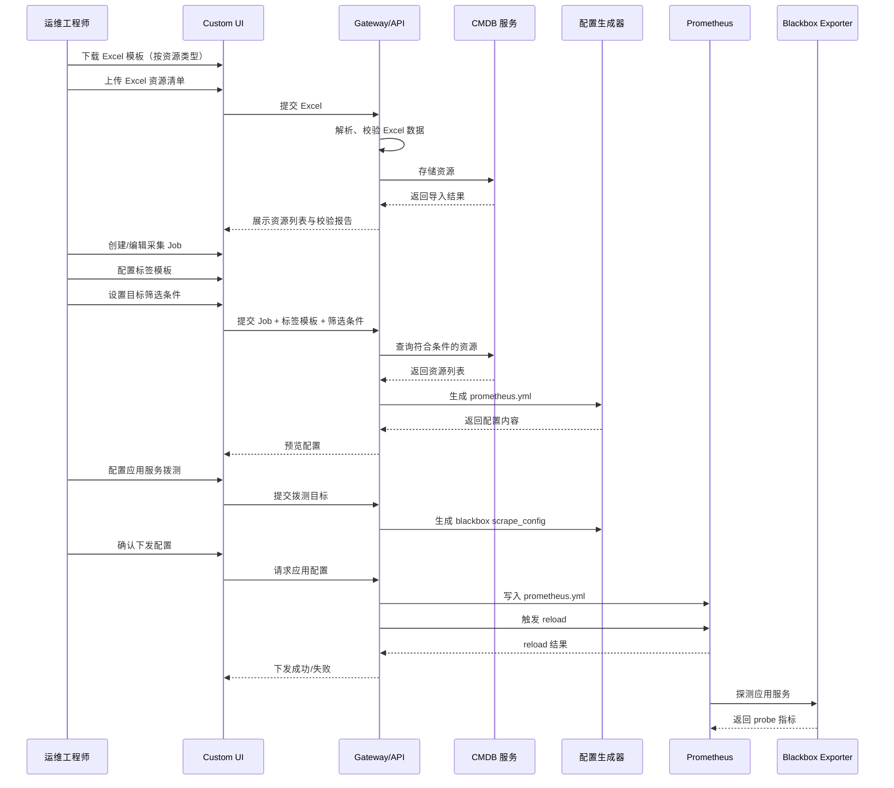

# Module 07: 配置管理

> **模块类型**: MVP 核心能力模块  
> **依赖文档**: [00_Global_Architecture.md](../00_Global_Architecture.md)、[Module_01_Metric_Collection_Center.md](Module_01_Metric_Collection_Center.md)  
> **目标用户**: 运维工程师、运维架构师  
> **版本**: v2.0  
> **更新日期**: 2026-07-20

---

## 1. 模块目标

作为 MetricCenter MVP 版本的**核心模块**，从功能架构上对应 **01 资源管理** 与 **03 配置中心**，并在 MVP 阶段承接 [Module 01: 指标管理与采集状态中心](Module_01_Metric_Collection_Center.md) 中指标管理相关配置的编辑与实现。

具体职责：

1. **资源管理**：维护三类监控资源（主机、中间件、应用服务），支持 Excel 导入与固定字段管理。
2. **标签与采集配置**：定义资源字段到 Prometheus Label 的映射规则，编辑采集 Job、标签模板和拨测配置。
3. **配置中心**：自动生成 `prometheus.yml` 并下发到 Prometheus，支持配置预览与校验。
4. **扩展性**：为后续接入外部 CMDB（如腾讯蓝鲸）预留统一接口。

> **MVP 边界**：资源管理最小化，字段固定，不做动态资源模型；告警规则不写 UI，直接编辑 `rules.yml`。
>
> **与 Module 01 的边界**：Module 01 是 **02 指标管理** 与 **06 采集状态与诊断** 的功能 Owner；MVP 阶段指标管理相关配置的编辑入口由本模块承载，但数据契约与能力边界由 Module 01 定义。

---

## 2. 用户故事

- OPS-02：从 Excel 批量导入主机、中间件、应用服务资源
- OPS-05：临时添加一个采集目标用于验证
- OPS-06：配置应用服务的 HTTP/TCP 拨测
- ARCH-03：查看平台整体采集覆盖率
- ARCH-04：配置 Remote Write 转发（P2）

---

## 3. 核心功能

### 3.1 资源管理（01 资源管理）

| 功能 | 说明 | 优先级 |
|------|------|--------|
| **资源类型管理** | 定义主机、中间件、应用服务三类资源，字段固定 | P0 |
| **主机资源管理** | 主机列表、CRUD、Excel 导入 | P0 |
| **中间件资源管理** | 中间件列表、类型选择、CRUD、Excel 导入 | P0 |
| **应用服务资源管理** | 应用服务列表、拨测 URL、CRUD、Excel 导入 | P0 |
| **展示字段控制** | 按资源类型固定展示列、默认排序 | P0 |
| **资源状态管理** | online / offline / maintenance 状态维护 | P0 |
| **CMDB 接入源** | Excel 接入（MVP）、HTTP API、Nacos、Kubernetes、腾讯蓝鲸（未来） | P1/P2 |
| **资源关系** | 应用-实例-集群关系、依赖拓扑（未来） | P2 |

### 3.2 指标管理配置实现（功能 Owner：Module 01）

| 功能 | 说明 | 优先级 |
|------|------|--------|
| **标签模板管理** | 按资源类型定义字段到 Prometheus Label 的映射 | P0 |
| **采集 Job 管理** | 配置 job_name、scrape_interval、metrics_path、scheme 等 | P0 |
| **目标筛选** | 按资源类型、env、app、cluster 等字段筛选纳入监控的实例 | P0 |
| **拨测配置管理** | 为应用服务生成 Blackbox Exporter 的探测配置 | P0 |
| **采集模板管理** | 预置 node-exporter、mysqld-exporter、simple-agent、blackbox 模板 | P1 |
| **指标元数据管理** | 指标名注册、类型标记（counter/gauge/histogram/summary）、HELP/UNIT | P1 |
| **高级 Relabel 管理** | 标签丢弃/保留/重写、正则替换、hashmod（未来） | P2 |

### 3.3 配置中心（03 配置中心）

| 功能 | 说明 | 优先级 |
|------|------|--------|
| **配置生成** | 根据资源+Job+标签模板自动生成 `prometheus.yml`、实时预览 | P0 |
| **配置校验** | YAML 语法校验、Prometheus 语义校验（调用 `promtool`）、冲突检测 | P0/P1 |
| **配置下发** | 手动下发、SIGHUP / `/-/reload` / 文件监听 | P0 |
| **配置版本** | 下发历史、版本对比、一键回滚 | P1 |
| **配置审计** | 变更记录、操作人、Diff 展示 | P2 |

---

## 4. 核心流程

### 4.1 配置管理整体流程



---

## 5. 数据模型

### 5.1 资源类型枚举

```go
type ResourceType string

const (
    ResourceTypeHost         ResourceType = "host"
    ResourceTypeMiddleware   ResourceType = "middleware"
    ResourceTypeApplication  ResourceType = "application"
)
```

### 5.2 资源基础结构（Resource）

所有资源类型共享的基础字段：

| 字段 | 类型 | 必填 | 说明 |
|------|------|------|------|
| resource_id | string | ✅ | 唯一标识 |
| resource_type | ResourceType | ✅ | host / middleware / application |
| app_name | string | ✅ | 应用名 → 映射为 `app` label |
| env | string | ✅ | 环境 → 映射为 `env` label |
| cluster | string | ✅ | 集群 → 映射为 `cluster` label |
| owner | string | ❌ | 负责人 |
| status | string | ✅ | online / offline / maintenance |
| created_at | datetime | ✅ | 创建时间 |
| updated_at | datetime | ✅ | 更新时间 |

### 5.3 主机资源（Host）

| 字段 | 类型 | 必填 | 说明 |
|------|------|------|------|
| hostname | string | ✅ | 主机名 |
| instance_ip | string | ✅ | 管理 IP |
| os_type | string | ❌ | linux / windows |
| os_version | string | ❌ | 系统版本 |

### 5.4 中间件资源（Middleware）

| 字段 | 类型 | 必填 | 说明 |
|------|------|------|------|
| middleware_type | string | ✅ | mysql / redis / kafka / elasticsearch / ... |
| instance_ip | string | ✅ | 服务 IP |
| port | int | ✅ | 服务端口 |
| version | string | ❌ | 版本号 |
| connection_string | string | ❌ | 连接串（敏感信息可加密存储） |

### 5.5 应用服务资源（Application）

| 字段 | 类型 | 必填 | 说明 |
|------|------|------|------|
| service_name | string | ✅ | 服务名 |
| health_check_url | string | ✅ | 拨测 URL |
| protocol | string | ✅ | http / https / tcp |
| endpoint | string | ❌ | 业务指标端点 |
| port | int | ❌ | 服务端口 |

### 5.6 标签模板（LabelTemplate）

| 字段 | 类型 | 说明 |
|------|------|------|
| id | string | 唯一标识 |
| name | string | 模板名称 |
| resource_type | ResourceType | 适用的资源类型 |
| job_id | string | 关联的 Job |
| mappings | []Mapping | 字段映射列表 |

### 5.7 字段映射（Mapping）

| 字段 | 类型 | 说明 |
|------|------|------|
| source_field | string | 来源字段名 |
| source_type | enum | `cmdb` / `prometheus_builtin` / `composite` |
| target_label | string | Prometheus Label 名 |
| enabled | bool | 是否启用 |
| transform | string | 转换规则（可选）：`lower`、`upper`、`prefix`、`replace` |

### 5.8 标签模板字段来源

#### A. CMDB 字段

| 资源类型 | CMDB 字段 | Prometheus Label |
|----------|-----------|------------------|
| 通用 | `app_name` | `app` |
| 通用 | `env` | `env` |
| 通用 | `cluster` | `cluster` |
| 主机 | `hostname` | `hostname` |
| 主机 | `instance_ip` | `instance_ip` |
| 中间件 | `middleware_type` | `middleware_type` |
| 应用服务 | `service_name` | `service_name` |

#### B. Prometheus 内置字段

| 内置字段 | 说明 |
|----------|------|
| `__address__` | 抓取地址 |
| `__scheme__` | 协议 |
| `__metrics_path__` | 采集路径 |
| `job` | Job 名称 |
| `instance` | 实例标识 |

#### C. 组合字段

| 组合字段 | 生成规则 |
|----------|----------|
| `instance` | 主机/中间件：`instance_ip` + `:` + `port` |

### 5.9 默认标签模板

按资源类型的默认映射：

**主机默认标签模板**

| 来源类型 | 来源字段 | 目标 Label |
|----------|----------|------------|
| composite | `instance_ip:port` | `instance` |
| cmdb | `app_name` | `app` |
| cmdb | `env` | `env` |
| cmdb | `cluster` | `cluster` |
| cmdb | `hostname` | `hostname` |

**中间件默认标签模板**

| 来源类型 | 来源字段 | 目标 Label |
|----------|----------|------------|
| composite | `instance_ip:port` | `instance` |
| cmdb | `app_name` | `app` |
| cmdb | `env` | `env` |
| cmdb | `cluster` | `cluster` |
| cmdb | `middleware_type` | `middleware_type` |

**应用服务默认标签模板**

| 来源类型 | 来源字段 | 目标 Label |
|----------|----------|------------|
| cmdb | `service_name` | `service_name` |
| cmdb | `app_name` | `app` |
| cmdb | `env` | `env` |
| cmdb | `cluster` | `cluster` |
| cmdb | `health_check_url` | `health_check_url` |

### 5.10 采集 Job（ScrapeJob）

| 字段 | 类型 | 说明 |
|------|------|------|
| id | string | 唯一标识 |
| job_name | string | Prometheus job_name |
| resource_type | ResourceType | 关联的资源类型 |
| scrape_interval | duration | 抓取间隔，默认 `15s` |
| scrape_timeout | duration | 抓取超时，默认 `10s` |
| metrics_path | string | 默认 `/metrics` |
| scheme | string | `http` / `https` |
| filter_rules | []FilterRule | 目标筛选规则 |
| label_template_id | string | 关联的标签模板 |
| enabled | bool | 是否启用 |

### 5.11 目标筛选规则（FilterRule）

| 字段 | 类型 | 说明 |
|------|------|------|
| field | string | 资源字段名 |
| operator | enum | `eq` / `neq` / `in` / `not_in` / `contains` |
| value | string / []string | 筛选值 |

### 5.12 拨测配置（BlackboxProbeConfig）

| 字段 | 类型 | 说明 |
|------|------|------|
| id | string | 唯一标识 |
| job_name | string | Prometheus job_name |
| module | string | Blackbox module，如 `http_2xx`、`tcp_connect` |
| targets | []string | 拨测目标 URL |
| scrape_interval | duration | 默认 `60s` |
| enabled | bool | 是否启用 |

### 5.13 采集模板（ScrapeTemplate）

| 字段 | 类型 | 说明 |
|------|------|------|
| id | string | 唯一标识 |
| name | string | 模板名称 |
| resource_type | ResourceType | 适用的资源类型 |
| display_name | string | 展示名称 |
| description | string | 模板说明 |
| default_scrape_interval | duration | 默认抓取间隔 |
| default_scrape_timeout | duration | 默认抓取超时 |
| default_metrics_path | string | 默认采集路径 |
| default_scheme | string | 默认协议 |
| default_port | int | 默认端口 |
| label_template_id | string | 关联的默认标签模板 |
| example_target | string | 示例目标地址 |
| code_path | string | 示例代码路径 |

---

## 6. Excel 导入规范

### 6.1 模板规则

MVP 阶段按资源类型提供**固定列模板**，不做动态字段映射。

**主机导入模板列**

```
hostname | instance_ip | os_type | app_name | env | cluster | owner | status
```

**中间件导入模板列**

```
middleware_type | instance_ip | port | version | app_name | env | cluster | owner | status
```

**应用服务导入模板列**

```
service_name | health_check_url | protocol | endpoint | port | app_name | env | cluster | owner | status
```

### 6.2 数据校验

| 校验项 | 规则 |
|--------|------|
| 必填项 | 检查资源类型对应的必填字段 |
| IP 格式 | `instance_ip` 必须符合 IPv4 格式 |
| 端口范围 | `port` 必须在 1 ~ 65535 |
| URL 格式 | `health_check_url` 必须符合 HTTP/TCP URL 格式 |
| 环境枚举 | `env` 必须是 `dev/test/staging/prod` 之一 |
| 协议枚举 | `protocol` 必须是 `http/https/tcp` 之一 |
| 状态枚举 | `status` 必须是 `online/offline/maintenance` 之一 |
| 重复检测 | 同一资源类型下，`instance_ip:port` 或 `service_name` 不可重复 |

### 6.3 导入结果

```json
{
  "status": "success",
  "data": {
    "total": 100,
    "success": 98,
    "failed": 2,
    "errors": [
      {
        "row": 5,
        "resource_type": "host",
        "field": "instance_ip",
        "value": "999.999.999.999",
        "reason": "IP 格式不正确"
      }
    ]
  }
}
```

---

## 7. 配置生成规则

### 7.1 普通采集配置示例

```yaml
global:
  scrape_interval: 15s
  evaluation_interval: 15s

scrape_configs:
  - job_name: 'node-exporter-prod'
    scrape_interval: 15s
    metrics_path: '/metrics'
    scheme: 'http'
    static_configs:
      - targets:
          - '10.0.1.10:9100'
          - '10.0.1.11:9100'
        labels:
          app: 'order-service'
          env: 'prod'
          cluster: 'bj-01'
          hostname: 'host-01'
```

### 7.2 Blackbox 拨测配置示例

```yaml
scrape_configs:
  - job_name: 'blackbox-http'
    metrics_path: /probe
    params:
      module: [http_2xx]
    static_configs:
      - targets:
          - 'https://order-service.prod/api/health'
    relabel_configs:
      - source_labels: [__address__]
        target_label: __param_target
      - target_label: __address__
        replacement: blackbox-exporter:9115
      - source_labels: [__param_target]
        target_label: instance
      - source_labels: [__param_target]
        target_label: health_check_url
```

### 7.3 生成规则

1. 按 `job_name` 分组
2. 每个 Job 下，根据筛选规则查询对应资源类型的资源
3. 对每个资源，按标签模板生成 labels
4. 将资源组合为 `static_configs`
5. Blackbox 拨测配置单独生成，指向 Blackbox Exporter

---

## 8. simple-agent 标准采集示例

MetricCenter 内置 [`platform/examples/simple-agent/`](../../../../platform/examples/simple-agent/main.go) 作为应用服务自定义指标接入模板。

### 8.1 启动示例

```bash
cd platform/examples/simple-agent
go mod tidy
go run main.go -listen-address ":9100" -app-name "order-service" -env "prod"
```

### 8.2 对应的应用服务采集模板

```yaml
id: "tpl-simple-agent"
name: "simple-agent"
resource_type: "application"
display_name: "Simple Agent 示例采集器"
description: "基于 prometheus/client_golang 的轻量采集端模板"
default_scrape_interval: "15s"
default_scrape_timeout: "10s"
default_metrics_path: "/metrics"
default_scheme: "http"
default_port: 9100
label_template_id: "default-application"
example_target: "localhost:9100"
code_path: "platform/examples/simple-agent/"
```

---

## 9. 配置下发机制

### 9.1 下发方式

| 方式 | 说明 | 适用场景 |
|------|------|----------|
| SIGHUP | 向 Prometheus 进程发送 SIGHUP 信号 | Prometheus 与平台同进程管理 |
| HTTP /-/reload | 调用 `POST /-/reload` | Prometheus 独立进程，需启用 `--web.enable-lifecycle` |
| 文件监听 | Prometheus 配置由 ConfigMap/文件挂载管理 | K8s 环境 |

MVP 推荐：**SIGHUP 或 HTTP /-/reload**

### 9.2 下发流程

1. 生成新的 `prometheus.yml`
2. 备份旧配置到 `prometheus.yml.bak`
3. 写入新配置
4. 触发 reload
5. 验证 reload 是否成功（调用 `/-/healthy` 或 `/-/ready`）
6. 记录下发历史

---

## 10. CMDB Provider 扩展设计

为后续接入腾讯蓝鲸等外部 CMDB 预留统一接口：

```go
type CMDBProvider interface {
    Name() string
    ListResources(ctx context.Context, resourceType ResourceType, filter Filter) ([]Resource, error)
}
```

MVP 实现：
- `ExcelProvider`：Excel 导入
- `SQLiteProvider`：本地 SQLite 存储

未来实现：
- `BlueKingProvider`：腾讯蓝鲸 CMDB
- `HTTPProvider`：通用 HTTP CMDB
- `NacosProvider`：Nacos 注册中心
- `KubernetesProvider`：K8s Endpoints/Service

---

## 11. 前端页面

| 页面 | 功能 |
|------|------|
| 资源类型选择 | 选择主机/中间件/应用服务进行管理 |
| 主机资源管理 | 主机列表、Excel 导入、编辑、删除 |
| 中间件资源管理 | 中间件列表、类型选择、Excel 导入 |
| 应用服务资源管理 | 应用服务列表、拨测 URL、Excel 导入 |
| 标签模板 | 按资源类型创建/编辑标签模板 |
| 采集模板 | 选择预置模板、查看示例代码 |
| 采集 Job | 创建/编辑 Job、筛选条件、标签模板关联 |
| 拨测配置 | 配置 Blackbox 拨测目标和模块 |
| 配置预览 | 实时预览生成的 `prometheus.yml` |
| 下发历史 | 查看配置变更记录（P2） |

---

## 12. 依赖

- `platform/config/`
- `platform/models/`
- `platform/discovery/`
- `upstream/prometheus/config/`
- `upstream/prometheus/discovery/`（后续扩展）

---

## 13. 验收标准

- [ ] 可以维护主机、中间件、应用服务三类资源
- [ ] 可以按资源类型下载固定列的 Excel 模板
- [ ] 可以上传 Excel 并导入到对应资源类型
- [ ] 导入时能够基于资源类型校验必填字段并返回错误报告
- [ ] 可以创建/编辑标签模板，且标签模板按资源类型区分
- [ ] 标签模板字段来源包含 CMDB 字段、Prometheus 内置字段和组合字段
- [ ] 可以查看预置采集模板（node-exporter、mysqld-exporter、simple-agent、blackbox）
- [ ] 可以创建/编辑采集 Job 并设置筛选条件
- [ ] 可以为应用服务配置 Blackbox 拨测
- [ ] 可以预览生成的 `prometheus.yml`
- [ ] 可以一键下发配置到 Prometheus
- [ ] 下发后 Prometheus 的 targets 正确更新
- [ ] 生成的 labels 与资源字段及标签模板配置保持一致
