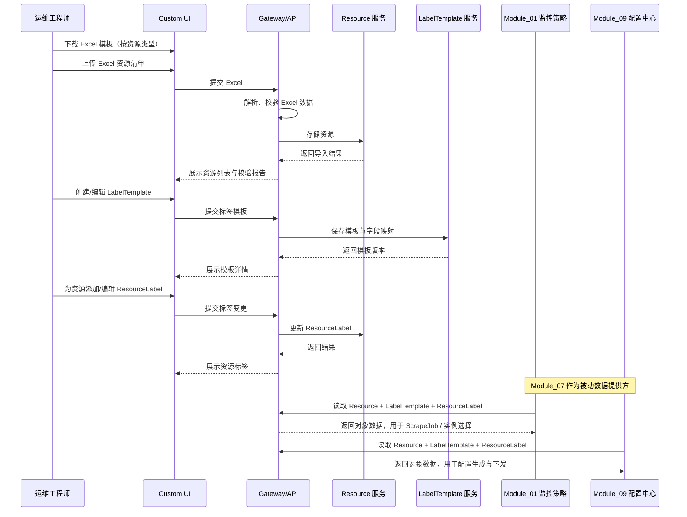
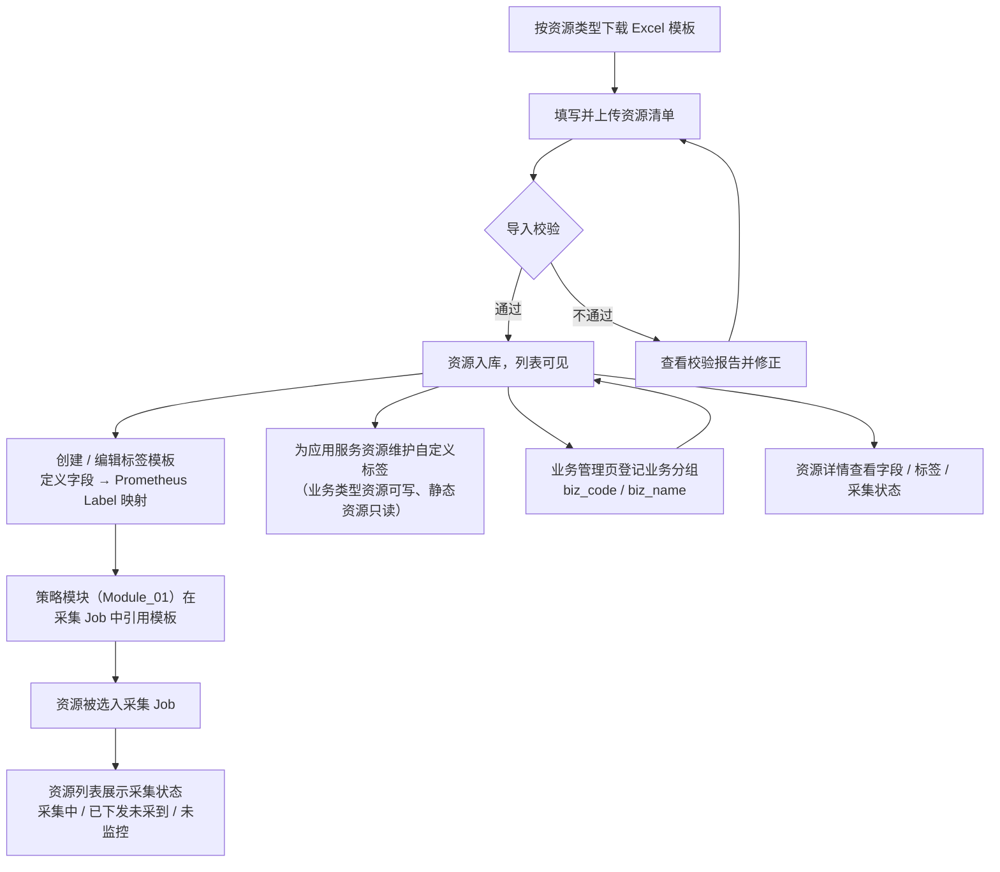
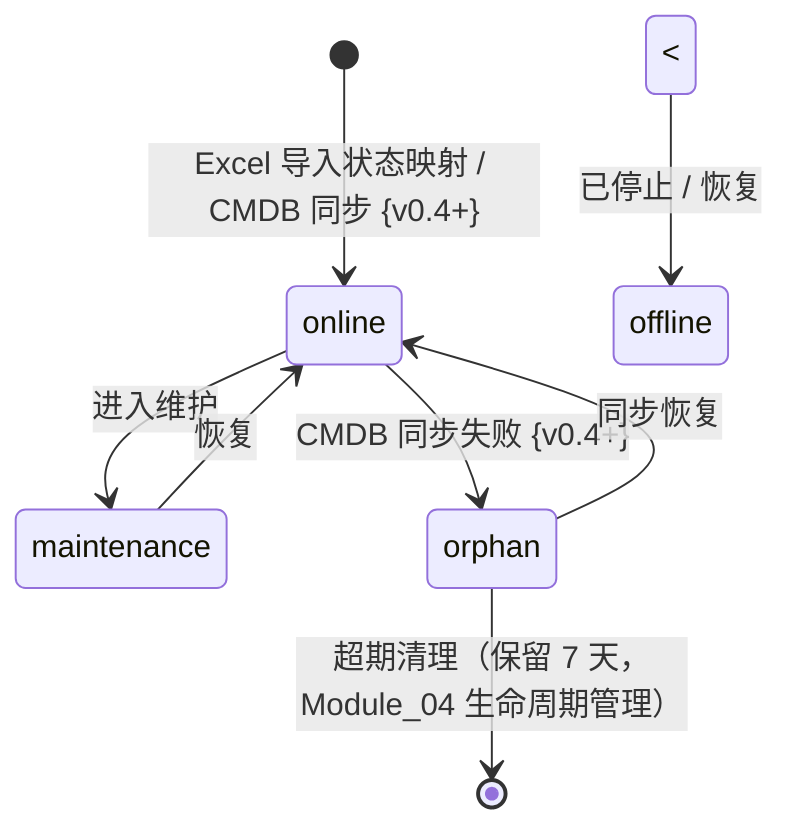

# Module 07: 监控对象管理

> **PRD 状态**: `ready`（可开发版本）
> **PRD 版本**: v2.39
> **产品版本覆盖**: MVP / v0.2 / v0.3 / v0.4 / v1.0
> **原型版本**: v2.39（决策 92 原型已同步：资源侧应用字段 `app_name` → `app_code`、新增「应用管理」页维护应用字典，同步明细见 `docs/prototypes/module-07/README.md` v2.39 变更说明；PRD v2.37 为「核心章节形态纪律」纯文档轮——技术层五章 §1/§4/§5/§7/§8 形态改造与归属归位，**原型行为不变、无需同步**）
> **更新日期**: 2026-09-19
> **对应原型**: `docs/prototypes/module-07/`

> **模块类型**: MVP 核心能力模块
> **依赖文档**: [00\_Global\_Architecture.md](../00_Global_Architecture.md)、[Module\_01: 监控策略与指标管理](Module_01_Metric_Collection_Center.md)、[Module\_09: 网域与边缘配置中心](Module_09_Network_Domain_and_Edge_Config_Center.md)
> **目标用户**: 运维工程师、运维架构师

***

## 0. 需求背景与典型场景

### 这个模块解决什么问题

监控平台的核心是「监控对象」——主机、数据库、中间件、应用服务。但现实中 CMDB 数据与监控对象往往不一致：资源台账不全、字段混乱、标签缺失，导致采集配置无法精准定位目标。本模块建立统一的监控对象台账与标签契约，让「监控什么」有单一事实来源。

### 用户需求的演进过程

从 MVP 开发期的真实反馈看，资源管理的需求随着数据规模扩大逐步暴露：

**阶段 1：数据接入期——「如何快速把 CMDB 数据导入平台？」**
- 用户最初的需求是：把现有的 CMDB 或 Excel 台账导入平台作为监控对象
- 痛点：手工逐条录入效率低，Excel 导入需要固定模板与校验规则
- 对应能力：Excel 批量导入（固定列模板 + 状态映射字典 + 导入校验）

**阶段 2：字段规范期——「资源字段不统一，采集配置对不上」**
- 用户在导入后发现：操作系统字段不统一（如 `ubutund` vs `Ubuntu`）、必填字段缺失导致采集 Job 选不到实例
- 痛点：资源字段缺乏标准化，采集实例定位依赖字段（如 `os_type`）标注不完善
- 对应能力：`os_type` 必填化 + 内置字典选择（AutoComplete 下拉）+ 字段归一化

**阶段 3：标签治理期——「监控数据需要统一的业务标签」**
- 用户需要为不同资源类型定义标签映射规则，让采集数据带上统一的业务标签
- 痛点：标签模板与资源实例的关联关系不清晰，静态资源与业务资源的标签治理边界模糊
- 对应能力：标签模板管理（按资源类别定义映射规则）+ 静态资源隐藏「关联实例」（决策 F-34）

**阶段 4：状态感知期——「资源到底有没有被采到？」**
- 用户在 M01 配置采集 Job 后，需要知道资源是否被正确采集
- 痛点：资源列表只有静态信息，无法感知采集状态；M01 Job 回显与 M07 badge 数据不同源
- 对应能力：采集状态三态 badge（采集中/已下发未采到/未监控）+ 资源列表筛选

**阶段 5：业务归属期——「资源需要按业务维度组织」**
- 用户需要按业务线（如支付业务、数据接口业务）组织应用服务资源
- 痛点：业务编码与资源归属缺乏字典管理，业务维度无法用于查询聚合
- 对应能力：业务分组字典（biz_code/biz_name）+ 业务管理页

### 不同技术背景用户的痛点分层

同一个资源管理能力，不同技术背景的用户会提出完全不同的问题：

| 用户类型 | 典型问题 | 本模块的应对 |
|----------|----------|-------------|
| **CMDB 管理员** | 「CMDB 字段与平台资源字段如何映射？」 | Excel 导入固定列模板 + 字段映射规则 |
| **有经验的运维** | 「标签模板修改后，会影响哪些采集 Job？」 | 标签模板「被引用 Job」展示 + 变更影响提示 |
| **普通运维** | 「我不知道该选哪个资源类别，字段填什么格式」 | 资源类别五大类引导 + 字段格式校验 + 内置字典选择 |
| **监控新手** | 「什么是标签？为什么采集配置需要标签模板？」 | 标签模板创建引导 + 用户词汇表（术语映射） |

### 典型场景（基于真实用户反馈）

| 场景 | 角色 | 触发条件 | 用户目标 | 成功标准 | 来源 |
|------|------|----------|----------|----------|------|
| 批量导入资源台账 | 运维工程师 | 从 CMDB 导出 500 台主机 Excel | 快速导入平台作为监控对象 | Excel 导入成功，资源列表可查，标签正确映射 | 原始需求 |
| 操作系统字段标准化 | 运维工程师 | 主机 `os_type` 填错导致采集 Job 选不到实例 | 操作系统字段从下拉字典选择，避免手误 | `os_type` 必填 + 内置字典选择（AutoComplete） | dev-feedback §9 |
| 维护标签模板 | 运维工程师 | 需要统一主机标签规范 | 定义主机字段到 Prometheus Label 的映射 | 模板保存后，新建 Job 自动应用该标签规则 | 原始需求 |
| 查看资源采集状态 | 运维架构师 | 例行检查监控覆盖率 | 按采集状态筛选资源，发现未监控缺口 | 资源列表三态 badge 清晰，可筛选/导出 | 决策 47-3 |
| 业务分组管理 | 运维工程师 | 需要按业务线组织应用服务资源 | 登记业务分组并关联到资源 | 业务字典落库，资源表单可选择业务归属 | 决策 48 |
| 静态资源标签治理 | 运维工程师 | 主机/数据库等静态资源不需要实例级标签 | 隐藏静态资源的「关联实例」Tab | 仅业务类型资源（application）展示关联实例 | F-34 |

> 本模块覆盖的用户故事详见 [§2 用户故事](#2-用户故事)。

---

## 1. 模块目标

> 决策依据：design-decisions.md 决策 16（资源类型粒度）/ D19（五大类拆分）/ D24（术语分层与字段改名）

Module 07 聚焦**监控对象的生命周期管理**，是 MetricCenter 的**对象数据层**。本模块负责维护可被监控的实体（Resource）、定义资源字段到 Prometheus Label 的映射规则（LabelTemplate），以及管理资源上附加的标签（ResourceLabel）。

**核心定位**：Module 07 是 Module\_01（监控策略与指标管理）和 Module\_09（网域与边缘配置中心）的**被动数据提供方**。本模块不直接生成或下发 Prometheus 配置，也不负责 ScrapeJob、拨测、规则编辑等策略配置；与两个模块的完整职责边界见 [§7.1](#71-模块边界与依赖关系)。

具体职责：

1. **资源管理**：维护五类监控资源（主机、数据库、中间件、应用服务、其他监控目标〔兜底类〕），支持 Excel 导入、手动录入、CRUD 与固定字段管理。
2. **标签模板管理**：按资源类型定义字段到 Prometheus Label 的映射规则，为策略模块生成 Job 提供稳定的标签契约。
3. **资源标签管理**：维护 ResourceLabel 的多种来源（system / user / cmdb）及冲突合并规则。
4. **Excel 导入**：提供固定列模板、状态映射字典与导入校验。
5. **扩展性**：为后续接入外部 CMDB（腾讯蓝鲸）预留统一 `CMDBProvider` 接口；具体的 CMDB 同步策略、失败处理与孤儿资源生命周期由 [Module\_04](Module_04_Custom_Discovery.md) 负责。MVP 阶段通过 `ExcelProvider` / `SQLiteProvider` 本地维护资源。

**MVP 边界**：

- 资源管理最小化，字段固定，不做动态资源模型。
- 本模块**不做** ScrapeJob 配置、Blackbox 拨测配置、配置生成、配置校验、配置下发、采集模板管理、目标筛选——这些职责的归属矩阵见 [§7.1](#71-模块边界与依赖关系)。

***

## 2. 用户故事

> 决策依据：design-decisions.md 决策 3.24（M07-OPS-07 回写全局用户故事库）

> 完整用户故事条目（角色 / 我希望 / 以便于）见**全局用户故事库** **[01\_User\_Stories.md](../01_User_Stories.md)** **4.7 节**；模块级用户故事使用模块命名空间编码（`M07-ROLE-NN`，全局唯一），产品级故事（ARCH-03）沿用全局库编码，仅在此列出编码与一句话摘要。

- **M07-OPS-02**：从 Excel 批量导入主机、数据库、中间件、应用服务资源
- **M07-OPS-05**：临时添加一个资源用于验证（由策略模块决定是否纳入采集 Job）
- **M07-OPS-07**：为资源类型创建/编辑标签模板，定义字段到监控标签的映射（完整条目见全局库 §4.7）
- **M07-OPS-08**：为资源维护业务归属（`biz_code`，全类型必填，字典下拉选择），如支付业务、数据接口业务（完整条目见全局库 §4.7）
- **M07-OPS-09**：为应用服务资源添加自定义标签（业务类型资源可写，静态资源只读）（完整条目见全局库 §4.7）
- **M07-OPS-10**：在业务管理页登记/维护业务分组（biz_code / biz_name / 状态），biz_code 创建后不可改、停用不删除（完整条目见全局库 §4.7）
- **ARCH-03**：查看平台整体采集覆盖率（完整条目见全局库 §2.2；落点：M01 实例选择器「未纳入任何 Job」筛选 + M01 Job 详情采集状态回显 + **M07 资源列表三态采集状态 badge**）

> 已移除：M07-OPS-06（Blackbox 拨测配置）、M07-ARCH-04（配置生成器注入 remote\_write），分别由 Module\_01 与 Module\_09 承接。

***

## 3. 核心功能

> 决策依据：design-decisions.md 决策 3.32-3.42（模板↔实例隐式关联 / 标签模板动线）/ 3.43（标签来源口径）/ 3.44（模板变更影响反馈）/ 3.45（标签双场景治理）/ 3.46（业务类型）/ 设计对齐决策 13/14/17/21/22（业务分组字典、`biz_code` 必填改造与命名 / 停用治理、`tenant_id→tenant` 映射——**{v0.2} 起为内置默认前瞻口径**，决策 68-5）

> 本章按「用户可见能力」组织：每个子节给出**一句用户价值 + 3~5 条行为要点 + 优先级 + 交付版本**。「优先级」（P0/P1/P2）回答「本轮是否必做」，「交付版本」回答「哪个产品版本交付」（`MVP` / 花括号阶段标签 `{v0.2}` / `{v0.4+}` / `后续版本`），两轴正交、口径与 `02_Product_Roadmap.md` §1.5 功能-版本矩阵一致。字段语义见 §5、接口见 §6、页面状态与全局行为见 §11、术语口径见 §10，定版论证见 `docs/05-execution-records/module-07/design-decisions.md`。

### 3.1 资源管理

> **用户价值**：把散落在 Excel、CMDB 与各团队表格里的被监控对象，汇成一份平台内权威、可批量维护的资源台账——每个对象都有明确归属、状态与标签来源。

#### 3.1.1 五类资源台账

> **用户价值**：不同类型对象在同一套列表与表单里维护，不必为每类资源学一套操作。

| 行为要点 | 说明 | 优先级 | 交付版本 |
| --- | --- | --- | --- |
| 五类资源类型 | 主机 / 数据库 / 中间件 / 应用服务 / 其他监控目标（兜底类）五类固定粗粒度类型；类型枚举与字段定义见 5.1 / 5.2 | P0 | MVP |
| 资源列表与检索 | 按类型 Tab 切换列表，展示列按类型固定、默认排序稳定；支持关键字检索与筛选 | P0 | MVP |
| 新增与编辑 | 列表内「新增资源」为**单一按钮**：按当前资源类型 Tab 打开对应登记抽屉（5 类 1:1）；编辑复用同一抽屉 | P0 | MVP |
| Excel 批量导入 | 按类型下载固定列模板 → 导入校验 → 结果清单；同一服务多实例按「一行 = 一个可抓取实例」录入，规范见 5.16 | P0 | MVP |
| 删除与引用保护 | 删除前二次确认；被采集 Job 引用时阻止删除，并返回引用 Job 名单与「查看引用 Job」入口；接口见 6.1 | P0 | MVP |

#### 3.1.2 其他监控目标登记（兜底类）

> **用户价值**：不在四类标准资源里、但仍需采集的对象（网络设备、GPU 服务器、自建 HTTP 端点、K8s 集群级端点）也能纳入台账，且不要求运维理解采集器术语。

| 行为要点 | 说明 | 优先级 | 交付版本 |
| --- | --- | --- | --- |
| 登记首问「登记对象」 | 表单首问对象类别——网络设备（SNMP 采集）/ GPU 服务器 / 自定义 HTTP 指标端点 / K8s 集群（集群级端点）；选择即写入端点子类型判别值，编辑时按其反查回显、未命中不强制重选 | P0 | MVP |
| 只登记端点地址 | 用户只填目标名称与端点 IP / 域名；端口 / 采集路径 / 协议等采集参数不在本表单出现，统一归 Module\_01 默认采集配置 | P0 | MVP |
| 自定义标签透传 | 支持 `key=value;key2=value2` 格式的自定义标签 | P0 | MVP |
| K8s 集群子动线 | K8s 集群不占类型入口（集群是部署形态而非资源类型），经本表单首问进入；节点 OS 层监控切换到「主机」Tab 登记 | P0 | MVP；首问分流 {v0.2} |
| 不纳入本类型的对象 | 容器 / Pod / K8s 节点等动态发现产物不在本模块登记；Oracle 等数据库统一归「数据库」类型 | P0 | MVP |

定位与边界见 5.9。

#### 3.1.3 列表展示、筛选与状态

> **用户价值**：让不同角色只看自己关心的列与范围，并一眼看出哪些对象在正常运行、哪些采集链路有问题。

| 行为要点 | 说明 | 优先级 | 交付版本 |
| --- | --- | --- | --- |
| 展示字段与排序 | 按资源类型固定展示列与默认排序 | P0 | MVP |
| 列显隐配置 | 工具栏「列设置」勾选显示 / 隐藏列；仅影响当前用户视图，不改变数据与默认列 | P1 | 后续版本 |
| 网域筛选器 | 列表内提供「网域」筛选器（默认记忆上次选择、始终可切「全部网域」）；资源按网域归属分组；网域列默认展示；网域列展示策略与登记引导见 5.4 | P0 | MVP |
| 运行状态维护 | 运行中 / 已停止 / 维护中三态；已停止的资源在下一配置生成周期即从采集目标移除；状态机见 8.1 | P0 | MVP |
| 采集状态三态 | 列表「采集状态」列展示三态 badge（采集中 / 已下发未采到 / 未监控），支持按采集状态筛选，异常态高饱和；口径与数据链路见 5.2 | P0 | MVP |

#### 3.1.4 标签与业务归属可见性

> **用户价值**：让用户看见「这个对象的标签从哪来、属于哪个业务」，而不是面对一堆没有出处的标签。

| 行为要点 | 说明 | 优先级 | 交付版本 |
| --- | --- | --- | --- |
| 适用模板展示 | 资源详情显示「适用模板」（该资源类型默认标签模板名 + 模板 ID），与 system 标签来源标注呼应；来源口径见 5.3 | P0 | MVP |
| 业务分组字典维护 | 业务管理页维护业务编码 `biz_code`（主键）、展示名 `biz_name`、描述与状态，为资源录入 / Excel 导入提供下拉选项；支持登记、受限编辑（仅 `biz_name` / 描述 / 状态）与停用；字段与红线见 5.18、接口见 6.1 | P0 | MVP |
| 外部接入源 | 为 BlueKing CMDB 等外部 Provider 预留统一接口；MVP 通过 Excel / SQLite 导入维护资源；外部 CMDB 同步由 Module\_04 实现 | P0 / P2 | MVP；CMDB 同步 {v0.4+} |
| 资源关系 | 应用-实例-集群关系与依赖拓扑 | P2 | 后续版本 |

### 3.2 标签模板管理

> **用户价值**：把「哪个资源字段变成哪个 Prometheus 标签」集中定义一次，该类型所有实例自动生效；改动前先看得见影响面。

#### 3.2.1 模板与映射维护

> **用户价值**：业务标签的定义只在一处维护，不必逐台实例重复配置。

| 行为要点 | 说明 | 优先级 | 交付版本 |
| --- | --- | --- | --- |
| 模板定义 | 按资源类型定义「资源字段 → Prometheus 标签」的映射 | P0 | MVP |
| 字段来源 | 支持资源字段、Prometheus 内置字段、组合字段、CMDB 字段；来源口径见 5.12 | P0 | MVP；CMDB 字段 {v0.4+} |
| 默认模板 | 五类资源各预置一套默认模板；模板清单见 5.13 | P0 | MVP |
| 创建工作流 | 选择资源类型 → 基于默认模板克隆 / 新建 → 编辑映射 → 保存前校验 → 保存 | P0 | MVP |
| 保存前校验 | 目标标签不得为保护 label（`instance` / `job` 等，`composite → instance` 例外）；同一模板内目标标签唯一 | P0 | MVP |

#### 3.2.2 关联实例可见性

> **用户价值**：改模板前先知道会影响哪些实例，不用自己数。

| 行为要点 | 说明 | 优先级 | 交付版本 |
| --- | --- | --- | --- |
| 适用关系 | 模板与实例按资源类型隐式关联——模板挂在资源类型上，该类型下所有实例自动适用（system 标签实时计算，见 5.3） | P0 | MVP |
| 关联实例清单 | 模板列表 / 详情展示「关联实例 N 个」，可展开查看实例清单（实例名 / 目标 IP / 状态） | P0 | MVP |
| 适用范围 | 仅业务类型资源（`application`）展示该入口；静态资源（host / database / middleware / 其他监控目标）的实例属性在 CMDB 侧只读治理，本模块不展示该入口 | P0 | MVP |

#### 3.2.3 引用影响与变更留痕

> **用户价值**：改模板前先看清影响面，改完有据可查。

| 行为要点 | 说明 | 优先级 | 交付版本 |
| --- | --- | --- | --- |
| 被引用 Job 展示 | 模板详情展示「被引用采集 Job N 个」（Job 名 / 网域 / 启用状态 / 变更状态） | P0 | MVP |
| 变更提示 | 模板刚修改且引用 Job 未确认发布时，行内显示「模板已变更，待确认」；与 Module\_09 变更单联动 | P0 | MVP；变更单联动 {v0.2+} |
| 修改快照 | 每次模板 / 映射变更落只读修改快照（操作人 / 时间 / 变更映射旧值 / 新值）；生效语义与回滚边界见 11.2 | P0 | MVP |
| 复制与版本 | 支持复制模板、基于现有模板创建新版本 | P1 | 后续版本 |

### 3.3 资源标签管理

> **用户价值**：个别实例确有模板覆盖不到的标签时，有一个不污染公共模板的出口。

| 行为要点 | 说明 | 优先级 | 交付版本 |
| --- | --- | --- | --- |
| 自定义标签维护 | 在资源详情为单个资源添加 / 编辑 / 删除标签；入口文案为「自定义标签（非必须）」 | P0 | MVP |
| 可写范围 | 仅 `user` 来源可编辑；仅业务类型资源（`application`）可写，静态资源只读（写接口返回 403，见 6.2） | P0 | MVP |
| 来源、优先级与冲突保护 | 标签来源分 system / user / cmdb 三种，冲突优先级 cmdb > user，system 为系统保护标签不可覆盖；禁止覆盖 Prometheus 内置 label（`instance` / `job` / `scheme` / `__address__` 等）；key 与 `source=cmdb` 已有标签冲突时实时提示「该 key 将由 CMDB 覆盖，建议更换 key」；口径见 5.3 / 10 | P0 | MVP；cmdb 来源 {v0.4+} |
| 来源标注与类型级引导 | system 标签标注「来自 XX 模板 · `app\_code→app`」并可跳转标签模板页；user 标注「手动添加」；新增 key 与模板映射目标冲突时提示「该标签由标签模板生成，如需修改请前往标签模板管理」 | P0 | MVP |
| 批量标签编辑 | 按资源类型或筛选条件批量增删改标签 | P1 | 后续版本 |
***

## 4. 核心流程

> 决策依据：design-decisions.md D24（术语分层，参与方与字段命名）

### 4.1 监控对象管理整体流程



**流程说明**：

- Module\_07 的核心流程只到 Resource、LabelTemplate、ResourceLabel 的维护为止。
- CMDB 存储、配置生成、配置下发均不在本模块职责范围内。
- Module\_01 与 Module\_09 通过只读接口消费本模块数据。

### 4.2 对象数据维护动线（用户视角）

4.1 是技术层时序（参与者 = UI / API / 服务）；本节从运维工程师视角给出对象数据的维护动线——**策略配置（ScrapeJob / 规则）与配置下发不在本模块动线内**，本模块只保证对象数据准确、完整。



***

## 5. 数据模型

## 5. 数据模型

> 决策依据：design-decisions.md 决策 16 / 3.4 / 3.16 / 3.18 / 3.25-3.26 / 3.43 / 3.45 / 3.46 / 3.47 / D18 / D19 / D24

### 5.1 资源类型枚举

| 枚举值 | 中文名 | 说明 |
|-------|-------|------|
| `host` | 主机 | |
| `database` | 数据库 | 数据库产品线独立成类（五大类拆分） |
| `middleware` | 中间件 | |
| `application` | 应用服务 | |
| `generic_target` | 其他监控目标 | 兜底类（见 5.9） |

**资源类型粒度说明**：

- `Resource.resource_category` 为**粗粒度五大类**分类（新增 `database`）；细粒度子类型以 `database_type`（mysql / redis / postgresql / oracle / dm8 / sqlserver / mongodb）与 `middleware_type`（kafka / elasticsearch / nginx / zookeeper）两个字段表达（见 5.7）；
- **五大类归类规则**：以**数据存储/查询为主语义、按产品线分采集器** → database；**消息/网关/协调/搜索** → middleware。边界案例已定：redis → database（缓存，业界多数 CMDB 放数据库/缓存侧）；elasticsearch 留 middleware；
- 细粒度监控对象类型（host / mysql / redis / kafka / nginx / application\_http / snmp）的\*\*映射与策略绑定落在 [Module\_01](Module_01_Metric_Collection_Center.md)（策略层）\*\*的 `monitor_type`，本模块不维护细粒度监控对象类型（推导表 `MONITOR_TYPE_DERIVATION_MAP` 见 Module\_01 5.1）；
- **权威来源为 CMDB**：{v0.4+} 由 [Module\_04](Module_04_Custom_Discovery.md) 同步后向本模块写入五大类 + database\_type / middleware\_type，MetricCenter **只维护映射、不增删类型**。

**CMDB 侧边界 {v0.4+}**：

- **CMDB 的 CI 类型本身是细粒度的**（如 BlueKing `bk_obj_id` 直接就是 mysql / redis / mongodb 等独立模型），CMDB **不存在**「中间件 → MySQL」的父子分类表达，也无需为 MetricCenter 引入 category 概念；
- MetricCenter 的**粗粒度五大类（category）仅是内部资源管理维度**（五类资源 CRUD 页面、标签模板归属、孤儿资源分组），不是 CMDB 的表达，也不是监控策略的表达；
- `database_type` / `middleware_type`（细粒度）来自 CMDB `bk_obj_id`{v0.4+} 或 Excel 导入列（MVP）；`resource_category`（粗粒度）由 [Module\_04](Module_04_Custom_Discovery.md) 的「CMDB CI 类型映射表」将细粒度 CI 归类到五大类。**CMDB 对分类拆分无感知、不受影响**（bk\_obj\_id 不变，仅映射表多一个目标类别值）。

**K8s 集群不设第六资源类型**：五大类按**采集形态**分类（用什么 exporter / 协议采），K8s 集群是**部署形态**而非采集形态——集群内要采的对象（节点 node exporter / kube-state-metrics / 业务 Pod）仍落回现有五类。「K8s 集群」诉求由四个现有对象分头承接，不新增类型：

| 用户想表达的 | 归属 | 现状 |
|---|---|---|
| 集群是一个网络边界（Pod 网段外部不可达） | **NetworkDomain**（overlay CNI 独立建域，`zone_type` 字典届时加 `k8s`） | 划域原则已决策（[Module_06 §3.2](Module_06_Multi_Tenant.md)），M09 机制零改动复用 |
| 集群是资源的分组 / 筛选维度 | **Resource.cluster 字段 → `cluster` 标签** | 已有字段与标签映射（§5.2 / §5.15） |
| 集群是动态实例的发现源（kubeconfig / APIServer 凭据） | **M04 服务发现源**（KubernetesProvider） | 已预留（§6.3），{v0.3+} 落地 |
| 集群本身要监控健康（apiserver / etcd / kube-state-metrics） | **generic_target**（UI 名「其他监控目标」，经其表单首问「登记对象 = K8s 集群」进入）+ Module_01 `monitor_type` 映射：`k8s_apiserver` / `k8s_etcd` / `k8s_kube_state_metrics`（{v0.2}，端点子类型判别见 Module\_01 §5.1） | 现有机制可表达；三个 k8s 监控对象类型 {v0.2} 随表单首问分流落地 |

> 如客户强诉求「在资源管理里看到集群清单」，给的是**集群视图**（按 `cluster` 字段分组 / 筛选的展示层，或后续轻量 Cluster 字典被 Resource 引用）——视图问题不是模型问题，MVP 不做。

> **`generic_target`（其他监控目标）兜底类定位、表单边界与 M01 职责分工见 §5.9。**

**资源身份第一性原则**：资源身份 = **采集端点 × 采集路径**，不是物理资产。「采集端点」指 Prometheus 实际抓取的 `instance`（IP:Port 或 URL）；「采集路径」指从哪条网络链路（哪条网域）触达该端点。两者组合唯一决定一条 Resource 的归属。

- **动态发现产物不构成登记对象**：容器、Pod、K8s 节点等动态实例由采集 Job 的服务发现机制（如 kubernetes_sd）在 Job 层生成 target，是**采集产物**而非 CMDB 登记对象——它们在 M07 没有 Resource 记录，其指标归属由对应 Job 的网域决定，查询时按 `node` / `instance` 标签与主机维度汇合。
- **同一物理机不拆登记记录的前提**：同一物理机上若存在多个采集切面（如 OS 层 `:9100` 经 B 域、K8s 节点指标经 A 域），K8s 节点指标由 A 域的集群 Job 动态发现覆盖，**主机仍只登记一条 host 记录（归属 OS 层采集路径对应的网域）**。仅当同一切面确实需要双路径冗余采集（极少数），才登记两条记录。
- **`instance_ip` 语义钉死为采集端点 IP**：即「该资源的采集端口在哪个 IP 上可达」。K8s 节点若有管理网 / 集群网双 IP，登记管理网 IP（node_exporter 可达侧），网域归属由 `ip_cidrs` 推导自然落 OS 层所在域。
- **与采集层标签汇合**：跨路径指标（如主机 OS 指标经 B 域、节点 K8s 指标经 A 域）在查询层按 `instance` / `node` 标签天然汇合，`network_domain` 标签仅区分数据采集链路来源，不影响跨域聚合。

### 5.2 资源基础结构（Resource）

所有资源类别共享的基础字段：

| 字段                   | 类型           | 必填 | UI 展示名    | 说明                                                                             |
| -------------------- | ------------ | -- | --------- | ------------------------------------------------------------------------------ |
| resource\_id         | string       | ✅  | 资源 ID     | 稳定唯一键，不用于展示；MVP 由服务端生成（uuid，创建后不可变，Excel 模板不含此列）；{v0.4+} CMDB 接入时复用 `cmdb_ci_id` |
| resource\_category       | ResourceCategory | ✅  | 资源类型      | host / database / middleware / application / generic\_target                              |
| database\_type      | string       | ❌  | 数据库类型     | 细粒度子类型（仅 `resource_category=database` 时使用）：mysql / redis / postgresql / oracle / dm8（达梦）/ sqlserver / mongodb 等；来自 CMDB `bk_obj_id`{v0.4+} 或 Excel 导入列（MVP） |
| middleware\_type    | string       | ❌  | 中间件类型     | 细粒度子类型（仅 `resource_category=middleware` 时使用）：kafka / elasticsearch / nginx / zookeeper 等；mysql / redis 已移入 `database_type`，本字段不再承载数据库产品线 |
| network\_domain\_id  | string       | ✅  | 网域        | 所属网域 ID；MVP 默认值为 `default`；{v0.2+} 按租户上下文填充。**语义：采集路径归属**（不是资产归属）——回答「这个资源的采集端点由哪条网域的采集链路触达」，与物理机的行政归属 / 云平台 / 业务无关；网域的用户侧定义与判断规则见 §5.4 |
| tenant\_id           | string       | ❌  | 仅技术信息     | 租户归属（权限/治理作用域）；MVP 单租户固定 `platform_admin`；作为 target 级 `tenant` 标签的**可选**标签映射来源（见 5.12.1）；{v0.2+} 多租户时按租户上下文填充，不进入采集拓扑 |
| source\_type         | enum         | ✅  | 数据来源      | 数据来源：`manual` / `import` / `cmdb {v0.4+}`，MVP 默认 `manual`                      |
| instance\_name       | string       | ❌  | 实例名       | 可读实例名/展示名；host 模板中必填，对应 Excel `instance_name`，生成 `hostname` label              |
| hostname             | string       | ❌  | 主机名       | 主机名；host 场景下默认与 `instance_name` 一致；也可从 CMDB `bk_host_name` 等字段同步               |
| instance\_ip         | string       | ❌  | 目标 IP     | 目标 IP 或域名；host / generic\_target 必填，作为 Prometheus scrape target 地址。**语义钉死为采集端点 IP**——即采集端口在哪个 IP 上可达，用于 `ip_cidrs` 归属推导；K8s 节点双网卡时登记采集端口可达侧的 IP |
| scrape\_port        | int          | ❌  | 采集端口     | {v0.2} 实例级采集端口覆盖（可选）；留空时由 M09 按「网域覆盖表 CITypeExporterMappingOverride → CITypeExporterMapping.default\_port → ExporterTemplate.default\_port」解析（见 Module\_01 5.1 端口一致性说明）；典型场景：同一主机运行多个同类实例（如两个 MySQL 3306/3307）各带各的端口 |
| os\_type             | string       | ✅* | 操作系统类型    | 操作系统类型；**host 必填**，为采集实例定位的关键依据（留空/拼错的主机被排除出采集候选，见 5.6）；采用**内置字典选择**（AutoComplete 下拉，可搜索/自定义），规范名↔家族归一化后落库；合法选项见 `GET /api/v2/platform/os-options`，host 场景下从 Excel `image` 或 CMDB 同步，字典可按需扩展规范名 |
| biz\_code     | string       | ✅  | 业务      | 业务归属**不可变编码**（如 payment、data-api）；对应业务分组字典主键；**MVP 所有资源类型必填**；导入时填写编码，UI 展示取字典 `biz_name`；经标签模板映射为 `biz` label；编码创建后不可变，展示名可改；停用条目不可被新资源/编辑选用，存量资源保留历史值 |
| app\_code            | string       | ✅* | 应用编码     | 应用归属**不可变编码**（如 order-service）；对应应用字典主键（见 5.19）；**`app` label 的唯一取值来源**（映射见 5.12.1 / 5.15）；录入与导入均填编码，UI 展示取字典 `app_name`；编码创建后不可变、展示名可改；停用条目不可被新资源 / 编辑选用，存量资源保留历史值；必填规则：application / database / middleware **必填**，host / generic\_target 可空（空值不注入 `app` 标签，见 5.15 规则 4） |
| env                  | string       | ✅  | 环境        | 环境 → 映射为 `env` label；全类型必填（任何资源都有环境归属）                                        |
| cluster              | string       | ✅* | 集群        | 集群 → 映射为 `cluster` label；**语义钉死为「集群」，不承载子应用维度**（子应用须新增独立字段，禁止复用，见下方红线）；host 场景下 Excel `sub_app_code` 列为空时取 `vpc`（物理列映射见 5.6）；必填规则同 `app_code`（host / generic\_target 可空，空值不注入标签） |
| owner                | string       | ❌  | 负责人       | 负责人；MVP 可由用户填写；{v0.4+} CMDB 接入时优先取自 `cmdb_maintainer`                            |
| cmdb\_ci\_id         | string       | ❌  | 仅技术信息     | {v0.4+} 对应 BlueKing CMDB 的 CI ID（`bk_inst_id`）                                 |
| cmdb\_business\_path | string       | ❌  | 仅技术信息     | {v1.0+} 对应 BlueKing CMDB 业务路径，用于 ITSM 服务目录映射                                   |
| cmdb\_module\_path   | string       | ❌  | 仅技术信息     | {v1.0+} 对应 BlueKing CMDB 模块路径，用于影响范围定位                                         |
| cmdb\_maintainer     | string       | ❌  | 仅技术信息     | {v1.0+} 对应 BlueKing CMDB 维护人，告警负责人来源之一                                         |
| status               | string       | ✅  | 运行状态    | `online` / `offline` / `maintenance` / `orphan {v0.4+}`；导入时 Excel 中文状态需映射到该枚举；状态行为语义（排除 `offline` 为目标语义、实现于 M09 targets 生成，MVP 必实现）见 8.1。UI 展示名「运行状态」，以与「采集状态」区分，数据来源以列头隐藏提示标注 |
| created\_at          | datetime     | ✅  | 仅技术信息     | 创建时间                                                                           |
| updated\_at          | datetime     | ✅  | 仅技术信息     | 更新时间                                                                           |

**`app_code` / `cluster` 必填标注（✅\*）**：按资源类别差异化——application / database / middleware 必填；host / generic\_target 可空（设备类资源无应用归属，强制必填会逼填假数据污染 `app` / `cluster` 标签聚合）；空值不注入对应标签（与 5.15 规则 4「`biz` 空值语义」对齐）。资源侧**只存编码 `app_code`**，展示名 `app_name` 由应用字典解析（字典缺条目时回退显示编码），展示名不参与标签取值。

**`cluster` 语义红线**：`cluster` **只表达集群**，不得复用承载「子应用 / 子服务」维度——Excel / CMDB 遗留列名 `sub_app_code` 的语义**等价于本 PRD 的 `cluster`（集群）**，**不是「子应用」**（物理列映射见 5.6）。若将来确需子应用维度，须新增独立字段并走独立 PRD 变更，禁止塞进 `cluster`。

**采集状态口径**：M07 是**资产台账**，但「采集状态」列升级为**三态真实状态 badge**——`采集中`（被 ScrapeJob 选中且 target `up`）/ `已下发未采到`（被选中但未采到数据：`down` / 待首次抓取 / **变更未确认下发**）/ `未监控`（未被任何 Job 选中）。数据由两处只读消费拼成：选中关系 `is_monitored` 由 M01 维护（取 DB 当前 `selected_instance_ids`，ready+enabled Job，**不问 M09 `change_status`、不感知下发时序**）；up/down 聚合由 M02 采集健康度/覆盖率 API 提供（MVP 起，按 `resource_id` 稳定身份标签回连资源）。「待采集（未下发）vs 已下发未采到」的细分由 M01 Job 上下文回显承担（M01 §5.10），本 badge 保持三态不区分。**M07 不直连时序数据**，列表查询必须走 M02 聚合 API、禁止逐行查询（TQ-6 N+1 教训）。「未纳入任何 Job」同步可在 M01 实例选择器筛选（辅助落点）；跨 Job 全局排障视图归 M02 目标状态页（P1）。


### 5.3 资源 Label（ResourceLabel）

为支持 CMDB、用户、系统模板三类来源的 label 合并与冲突处理，每个资源关联的 label 单独维护：

| 字段           | 类型       | 必填  | UI 展示名 | 说明 |
| ------------ | -------- | --- | ------ | ---------------------------------------------------------------------------------------------------- |
| id           | string   | ✅   | 仅技术信息  | 唯一标识 |
| resource\_id | string   | ✅   | 仅技术信息  | 关联的 `Resource.resource_id` |
| key          | string   | ✅   | 标签 Key | Label key；强制小写、下划线连接；禁止以 `__` 开头；禁止覆盖 Prometheus 内置 label（`instance`、`job`、`scheme`、`__address__` 等） |
| value        | string   | ✅   | 标签值    | Label value |
| source       | enum     | ✅   | 标签来源   | `system` / `user` / `cmdb {v0.4+}` |
| created\_at  | datetime | ✅   | 仅技术信息  | 创建时间 |
| updated\_at  | datetime | ✅   | 仅技术信息  | 更新时间 |

**来源说明**：

- `system`：由 [LabelTemplate](#510-标签模板labeltemplate) 根据 Resource 字段自动生成的默认 label，如 `app`、`env`、`cluster`、`hostname`、`biz`（来自 `biz_code`）。
- `user`：用户通过 UI 或 Excel 手动添加的 label。
- `cmdb`：{v0.4+} 由 Module\_04 CMDB 同步写入的 label。

**MVP 展示口径**：MVP 未接入 CMDB，`cmdb` 来源标签在原型中统一以「{v0.4+} 预留」占位样式展示（数据模型与冲突优先级保留）。模板映射不新增 `user_field` 来源，理由与外迁论证见 `docs/05-execution-records/module-07/design-decisions.md`「§3 定版论证外迁」。

**写接口边界**：`user` 来源标签写操作（新增 / 编辑 / 删除）**仅对 `resource_category=application` 资源开放**；host / middleware / generic\_target 为**只读**，写请求返回 403（见 6.2）。

**标签来源优先级与冲突规则**（本节为唯一权威，其余章节不重复）：

| 优先级 | 来源 | 同 key 冲突时行为 |
|-------|------|------------------|
| 1（高） | `cmdb`（{v0.4+}，Module\_04 写入） | **覆盖** `user` 来源标签 |
| 2 | `user`（用户手动添加） | 覆盖 `system` 标签（同 key 时以用户标签为准展示；`system` 仅作生成基线，非冲突场景不重复展示） |
| 3（低） | `system`（标签模板根据 Resource 字段自动生成） | **系统保护标签，不可被覆盖** |

Prometheus 内置 label（`__address__` / `instance` / `job` / `scheme`）禁止用户手动覆盖（composite→instance 映射除外）。

- `system` 标签**实时计算、不落库**：Module\_09 生成 `prometheus.yml` 时，按 Job 引用的 LabelTemplate 规则对 `selected_instance_ids` 逐个实例实时计算生成（见 5.12.3 取值时序）；
- 模板映射修改后**立即生效**于下次配置生成（无需批量重算任务）；
- 只读修改快照（MVP）与「保存后影响反馈」的用户侧闭环见 3.2.3 / 11.2；
- 模板变更会**穿透**到引用它的 Job，使生成的配置产生 diff，纳入 Module\_09「配置变更确认 → 下发」流程（见 Module\_09 3.3.1 / 3.4）。

**标签配置唯一入口原则**：

- **类型级标签**：唯一编辑入口 = 标签模板（Module\_07 新增/编辑/克隆/删除）；
- **实例级标签**：唯一编辑入口 = 资源详情的 `user` 标签（system / cmdb 只读；**静态资源整体只读**，仅 application 资源可写）；
- **策略层（Job）**：仅引用模板（`label_template_id` 允许换用其他模板，见 Module\_01 5.2），**不提供 Job 内标签编辑**；**不引入实例级模板**（MVP 与 {v0.2+} 均不引入，避免配置入口分散导致歧义与溯源困难）；
- **可溯源**：system 标签可追溯至「模板 + 映射 + 来源字段」，user 标签可追溯至「资源 + 添加时间」。

- 用户手动添加 label 时，输入框旁提示“禁止覆盖 Prometheus 内置 label（`instance`、`job`、`scheme`、`__address__` 等）”；key 校验规则：小写字母、数字、下划线；禁止以 `__` 开头；长度限制 128 字符。
- 当用户输入的 key 与 `source=cmdb` 的已有 label 冲突时，实时提示“该 key 将由 CMDB 覆盖，建议更换 key”。

- 资源详情标签管理中，`system` 来源标签标注来源映射（如「来自 主机默认模板 · app\_code→app」），并提供「前往标签模板管理」跳转入口（跳转至对应资源类型的模板页）；`user` 来源标注「手动添加」；`cmdb` 来源标注「CMDB 同步（后续版本）」；
- 用户添加的 key 与模板中已存在的映射目标一致（如输入 `app`）时，提示「该标签由标签模板生成，如需修改请前往标签模板管理」，引导用户在模板侧做类型级变更而非实例级手工覆盖。

### 5.4 网域（NetworkDomain）引用

网域是 MetricCenter 支持多网域物理隔离场景的核心维度。每个资源必须归属到一个网域。

`NetworkDomain` 数据模型与生命周期管理由 [Module\_06: 多租户](Module_06_Multi_Tenant.md) 负责，Token 生成（网域监控纳管）与 Edge Agent 状态由 [Module\_11](Module_11_Edge_Access_and_Agent_Delivery.md) 负责。**本模块仅读取** **`network_domain_id`** **作为资源分组的归属字段**。

本模块使用的最小字段：

| 字段     | 类型     | 必填 | UI 展示名 | 说明                               |
| ------ | ------ | -- | ------ | -------------------------------- |
| id     | string | ✅  | 网域     | 网域唯一标识，如 `default`、`gov-cloud-a` |
| name   | string | ✅  | 网域名称   | 网域展示名                            |
| status | enum   | ✅  | 状态     | online / offline / unknown       |

**MVP 处理**：系统初始化时自动创建一个 `id=default` 的默认网域，所有未指定网域的资源自动归属到默认网域，保证单网域场景无感知；**网域登记管理（含 `default` 预置）由 Module\_06 在 MVP 范围提供**（评审决策：网域 / 租户管理纳入 MVP，见 design-decisions.md「评审结论」E 组）。

**网域存在性校验口径**：Resource 的 `network_domain_id` 是否有效，以 **Module\_06 维护的 `NetworkDomain` 行政记录**为准（网域由 M06 创建/分配/删除，Module_11 仅负责监控纳管）。M07 不重复维护网域生命周期，仅读取 `id` / `name` / `domain_type` 做展示与校验。

**区域属性单一事实来源**：Resource 上**不存储**任何区域属性（云类型 / 网络区域 / AZ 等）——这类信息唯一事实来源是 M06 的 `NetworkDomain` 行政记录（`zone_type` 等，见 Module\_06 3.1）。资源侧（Excel 模板 / 手动录入 / CMDB 同步）**只引用** `network_domain`，展示时的区域信息一律经网域派生（join），禁止在资源表冗余。用户心智路径唯一：**先在 M06 登记网域，再在 M07 导入/录入资源时选择网域**。

**网域心智原则**：网域是**部署拓扑属性，不是资产属性**——心智原则为「**接入可见、消费隐藏**」：接入侧（导入 / 录入 / 同步）通过归属解析链自动推导归属，消费侧（查询 / 看板 / 告警）默认不感知网域；解析链全部为平台侧数据，**绝不回写 CMDB、绝不要求 CMDB 加字段**。四级优先级链见 5.16.4；MVP 不变：导入 / 录入时 `network_domain` 手动必填。

**网域用户侧定义与判断规则**（M07 登记侧直接复用 M06 已落定的用户语言，避免用户在两个模块看到两套定义）：

- **一句话定义**：网域 = 一组**网络互通**的机器的集合（网络可达性区域）；平台中心**能不能直接访问**机器，决定这个资源归哪个网域；
- **登记侧判断规则（M07 表单以此提问）**：问「这台机器的采集端口，平台中心（或某个采集节点）能直接访问吗？」——能直连 → 选「中心直连域（default）」；需要经某隔离区采集节点中转 → 选对应采集节点域；
- **与 M06 的职责分工**：M06 管「建不建网域、叫什么、谁能授权用」；M07 管「这个资源的采集端口归哪个已建网域触达」，**M07 不提供新建网域入口**。

**表单引导与列表展示归 §11.2**：登记表单的「网域」字段引导（用户语言提示语、下拉链路说明、`instance_ip` 推导预览）与资源列表 / 详情的网域列展示策略，由 §11.2 前端交互契约统一承载，本节不重复。数据侧口径：{v0.3} 起网域字段可留空（留空交由后端按解析链推导，见 5.16.4），MVP 仍必填。

**K8s 场景登记动线分流**：从表单首问消除「节点算哪个域」的二选一困惑——「其他监控目标」登记表单首问「登记对象」，K8s 集群与其余端点类型分流，用户按要监控的对象选择，不在同一表单里纠结：

| 动线 | 登记对象 | 网域归属 | 说明 |
|---|---|---|---|
| **首问 = K8s 集群（集群级端点）** | `generic_target`（API Server / kube-state-metrics / etcd 等集群级端点） | 集群所在网络可达性区域（overlay 集群通常独立建域） | 集群内节点、Pod、容器指标由该域的 K8s 采集 Job（kubernetes_sd）动态发现覆盖，**无需逐台登记** |
| **新增资源 → 登记主机** | `host`（OS 层 node_exporter `:9100`） | 采集端口（`:9100`）可达侧所在网域（通常为管理网所在域） | 逐台登记；K8s 节点作为物理机登记 host 时，其 K8s 维度指标已由集群 Job 覆盖，本条 host 只管 OS 层 |

判定口诀（写入表单与导入指引）：**问「这条指标从哪条网络路径采到？」——路径唯一则归属唯一；两条路径都要采，对应两个采集端点、两条资源记录（K8s 节点指标走集群 Job 动态发现，不算重复登记）。** 行政归属（归哪个部门、属于哪个集群资产、在哪朵云）用 `owner` / `cluster` / 云类型等资产字段表达，与网域正交。

**网域列展示策略**：见 §11.2（网域列默认展示且单网域模式不可隐藏、网域筛选器记忆与切换、资源详情页网域置顶）。

### 5.5 Excel 状态映射字典

Excel/外部数据源中的状态值通常是业务语言（如 `运行中`、`已停止`），需要映射到 MetricCenter `Resource.status` 枚举（`online` / `offline` / `maintenance`）。

#### 5.5.1 默认映射

| 来源状态值（不区分大小写）                               | 目标 `Resource.status` | 说明      |
| ------------------------------------------- | -------------------- | ------- |
| `运行中`、`正常`、`online`、`active`、`running`、`up` | `online`             | 正常运行    |
| `已停止`、`停止`、`offline`、`stopped`、`down`、`关机`  | `offline`            | 已停止/不可用 |
| `维护中`、`维修中`、`maintenance`、`maintaining`     | `maintenance`        | 维护中     |

#### 5.5.2 可配置映射

默认映射无法满足所有客户时，支持通过配置扩展或覆盖：

| 配置项                             | 说明                                                                                                                    |
| ------------------------------- | --------------------------------------------------------------------------------------------------------------------- |
| `status_mapping.default_target` | 未匹配到任何规则时的 fallback 目标状态；默认 `offline`                                                                                 |
| `status_mapping.rules`          | 规则列表，每条规则包含 `source_status`（来源值，支持精确匹配或正则）、`target_status`、`resource_category`（可选，为空时适用于所有类型）、`priority`（同 source 冲突时优先级） |
| `status_mapping.case_sensitive` | 是否区分大小写；默认 `false`                                                                                                    |

**配置示例**：

```yaml
status_mapping:
  case_sensitive: false
  default_target: offline
  rules:
    - source_status: "运行中|正常|online|running"
      target_status: online
      resource_category: host
      priority: 100
    - source_status: "已停止|停止|offline|stopped"
      target_status: offline
      resource_category: host
      priority: 100
    - source_status: "维护中|维修中|maintenance"
      target_status: maintenance
      priority: 90
```

#### 5.5.3 数据模型

| 字段           | 类型                   | 必填 | UI 展示名  | 说明                          |
| ------------ | -------------------- | -- | ------- | --------------------------- |
| id           | string               | ✅  | 仅技术信息   | 唯一标识                        |
| source\_status | string               | ✅  | 来源状态  | 来源状态值（或正则表达式）               |
| target\_status | ResourceStatus       | ✅  | 目标状态  | `online` / `offline` / `maintenance` |
| resource\_category | ResourceCategory? | ❌  | 资源类型  | 仅对特定资源类型生效；空表示通用            |
| priority     | int                  | ✅  | 优先级   | 同 source 冲突时优先级，数值大的优先      |
| is\_builtin  | bool                 | ✅  | 仅技术信息   | 是否系统内置；内置规则禁止删除但可禁用         |
| enabled      | bool                 | ✅  | 是否启用  | 是否启用                        |
| created\_at  | datetime             | ✅  | 仅技术信息   | 创建时间                        |
| updated\_at  | datetime             | ✅  | 仅技术信息   | 更新时间                        |

#### 5.5.4 映射优先级

1. 先匹配 `resource_category` 精确匹配的规则；无命中再匹配通用规则（`resource_category` 为空）。
2. 同一 `source_status` 存在多条规则时，按 `priority` 倒序取最高者。
3. 仍无命中时，使用 `default_target`（默认 `offline`）。
4. 映射结果无法识别时（如配置错误指向非法状态），记录导入错误并跳过该资源。

#### 5.5.5 UI 配置入口（P2）

- MVP 阶段通过配置文件或初始化 SQL 管理映射字典，UI 仅**只读展示**（导入记录页 / 标签模板页说明区展示映射结果）。
- {v0.4+} 在 [Module\_05: 自定义 UI](Module_05_Custom_UI.md) 的系统设置页面提供映射规则管理。

**Excel 枚举一致性规则**：

- `status` 列：**允许与线上枚举不一致**——Excel 可填业务语言（`运行中`/`已停止`/`维护中`），经映射字典转为线上枚举 `online / offline / maintenance`；映射字典本身 MVP 由配置/SQL 管理（不可 UI 编辑）；
- 其他枚举列（`env` / `protocol` / `scheme`）：**强制与线上枚举一致**，不一致在导入校验时报错（见 5.16.2）；
- 固定列结构：必须与 5.16.1 模板列一致，不支持动态列。

### 5.6 主机资源（Host）

| 字段           | 类型     | 必填 | UI 展示名 | 说明              |
| ------------ | ------ | -- | ------ | --------------- |
| hostname     | string | ✅  | 主机名    | 主机名             |
| instance\_ip | string | ✅  | 目标 IP  | 管理 IP           |
| os\_type     | string | ✅  | 操作系统类型 | 操作系统类型，**host 必填**——采集实例定位强依赖它（`linux`/`windows` 监控类型由 `os_type` 推导，为空/拼错的主机被排除出采集候选）；**内置字典选择**（AutoComplete 下拉，可搜索/自定义），按「规范名 → 家族」归一化（Ubuntu/CentOS/openEuler/Kylin…→linux，Windows Server/Windows 10/11…→windows），合法选项见 `GET /api/v2/platform/os-options`，字典可按需扩展规范名 |
| os\_version  | string | ❌  | 系统版本   | 系统版本            |

**物理列备注（CMDB 遗留列名 ↔ PRD 语义字段）**：主机表与主机 Excel 模板沿用 CMDB 历史列名，与 PRD 语义字段名**不完全同名**；列名**不改名**（改名会破坏 Excel 导入与既有集成），差异按下表收敛——

| 物理列 / Excel 列 | as-is 语义（应用字典上线前） | to-be 语义（应用字典上线后） | 读取入口 |
| --- | --- | --- | --- |
| `Host.app_code` | PRD `app_name`（**展示名**——历史债：列名带 code 却存展示名） | PRD `app_code`（**不可变编码**；随应用字典 seed 归一化切换，见 5.19 存量迁移） | `Resource.GetAppCode()`（原 `GetAppName()`） |
| `Host.sub_app_code` | PRD `cluster`（**集群**） | 不变（**不是「子应用」**） | `Resource.GetCluster()` |
| `Host.vpc` | `cluster` 的回退取值（`sub_app_code` 为空时） | 不变 | 同上 |

> **红线**：`sub_app_code` 是遗留列名，**语义恒等于 `cluster`（集群）**，任何文案 / 代码 / 注释不得将其解释为「子应用」；子应用维度若将来需要，须新增独立字段（见 5.2 红线）。五类资源的物理列名各不相同，统一由 `Resource` 接口的取值方法收敛，PRD 与 UI 一律使用语义字段名（`app_code` / `cluster`）。

### 5.7 中间件资源（Middleware）

| 字段                 | 类型     | 必填 | UI 展示名 | 说明                                          |
| ------------------ | ------ | -- | ------ | ------------------------------------------- |
| middleware\_type   | string | ✅  | 中间件类型  | kafka / elasticsearch / nginx / zookeeper / ...（mysql / redis 已移入 `database_type`，见 5.7.1） |
| instance\_ip       | string | ✅  | 目标 IP  | 服务 IP                                       |
| port               | int    | ✅  | 端口     | 服务端口                                        |
| version            | string | ❌  | 版本号    | 版本号                                         |
| connection\_string | string | ❌  | 连接串    | 连接串（敏感信息可加密存储）                              |

#### 5.7.1 数据库资源（Database）

数据库产品线从中间件独立成类（五大类拆分）：以数据存储/查询为主语义、按产品线分采集器 → `resource_category=database`；细粒度子类型用 `database_type` 表达（mysql / redis / postgresql / oracle / dm8 / sqlserver / mongodb），不使用 `middleware_type`。

| 字段                 | 类型     | 必填 | UI 展示名 | 说明                                          |
| ------------------ | ------ | -- | ------ | ------------------------------------------- |
| database\_type     | string | ✅  | 数据库类型  | mysql / redis / postgresql / oracle / dm8（达梦）/ sqlserver / mongodb |
| instance\_ip       | string | ✅  | 目标 IP  | 服务 IP                                       |
| port               | int    | ✅  | 端口     | 服务端口                                        |
| version            | string | ❌  | 版本号    | 数据库版本                                       |
| connection\_string | string | ❌  | 连接串    | 连接串（敏感信息可加密存储）                              |

### 5.8 应用服务资源（Application）

| 字段                 | 类型     | 必填 | UI 展示名   | 说明                                                          |
| ------------------ | ------ | -- | -------- | ----------------------------------------------------------- |
| service\_name      | string | ✅  | 服务名      | 服务名                                                         |
| biz\_code   | string | ✅  | 业务   | 业务归属**不可变编码**（如 payment、data-api）；对应业务分组字典主键；**MVP 必填**；导入时填写编码，UI 展示取字典 `biz_name`；经标签模板映射为 `biz` label；编码创建后不可变，展示名可改；停用条目不可被新资源/编辑选用，存量资源保留历史值 |
| health\_check\_url | string | ❌  | 健康检查 URL | 拨测 URL；作为资源字段由 Module\_07 维护，Blackbox Job 配置由 Module\_01 负责 |
| protocol           | string | ❌  | 协议       | http / https / tcp                                          |
| endpoint           | string | ✅  | 业务指标端点   | 业务指标抓取地址（host:port），即 Prometheus scrape target 地址；同一服务多实例 = 多行，`service_name` 相同、`endpoint` 不同 |
| port               | int    | ❌  | 端口       | 服务端口（endpoint 自带端口时可不填）                                        |

**资源粒度说明（粒度 = 服务实例）**：application 资源**一行 = 一个可抓取实例**，「服务」是逻辑概念，**不落资源表**，由 `app` / `biz` 标签聚合表达（与 5.15 关联键契约自洽）——

- **单实例**（一台机器一个进程）：1 行资源，`service_name + endpoint`；
- **多副本服务**（同服务部署在 N 台 VM）：**N 行资源**，共享 `app_code` / `biz_code`，PromQL `sum by (app)` / `sum by (biz)` 天然完成服务级 / 业务类型级聚合，单实例用 `instance` 区分；
- **K8s 动态实例**（扩缩容 / 漂移）：MVP 不手工表达，{v0.3} 走服务发现（5.15 已预留 `__meta_*`）；
- **用户侧唯一入口**（LB / VIP / 域名）：**拨测语义**（服务对外是否存活），由 `health_check_url` 承载、M01 Blackbox 消费，不决定资源粒度；纯拨测资源行的 `endpoint` 填拨测地址（与 `health_check_url` 一致）。

依据：Prometheus 的 scrape target 必须是具体 host:port，M09 生成配置时本就是逐实例 N 行 `static_configs`——资源表直接一行一实例，模型最扁，不引入「服务级资源 + 实例列表」嵌套模型（避免复杂化 M01 实例选择与 M09 配置生成）。

### 5.9 其他监控目标（GenericTarget，兜底类）

**定位**：GenericTarget 是五大资源类型中的**兜底类**——主机 / 数据库 / 中间件 / 应用服务四类标准资源之外、**可通过 HTTP 端点暴露 Prometheus 指标**的对象，统一在此登记；UI 展示名为「**其他监控目标**」（内部枚举值 / 字段名 / API 值 `generic_target` 保持不变）。当前明确承载三类场景：

1. **网络设备与硬件**：SNMP 交换机 / 路由器、GPU 服务器、光纤交换机、存储设备等；
2. **K8s 集群级端点**：API Server / kube-state-metrics / etcd 等集群本身的健康端点（登记动线 = 本类型表单首问「登记对象 = K8s 集群」；容器 / Pod / K8s 节点由采集 Job 动态发现、**不在此登记**）；
3. **自定义 HTTP 指标端点**：自带 `/metrics`、暂无标准资源类型可归的设备或程序。

**与 M01 的职责边界**：M07 只登记「**端点在哪**（`instance_ip`）+ **是哪类对象**（端点类型）」，是被采集的资产台账（网域 / 业务 / 标签 / coverage / Excel 导入 / {v0.4+} CMDB 同步）；「**用什么采集器软件、怎么装、默认采集参数**」归 Module 01 的 ExporterTemplate（采集器登记）与 CITypeExporterMapping（类型默认采集配置）。一台设备一条资源、一类软件一条采集器登记，M07 表单不向用户暴露 exporter 术语。

**blackbox 拨测口径**：纯拨测 URL 由 M01 `job_type=blackbox` Job 的 `blackbox_targets` 承载，不强制在 M07 登记；存量 `exporter_type=blackbox_exporter` 的 GenericTarget 资源继续支持、不迁移（拨测目标网域取发起侧）。

登记表单以**首问「登记对象」**驱动（网络设备（SNMP 采集）/ GPU 服务器 / 自定义 HTTP 指标端点 / K8s 集群（集群级端点）），选中即写入 `exporter_type` 端点子类型判别值（隐藏提交，K8s 集群另带「集群组件」必填）。**端口 / 采集路径 / 协议等采集参数不在本表单出现、也不在详情抽屉展示**——统一由 M01 默认采集配置承载（解析链：Job 覆盖 → `CITypeExporterMapping` → `ExporterTemplate`）。实例级端口偏差由 `Resource.scrape_port` 覆盖链承接（{v0.2}，见 §5.2 / Module 01 §5.1 三层端口链），不在本类型重复维护采集实现知识。

| 字段             | 类型     | 必填 | UI 展示名      | 说明                                                                |
| -------------- | ------ | -- | ----------- | ----------------------------------------------------------------- |
| target\_name   | string | ✅  | 目标名称        | 目标名称/描述                                                           |
| instance\_ip   | string | ✅  | 端点 IP / 域名  | 采集端点 IP 或域名（语义同 §5.2 `instance_ip`：采集端口在哪个地址可达），作为 Prometheus scrape target 地址 |
| 端点类型（表单字段） | enum | ✅  | 登记对象（首问） | **非持久表单字段**：首问选择登记对象类别（网络设备（SNMP 采集）/ GPU 服务器 / 自定义 HTTP 指标端点 / K8s 集群（集群级端点）），选择即写入 `exporter_type` 技术判别值；**不再联动带出端口 / 采集路径 / 协议**（采集参数归 M01 默认采集配置）。编辑时按 `exporter_type` 判别值反查回显，未命中不强制重选 |
| custom\_labels | map    | ❌  | 自定义标签       | 自定义 Label，如 `device_type=snmp_switch`、`vendor=h3c`                |
| exporter\_type | string | ❌  | 仅技术信息 | **端点子类型判别值（对用户隐藏的技术字段）**：由端点类型预设写入，如 `snmp_exporter`、`dcgm_exporter`、`kubernetes-apiserver`、`kube-state-metrics`、`etcd`；供 M01 推导 `monitor_type`（推导表见 Module 01 §5.1），不由用户手填。注意 Oracle 等数据库实例**不**走兜底类——统一归 `database`（`database_type=oracle`，§5.2 / §5.7.1 枚举为权威） |

### 5.10 标签模板（LabelTemplate）

| 字段                 | 类型               | 必填  | UI 展示名 | 说明 |
| ------------------ | ---------------- | --- | ------ | ---------------------------------------------------------------------------- |
| id                 | string           | ✅   | 仅技术信息  | 唯一标识 |
| name               | string           | ✅   | 模板名称   | 模板名称 |
| resource\_category | ResourceCategory | ✅   | 资源类型   | 适用的**粗粒度资源类别**（host / database / middleware / application / generic\_target） |
| mappings           | \[]Mapping       | ✅   | 字段映射   | 字段映射列表 |

> **标签模板锚点粒度**：模板内容（字段 → label 映射）由资源字段 schema 决定、**锚定粗粒度资源类别**（不按细粒度 CI 类型建模板，避免 host\_linux / host\_windows 各建一套内容几乎相同的模板）；细粒度 CI 类型的**默认模板由 Module\_01 映射指定**（`CITypeExporterMapping.label_template_id` 指向本类别下的某个模板），本模块模型不变。

### 5.11 字段映射（Mapping）

| 字段            | 类型     | 必填  | UI 展示名 | 说明 |
| ------------- | ------ | --- | ------ | ---------------------------------------------------------------------------- |
| source\_field | string | ✅   | 字段来源   | 来源字段名 |
| source\_type  | enum   | ✅   | 来源类型   | `resource_field` / `prometheus_builtin` / `composite` / `cmdb_field {v0.4+}` |
| target\_label | string | ✅   | 目标标签   | Prometheus Label 名 |
| enabled       | bool   | ✅   | 是否启用   | 是否启用 |
| transform     | string | ❌   | 转换规则   | 转换规则（可选，默认空=原样透传）：`lower`、`upper`、`prefix`、`replace` |

**转换规则说明**：

- **语义**：对标签值做字符串变换，用于对齐 Resource 字段值与标签目标格式（如 `os_type` 混用 `Linux/linux` 时配 `lower` 统一小写）；
- **必填性**：**可留空**，留空 = 来源字段值原样透传（绝大多数映射不需要变换，不强制填写）；
- **交互**：UI 以下拉选择呈现，选项「无（默认）/ lower / upper / prefix {P1} / replace {P1}」；`prefix`/`replace` 需要参数（前缀值 / pattern+replacement），参数化编辑放 P1，MVP 置灰。

**目标标签默认值**：新增 `source_type=resource_field` 的映射时，目标标签**默认预填为来源字段名**（如来源字段 `env` → 目标标签 `env`），用户可修改（`app_code → app`、`instance_ip:port → instance` 等场景需手动调整）；`composite` 来源默认预填 `instance`，且**目标标签锁定为** **`instance`、不可编辑**（组合字段是预置规则，标签名不应由用户改动，改动会破坏 Prometheus 标准 `instance` 语义）。

**映射校验规则**：目标标签不得为保护 label（`PROTECTED_PROMETHEUS_LABELS`，`composite→instance` 例外）；同一模板内 `target_label` 必须唯一，保存时校验并阻止重复。

> **命名规约（跨模块基线）**：**`target_label` 一律不带 `_id` 后缀**——`_id` 后缀只属 DB 列与 API JSON 字段（如 `Tenant.id`、`NetworkDomain.tenant_id`，ID 语义）。即「资源字段（①层，可带 `_id`）」→「标签（②层，不带 `_id`）」是本表的固有映射语义：`tenant_id → tenant`、`biz_code → biz`、`app_code → app` 皆是该规约的实例。新增映射时若来源字段带 `_id`，目标标签应去掉该后缀（`resource_id → resource_id` 为例外——它是 M02 coverage 三态聚合与 M07 badge 回连的**稳定身份键**，属约定俗成的保留名）。

**`tenant_id` → `tenant` 映射（内置默认前瞻口径）**：MVP 单租户**不注入**（默认模板不含此映射，注入骨架恒通过）；**{v0.2} 起为五类默认模板的内置默认映射**——由 `DefaultMappingBuilders` 统一生成 `{SourceField: "tenant_id", TargetLabel: "tenant"}`，把资源字段 `tenant_id` 映射为 target 级 **`tenant`** 标签（写入 `targets/*.json` 的 `static_configs[].labels`）。

该映射**必须内置**：Module\_02 多租户隔离的硬隔离边界 matcher 名为 `tenant`（§7.2 第 1 条），查询侧按 fail-closed **严格派**注入 `tenant="<当前租户>"`，缺该映射的 Job 序列对任何普通租户不可见（静默丢失），且会被 M09 生成期门禁拦住——内置是让「门禁恒通过」走常规路径的前提，而非可选项；**租户标签的唯一来源就是本映射**——M09 `external_labels` 不承担租户标签。

**平台自身指标的特殊处理**：监控平台自身的 Job（中心 `default` 网域的 `node_exporter` 等平台基础设施）**必须显式获得 `tenant="platform_admin"`**，不得依赖「无标签即公共」。

### 5.12 标签模板字段来源

#### 5.12.1 Resource 字段

| 资源类别       | 来源字段                 | Prometheus Label     | 说明                                               |
| ---------- | -------------------- | -------------------- | ------------------------------------------------ |
| 通用         | `app_code`           | `app`                | Resource 基础字段；**`app` label 唯一取值来源（不可变编码）**      |
| 通用         | `env`                | `env`                | Resource 基础字段                                    |
| 通用         | `cluster`            | `cluster`            | Resource 基础字段（语义 = 集群，不承载子应用）；host 场景下 `sub_app_code` 为空时取 `vpc`，见 5.6 |
| 通用         | `biz_code`    | `biz`                | 业务类型归属；**全资源类型通用业务标签**，值取 Resource 的 `biz_code` 编码 |
| 通用         | `instance_name`      | `instance_name`      | 可读实例名；host 模板中必填                                 |
| 主机         | `hostname`           | `hostname`           | host 场景下默认与 `instance_name` 一致                   |
| 主机         | `instance_ip`        | `instance_ip`        | 采集目标地址                                           |
| 主机         | `os_type`            | `os_type`            | 操作系统类型                                           |
| 数据库 | `database_type`       | `database_type`      | 数据库类型                 |
| 中间件        | `middleware_type`    | `middleware_type`    | 中间件类型                      |
| 应用服务       | `service_name`       | `service_name`       | 应用服务名                                            |
| 通用 {v0.4+} | `cmdb_business_path` | `cmdb_business_path` | CMDB 接入后由 Module\_04 同步                          |
| 通用 {v0.4+} | `cmdb_module_path`   | `cmdb_module_path`   | CMDB 接入后由 Module\_04 同步                          |
| 通用 {v0.4+} | `cmdb_maintainer`    | `cmdb_maintainer`    | CMDB 接入后由 Module\_04 同步                          |
| 通用 {v0.2+} | `tenant_id`          | `tenant`             | 租户归属；**{v0.2} 起为默认模板内置映射**；MVP 单租户不注入 |

> **`app_name` 不作为映射来源**：`app_name` 是应用字典的展示名（见 5.19），**不落在 Resource 上、不可选为映射来源字段**——修改展示名不触发监控配置重新生成 / 下发，`app` label 恒取 `app_code`。
>
> **`tenant_id` → `tenant` 映射**的完整口径（内置默认、命名规约、fail-closed 后果、平台自身指标处理）见 5.11。

#### 5.12.2 Prometheus 内置字段

| 内置字段               | 说明     |
| ------------------ | ------ |
| `__address__`      | 抓取地址   |
| `__scheme__`       | 协议     |
| `__metrics_path__` | 采集路径   |
| `job`              | Job 名称 |
| `instance`         | 实例标识   |

**澄清**：以上内置字段由 Prometheus 从 Job 配置（`job_name` / `scheme` / `metrics_path`）与抓取过程**原生注入**，模板不需要（也不应）将其映射到自身（`job→job` / `__scheme__→__scheme__` 属空操作）；MVP 默认 / 自定义模板均不使用 `prometheus_builtin` 来源，该来源保留给 {v0.3+} 服务发现 / relabel 场景（来源维度口径见 10）。

**MVP 交互**：新增映射时**隐藏 `prometheus_builtin` 与「组合字段」两种来源选项**（只保留 资源字段；`cmdb_field` 以 {v0.4+} disabled 呈现）；枚举值保留在数据模型中（`source_type` 枚举含 `prometheus_builtin` / `composite`），待 {v0.3+} 服务发现场景启用。组合字段为**默认模板内置**（自动生成 `instance`，见 5.13），新增映射不可选。

#### 5.12.3 组合字段

| 组合字段       | 生成规则                                |
| ---------- | ----------------------------------- |
| `instance` | 主机/数据库/中间件：`instance_ip` + `:` + `port` |

**说明**：组合字段表示资源上不存在单一字段、需由多个字段拼接/计算得到的标签。MVP 仅保留一个预设（`instance_ip:port → instance`，即 Prometheus 标准 `instance` 标识），`target_label` 固定为 `instance`。

**组合字段用户语言说明与 MVP 内部默认**：

- **为什么需要 `instance` 含端口**：`instance` 是 Prometheus 内置/保留标签（抓取时自动注入，值 = 抓取地址 `host:port`，出现在该目标全部序列），作用是**采集目标身份标识**——同 IP 多服务（单容器多服务 / 多端口）时必须靠端口区分身份，否则不同目标的同名指标会合并冲突（见 5.15 关联键说明：`instance` 仅作采集地址，关联键用 `app` / `biz`）；
- **组合字段是内部默认行为**：MVP 直连抓取下，Prometheus 自动注入的 `instance`（= 抓取地址 `资源IP:default_port`）与组合字段拼接结果一致——前台不展示、用户无需配置；端口配置点仍在 Module\_01 CI-Exporter 映射 `default_port`（映射表单可编辑 → 创建 Job 时快照继承 → Module\_09 生成配置拼接），组合字段隐藏不影响端口配置链路（见 Module\_01 5.1）；
- **{v0.3+} 开放时机**：服务发现（`__meta_*` 派生 identity）、代理 / 统一出口抓取（抓取地址 ≠ 资源身份）等需要**身份定制**的场景，再开放组合字段来源选项并配套说明（实例级端口覆盖的基础场景已由 {v0.2} `scrape_port` 字段承载，见 5.2）；
- **MVP 交互**：见 5.12.2（新增映射隐藏 `prometheus_builtin` 与组合字段来源选项）；默认模板中 composite 映射行标注「内置默认」（自动生成 `instance`，无需配置）。

**跨层解析**：`port` 在 host 资源上不存在（见 5.6），`instance` 的端口实际取自 Module\_01 的 `CITypeExporterMapping.default_port`（如 node\_exporter 9100）或 Job 覆盖值——组合字段最终由 Module\_09 在生成配置时解析（`Resource.instance_ip` + 策略层端口）。{v0.3+} 可扩展为表达式语法（如 `${instance_ip}:${port}`）或按资源类型的有限预设集。

**取值时序**：

- 模板定义时（Module\_07）只声明**规则**（`instance = instance_ip + port`），不取任何实例值——不需要先存在 Job / 实例 / Exporter；
- `port` 的取值来源是**映射层预设**（`CITypeExporterMapping.default_port`，创建映射时已填写），与"是否已创建采集 Job、是否已安装 Exporter"**无关**，因此不会因尚未配置而取不到值；
- 真正出值在 Module\_09 生成 `prometheus.yml` 时，对 `selected_instance_ids` 逐个实例拼接 `instance_ip:default_port`；
- 唯一风险是**配置正确性**：映射 `default_port` 与实例上 exporter 实际监听端口不一致时，instance 标签会错（该不一致的解决手段见 Module\_01 5.1 端口一致性说明）。

### 5.13 默认标签模板

按资源类型的默认映射：

> **{v0.2} 前瞻**：五类默认模板在 {v0.2} 起追加 `tenant_id → tenant` 映射并由前端默认启用，MVP 单租户不含；口径与理由见 5.11。

> **稳定资源身份标签**：五类默认模板均**必须包含 `resource_id → resource_id` 映射**——`resource_id` 是 coverage 三态聚合（M02 `/api/v1/health/coverage`）与 M07 badge 回连资源的唯一稳定键；`hostname` 仅为可读别名，不替代 `resource_id`；`instance`（ip:port）仅作 Prometheus 抓取目标身份，不作为业务稳定关联键（M01 §9.1 同步收紧）。

**主机默认标签模板**

| 来源类型            | 来源字段               | 目标 Label        |
| --------------- | ------------------ | --------------- |
| composite       | `instance_ip:port` | `instance`      |
| resource\_field | `resource_id`      | `resource_id`   |
| resource\_field | `app_code`         | `app`           |
| resource\_field | `env`              | `env`           |
| resource\_field | `cluster`          | `cluster`       |
| resource\_field | `biz_code`         | `biz`           |
| resource\_field | `hostname`         | `hostname`      |
| resource\_field | `instance_name`    | `instance_name` |
| resource\_field | `os_type`          | `os_type`       |

**中间件默认标签模板**

| 来源类型            | 来源字段               | 目标 Label          |
| --------------- | ------------------ | ----------------- |
| composite       | `instance_ip:port` | `instance`        |
| resource\_field | `resource_id`      | `resource_id`     |
| resource\_field | `app_code`         | `app`             |
| resource\_field | `env`              | `env`             |
| resource\_field | `cluster`         | `cluster`         |
| resource\_field | `biz_code`        | `biz`             |
| resource\_field | `middleware_type`  | `middleware_type` |

**数据库默认标签模板**

| 来源类型            | 来源字段               | 目标 Label          |
| --------------- | ------------------ | ----------------- |
| composite       | `instance_ip:port` | `instance`        |
| resource\_field | `resource_id`      | `resource_id`     |
| resource\_field | `app_code`         | `app`             |
| resource\_field | `env`              | `env`             |
| resource\_field | `cluster`          | `cluster`         |
| resource\_field | `biz_code`         | `biz`             |
| resource\_field | `database_type`    | `database_type`   |

**应用服务默认标签模板**

| 来源类型            | 来源字段               | 目标 Label           |
| --------------- | ------------------ | ------------------ |
| resource\_field | `resource_id`      | `resource_id`      |
| resource\_field | `service_name`     | `service_name`     |
| resource\_field | `app_code`         | `app`              |
| resource\_field | `env`              | `env`              |
| resource\_field | `cluster`          | `cluster`          |
| resource\_field | `biz_code`         | `biz`              |
| resource\_field | `health_check_url` | `health_check_url` |

**其他监控目标默认标签模板**

| 来源类型            | 来源字段               | 目标 Label      |
| --------------- | ------------------ | ------------- |
| composite       | `instance_ip:port` | `instance`    |
| resource\_field | `resource_id`      | `resource_id` |
| resource\_field | `target_name`      | `target_name` |
| resource\_field | `app_code`         | `app`         |
| resource\_field | `env`              | `env`         |
| resource\_field | `cluster`          | `cluster`     |
| resource\_field | `biz_code`         | `biz`         |
| resource\_field | `custom_labels.*`  | 透传            |

> **默认模板中的组合字段 = 内置默认**：host / middleware / generic\_target 默认模板中的 `composite → instance` 为内置默认（见 5.12.3）；application 默认模板不含组合字段——`endpoint` 字段自带端口，抓取时自动注入 `instance = endpoint`。

### 5.15 业务指标标签规范

> 所有资源类型均维护 `biz_code` 字段，用于表达资源所属业务域，并通过 LabelTemplate 统一映射为 `biz` label。Prometheus 无"指标 ↔ 资源"实体关联机制，一切关联通过 label 完成——本规范定义业务指标与资源（Resource）的关联契约，是 Module\_01（策略）/ Module\_09（配置生成）的标签注入依据。

**关联键（Join Keys）**：

| 标签 | 来源 | 必带 | 说明 |
|------|------|------|------|
| `app` | 标签模板映射（`app_code` → `app`，抓取注入）或业务埋点自带 | ✅ | 指标 ↔ 应用服务资源的关联键；**值 = 平台 `app_code` 不可变编码**；展示名 `app_name` 由应用字典解析，改动不影响监控配置 |
| `biz` | 标签模板映射（`biz_code` → `biz`，抓取注入） | ✅ | 指标 ↔ 业务类型（业务域）的关联键；**值取 `biz_code` 不可变编码**（如 payment / data-api）；展示名通过业务分组字典 `biz_name` 解析，修改 `biz_name` 不影响监控配置 |
| `env` / `cluster` | 标签模板映射 | ❌ 建议 | 环境 / 集群维度，辅助过滤 |

**关联机制（机制 A 为主 + 机制 B 兜底）**：

- **机制 A：抓取时注入（推荐，MVP 主路径）**——所有资源类型在录入/导入时维护 `biz_code` 字段，默认标签模板为每一类资源生成 `app` / `biz` / `env` / `cluster` 等标签（`biz_code → biz` 为全资源类型通用映射）；Module\_09 生成配置时，按 `label_template_id` 将每个 target（实例）的资源属性转换为 **target 级 labels**（写入 `targets/*.json` 每个 target 的 `labels`；Job 级 labels 仅保留系统字段），Prometheus 抓取时自动附加到该 target 全部序列（资源指标自动带业务标签，**零业务侧成本**）。
- **机制 B：业务埋点标签 + relabel 归一化（兜底）**——业务侧代码埋点直出指标时，按本规范携带 `app`（值 = 平台 `app_code`）等关联标签；平台侧用 `metric_relabel_configs` 归一化兜底（如业务侧 `biz` / `service` 标签重命名为 `app`）。**关键限制**：`metric_relabel_configs` 只能操作指标自带标签、无法引入资源侧数据，关联键值一致性依赖业务侧按规范埋点（或平台侧治理校验）。
- **查询时 join（可选）**：PromQL `on(app)` / `group_left` join 资源维度，用于聚合场景；依赖前两步标签一致。

**规则（约束）**：

1. **关联键用稳定业务标识，不用 `instance`**——动态微服务实例（K8s 扩缩容）下 `instance` 会漂移；`app` / `biz` 为稳定业务标识，{v0.3+} 服务发现场景（`prometheus_builtin` + `__meta_*` relabel，见 5.12.2）天然兼容；
2. **业务属性分两类**：资源属性（`app` / `biz` / `env` / `cluster`，参与关联与聚合）与业务维度属性（`path` / `method` / `status`，仅查询分析），两者在埋点与展示中明确区分；
3. **业务维度标签不参与资源关联**——`path` / `method` / `status` 等指标自带维度标签仅用于接口级 QPS / 延迟 / 错误率分析，不作为指标 ↔ 资源关联键；
4. **`biz` 空值与不变性语义**——`biz_code` 为空时不注入 `biz` 标签；MVP 所有资源类型 `biz_code` 必填，因此默认注入；**注入 `biz` 标签的值是 `biz_code` 编码（不可变），业务字典的 `biz_name` 仅用于 UI 展示，修改 `biz_name` 不触发配置重新生成或下发**；
5. **`app` 空值与不变性语义**——`app_code` 为空时不注入 `app` 标签（host / generic\_target 允许为空，见 5.2）；**注入 `app` 标签的值是 `app_code` 编码（不可变），应用字典的 `app_name` 仅用于 UI 展示，修改 `app_name` 不触发配置重新生成或下发**；字典条目停用后不可被新资源 / 编辑选用，存量资源保留历史值（与 `biz` 同口径，见 5.19）。

**版本**：MVP 落地机制 A（现有 5.8 / 5.12 设计已支撑）+ 规范定义；机制 B 的 `metric_relabel_configs` 归一化兜底 MVP 提供；{v0.3+} 动态实例（服务发现）场景沿用本规范（关联键不变）。

### 5.16 Excel 导入规范

#### 5.16.1 模板规则

MVP 阶段按资源类型提供**固定列模板**，不做动态字段映射。

**主机导入模板列**：`network_domain` / `instance_name` / `hostname` / `instance_ip` / `os_type` / `biz_code` / `app_code` / `env` / `cluster` / `owner` / `status`

其中 `instance_name` 为必填（host 模板必填项，生成 `hostname` label，见 5.2 / 5.12.1）。

> **主机 Excel 物理列名与 PRD 语义字段的映射**：主机模板沿用 CMDB 遗留列名——`app_code` 列 = PRD `app_code`（**应用编码**，非展示名），`sub_app_code` 列 = PRD `cluster`（**集群**，非「子应用」）、为空时取 `vpc` 列；其余列与 PRD 字段同名。**展示名 `app_name` 不在 Excel 中填写**，由应用字典按 `app_code` 解析展示（见 5.6 / 5.19）。

**中间件导入模板列**：`network_domain` / `middleware_type` / `instance_ip` / `port` / `version` / `biz_code` / `app_code` / `env` / `cluster` / `owner` / `status`

**数据库导入模板列**：`network_domain` / `database_type` / `instance_ip` / `port` / `version` / `biz_code` / `app_code` / `env` / `cluster` / `owner` / `status`

**应用服务导入模板列**：`network_domain` / `service_name` / `biz_code` / `health_check_url` / `protocol` / `endpoint` / `port` / `app_code` / `env` / `cluster` / `owner` / `status`

其中 `biz_code`（业务类型）为**必填项**：导入时填写业务编码，映射为 `biz` 标签。

> **同一服务多实例说明**：应用服务按「一行 = 一个可抓取实例」建模（见 5.8 粒度说明）——同一服务部署在 N 台机器 = **N 行**，`service_name` 相同、`endpoint` 不同，导入**允许**该行形态（重复检测按 `service_name + endpoint`，见 5.16.2）；N 行共享同一 `app_code`（**必填**，不再「留空默认取 service_name」）。

**其他监控目标导入模板列**：`network_domain` / `target_name` / `instance_ip` / `port` / `metrics_path` / `scheme` / `exporter_type` / `custom_labels` / `biz_code` / `app_code` / `env` / `cluster` / `owner` / `status`

其中 `custom_labels` 列支持 `key1=value1;key2=value2` 格式。

**网域列取值约束**：`network_domain` 列**只允许引用 Module\_06 已登记的网域**，不接受自由文本新造网域（报错引导闭环成立；单网域场景下仅允许 `default` / 空值自动填充 `default`）——

- 「下载模板」**由后端生成静态 xlsx**（MVP 不做 dataValidation 下拉——SheetJS 社区版不支持、前端生成成本高），改为模板内置「**取值说明 sheet**」：`network_domain` / `biz_code` / `env` / `status` 等列的合法值清单（实时取自 M06 网域清单与业务分组字典）；dataValidation 下拉挪 {v0.2+} 评估；
- 导入校验发现不存在的网域名时，报错文案必须引导闭环：「网域 xxx 未登记，请先到『系统设置 → 网域管理』登记后重新导入」（M06 入口）；
- `biz_code` 列**只允许引用已登记的业务分组字典条目**（合法值见模板「取值说明 sheet」），不接受自由文本；未登记时报错给出可执行指引：「业务 xxx 未登记，请到『业务管理』页登记后重新导入」（字典由业务管理页维护、落 DB，见 3.1.4 / 5.18）；
- `network_domain` 列留空时的 IP 推导 {v0.3}、可选 `scrape_port` 列 {v0.2}、CMDB 同步场景的待分类队列 {v0.4+} 见 5.16.4。

#### 5.16.2 数据校验

| 校验项     | 规则                                                              |
| ------- | --------------------------------------------------------------- |
| 必填项     | 检查资源类型对应的必填字段；`app_code` / `cluster` 对 host、generic\_target 可空（见 5.2 必填标注）；`app_code` 须存在于应用字典且未被停用（见 5.19） |
| 网域存在性   | `network_domain` 必须对应已存在的 `NetworkDomain.id`；为空时自动填充为 `default` |
| 网域启用态   | 新增 / 编辑时 `network_domain_id` 必须对应**启用中**（非禁用 / 非冻结）的 `NetworkDomain`；禁用网域拒绝写入（与 M06 禁用=冻结语义一致；存量资源保留历史归属不受影响） |
| IP 格式   | `instance_ip` 必须符合 IPv4 格式                                      |
| 端口范围    | `port` 必须在 1 \~ 65535                                           |
| URL 格式  | `health_check_url` 必须符合 HTTP/TCP URL 格式                         |
| 环境枚举    | `env` 必须是 `dev/test/staging/prod` 之一                            |
| 业务存在性 | `biz_code` **必填**，且必须对应已**启用**的业务分组字典条目；**停用条目不可被新资源 / 新增 / 编辑选用**（编辑已属停用业务时提示、允许保留历史值）；编码规范：小写字母、数字、连字符，长度 ≤ 64 |
| 协议枚举    | `protocol` 必须是 `http/https/tcp` 之一                              |
| 状态枚举    | Excel/CSV 导入时 `status` 列允许业务语言，经 5.5 状态映射字典转为 `online/offline/maintenance`；手动录入 / API 写请求必须直接为 `online/offline/maintenance` 之一 |
| 重复检测    | 判重键按资源类型明确（均按 `network_domain_id` 收敛：政务云虽规划层保证跨区 IP 不重复，但按网域收敛可兼容其他客户跨区 IP 复用场景，并使"跨区迁移主机"语义正确）——**host = (domain, `instance_ip`)；database / middleware / generic\_target = (domain, `instance_ip`, `port`)；application = (domain, `service_name`, `endpoint`)** |
| 其他监控目标必填 | 其他监控目标 `instance_ip` 必填且符合 IPv4/域名格式                            |
| 其他监控目标协议枚举 | 其他监控目标 `scheme` 必须是 `http/https` 之一 |
| 自定义标签格式 | `custom_labels` 必须符合 `key=value;key2=value2` 格式                 |

**导入模式（upsert）**：导入 API 支持 `mode=create_only / upsert`（见 6.1）。`upsert` 模式下按上述**判重键**定位已有资源并**覆盖更新**（状态 / 负责人 / 集群等字段变更可批量收敛，CMDB 导出 → 修改 → 再导入的批量维护动线成立）；`create_only` 下判重命中即失败（计入 failed）。判重键即 upsert 的更新定位键，与 `resource_id`（服务端 uuid）解耦。

**upsert 不做删除 / 全量同步**：Excel 中消失的行不会被清理，upsert 只新增与覆盖更新。**批量下线推荐动线**：将目标行 `status` 置为「已停止」（映射为 `offline`）后 upsert 导入——配合 8.1 的排除语义获得「停止采集」效果：`offline` 后**下一配置生成周期即从 targets 移除、不触发采集器 reload**；彻底删除仍走单条 DELETE（被 Job 引用时按 6.1 报错指引先解除引用）。

**网域被删后资源归属处理（M06 删除网域级联）**：M06 删除网域（级联清退）后，本域存量资源**不自动解绑、保留历史 `network_domain_id`**（审计追溯，见 5.2 `network_domain_id` 字段）；但该网域处于「域已删除」无效态，**禁止新资源引用 / 新增 / 编辑写入**指向该域（与 5.16.2「网域存在性 / 网域启用态」校验一致，视为不可用域）。资源**列表 / 详情展示**时按 `network_domain_id` join 网域表，网域记录缺失则显示「域已删除」标识（如灰色 Tag「域已删除」+ tooltip「该网域已被管理员删除，资源保留历史归属供审计追溯」）。据此，**本域存量资源日后不可被新采集 Job 纳入实例选择**（纳入前需先将资源迁移到其他启用网域），但资源本身不删除，由管理员按需迁移或保留审计。

#### 5.16.3 导入结果

```json
{
  "status": "success",
  "data": {
    "total": 100,
    "success": 98,
    "updated": 15,
    "failed": 2,
    "errors": [
      {
        "row": 5,
        "resource_category": "host",
        "field": "instance_ip",
        "value": "999.999.999.999",
        "reason": "IP 格式不正确"
      }
    ]
  }
}
```

> **字段说明**：`success` = 新建（create\_only）或新建 + 更新合计（upsert）；`updated` = upsert 模式下命中判重键被覆盖更新的行数（create\_only 无此字段）；`failed` / `errors` = 校验失败明细（行号 / 类别 / 字段 / 值 / 原因）。导入记录（6.4）保留每次导入的 `mode` 与更新明细，供审计追溯。

#### 5.16.4 网域归属解析链（v0.3 / v0.4）

资源网域归属按**四级优先级链**解析，命中即停；全部为平台侧配置，不回写 CMDB：

| 优先级 | 机制 | 适用场景 | 版本 |
|--------|------|----------|------|
| ① | **CMDB 字段映射**：同步任务配置「CMDB 字段值 → 网域」映射表（如蓝鲸 `bk_cloud_id=1 → gov-cloud-a`，或客户 CMDB 的机房 / Region 字段） | CMDB 已关联部署拓扑属性 | {v0.4} |
| ② | **同步通道绑定**：同步任务整体声明归属网域（按网域分源同步，或由网域内 Edge Sync Agent 就近拉取） | 各隔离区独立 CMDB 视图 / 网域内同步 | {v0.4} |
| ③ | **IP 段推导**：按资源 IP 匹配 M06 `NetworkDomain.ip_cidrs`，**最长前缀优先** | Excel 导入（列留空）/ 同步源无拓扑字段 | {v0.3} |
| ④ | **待分配队列 + 规则化**：推导失败或歧义（同网段跨网域重复判歧义、不猜测）的资源进入「待分类」队列的「网域未决」类型；{v0.3} 支持**规则化**动作——按未决 IP 聚合出候选 CIDR（默认 /24，可编辑前缀长度），一键追加到目标网域的 `ip_cidrs`，追加后触发重推导，命中则从未决队列移除；剩余仍未命中或歧义者人工一次性指派 | 兜底 | {v0.3}（导入报错标注 + 规则化动作）/ {v0.4}（队列） |

规则要点：

- **显式优先**：导入 / 录入时用户显式填写的网域优先于一切推导；
- **冲突告警**：CMDB 字段映射结果与 IP 推导结果不一致时，按优先级取值但记录「归属冲突」提示（CMDB 数据质量信号），不静默；
- **IP 推导的边界**：仅在企业 IP 规划全局唯一时可靠；隔离网域间私有地址段重叠（如两侧都用 10.0.0.0/8）时推导判歧义，须用 ①/② 消歧；
- **多 IP / 无 IP 资源**：取首个可解析 IP 参与推导；域名类目标不做 DNS 解析（避免运行时依赖），直接落待分配；
- **blackbox 拨测目标例外**：拨测目标（URL）不参与归属推导——拨测的网域语义是「**从哪个网域发起拨测**」（探测路径），由 blackbox Job 归属网域承载（见 Module_02 §1 blackbox 网域语义）。
- **规则化 {v0.3}**：「待分配」队列不应成为持续的人力黑洞。对未决 IP 按**相同 /24 段聚合计数**，给出候选 CIDR（支持用户调整前缀长度），确认后**一键追加到 M06 目标网域的 `ip_cidrs`**；追加后自动触发该批资源的重推导，命中者从未决队列移除。规则化只生成平台侧 `ip_cidrs` 数据，**不回写 CMDB**。
- **未匹配 IP 对账视图 {v0.3}**：资源管理页提供「网域未决」看板，展示近 7 天未匹配 IP 的 TopN 聚合（按候选 CIDR / 出现次数），辅助管理员发现规则缺口；高频出现的未决段优先通过「规则化」收敛为 `ip_cidrs`。
- **K8s 双域操作规约**：K8s 集群（overlay CNI，独立建域 A）与物理主机管理网（域 B）平行时，归属按**采集路径**而非行政归属判定——集群级端点（API Server / kube-state-metrics / etcd）→ 域 A；节点 OS 层（node_exporter `:9100`）→ 域 B（按可达侧 IP 由 `ip_cidrs` 推导）；节点 K8s 维度指标（kubelet / cAdvisor / Pod）由域 A 的集群 Job 动态发现、不在 M07 登记，其网域 = Job 网域（A）。登记动线与判定口诀见 5.4；
  - **冲突告警级的人工处理标准动作**：节点 IP 若同时命中 A、B 两域 `ip_cidrs`（同前缀跨域）→ 判歧义进未决队列 → 人工拆为「集群端点（A）+ 主机 OS（B）」两条记录分别显式指定。

### 5.17 simple-agent 标准采集示例（资源示例）

MetricCenter 内置 [`platform/examples/simple-agent/`](../../../platform/examples/simple-agent/main.go) 作为**应用服务资源**接入示例。

> **说明**：simple-agent 的 ScrapeJob、Exporter 模板、采集参数等策略配置由 [Module\_01](Module_01_Metric_Collection_Center.md) 负责；本模块仅演示如何将其作为一条 Application 类型 Resource 录入。

#### 5.17.1 启动示例

启动命令与参数说明见 [`platform/examples/simple-agent/README.md`](../../../platform/examples/simple-agent/README.md)。

#### 5.17.2 对应的资源示例

```yaml
resource_id: "9f3c2a1e-7b4d-4e8f-a2c6-5d1e0f8b3a47"   # 服务端生成（uuid），示例为创建后返回值
resource_category: "application"
network_domain_id: "default"
source_type: "manual"
service_name: "order-service"
biz_code: "payment"
app_code: "order-service"
env: "prod"
cluster: "bj-01"
health_check_url: "http://localhost:9100/-/healthy"
protocol: "http"
endpoint: "localhost:9100"
port: 9100
status: "online"
```

> 完整的采集模板（含 `default_scrape_interval`、`default_metrics_path`、`default_port` 等）已移至 [Module\_01](Module_01_Metric_Collection_Center.md) 的 Exporter 模板管理章节。

### 5.18 业务分组字典（BusinessDomain）

> 决策依据：design-decisions.md 决策 17 / 21 / 22 / 48

> **定位**：业务分组字典是 `biz_code → biz` 标签的**取值权威**——本产品预留的业务属性关联映射字段（业务域聚合键，供将来对接微服务 / 自定义采集器暴露的业务属性）；与资源属性 `app_code → app`（应用服务实例级）是两个粒度，不混用。MVP 起字典**落 platform DB 并提供业务管理页**；`platform/config/business_domains.yaml` 降级为**首次启动 seed**（DB 为空时导入初始字典 + `infra` 兜底条目），之后 DB 为唯一权威，热加载机制退役。

| 字段 | 类型 | 必填 | UI 展示名 | 说明 |
|------|------|------|----------|------|
| biz\_code | string | ✅ | 业务编码 | 字典主键，**创建后不可变**；编码规范：小写字母、数字、连字符，长度 ≤ 64（服务端校验）；创建表单醒目提示「编码创建后不可改」 |
| biz\_name | string | ✅ | 业务名 | 展示名，仅 UI 展示；**修改不触发监控配置重新生成 / 下发**（label 存 `biz_code`） |
| description | string | ❌ | 描述 | 业务说明 |
| status | enum | ✅ | 状态 | `enabled` / `disabled`；**停用不删除**——停用条目不可被新资源/编辑选用，存量资源保留历史值并以「业务名（已停用）」标识 |
| created\_at / updated\_at | datetime | ✅ | 仅技术信息 | 创建 / 更新时间 |

**红线（UI/服务端硬化）**：①`biz_code` 永不可改（编辑接口不接收该字段）；②仅 `biz_name` / `description` / `status` 可编辑；③停用不删除（不提供删除入口）；④**`infra` 兜底条目禁止停用 / 删除**（无业务归属设备的统一挂载点，破除则必填逼出假业务）。

**消费链路不变**：资源录入表单 / Excel 导入校验仍只读消费本字典（`GET /api/v2/platform/business-domains`）；M01 业务指标库 `business_domain` 与本字典对齐（同名同值）。

### 5.19 应用字典（ApplicationDict）

> **定位**：应用字典是 `app_code → app` 标签的**取值权威**——与业务分组字典（5.18）同构，两者粒度不同：`biz` 回答「服务谁」（业务域聚合），`app` 回答「属于哪个应用」（应用实例级聚合）。MVP 起字典**落 platform DB 并提供应用管理页**；与 `biz` 同口径——**编码不可变 + 展示名必填 + 停用不删除**。

| 字段 | 类型 | 必填 | UI 展示名 | 说明 |
|------|------|------|----------|------|
| app\_code | string | ✅ | 应用编码 | 字典主键，**创建后不可变**；编码规范：小写字母、数字、连字符，长度 ≤ 64（服务端校验）；**`app` label 的取值来源**；创建表单醒目提示「编码创建后不可改」 |
| app\_name | string | ✅ | 应用名 | **必填展示名**，仅 UI 展示；**修改不触发监控配置重新生成 / 下发**（label 存 `app_code`） |
| description | string | ❌ | 描述 | 应用说明 |
| status | enum | ✅ | 状态 | `enabled` / `disabled`；**停用不删除**——停用条目不可被新资源 / 编辑选用，存量资源保留历史值并以「应用名（已停用）」标识 |
| created\_at / updated\_at | datetime | ✅ | 仅技术信息 | 创建 / 更新时间 |

**红线（UI / 服务端硬化）**：①`app_code` 永不可改（编辑接口不接收该字段）；②仅 `app_name` / `description` / `status` 可编辑；③停用不删除（不提供删除入口）；④**资源侧 `app_code` 只允许引用未停用条目**（录入 / 编辑 / Excel 导入三处同校验）；⑤**禁止用展示名当编码**——`app` label 恒取 `app_code`，禁止以 `app_name` 作为标签值或映射来源（与 `biz_code → biz` 同规约）。

**消费链路**：资源录入表单 / Excel 导入校验只读消费本字典（`GET /api/v2/platform/application-dict`，与 `business-domains` 同构）；资源列表 / 详情的「应用」列展示 `app_name`（字典缺条目时回退显示 `app_code`）；M05 首页 L2 应用明细表的 `app_code` / `app_name` 取本字典与资源聚合（见 Module\_05 §5.1）。

**存量迁移（MVP 上线一次性）**：应用字典首次 seed 时，**以存量资源的应用取值（`Host.app_code` 等物理列，见 5.6）为基准生成条目**——`app_code` = 原值归一化（小写字母 / 数字 / 连字符），`app_name` = 原值。目标是**存量 `app` label 不断、时序不裂**：已合规取值的归一化是恒等变换、`app` label 完全不变；个别含大写 / 空格 / 中文的原值会被归一化，该部分资源的 `app` label 变化一次（随下次配置下发生效），须列入发布说明。

***

## 6. 接口设计

> 决策依据：design-decisions.md 决策 3.20（接口设计章节）/ 3.45（写接口边界）/ D24（术语改名）

> 技术层：MVP 最小 REST 契约。业务 API 统一前缀 `/api/v2/platform`（见 [03\_API\_Standard](../03-engineering-standards/03_API_Standard.md) §1.2）；鉴权、租户上下文、网关透传与错误码规范见 [00\_Global\_Architecture.md](../00_Global_Architecture.md)；所有响应错误统一为 `{ "code": string, "message": string }`。

### 6.1 资源管理 API（Resource）

| 方法     | 路径                                                   | 说明                                                                                                                    |
| ------ | ---------------------------------------------------- | --------------------------------------------------------------------------------------------------------------------- |
| GET | `/api/v2/platform/resources` | 资源列表，Query：`resource_category` / `network_domain_id` / `keyword`（名称 + IP）/ `collection_status`（三态筛选 `up`（采集中）/ `down`（已下发未采到）/ `unmonitored`（未监控），口径见 5.2）/ `page` / `page_size`（MVP 分页从简，默认 50） |
| POST   | `/api/v2/platform/resources`                                  | 创建资源（source\_type=manual）                                                                                             |
| PUT    | `/api/v2/platform/resources/{resource_id}`                    | 更新资源                                                                                                                  |
| DELETE | `/api/v2/platform/resources/{resource_id}`                    | 删除资源（被 Job 引用时由 Module\_01 关联校验并**在报错中列出引用 Job 名单 + 跳转**，见 6.6.1）                                                    |
| POST   | `/api/v2/platform/resources/import`                           | Excel 导入（multipart，返回 5.16.3 导入结果结构）；Form 参数 `mode=create_only / upsert`（默认 create\_only，upsert 语义见 5.16.2）       |
| GET    | `/api/v2/platform/resources/import-templates/{resource_category}` | 下载固定列模板（返回列定义 JSON，前端渲染为可下载模板）                                                                                        |
| GET | `/api/v2/platform/business-domains` | 业务分组字典列表（供资源录入 / Excel 校验下拉与业务管理页使用；数据来自 DB，配置文件仅首次启动 seed，见 5.18） |
| POST | `/api/v2/platform/business-domains` | 登记业务分组：`biz_code`（编码规范：小写字母 / 数字 / 连字符 ≤ 64，创建后不可变）、`biz_name`、`description`；`bad_request`：编码重复 / 编码不规范 |
| PUT | `/api/v2/platform/business-domains/{biz_code}` | 受限编辑业务分组：**仅 `biz_name` / `description` / `status` 可改**（请求体不接收 `biz_code`）；`bad_request`：`infra` 兜底条目禁止停用；不提供删除入口（停用不删除） |

### 6.2 资源标签 API（ResourceLabel）

| 方法     | 路径                                                  | 说明                               |
| ------ | --------------------------------------------------- | -------------------------------- |
| GET    | `/api/v2/platform/resources/{resource_id}/labels`            | 资源标签列表（按来源优先级排序展示）               |
| POST   | `/api/v2/platform/resources/{resource_id}/labels`            | 添加 user 来源标签（校验 key 规则与保护 label） |
| PUT    | `/api/v2/platform/resources/{resource_id}/labels/{label_id}` | 编辑 user 来源标签值                    |
| DELETE | `/api/v2/platform/resources/{resource_id}/labels/{label_id}` | 删除 user 来源标签                     |

> `system` / `cmdb` 来源标签**不提供写接口**（只读展示）；`cmdb` 来源 {v0.4+} 由 Module\_04 同步写入。
>
> **写接口边界**：`user` 来源写接口（POST / PUT / DELETE）**仅对 `resource_category=application` 资源开放**（业务类型资源，平台治理）；host / middleware / generic\_target 资源标签只读（数据治理在 Excel/CMDB 侧），写请求返回 403（治理边界，见 3.3 / 5.3）。

### 6.3 标签模板 API（LabelTemplate）

| 方法     | 路径                                                            | 说明                                                                                                                                             |
| ------ | ------------------------------------------------------------- | ---------------------------------------------------------------------------------------------------------------------------------------------- |
| GET    | `/api/v2/platform/label-templates`                                     | 模板列表，Query：`resource_category` / `is_default` / `keyword`；返回含 mappings                                                                             |
| POST   | `/api/v2/platform/label-templates`                                     | 创建模板（非默认，mappings 为空）                                                                                                                          |
| PUT    | `/api/v2/platform/label-templates/{template_id}`                       | 改名 / 改资源类型（资源类型创建后不可改，服务端校验）                                                                                                                   |
| DELETE | `/api/v2/platform/label-templates/{template_id}`                       | 删除模板（默认模板禁止删除；被 Module\_01 引用时阻止）                                                                                                              |
| POST   | `/api/v2/platform/label-templates/{template_id}/clone`                 | 克隆模板（含全部 mappings，新模板 is\_default=false）                                                                                                       |
| GET    | `/api/v2/platform/label-templates/{template_id}/resources`             | 关联实例查询：按模板 resource\_category 返回关联资源列表（含 count / 实例名 / IP / 状态），用于「关联实例 N 个」展示                                                             |
| POST | `/api/v2/platform/label-templates/{template_id}/mappings`              | 新增映射（服务端校验：保护 label / 同模板 target\_label 唯一）                                                                                                    |
| PUT    | `/api/v2/platform/label-templates/{template_id}/mappings/{mapping_id}` | 编辑映射（编辑自身排除唯一性校验）                                                                                                                              |
| DELETE | `/api/v2/platform/label-templates/{template_id}/mappings/{mapping_id}` | 删除映射                                                                                                                                           |

> **组合字段接口语义**：模板 API 只保存映射规则（`source_field=instance_ip:port`、`source_type=composite`），**不保存任何实例值**；`instance` 标签出值由 Module\_09 生成配置时拼接（见 5.12.3 取值时序）。

### 6.4 导入记录 API

| 方法  | 路径                            | 说明                                      |
| --- | ----------------------------- | --------------------------------------- |
| GET | `/api/v2/platform/imports`             | 导入记录列表，Query：`resource_category` / `status` |
| GET | `/api/v2/platform/imports/{import_id}` | 导入详情（含 errors 明细）                       |

### 6.5 只读消费契约（Module\_01 / Module\_09）

- Module\_01 与 Module\_09 **仅通过上述 GET 接口只读消费** Resource、ResourceLabel、LabelTemplate 数据，不经过本模块写接口；
- **采集状态三态来源**：M07 资源列表「采集状态」badge 数据 = M01 维护的选中关系（`is_monitored`）+ M02 采集健康度 / 覆盖率 API（up 聚合，按 `resource_id` 回连）；M07 对两者均为**只读消费、不直连时序数据**，列表级查询走 M02 聚合 API（禁止逐行查询，TQ-6）；
- **被引用 Job 查询**：标签模板页「被引用采集 Job N 个」数据由 Module\_01 的只读接口提供（`GET /api/v2/platform/scrape-jobs?label_template_id={template_id}`），M07 不直接暴露此聚合接口，以避免被动数据提供方反向依赖策略模块；
- 本模块不提供 `prometheus.yml` 生成 / 下发类接口（职责在 Module\_09）。

### 6.6 接口请求响应与错误码契约

本节为 MVP 后端可直接实现的请求 / 响应 / 错误码契约。所有接口统一返回 `platform/api/response` 格式：

```json
{ "status": "success", "data": {} }
{ "status": "error", "errorType": "bad_request", "error": "human readable message" }
```

通用 `errorType`：`bad_request`、`unauthorized`、`forbidden`、`not_found`、`internal`。

#### 6.6.1 资源管理 API

| 方法 | 路径 | Query / 请求体 | 响应 data 说明 | 业务错误 |
|------|------|----------------|----------------|----------|
| GET | `/api/v2/platform/resources` | Query: `resource_category`、`network_domain_id`、`keyword`、`page`、`page_size` | `{ items: [...], total: N }`，item 字段见 5.2 | — |
| POST | `/api/v2/platform/resources` | 5.2 字段（`source_type=manual`，除 id/timestamps） | 创建后的完整对象 | `bad_request`：必填字段缺失 / `network_domain_id` 不存在（M06 行政记录） |
| PUT | `/api/v2/platform/resources/{resource_id}` | 5.2 可更新字段 | 更新后的完整对象 | `not_found`；`bad_request`：修改 host/middleware/generic 的 `user` 来源标签越权 |
| DELETE | `/api/v2/platform/resources/{resource_id}` | — | `{ resource_id }` | `not_found`；`forbidden`：被 Module\_01 的 ScrapeJob 引用时禁止删除，**报错 data 返回引用 Job 名单**（`{ job_name, network_domain_id, enabled }[]`）与「查看引用 Job」跳转（M01 Job 列表） |
| POST | `/api/v2/platform/resources/import` | multipart/form-data：`file` + `resource_category` + `mode`（`create_only` 默认 / `upsert`） | 5.16.3 导入结果结构（upsert 含 `updated`） | `bad_request`：文件格式 / 必填列缺失 / 非法 mode |
| GET | `/api/v2/platform/resources/import-templates/{resource_category}` | — | `{ columns: [...], sample_row: [...] }` | `not_found`：未知资源类型 |

#### 6.6.2 资源标签 API

| 方法 | 路径 | Query / 请求体 | 响应 data 说明 | 业务错误 |
|------|------|----------------|----------------|----------|
| GET | `/api/v2/platform/resources/{resource_id}/labels` | — | `{ items: [...], total: N }`：按来源优先级排序（`system` / `user` / `cmdb {v0.4+}`） | `not_found` |
| POST | `/api/v2/platform/resources/{resource_id}/labels` | `{ key, value }` | 新增的 user 标签 | `forbidden`：`resource_category ≠ application`；`bad_request`：key 规则非法 / 覆盖 system/cmdb 标签 |
| PUT | `/api/v2/platform/resources/{resource_id}/labels/{label_id}` | `{ value }` | 更新后的 user 标签 | `forbidden`：非 user 来源；`not_found` |
| DELETE | `/api/v2/platform/resources/{resource_id}/labels/{label_id}` | — | `{ label_id }` | `forbidden`：非 user 来源；`not_found` |

#### 6.6.3 标签模板 API

| 方法 | 路径 | Query / 请求体 | 响应 data 说明 | 业务错误 |
|------|------|----------------|----------------|----------|
| GET | `/api/v2/platform/label-templates` | Query: `resource_category`、`is_default`、`keyword`、`page`、`page_size` | `{ items: [...], total: N }`，item 含完整 mappings | — |
| POST | `/api/v2/platform/label-templates` | `{ name, resource_category, description?, mappings?: [...] }` | 创建的模板（`is_default=false`），**`description` 必须落库** | `bad_request`：同名同资源类型 / 非法 mapping |
| PUT | `/api/v2/platform/label-templates/{template_id}` | `{ name?, description?, resource_category? }`（resource_category 创建后不可改） | 更新后的模板，**`description` 变更必须落库** | `not_found`；`bad_request` |
| DELETE | `/api/v2/platform/label-templates/{template_id}` | — | `{ template_id }` | `bad_request`：默认模板禁止删除；`forbidden`：被 Module\_01 引用时禁止删除 |
| POST | `/api/v2/platform/label-templates/{template_id}/clone` | `{ name? }` | 克隆后的新模板 | `not_found` |
| GET | `/api/v2/platform/label-templates/{template_id}/resources` | — | `{ items: [...], total: N }`：按模板 resource_category 匹配的资源列表 | `not_found` |
| POST | `/api/v2/platform/label-templates/{template_id}/mappings` | `{ target_label, source_type, source_field, transform_rule? }` | 新增后的 mappings 列表 | `bad_request`：保护 label / 同模板 target_label 重复 |
| PUT | `/api/v2/platform/label-templates/{template_id}/mappings/{mapping_id}` | `{ target_label?, source_type?, source_field?, transform_rule? }` | 更新后的 mappings 列表 | `not_found`；`bad_request` |
| DELETE | `/api/v2/platform/label-templates/{template_id}/mappings/{mapping_id}` | — | `{ mapping_id }` | `not_found` |

### 6.7 CMDB Provider 扩展接口

为后续接入腾讯蓝鲸等外部 CMDB 预留统一接口。MVP 实现由本模块提供本地录入能力；{v0.4+} 外部 Provider（腾讯蓝鲸、Nacos、K8s、HTTP）由 [Module\_04](Module_04_Custom_Discovery.md) 扩展，须遵循本接口。

> **边界说明**：CMDB 同步策略、失败处理、孤儿资源生命周期、CI 类型映射表、待分类队列等**外部数据源生命周期管理**均由 [Module\_04](Module_04_Custom_Discovery.md) 负责；本模块只消费同步后的 `Resource` 数据并提供给 Module\_01 / Module\_09 使用。

```go
type CMDBProvider interface {
    Name() string
    ListResources(ctx context.Context, resourceType ResourceCategory, networkDomainID string, filter Filter) ([]Resource, error)
}
```

MVP 实现：

- `ExcelProvider`：Excel 导入
- `SQLiteProvider`：本地 SQLite 存储

{v0.4+} 实现（由 Module\_04 负责）：

- `BlueKingProvider`：腾讯蓝鲸 CMDB
- `HTTPProvider`：通用 HTTP CMDB
- `NacosProvider`：Nacos 注册中心
- `KubernetesProvider`：K8s Endpoints/Service

***

## 7. 依赖

> 决策依据：design-decisions.md 决策 3.10（标签模板归属 Module_07）/ 3.34（模板↔实例职责分层）

### 7.1 模块边界与依赖关系

本模块是平台的**对象数据层**：只维护 Resource / LabelTemplate / ResourceLabel，不生成、不校验、不下发任何采集配置。各协作模块的职责边界如下（本节为**跨模块边界的唯一权威**）。

#### 7.1.1 与 Module_01 的边界

| 职责 | Module_01（监控策略与指标管理） | Module_07（监控对象管理） |
|------|--------------------------------|---------------------------|
| ScrapeJob / 拨测 / 规则的数据模型与配置 | ✅ Owner | ❌ 不参与 |
| Exporter 模板绑定 / 实例选择 / 规则编辑 | ✅ | ❌ 不参与 |
| 采集状态三态 badge（采集中 / 已下发未采到 / 未监控） | ✅ 维护选中关系（数据源） | ✅ 展示（消费 M01 选中关系 + M02 健康度 API）；M01 Job 详情同步回显 |
| Resource / LabelTemplate / ResourceLabel 数据契约 | ❌ 只读消费 | ✅ 定义与维护方 |

**边界口径**：Module\_01 是监控策略 Owner，负责 ScrapeJob、Exporter 模板绑定、实例选择、规则编辑；Module\_07 仅向 Module\_01 提供 Resource、LabelTemplate 与 ResourceLabel 数据契约。

#### 7.1.2 与 Module_09 的边界

| 职责 | Module_09（网域与边缘配置中心） | Module_07（监控对象管理） |
|------|--------------------------------|---------------------------|
| 配置生成（`prometheus.yml` / `targets/*.json`） | ✅ | ❌ 不生成任何配置产物 |
| 配置变更确认（diff）/ 预览 / 校验 / 下发 | ✅ | ❌ |
| Resource / LabelTemplate / ResourceLabel 数据契约 | ❌ 只读消费 | ✅ 定义与维护方 |
| 对象数据的准确性与完整性 | ❌ 消费方 | ✅ 责任方 |

**边界口径**：Module\_09 负责配置生成、预览与下发；Module\_07 不生成 `prometheus.yml`，仅保证对象数据准确、完整。

### 7.2 技术依赖

- `platform/models/`：Resource、LabelTemplate、ResourceLabel 模型定义
- `platform/discovery/`：CMDB Provider 接口与 Excel/SQLite 实现

数据消费方（本模块为提供方、只读消费）：

- [Module\_01](Module_01_Metric_Collection_Center.md)：消费 Resource、LabelTemplate、ResourceLabel 数据；采集状态由 M07 资源列表三态 badge（消费 M01 选中关系 + M02 健康度 API）与 M01 Job 详情回显承接
- [Module\_09](Module_09_Network_Domain_and_Edge_Config_Center.md)：读取 Resource、LabelTemplate、ResourceLabel 数据生成并下发配置

***

## 8. 数据模型状态机

> 决策依据：design-decisions.md 决策 3.4（保护 label）/ 3.28（system 保护标签不可被覆盖）

> **说明**：集中定义本模块核心对象的状态流转（与 4.1 监控对象管理整体流程互为参照，供后端实现与前后端契约对齐）。

### 8.1 Resource.status（资源状态）状态机



| 状态          | 含义        | 进入条件                       | 后续流转                     |
| ----------- | --------- | -------------------------- | ------------------------ |
| online      | 运行中       | Excel 导入状态映射（运行中）/ CMDB 同步 | 可切 maintenance / offline |
| offline     | 已停止       | Excel 状态映射（已停止）/ 探活失败      | 可恢复 online               |
| maintenance | 维护中       | Excel 状态映射（维护中）            | 恢复 → online              |
| orphan      | 孤儿 {v0.4+} | CMDB 同步失败，资源保留 7 天         | 超期清理 / 同步恢复后转正常状态        |

**孤儿资源 {v0.4+}**：CMDB 同步失败时按 `network_domain_id + resource_category` 归组保留 7 天，保证「CMDB 同步失败后仍保持监控不中断」（M04-OPS-10）；孤儿资源不参与新采集 Job 的实例选择，由 Module\_04 生命周期管理。

**行为语义（目标采集契约，MVP 必实现）**：status 不仅是展示字段——目标语义为「M01 选实例 / M09 生成配置时默认排除 `offline` 资源」（`offline` 不再出现在 `prometheus.yml` 抓取目标与 Job 实例选择中，避免下线资源持续被抓取、持续告警骚扰）。实现落点：M09 生成 `targets/*.json` 时按 `Resource.status=offline` 过滤，`offline` 后**下一配置生成周期即从 targets 移除、不触发采集器 reload**（targets 变化仅原子重写 `targets/*.json`，file_sd 自动感知，见 M09）；M01 实例候选集对 `offline` 实例**显示但置灰不可选**（见 M01 §3.1/§5.4）。`maintenance` 的排除口径与本节一并对齐（MVP 不保证）。

***

## 9. 验收标准

> 决策依据：design-decisions.md 决策 3.23 / 3.25-3.26 / 3.44 / 3.45 / 3.46 / 3.47 / D19 / D24

### 9.1 用户验收（用户可在 UI 感知/操作）

- [ ] {v0.3} Excel 导入 `network_domain` 列可留空，由 M06 `NetworkDomain.ip_cidrs` 规则自动推导归属（最长前缀优先）；推导失败 / 歧义的行在导入结果中标注「网域未决」并给出可执行指引
- [ ] {v0.3} 「网域未决」队列支持按 IP 聚合候选 CIDR（默认 /24，可调整前缀），一键追加到目标网域的 `ip_cidrs` 并触发重推导；提供近 7 天未匹配 IP 的 TopN 对账视图
- [ ] {P0 / v0.2} 资源可登记可选 `scrape_port`（实例级采集端口覆盖）；M09 生成 target 时优先取实例端口，留空按 5.2 的三层默认端口解析链回落
- [ ] {P0 / v0.2} 「新增资源」为单一按钮、抽屉表单形态跟随当前资源类型 Tab（5 类 1:1）：K8s 集群不占类型入口，在「其他监控目标」Tab 经表单首问「登记对象 = K8s 集群」登记集群级端点，并明示「集群内节点 / Pod / 容器由该域采集 Job 动态发现、无需逐台登记」；主机 Tab 登记 host、OS 层采集端口默认 `:9100`
- [ ] {P0 / v0.2} 资源新增 / 编辑表单「网域」字段以可达性语言引导（`extra` 提示「这台机器的采集端口从哪条链路够得着？」），下拉选项带链路说明；`instance_ip` 填写后展示 `ip_cidrs` 推导预览，歧义时提示人工选择
- [ ] {P0 / v0.2} K8s 集群（overlay 独立建域 A）与主机管理网（域 B）平行场景：集群级端点登记 generic_target → 域 A；节点 OS 层登记 host → 域 B（按 `:9100` 可达侧 IP 推导）；节点 K8s 维度指标由域 A 集群 Job 动态发现、不在 M07 登记
- [ ] {v0.4} CMDB 同步任务支持配置「字段值 → 网域」映射表与同步通道绑定；字段映射结果与 IP 推导结果冲突时按优先级链取值并记录「归属冲突」提示（不静默）
- [ ] {P0} 其他监控目标登记表单去 exporter 化：首项为首问「登记对象」下拉（网络设备（SNMP 采集）/ GPU 服务器 / 自定义 HTTP 指标端点 / K8s 集群（集群级端点）），选择后写入隐藏的 `exporter_type` 判别值；表单任何用户可见位置不出现「Exporter」术语；**端口 / 采集路径 / 协议不在表单与详情出现**；Tab / 菜单 / 详情等 UI 展示名统一为「其他监控目标」
- [ ] {P0} 其他监控目标只登记端点资产：`instance_ip`（端点 IP / 域名）+ 端点类型 + 业务 / 网域 / 标签；不提供采集器软件登记 / 安装类字段；纯拨测 URL 由 M01 blackbox Job 的 `blackbox_targets` 承载、不强制建资源，存量 `exporter_type=blackbox_exporter` 资源继续可见可编辑、不迁移；Oracle 等数据库实例不可经兜底类登记（归 database）
- [ ] {P0} 可以维护主机、数据库、中间件、应用服务、其他监控目标五类资源
- [ ] {P0} 系统初始化后存在默认网域 `default`，单网域场景下用户无感知
- [ ] {P0} 可以按资源类型下载固定列的 Excel 模板，模板包含 `network_domain_id` 列；主机模板包含必填的 `instance_name` 列
- [ ] {P0} 可以上传 Excel 并导入到对应资源类型；未填写 `network_domain_id` 时自动归属到 `default`；导入支持 upsert 模式（重复判重键命中时覆盖更新，结果展示 updated 计数）
- [ ] {P0} 可以创建/编辑标签模板，且标签模板按资源类型区分
- [ ] {P0} 标签模板字段来源包含 Resource 字段；组合字段为默认模板内置（自动生成 `instance`），Prometheus 内置字段为 v0.3+ 服务发现场景预留，MVP 新增映射不展示
- [ ] {P0} 新增映射时目标标签默认预填为来源字段名（`resource_field` 来源），用户可修改
- [ ] {P0} 同一模板内目标标签不允许重复，保存时提示并阻止；保护 label 作为目标标签时提示并阻止（composite→`instance` 例外）
- [ ] {P0} 转换规则以下拉选择呈现（无 / lower / upper，prefix / replace 标 P1 置灰），可留空；留空时标签值原样透传
- [ ] {P0} 新增映射时字段来源仅展示资源字段（prometheus\_builtin 与「组合字段」隐藏，cmdb\_field 以 v0.4+ disabled 呈现）
- [ ] {P1} 模板列表展示模板 ID（可复制），便于与 Module\_01 的模板引用对应
- [ ] {P0} 标签模板页左侧模板列表支持按资源类型 Tab 切换、搜索框与「默认/自定义」筛选
- [ ] {P0} 模板与映射的新增/编辑使用右侧抽屉，编辑时保留模板与映射上下文；映射明细按来源类型分组展示
- [ ] {P0} 资源新增/编辑使用右侧抽屉（与标签模板页编辑方式一致）
- [ ] {P1} 资源列表支持「列设置」入口，可勾选显示/隐藏列（含中间件类型、网域、来源等），不影响默认列与数据
- [ ] {P1} 其他监控目标可配置 `custom_labels`（自定义标签），并随标签模板透传
- [ ] {P0} 资源详情标签管理展示全量标签（system / user / cmdb），仅 `user` 来源可编辑/删除；`system` 标签标注「来自 XX 模板 · 来源字段→目标标签」并可跳转标签模板页
- [ ] {P0} 资源详情用户标签编辑入口文案为「自定义标签（非必须）」，并提示「大多数场景下标签模板已自动生成所需标签，仅当个别实例需要额外标签时使用」
- [ ] {P0} 标签模板页每个模板显示「关联实例 N 个」，可展开查看实例清单（实例名 / IP / 状态）
- [ ] {P0} 标签模板页每个模板显示「被引用采集 Job N 个」，可查看 Job 清单（Job 名 / 网域 / 启用状态 / 变更状态）；模板修改后引用 Job 显示「模板已变更，待确认」badge
- [ ] {P0} 模板 / 映射保存成功后给出影响反馈：「本模板被 N 个采集 Job 引用（M 个网域），将按新映射重新生成标签」，并提供「查看引用 Job」入口；生效语义按版本区分——MVP 提示「重新生成配置并立即生效」，v0.2+ 提示「配置变更请前往配置中心确认后生效」并提供跳转
- [ ] {P0} 资源详情显示「适用模板」（该资源类型默认模板名 + 模板 ID），与 system 标签来源标注呼应
- [ ] {P0} 用户添加的标签 key 与模板映射目标冲突时，提示「该标签由标签模板生成，如需修改请前往标签模板管理」，引导类型级变更
- [ ] {P0} 静态资源（主机/中间件/其他监控目标）标签只读展示来源（system / cmdb / Excel 带入），不提供实例级打标入口
- [ ] {P0} 所有资源类型新增/编辑时**必填** `biz_code`（业务），详情页展示业务展示名 `biz_name`；停用业务以「业务名（已停用）」标识
- [ ] {P0} 应用服务资源开放「自定义标签」编辑（user 来源）；非 application 资源标签编辑入口隐藏/禁用
- [ ] {P0} 标签模板可新增 `biz_code → biz` 映射；所有资源类型默认模板包含 `biz_code → biz` 映射；业务指标经抓取注入带 `app` / `biz` 标签，可按业务类型聚合
- [ ] {P0} 资源列表「采集状态」列展示三态 badge（采集中 / 已下发未采到 / 未监控），支持按采集状态筛选（`collection_status`）；「已下发未采到」高饱和展示；badge 数据只读消费 M01 选中关系 + M02 健康度 API
- [ ] {P0} 业务管理页可查看业务分组列表并登记新业务（`biz_code` 编码规范校验 + 醒目提示「编码创建后不可改」）；编辑仅开放 `biz_name` / `description` / 状态；不提供删除入口；`infra` 兜底条目禁止停用

### 9.2 技术验收（后端/契约可验证）

- [ ] {P0} 导入时能够基于资源类型校验必填字段，并校验 `network_domain_id` 存在性
- [ ] {P0} 导入时 Excel 中文 `status` 能够映射到 `Resource.status` 枚举（如 `运行中` → `online`）
- [ ] {P0} 导入 upsert：按类型判重键（host=(domain, `instance_ip`)；database/middleware/generic\_target=(domain, `instance_ip`, `port`)；application=(domain, `service_name`, `endpoint`)）定位已有资源并覆盖更新，结果返回 `updated` 计数；`create_only` 下判重命中计入 failed
- [ ] {P1} {组合字段出值} 模板 API 保存 composite 映射（`instance_ip:port → instance`）时仅存规则、不存实例值；生成配置阶段 `instance` 标签 = `Resource.instance_ip` + 策略层 `default_port` 拼接（契约见 5.12.3 / 6.3）
- [ ] {P1} {composite 例外} 保存映射时校验保护 label：`source_type=composite && target_label=instance` 跳过拦截（composite→`instance` 例外），其余保护 label（`job`/`scheme`/`__address__` 等）一律阻止
- [ ] {P1} ResourceLabel 支持 `system` / `user` / `cmdb {v0.4+}` 三种来源；`system` 为系统保护标签不可被 `user` 覆盖，同 key 冲突优先级为 `cmdb` > `user`（与 8 数据模型状态机一致）
- [ ] {P1} 用户手动添加 label 时禁止覆盖 Prometheus 内置 label，冲突 key UI 提示“将被 CMDB 覆盖”
- [ ] {P1} 模块边界清晰：Module\_07 不生成 `prometheus.yml`，不配置 ScrapeJob，不下发配置
- [ ] {P1} Module\_01 与 Module\_09 可通过只读接口稳定获取 Resource、LabelTemplate、ResourceLabel 数据
- [ ] {P1} {v0.4+} 资源模型预留 `cmdb_ci_id`、`cmdb_business_path`、`cmdb_module_path`、`cmdb_maintainer` 字段
- [ ] {P0} ResourceLabel 写接口（POST / PUT / DELETE）按 `resource_category` 校验：仅 `application` 可写 user 标签，host / middleware / generic\_target 返回 403
- [ ] {P1} `biz_code` 字段与 `biz_code → biz` 映射写入 5.12.1 契约；5.15 业务指标标签规范（关联键 `app` / `biz`、机制 A 注入 + 机制 B relabel 兜底）作为 Module\_01/09 生成配置的标签注入依据
- [ ] {P0} 业务分组字典落 DB（`BusinessDomain` 实体），`business_domains.yaml` 仅作首次启动 seed（含 `infra` 兜底条目）；`POST /api/v2/platform/business-domains` 校验编码规范（小写字母 / 数字 / 连字符 ≤ 64）与重复；`PUT` 仅接受 `biz_name` / `description` / `status`；`infra` 停用返回 `bad_request`；`biz_name` 修改不触发配置重新生成
- [ ] {P1} 业务存在性校验「`biz_code` 必须对应**启用**条目」；停用条目不可被新增/编辑选用，存量资源保留历史值
- [ ] {P1} `biz_code` 编码创建后不可变，字典展示名 `biz_name` 修改不触发配置重新生成 / 下发；MVP 单租户下 `tenant_id → tenant` 映射默认模板不注入、注入骨架恒通过；**v0.2 起该映射为五类默认模板内置默认**（`DefaultMappingBuilders` 统一生成、前端默认启用），标签名为 `tenant`（不带 `_id` 后缀），缺失时由 M09 生成期门禁阻断（命名规约见 §5.11）
- [ ] {P0} 采集状态三态数据链路可验证：`is_monitored` 选中关系由 M01 维护、M07 只读映射；up / down 聚合来自 M02 `/api/v1/health/coverage`（按 `resource_id` 标签回连资源）；资源列表查询走聚合 API 一次性获取，**禁止逐行调用**（TQ-6 N+1 教训）

***

## 10. 术语映射（用户词汇表）

> 决策依据：design-decisions.md 决策 16 / 3.43 / 3.45 / 3.46 / D19 / D24

> 后端术语 ↔ 用户语言的权威对照（与 5.x 数据模型「UI 展示名」列一致）。用户可见文案、前端页面、接口文档均以本表对齐；「仅技术信息」术语只出现在技术层（折叠区 / 代码注释 / 接口契约），不作为用户界面文案。

| 后端术语                                  | 用户语言         | 说明                                                                                                                                  |
| ------------------------------------- | ------------ | ----------------------------------------------------------------------------------------------------------------------------------- |
| `Resource`                            | 监控对象 / 资源    | 主机、数据库、中间件、应用、其他监控目标五类                                                                                  |
| `resource_category`                       | 资源类型         | host / database / middleware / application / generic\_target（粗粒度五大类）                                                                           |
| `generic_target`                       | 其他监控目标       | 兜底类资源（内部枚举值 / API 值不变，UI 旧称「通用目标」停用）：四类标准资源之外、可通过 HTTP 端点暴露 Prometheus 指标的对象——网络设备与硬件 / K8s 集群级端点 / 自定义 HTTP 指标端点；容器 / Pod / K8s 节点不登记                |
| `exporter_type` / 端点类型预设              | 端点类型         | 用户界面只呈现「端点类型」预设（网络设备（SNMP 采集）/ GPU 服务器 / K8s 集群端点 / 自定义 HTTP 指标端点）；`exporter_type` 是对应的**端点子类型判别技术值**（如 `snmp_exporter`、`dcgm_exporter`、`kubernetes-apiserver`），对用户隐藏、随预设写入，供 M01 推导 `monitor_type`（推导表见 Module\_01 §5.1）；采集器软件的登记 / 安装 / 默认参数在 M01，不在 M07 |
| `middleware_type`                     | 中间件类型        | kafka / elasticsearch / nginx / zookeeper 等（细粒度子类型；mysql / redis 已移入 `database_type`）                                                                                     |
| `database_type`         | 数据库类型        | mysql / redis / postgresql / oracle / dm8（达梦）/ sqlserver / mongodb 等（细粒度子类型；数据库产品线独立成类）                                                                                  |
| `ResourceLabel`                       | 资源标签         | 附加到资源的键值标签（三来源：CMDB / 用户 / 系统）                                                                                                      |
| `LabelTemplate`                       | 标签模板         | 按资源类型管理「字段 → Prometheus Label」映射                                                                                                    |
| 被引用 Job（ScrapeJob）                    | 被引用采集 Job    | 引用本模板的采集 Job（策略层消费方，Module\_01 维护）；模板变更穿透其配置                                                                                |
| `ConfigDraft` / `change_no`           | 配置变更确认 / 变更单 | {v0.2+} Module\_09 的待确认配置变更（变更单号 `CHG-xxx`）；模板变更后用户前往配置中心确认发布（跨模块词汇，见 Module\_09 术语映射）                                              |
| `ResourceLabel.source`                | 标签来源         | cmdb / user / system；system = 模板生成（对应字段来源：资源字段+组合字段）、user = 实例级自定义、cmdb = {v0.4+} 预留（MVP 占位展示）                                        |
| `Mapping.source_type`                 | 映射字段来源       | resource\_field / composite / cmdb\_field / prometheus\_builtin；生成关系：system 标签 ← 资源字段+组合字段，cmdb 标签 ← cmdb\_field {v0.4+}，user 标签不走模板 |
| `status`                              | 运行状态         | 运行中 / 已停止 / 维护中（+ {v0.4+} 孤儿）；UI 展示名「运行状态」，数据来源（CMDB / Excel / 手动）以列头隐藏提示标注                                        |
| 采集状态（badge）                       | 采集状态         | 三态：采集中（被 Job 选中且 up）/ 已下发未采到（被选中但未采到数据：down / 待首次抓取 / 变更未确认下发——选中关系不感知 M09 时序）/ 未监控（未被任何 Job 选中）；数据 = M01 选中关系 + M02 健康度 API，只读 |
| `orphan`                              | 孤儿资源         | 仅技术信息（{v0.4+}，CMDB 同步失败保留 7 天）                                                                                                        |
| Excel 状态映射                            | 仅技术信息        | Excel 中文状态（运行中/已停止/维护中）→ 枚举映射规则                                                                                                     |
| `cmdb_ci_id` / `cmdb_business_path` 等 | 仅技术信息        | CMDB 预留字段（{v0.4+}，Excel 模板保留列）                                                                                                        |
| `network_domain_id`                   | 网域           | 资源归属网域（对应 CMDB 云区域，{v0.4+}）                                                                                                           |
| `scrape_port`                        | 采集端口         | {v0.2} 实例级采集端口覆盖（可选）；留空由 M09 按解析链取默认端口（见 5.2）                                                                                     |
| `biz_code`                     | 业务        | 业务归属**不可变编码**（如 payment、data-api），对业务分组字典主键；展示名 `biz_name` 仅 UI 展示；经标签模板映射为 `biz` label；停用条目不可新选，存量资源保留历史值                                                           |
| `biz_name`                     | 业务名        | 业务分组字典展示名，仅 UI 展示，修改不触发监控配置重新生成 / 下发；停用业务以「业务名（已停用）」标识                                                           |
| 业务管理                        | 业务管理        | 业务分组字典维护页：列表 + 登记 + 受限编辑（仅 biz_name / description / 状态）+ 停用；字典落 DB，`business_domains.yaml` 仅首次启动 seed；`biz_code` 创建后不可改、停用不删除、`infra` 禁止停用/删除 |
| `biz`（label）                        | 业务标签        | 业务聚合标签：值 = 资源 `biz_code` 不可变编码；`biz_name` 仅 UI 展示，修改展示名不影响监控配置                                                                                            |
| `app_code`                           | 应用编码        | 应用归属**不可变编码**（如 order-service），对应应用字典主键；**`app` label 的取值来源**；资源侧必填规则：application / database / middleware 必填，host / 其他监控目标可空；停用条目不可新选，存量资源保留历史值（见 5.19） |
| `app_name`                           | 应用名          | 应用字典展示名，**必填**、仅 UI 展示；不落在资源上、不参与标签取值，修改不触发监控配置重新生成 / 下发（label 存 `app_code`） |
| 应用管理                              | 应用管理        | 应用字典维护页：列表 + 登记 + 受限编辑（仅 app_name / description / 状态）+ 停用；字典落 DB；`app_code` 创建后不可改、停用不删除；首次 seed 由存量应用取值归一化生成（见 5.19） |
| `app`（label）                       | 应用标签        | 应用聚合标签：值 = 资源 `app_code` 不可变编码；`app_name` 仅 UI 展示，修改展示名不影响监控配置 |
| 应用字典（5.19）                      | 仅技术信息      | 与业务分组字典同构：`app_code → app` 取值权威（code 不可变 + name 必填展示名 + 停用不删除）；与 `biz`（服务谁）粒度不同，`app` 是应用实例级聚合键 |
| 业务指标标签规范（5.15）                   | 仅技术信息        | 业务指标 ↔ 静态资源关联契约：`app` / `biz` 关联键、机制 A 抓取注入 + 机制 B relabel 兜底、业务维度标签不参与资源关联                                        |
| `PROTECTED_PROMETHEUS_LABELS`         | 仅技术信息        | 保护 label（instance / job 等），用户禁止覆盖                                                                                                   |
| `CMDBProvider`                        | 仅技术信息        | {v0.4+} CMDB 同步接口（Module\_04 实现）                                                                                                      |

> **两组「来源」是不同维度**：资源详情标签卡的「标签来源」（system / user / cmdb，`ResourceLabel.source`）与标签模板映射的「映射字段来源」（resource\_field / composite / cmdb\_field / prometheus\_builtin，`Mapping.source_type`）是两个维度、不可混用。字段来源是**映射级**维度，不是模板级分类维度——同一模板内可混合多种来源（默认模板即混用组合字段 + 资源字段）；模板列表只有「默认模板（`is_default`）」与「自定义模板」之分，不存在「默认模板 / 内置参数模板」的类别划分（见 5.12）。

> **提示分区规范**：原型 / 产品页面中的提示按受众分三类，避免相互干扰——
>
> 1. **用户 UI 文案**：面向运维工程师，**不含「决策 X」「PRD X.X」等实现层引用**，讲人话；
> 2. **产品 / 技术评审说明**：设计决策依据与 PRD 引用**集中折叠在页面底部「原型与实现说明（面向产品 / 技术评审）」区**，默认折叠，用户无感知，产品评审与开发可展开；
> 3. **开发 / AI 注释**：代码注释与 PRD 数据模型 / 技术字段承载实现细节与决策引用，供后续代码开发（含 AI）理解。
>
> 此规范使**用户看到干净的"未来原型雏形"**，同时**开发侧（含 AI）可从代码注释与 PRD 获取完整设计依据**。本规范由 `.kimi/agents/prototype-designer.md`「提示分区规范」强制执行，原型 MainLayout 提供全局折叠区承载本模块决策清单。

***

## 11. 前端交互契约

> 决策依据：design-decisions.md 决策 3.35-3.42（标签模板页布局与动线）/ 3.44（保存影响反馈）

### 11.1 页面状态矩阵

| 页面 | 状态 | 表现与文案 |
|------|------|-----------|
| 资源列表（五类资源 Tab） | 加载中 | 表格骨架屏 |
| 资源列表（五类资源 Tab） | 空态 | 「暂无资源」，提供「新增资源」与「下载模板 / Excel 导入」引导 |
| 资源列表（五类资源 Tab） | 接口错误 | Alert 提示「资源列表加载失败，请稍后重试」，提供「重新加载」按钮 |
| 资源列表（五类资源 Tab） | 数据超量 | MVP 分页从简（pageSize 默认 50），优先搜索 / 筛选（关键字、网域、业务、状态）；「网域」「业务」筛选器默认记忆上次选择、始终可切「全部网域 / 全部业务」 |
| 资源列表（五类资源 Tab） | 权限不足 | 静态资源（host / middleware / generic\_target）标签只读展示，不提供打标入口 |
| 资源详情（含标签管理） | 加载中 | 表单 / 标签卡骨架屏 |
| 资源详情（含标签管理） | 空态 | 「暂无自定义标签（非必须）」引导：标签模板已自动生成所需标签，仅当个别实例需要额外标签时使用 |
| 资源详情（含标签管理） | 接口错误 | Alert 提示「资源详情加载失败，请稍后重试」，提供「返回列表」按钮 |
| 资源详情（含标签管理） | 权限不足 | 对静态资源写 user 标签返回 403，提示「该资源为静态资源，标签由 CMDB / Excel 带入，不支持手动打标」 |
| 标签模板页（左栏列表） | 加载中 | 左栏模板列表骨架屏 |
| 标签模板页（左栏列表） | 空态 | 「暂无标签模板」，提供「新建模板」引导 |
| 标签模板页（左栏列表） | 接口错误 | Alert 提示「模板列表加载失败，请稍后重试」，提供「重新加载」按钮 |
| 标签模板页（左栏列表） | 数据超量 | MVP 模板列表分页从简（pageSize 默认 50），支持关键字搜索与「默认 / 自定义」筛选 |
| 标签模板页（右栏 Tab：映射明细 / 关联实例 / 被引用 Job） | 加载中 | 右栏 Tab 内容骨架屏 |
| 标签模板页（右栏 Tab：映射明细 / 关联实例 / 被引用 Job） | 空态 | 映射明细「暂无映射」；关联实例「该类型下暂无实例」；被引用 Job「暂无采集 Job 引用本模板」 |
| 标签模板页（右栏 Tab：映射明细 / 关联实例 / 被引用 Job） | 接口错误 | Alert 提示「关联实例 / 被引用 Job 加载失败，请稍后重试」，提供「重新加载」按钮 |
| 标签模板页（右栏 Tab：映射明细 / 关联实例 / 被引用 Job） | 数据超量 | 关联实例与被引用 Job Table 分页（pageSize=10），支持关键字搜索、状态 / 启用筛选 |
| 资源标签 | 加载中 | 标签卡骨架屏 |
| 资源标签 | 空态 | 「暂无自定义标签（非必须）」，说明模板已自动生成所需标签 |
| 资源标签 | 接口错误 | Alert 提示「标签数据加载失败，请稍后重试」，提供「重新加载」按钮 |
| 资源标签 | 权限不足 | 静态资源标签区只读展示来源（system / cmdb / Excel 带入），不提供编辑入口；key 与 CMDB 冲突时实时提示「该 key 将由 CMDB 覆盖，建议更换 key」 |
| 导入记录 | 加载中 | 表格骨架屏 |
| 导入记录 | 空态 | 「暂无导入记录」，提供「下载模板」+「上传 Excel」引导 |
| 导入记录 | 接口错误 | Alert 提示「导入记录加载失败，请稍后重试」，提供「重新加载」按钮 |
| 导入记录 | 数据超量 | 表格分页，支持按资源类型 / 状态筛选 |
| 业务管理 | 加载中 | 表格骨架屏 |
| 业务管理 | 空态 | 「暂无业务分组」，提供「登记业务」引导（正常启动后 seed 已导入 `infra` 兜底条目，空态仅出现在 seed 前或异常场景） |
| 业务管理 | 接口错误 | Alert 提示「业务分组加载失败，请稍后重试」，提供「重新加载」按钮 |
| 业务管理 | 登记校验失败 | 编码不规范 / 重复时字段下方提示「编码仅允许小写字母、数字、连字符（≤ 64 字符）」/「该业务编码已存在」；表单醒目提示「编码创建后不可改」 |
| 业务管理 | 停用受限 | 对 `infra` 兜底条目点停用时提示「infra 为无业务归属设备的兜底分组，不可停用」 |

### 11.2 全局行为规则

- **编辑类操作统一右侧抽屉（Drawer）**：资源新增 / 编辑、标签模板级与映射级（新增 / 改名 / 克隆 / 删除）操作统一使用右侧抽屉作为编辑容器，保留列表上下文，避免 Modal 遮住对照内容（见 3.1.1 / 3.2.1）。
- **MVP 分页从简（搜索 / 筛选优先）**：资源列表、模板列表 MVP 分页从简（pageSize 默认 50），优先搜索 / 筛选（全量不分页在千台规模不成立）；关联实例与被引用 Job Table 分页（pageSize=10），数据量大时可扩展虚拟滚动（页面状态见 11.1）。
- **破坏性操作二次确认**：删除资源、删除模板等操作前弹出 Modal 二次确认，并明确提示影响范围——删除资源被 Job 引用时由 Module\_01 关联校验，**403 报错 data 返回引用 Job 名单并提供「查看引用 Job」跳转**（M01 Job 列表，见 6.6.1）；删除模板提示默认模板禁止删除 / 被引用时阻止。
- **表单校验错误位置**：字段校验失败时错误提示置于字段下方；全局错误使用 Alert 置顶展示。
- **提交中防重复**：创建 / 编辑 / 保存按钮在提交期间置为 loading 并禁用，等待接口返回后再恢复。
- **网域列默认展示且单网域模式不可隐藏**：即使单网域模式（`multi_site_enabled=false`），资源列表 / 详情 / Excel 模板仍保留「网域」列；列显隐配置中隐藏需用户主动关闭；资源详情页将「网域」作为基础属性置顶展示。
- **业务列默认展示**：资源列表与资源详情页展示「业务」列（显示字典 `biz_name`），停用业务以「业务名（已停用）」标识；`biz_code` 在新增 / 编辑表单中为**必填**下拉选择（仅含启用条目，停用条目不可选）。
- **业务字典红线**：业务管理页表单与服务端共同硬化红线——`biz_code` 创建后不可改（创建时编码规范校验 + 醒目提示）；编辑仅开放 `biz_name` / `description` / 状态；不提供删除入口（停用不删除）；`infra` 兜底条目禁止停用 / 删除；`biz_name` 修改不触发监控配置重新生成 / 下发（详见 5.18）。
- **「网域」字段禁止自由输入（MVP 强制）**：资源新增 / 编辑表单的「网域」字段必须是**下拉选择器（Select）**，数据源 = `GET /api/v2/platform/network-domains?status=enabled`（仅启用态网域），禁用 / 冻结网域不可选（与 M06 禁用语义一致）；禁止用户自由输入或新造网域。后端仍保留存在性 / 启用态兜底校验（§5.16.2 / §6 POST 错误契约），防止并发删除、状态变更或 API 直调绕过。
- **「网域」字段可达性引导**：表单「网域」字段提示语用用户语言「这台机器的采集端口从哪条链路够得着？」，下拉选项带链路说明；用户填 `instance_ip` 后实时展示 `ip_cidrs` 推导预览（「按当前 IP 推导归属：XX 域」），歧义时提示人工选择；推导预览不替代显式选择，仅辅助决策。
- **K8s 登记动线分流**：「新增资源」为单一按钮、抽屉表单形态跟随当前资源类型 Tab（5 类 1:1），K8s 集群不占类型入口——在「其他监控目标」Tab 经表单首问「登记对象 = K8s 集群」登记集群级端点，选项明示「集群内节点、Pod、容器指标由该域采集 Job 动态发现，无需逐台登记」；主机 Tab 登记 host、OS 层采集端口默认 `:9100`、网域按管理网可达性推导。禁止在同一表单里让用户对 K8s 节点做「算集群域还是算主机域」的二选一。
- **其他监控目标表单去技术化**：generic_target 的 UI 展示名统一为「其他监控目标」；登记表单不得出现「Exporter」等技术术语——用户只填端点地址、选首问「登记对象」类别；**端口 / 采集路径 / 协议等采集参数不在 M07 表单与详情抽屉出现**，统一归 M01 默认采集配置（解析链：Job 覆盖 → `CITypeExporterMapping` → `ExporterTemplate`）；`exporter_type` 作为隐藏技术判别值随表提交（供 M01 推导 `monitor_type`）。实例端口偏差走 `scrape_port` 覆盖链；纯拨测 URL 走 M01 blackbox Job，不强制建 M07 资源。
- **「网域」筛选器记忆与切换**：资源列表「网域」筛选器默认记忆上次选择，始终提供「全部网域」选项支持跨域搜索；不采用顶部「当前网域」全局上下文切换器。
- **Excel 导入空态引导**：导入记录空态提供「下载模板」引导（模板由后端生成静态 xlsx，内置「取值说明 sheet」列出网域 / 业务 / 枚举列合法值，见 5.16.1）；导入失败展示校验报告（行号 / 字段 / 原因），未登记网域报错引导闭环到 M06、未登记业务报错引导联系平台管理员维护业务字典配置（见 5.16.1）。
- **静态资源标签只读提示**：静态资源（host / middleware / generic\_target）标签区只读展示来源（system / cmdb / Excel 带入），不提供实例级打标入口；写请求返回 403 时提示原因（见 3.3 / 6.2）。
- **保存模板 / 映射后影响反馈**：「本模板被 N 个采集 Job 引用（M 个网域），将按新映射重新生成标签」并提供「查看引用 Job」入口；生效语义按版本区分（MVP = 重新生成并立即生效；{v0.2+} = 前往配置中心确认后生效）；MVP 同时提示「**无版本回滚能力，修改立即生效**」——每次变更落只读修改快照（操作人 / 时间 / 旧值 / 新值），版本化切换 UI 为 P1（见 3.2 / 5.3）。
- **跨模块跳转**：标签模板页「被引用 Job」数据由 Module\_01 只读接口提供（跳转查看）；删除资源 403 报错提供「查看引用 Job」跳转；网域登记跳转 Module\_06；配置变更确认跳转 Module\_09（{v0.2+} 启用）。跨模块跳转由统一导航配置承载，原型可暂用相对路径演示。
- **采集状态三态 badge**：资源列表「采集状态」列展示三态（采集中 / 已下发未采到 / 未监控），支持筛选；异常驱动展示——仅「已下发未采到」高饱和并可附提醒「已选中但未采集到数据（含变更未确认下发情形），请检查变更下发状态、采集器安装与网络连通」；数据 = M01 选中关系（`is_monitored` 只读映射）+ M02 健康度 / 覆盖率 API（聚合调用，禁止逐行查询）；「待采集 vs 已下发未采到」细分归 M01 Job 回显（见 5.2）。

- **标签模板页 Tab 顶部说明文案**：被引用 Job Tab 顶部说明「本模板被 {N} 个采集 Job 引用。修改模板后，引用的 Job 会按新映射重新生成标签，配置变更需在配置中心确认后生效（MVP 阶段重新生成并立即生效）。」；关联实例 Tab 顶部说明「本模板适用于 {资源类型} 类型，该类型下所有 {N} 个实例自动适用本模板的标签映射，无需手动关联。如需查看具体实例清单，请浏览下方列表。」
- **标签模板页布局**：左右分栏——左栏为模板列表（资源类型 Tab 切换 + 搜索框 + 默认 / 自定义筛选），右栏为选中模板的详情；左栏模板卡片只呈现「名称 + 默认 / 自定义 Tag + 映射数 +（仅业务类型资源）关联实例数 badge」，明细一律在右栏查看；右栏以 2~3 个 `Tabs` 承载视图——映射明细（所有类别）、关联实例（仅业务类型资源）、被引用 Job（所有类别），关联实例与引用 Job 均用完整 Table 承载（分页 + 关键字搜索），不用弹窗承载大数据集。
- **列表「列设置」入口**：列表工具栏提供「列设置」入口，用户可勾选显示 / 隐藏列；隐藏仅影响当前用户视图，不改变数据与默认列。「网域」列默认展示，隐藏需用户主动关闭。
- **资源列表结构**：资源列表采用「资源类型 Tab + 表格 + 行点击详情抽屉（含标签管理）」结构，不做左右分栏（资源字段差异大，分栏信息密度失衡）；五大资源类型为固定粗粒度枚举，导航保持 Tab 不变，后续细粒度类型（如 MySQL / Redis / Kafka）在 Tab 内通过子类型字段筛选承接，不新增顶层导航（见 5.1）。
***

## Change Log

> **Change Log 定位**：本表为业务沟通决策的精简记录（**保留最近 3 版**一句话摘要）；**完整历史（v2.25 及以前逐版详情，含 v2.28 起历次轮转迁入）已迁移至** **`docs/05-execution-records/module-07/design-decisions.md`「Change Log（完整历史）」小节**。Change Log 主要记录业务侧沟通决策与文档变更，**不承载开发契约**（开发契约见 5.x 数据模型 / 8 状态机 / 9 验收标准）。

| 版本   | 日期         | 变更类型 | 变更内容                                                                                                                                                                                                                                                                                 | 落点章节 | 产品版本影响            | 状态  |
| ---- | ---------- | ---- | ------------------------------------------------------------------------------------------------------------------------------------------------------------------------------------------------------------------------------------------------------------------------------------- | ----------------- | ----------------- | --- |
| v2.39 | 2026-09-19 | 修改 | **应用双层编码 + 应用字典（决策 92）**：`app_name` → `app_code`（`app` label 来源），展示名归 §5.19；`sub_app_code` 钉死为「集群」；详版见 design-decisions | 5.2 / 5.6 / 5.8 / 5.12.1 / 5.13 / 5.15 / 5.16 / 5.19 / 10 | MVP 生效 | ready |
| v2.38 | 2026-09-17 | 契约 | **补「网域被删后资源归属处理」条款（dev-feedback #4 / 决策 82-1）**——删域后存量资源不自动解绑、保留 `network_domain_id` 供审计，该域转无效态、禁止新引用写入（正文见 §5.16.2） | 5.16 | 无（契约澄清） | ready |
| v2.37 | 2026-09-16 | 精简 | **核心章节形态纪律（T6，纯文档，规格语义零变更）**——技术层五章 §1/§4/§5/§7/§8 形态改造与归属归位（要求 13 + 门禁检查 6）；完整映射见 `design-decisions.md`「核心章节形态纪律改造」 | 1 / 4 / 5 / 7 / 8 / 11.2 | 无（形态与归属，规格语义零变更） | ready |

