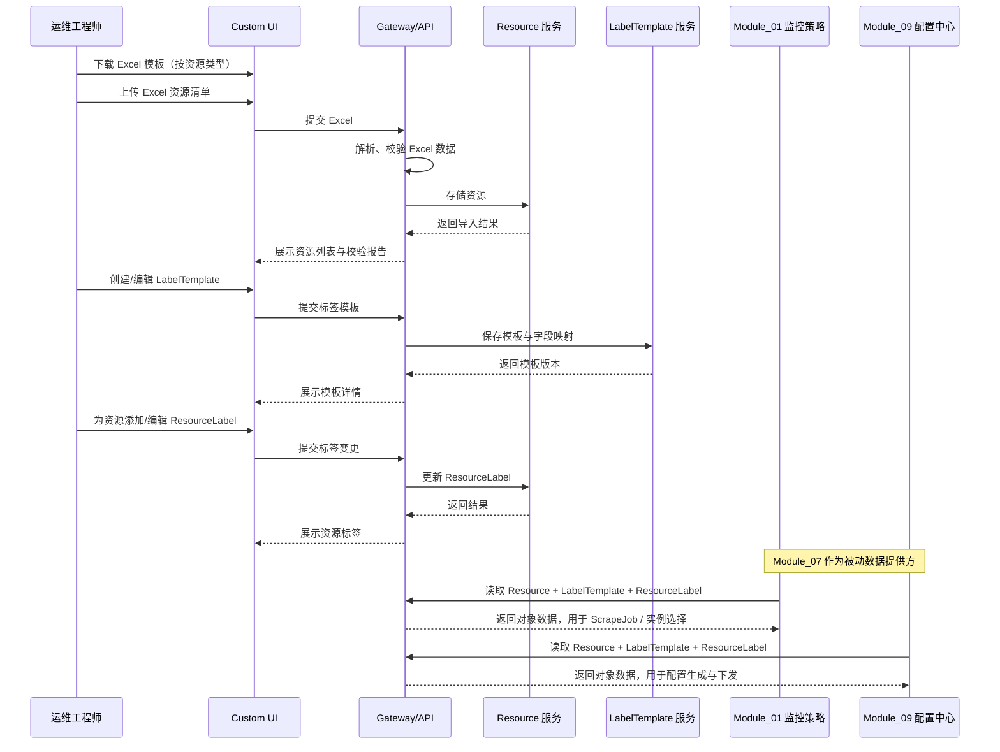

# Module 07: 监控对象管理

> **PRD 状态**: `设计中`（原型已验证至 v2.7，待两段式评审与 ready 确认）
> **PRD 版本**: v2.14
> **产品版本覆盖**: MVP / v0.4 / v1.0
> **原型版本**: v2.7（本轮为契约层修订，原型待同步 v2.8）
> **更新日期**: 2026-08-16
> **对应原型**: `docs/prototypes/module-07/`

> **模块类型**: MVP 核心能力模块
> **依赖文档**: [00\_Global\_Architecture.md](../00_Global_Architecture.md)、[Module\_01: 监控策略与指标管理](Module_01_Metric_Collection_Center.md)、[Module\_09: 网域与边缘配置中心](Module_09_Network_Domain_and_Edge_Config_Center.md)
> **目标用户**: 运维工程师、运维架构师

***

## 1. 模块目标

Module 07 聚焦**监控对象的生命周期管理**，是 MetricCenter 的**对象数据层**。本模块负责维护可被监控的实体（Resource）、定义资源字段到 Prometheus Label 的映射规则（LabelTemplate），以及管理资源上附加的标签（ResourceLabel）。

> **核心定位**：Module 07 是 Module\_01（监控策略与指标管理）和 Module\_09（网域与边缘配置中心）的**被动数据提供方**。本模块不直接生成或下发 Prometheus 配置，也不负责 ScrapeJob、拨测、规则编辑等策略配置。

具体职责：

1. **资源管理**：维护五类监控资源（主机、数据库、中间件、应用服务、通用指标目标，{v2.13} 新增数据库），支持 Excel 导入、手动录入、CRUD 与固定字段管理。
2. **标签模板管理**：按资源类型定义字段到 Prometheus Label 的映射规则，为策略模块生成 Job 提供稳定的标签契约。
3. **资源标签管理**：维护 ResourceLabel 的多种来源（system / user / cmdb）及冲突合并规则。
4. **Excel 导入**：提供固定列模板、状态映射字典与导入校验。
5. **扩展性**：为后续接入外部 CMDB（腾讯蓝鲸）预留统一 `CMDBProvider` 接口；具体的 CMDB 同步策略、失败处理与孤儿资源生命周期由 [Module\_04](Module_04_Custom_Discovery.md) 负责。MVP 阶段通过 `ExcelProvider` / `SQLiteProvider` 本地维护资源。

> **MVP 边界**：
>
> - 资源管理最小化，字段固定，不做动态资源模型。
> - 本模块**不做** ScrapeJob 配置、Blackbox 拨测配置、配置生成、配置校验、配置下发、采集模板管理、目标筛选。
> - 上述策略与下发职责分别由 [Module\_01](Module_01_Metric_Collection_Center.md) 和 [Module\_09](Module_09_Network_Domain_and_Edge_Config_Center.md) 承担。
>
> **与 Module\_01 的边界**：Module\_01 是监控策略 Owner，负责 ScrapeJob、Exporter 模板绑定、实例选择、规则编辑；Module\_07 仅向 Module\_01 提供 Resource、LabelTemplate 与 ResourceLabel 数据契约。
>
> **与 Module\_09 的边界**：Module\_09 负责配置生成、预览与下发；Module\_07 不生成 `prometheus.yml`，仅保证对象数据准确、完整。

***

## 2. 用户故事

> {v1.6} 完整用户故事条目（角色 / 我希望 / 以便于）见**全局用户故事库** **[01\_User\_Stories.md](../01_User_Stories.md)** **4.7 节**；模块级用户故事使用模块命名空间编码（`M07-ROLE-NN`，全局唯一），产品级故事（ARCH-03）沿用全局库编码，仅在此列出编码与一句话摘要。

- **M07-OPS-02**：从 Excel 批量导入主机、数据库、中间件、应用服务资源
- **M07-OPS-05**：临时添加一个资源用于验证（由策略模块决定是否纳入采集 Job）
- **M07-OPS-07**：为资源类型创建/编辑标签模板，定义字段到监控标签的映射（完整条目见全局库 §4.7）
- **M07-OPS-08**：为应用服务资源维护业务类型（业务域）归属，如支付业务、数据接口业务（完整条目见全局库 §4.7；{v2.8}）
- **M07-OPS-09**：为应用服务资源添加自定义标签（业务类型资源可写，静态资源只读）（完整条目见全局库 §4.7；{v2.8}）
- **ARCH-03**：查看平台整体采集覆盖率（通过 Resource 列表的「已监控 / 未监控」badge）（产品级故事，见全局库 §2.2）

> 已移除：M07-OPS-06（Blackbox 拨测配置）、M07-ARCH-04（配置生成器注入 remote\_write），分别由 Module\_01 与 Module\_09 承接。

***

## 3. 核心功能

### 3.1 资源管理

| 功能                  | 说明                                                                                                                                                                  | 优先级              |
| ------------------- | ------------------------------------------------------------------------------------------------------------------------------------------------------------------- | ---------------- |
| **资源类型管理**          | 定义主机、数据库、中间件、应用服务、通用指标目标五类资源（{v2.13} 新增数据库），字段固定                                                                                                                                       | P0               |
| **主机资源管理**          | 主机列表、CRUD、Excel 导入                                                                                                                                                  | P0               |
| **数据库资源管理（{v2.13}）** | 数据库列表、类型选择（database_type）、CRUD、Excel 导入                                                                                                                             | P0               |
| **中间件资源管理**         | 中间件列表、类型选择、CRUD、Excel 导入                                                                                                                                            | P0               |
| **应用服务资源管理**        | 应用服务列表、CRUD、Excel 导入                                                                                                                                                | P0               |
| **通用指标目标管理**        | 通用/自定义 Exporter 目标管理，支持自定义 IP、端口、metrics\_path 与 Label                                                                                                              | P0               |
| **展示字段控制**          | 按资源类型固定展示列、默认排序                                                                                                                                                     | P0               |
| **列显隐配置**           | 资源列表支持用户勾选显示 / 隐藏列（含中间件类型、网域、来源等），满足不同用户查看不同字段的诉求                                                                                                                   | P1               |
| **资源状态管理**          | online / offline / maintenance 状态维护                                                                                                                                 | P0               |
| **已监控 / 未监控 badge** | 在 Resource 列表展示该资源是否被任意 ScrapeJob 选中；由 Module\_01 写入关联关系，Module\_07 只读展示                                                                                            | P0               |
| **适用模板展示**          | 资源详情显示「适用模板」（该资源类型对应的默认标签模板名 + 模板 ID），与 system 标签来源标注呼应，让用户看见"此实例由哪个模板产生标签"；{v2.3}                                                                                  | P0               |
| **网域归属**            | 资源按 `network_domain_id` 分组；网域生命周期由 [Module\_09](Module_09_Network_Domain_and_Edge_Config_Center.md) 负责。**本模块不采用顶部「当前网域」全局上下文切换器**，而是在资源列表内提供「网域」筛选器（默认记忆上次选择、始终可切换为「全部网域」以支持跨域搜索）；**单网域模式下 Resource 列表仍展示「网域」列**，网域作为云区域概念从 CMDB/Excel 代入，不可隐藏 | P0（MVP 至少一个默认网域） |
| **CMDB 接入源**        | 为 BlueKing CMDB 等外部 Provider 预留统一接口；MVP 通过 `ExcelProvider` / `SQLiteProvider` 维护资源；v0.4+ 由 [Module\_04](Module_04_Custom_Discovery.md) 实现外部 CMDB 同步                 | P0 / P2          |
| **资源关系**            | 应用-实例-集群关系、依赖拓扑（未来）                                                                                                                                                 | P2               |

> **UI/UX 说明（v1.8）**：
>
> - **编辑方式**：资源新增 / 编辑使用**右侧抽屉（Drawer）**，与标签模板页的抽屉编辑方式一致——抽屉保留列表上下文，用户可同时对照列表与表单；
> - **列表结构**：资源列表采用「资源类型 Tab + 表格 + 行点击详情抽屉（含标签管理）」结构，不做左右分栏（资源字段差异大，分栏信息密度失衡）；
> - **列显隐配置（P1）**：列表工具栏提供「列设置」入口，用户可勾选显示 / 隐藏列；隐藏仅影响当前用户视图，不改变数据与默认列。「网域」列默认展示，隐藏需用户主动关闭。

### 3.2 标签模板管理

| 功能                     | 说明                                                                                                                               | 优先级 |
| ---------------------- | -------------------------------------------------------------------------------------------------------------------------------- | --- |
| **标签模板管理**             | 按资源类型定义字段到 Prometheus Label 的映射                                                                                                  | P0  |
| **字段来源配置**             | 支持 Resource 字段、Prometheus 内置字段、组合字段、CMDB 字段（v0.4+）                                                                               | P0  |
| **默认标签模板**             | 为五类资源预置默认模板（{v2.13} 新增数据库默认模板）                                                                                                                      | P0  |
| **模板创建工作流**            | 选择资源类型 → 基于默认模板克隆/新建 → 编辑映射 → 保存前校验 → 保存（模板是业务标签契约，MVP 无需映射 Prometheus 内置采集参数）                                                   | P0  |
| **映射校验规则**             | 目标标签不得为保护 label（`instance`/`job` 等，composite→`instance` 例外）；同一模板内目标标签必须唯一                                                        | P0  |
| **关联实例展示**             | 模板列表/详情展示「关联实例 N 个」（= 该资源类型下资源数），可展开查看实例清单（实例名 / IP / 状态）；{v2.3}                                                                 | P0  |
| **被引用 Job 展示（{v2.7}）** | 模板详情展示「被引用采集 Job N 个」（= 引用本模板的 ScrapeJob，含 Job 名 / 网域 / 启用状态 / 变更状态），让用户评估"改这个模板会影响哪些采集任务"；模板刚修改且引用 Job 未确认发布时显示「模板已变更，待确认」badge | P0  |
| **模板版本/克隆**            | 支持复制、基于现有模板创建新版本（P1）                                                                                                             | P1  |

> **字段来源与模板类别说明**：字段来源（resource\_field / prometheus\_builtin / composite / cmdb\_field）是**映射级**维度，不是**模板级**分类维度——同一模板内可混合多种来源（默认模板即混用 composite + resource\_field）。模板列表不存在「默认模板 / 内置参数模板」的类别划分，只有「默认模板（is\_default）」与「自定义模板」之分。
>
> **组合字段（用户语言）**：组合字段 = **由多个字段拼接生成的标签**，如实例标识 `instance` = 目标 IP + 端口（`instance_ip:port`），用于 Prometheus 识别唯一采集目标。用户在使用时**只需选择预设组合（当前为** **`instance_ip:port`），无需填写数值**——标签数值由系统在生成采集配置时自动拼接（详见 5.12 C 取值时序），模板保存阶段不会、也不需要填值。
>
> **Prometheus 内置字段澄清**：`job` / `scheme` / `metrics_path` / `__address__` 等内置字段由 Prometheus 从 Job 配置与 scrape 配置**原生注入**，模板无需（也不应）将它们映射到自身，否则是空操作。`source_type=prometheus_builtin` 保留为 v0.2+ 服务发现 / relabel 场景预留。
>
> **模板与实例的关联关系（{v2.3}）**：模板与实例通过 `resource_category` **隐式关联**——模板挂在资源类型上，该类型下所有资源实例自动适用（system 标签实时计算，见 5.3 生成时机）。**不引入模板→实例显式绑定**（避免与 Job 选实例逻辑重复、破坏标签配置唯一入口原则）。本模块负责把该关联**显式展示**给用户：
>
> - 标签模板页每个模板显示「关联实例 N 个」，点击可展开实例清单（实例名 / 目标 IP / 状态），便于用户评估"改这个模板会影响哪些实例"；
> - 资源详情新增「适用模板」行（见 3.1），显示该资源类型对应的默认模板名 + 模板 ID，与 system 标签来源标注（见 5.3 联动呈现）呼应。
>
> **UI/UX 说明（v1.8 / {v2.3} 布局重构）**：
>
> - **页面布局**：左右分栏——左侧「模板列表」（按资源类型 Tab 切换 + **搜索框** + **默认/自定义筛选**），右侧展示选中模板的详情；
> - **左栏模板卡片（{v2.3}）**：卡片精简为「名称 + 默认/自定义 Tag + 映射数 + 关联实例数 badge」，不再内嵌弹窗/明细信息——点击选中模板后，明细在右侧 Tab 中查看；
> - **右栏 Tab 化（{v2.3} / {v2.7} 三 Tab）**：右侧详情用 `Tabs` 承载视图——**Tab1 映射明细**（按来源类型分组展示）、**Tab2 关联实例**（完整 Table：分页 pageSize=10、关键字搜索、状态筛选）、**Tab3 被引用 Job（{v2.7}）**（完整 Table：Job 名 / 网域 / 启用状态 / 变更状态，分页 pageSize=10、关键字搜索），实例量大时可扩展虚拟滚动；关联实例与引用 Job 均不再用弹窗（Popover）展示，避免大数据集无法承载；
> - **被引用 Job Tab 说明文案（{v2.7}）**：Tab 顶部增加说明——「本模板被 {N} 个采集 Job 引用。修改模板后，引用的 Job 会按新映射重新生成标签，配置变更需在配置中心确认后生效（MVP 阶段重新生成并立即生效）。」让用户理解"改模板影响哪些采集任务、何时生效"；模板修改后引用 Job 行内「变更状态」列显示「模板已变更，待确认」badge（v0.2+ 与 Module\_09 变更单联动，MVP 显示「已变更」）；
> - **保存后影响提示（{v2.7}）**：模板 / 映射保存成功后，页面给出影响反馈（替代单纯"保存成功"）——「本模板被 {N} 个采集 Job 引用（{M} 个网域），将按新映射重新生成标签；配置变更请前往配置中心确认后生效（v0.2+）／重新生成配置并立即生效（MVP）」，并提供「查看引用 Job」（跳转本页 Tab3）与「前往配置中心确认」（跳转 Module\_09，v0.2+ 启用）入口；MVP 阶段不提供 M09 跳转（M09 变更确认 UI 为 v0.2+ 能力）；
> - **关联实例 Tab 说明文案（{v2.5}）**：Tab 顶部增加隐式关联说明——「本模板适用于 {资源类型} 类型，该类型下所有 {N} 个实例自动适用本模板的标签映射，无需手动关联。如需查看具体实例清单，请浏览下方列表。」让用户一眼理解"为什么这些实例出现在这里"，消除"需要逐台手动配置"的困惑；
> - **编辑方式**：模板级（新增 / 改名 / 克隆 / 删除）与映射级（新增 / 编辑 / 删除）操作统一使用**右侧抽屉（Drawer）**，编辑时保留模板与映射上下文（Modal 会遮住映射表格，无法对照编辑）；
> - **分页策略**：模板列表 MVP 不分页（搜索/筛选优先）；关联实例 Table 分页（pageSize=10，避免大列表长页滚动）。

### 3.3 资源标签管理

| 功能                     | 说明                                                                                               | 优先级 |
| ---------------------- | ------------------------------------------------------------------------------------------------ | --- |
| **ResourceLabel CRUD** | 为单个资源添加、编辑、删除标签（仅 `user` 来源可编辑；**仅 `resource_category=application` 资源可写，静态资源只读** {v2.8}） | P0  |
| **来源与合并规则**            | 支持 `system` / `user` / `cmdb {v0.4+}` 三种来源，冲突优先级 `cmdb` > `user`；`system` 为系统保护标签不可覆盖（{v2.2} 修正） | P0  |
| **内置 label 保护**        | 禁止覆盖 Prometheus 内置 label（`instance`、`job`、`scheme`、`__address__` 等）                              | P0  |
| **CMDB 覆盖提示**          | 当用户输入的 key 与 `source=cmdb` 的已有 label 冲突时，实时提示「该 key 将由 CMDB 覆盖，建议更换 key」                         | P0  |
| **来源标注与模板联动**          | `system` 标签标注「来自 XX 模板 · app\_name→app」并可跳转标签模板页；`user` 标注「手动添加」；{v2.2}                          | P0  |
| **类型级变更引导**            | 用户添加的 key 与模板映射目标冲突时，提示「该标签由标签模板生成，如需修改请前往标签模板管理」（引导走模板而非实例级覆盖）{v2.2}                            | P0  |
| **批量标签编辑**             | 按资源类型或筛选条件批量增删改标签（P1）                                                                            | P1  |

> **{v2.2} 定位说明**：资源详情标签管理展示全量标签（system / user / cmdb），操作仅针对 `user` 来源；`system` / `cmdb` 只读。标签编辑的唯一入口原则见 5.3「标签配置唯一入口原则」——类型级走模板，实例级走 user 标签，Job 仅引用模板。
>
> **{v2.5} 文案弱化**：用户标签（user 来源）编辑入口文案从「标签管理」调整为「自定义标签（非必须）」，并增加引导提示——「大多数场景下，标签模板已自动生成所需标签；仅当个别实例需要额外标签时使用」。目的是弱化用户标签的感知强度，避免用户误以为每台实例都需要手动打标。
>
> **{v2.6} 统一口径（标签来源 vs 映射字段来源）**：资源详情标签卡的「来源」（system / user / cmdb）与标签模板映射的「来源类型」（resource\_field / composite / cmdb\_field）是两个维度，UI 已给出对照说明（资源详情「标签口径说明」+ 模板页「标签来源口径」文案）——
>
> - **system = 标签模板映射产物**：MVP 字段来源 = 平台资源字段（resource\_field）+ 组合字段（composite），即「MVP 不从 CMDB 导入、使用平台资源管理字段」；
> - **user = 实例级自定义标签**：资源详情手加 + 通用目标 `custom_labels` 透传，**不进入模板映射**；
> - **cmdb = v0.4+ CMDB 同步**：对应模板映射的 `cmdb_field`，MVP mock 中 cmdb 来源标签以「v0.4+ 预留」占位样式展示。
>
> **结论：模板映射不新增「用户自定义字段」（user\_field）来源枚举**——Resource 字段固定（MVP 无资源级自定义字段）、用户标签已有唯一入口（详情手加 / custom\_labels 透传），新增会破坏「标签配置唯一入口原则」（类型级走模板、实例级走 user）；类型级用户标签诉求走 P1 批量标签编辑（按资源类型批量打 user 标签）。
>
> **{v2.8} 双场景治理边界**：标签管理按"静态资源 vs 业务类型资源"两种场景区分治理——
>
> - **静态资源（host / middleware / generic\_target）**：标签治理在 CMDB 侧（MVP = Excel 导入列带入作为前置形态，v0.4+ = Module\_04 CMDB 同步），平台**只读展示来源、不提供实例级打标入口**（ResourceLabel 写接口对非 application 资源返回 403，见 6.2）；数据治理主体不在本平台，避免引导用户二次打标与 CMDB 数据冲突。
> - **业务类型资源（application）**：开放 `user` 来源自定义标签（资源详情「自定义标签」入口），承载业务用户关心的业务维度标注；`business_domain`（业务类型/业务域，如支付业务、数据接口业务）作为 Resource 基础字段维护，标签模板映射为 `biz` label（见 5.2 / 5.8 / 5.12 A / 5.15），支持"按业务类型聚合监控"。
>
> **标签模板与治理解耦**：标签模板（LabelTemplate）与"谁治理标签数据"是两个层面——即使静态资源标签治理在 CMDB 侧，标签模板仍保留：它是"CMDB/Excel 字段 → Prometheus Label"的技术契约（Module\_01/09 生成 Job 配置的输入），不因静态资源只读而移除。

***

## 4. 核心流程

### 4.1 监控对象管理整体流程



> **流程说明**：
>
> - Module\_07 的核心流程只到 Resource、LabelTemplate、ResourceLabel 的维护为止。
> - CMDB 存储、配置生成、配置下发均不在本模块职责范围内。
> - Module\_01 与 Module\_09 通过只读接口消费本模块数据。

***

## 5. 数据模型

### 5.1 资源类型枚举

```go
type ResourceCategory string

const (
    ResourceCategoryHost          ResourceCategory = "host"
    ResourceCategoryDatabase      ResourceCategory = "database"      // {v2.13} 五大类拆分新增：数据库产品线独立成类（决策 D19）
    ResourceCategoryMiddleware    ResourceCategory = "middleware"
    ResourceCategoryApplication   ResourceCategory = "application"
    ResourceCategoryGenericTarget ResourceCategory = "generic_target"
)
```

> **资源类型粒度说明（决策 16：两套 CI 类型粒度体系；{v2.13} 五大类拆分，决策 D19）**：
>
> - `Resource.resource_category` 为**粗粒度五大类**分类（{v2.13} 由四大类拆分而来，新增 `database`）；细粒度子类型以 `database_type`（mysql / redis / postgresql / oracle / dm8 / sqlserver / mongodb）与 `middleware_type`（kafka / elasticsearch / nginx / zookeeper）两个字段表达（见 5.7）；
> - **五大类归类规则（{v2.13}，决策 D19）**：以**数据存储/查询为主语义、按产品线分采集器** → database；**消息/网关/协调/搜索** → middleware。边界案例已定：redis → database（缓存，业界多数 CMDB 放数据库/缓存侧）；elasticsearch 留 middleware；
> - 细粒度监控对象类型（host / mysql / redis / kafka / nginx / application\_http / snmp，{v3.16} 术语分层，决策 D24）的\*\*映射与策略绑定落在 [Module\_01](Module_01_Metric_Collection_Center.md)（策略层）\*\*的 `monitor_type`，本模块不维护细粒度监控对象类型（推导表 `MONITOR_TYPE_DERIVATION_MAP` 见 Module\_01 5.1）；
> - **权威来源为 CMDB**：v0.4+ 由 [Module\_04](Module_04_Custom_Discovery.md) 同步后向本模块写入五大类 + database\_type / middleware\_type，MetricCenter **只维护映射、不增删类型**。
>
> **CMDB 侧边界（v0.4+）**：
>
> - **CMDB 的 CI 类型本身是细粒度的**（如 BlueKing `bk_obj_id` 直接就是 mysql / redis / mongodb 等独立模型），CMDB **不存在**「中间件 → MySQL」的父子分类表达，也无需为 MetricCenter 引入 category 概念；
> - MetricCenter 的**粗粒度五大类（category）仅是内部资源管理维度**（五类资源 CRUD 页面、标签模板归属、孤儿资源分组），不是 CMDB 的表达，也不是监控策略的表达；
> - `database_type` / `middleware_type`（细粒度）来自 CMDB `bk_obj_id`（v0.4+）或 Excel 导入列（MVP）；`resource_category`（粗粒度）由 [Module\_04](Module_04_Custom_Discovery.md) 的「CMDB CI 类型映射表」将细粒度 CI 归类到五大类。**CMDB 对分类拆分无感知、不受影响**（bk\_obj\_id 不变，仅映射表多一个目标类别值）。

### 5.2 资源基础结构（Resource）

所有资源类别共享的基础字段（{v3.16} 由「资源类型」更名，字段 `resource_category`）：

| 字段                   | 类型           | 必填 | UI 展示名    | 说明                                                                             |
| -------------------- | ------------ | -- | --------- | ------------------------------------------------------------------------------ |
| resource\_id         | string       | ✅  | 资源 ID     | 稳定唯一键，不用于展示；MVP 取自 `server_id` / `instance_name`；v0.4+ CMDB 接入时复用 `cmdb_ci_id` |
| resource\_category       | ResourceCategory | ✅  | 资源类型      | host / database / middleware / application / generic\_target（{v2.13} 五大类，新增 database）                              |
| database\_type      | string       | ❌  | 数据库类型     | {v2.13} 细粒度子类型（仅 `resource_category=database` 时使用）：mysql / redis / postgresql / oracle / dm8（达梦）/ sqlserver / mongodb 等；来自 CMDB `bk_obj_id`（v0.4+）或 Excel 导入列（MVP） |
| middleware\_type    | string       | ❌  | 中间件类型     | 细粒度子类型（仅 `resource_category=middleware` 时使用）：kafka / elasticsearch / nginx / zookeeper 等；{v2.13} mysql / redis 已移入 `database_type`，本字段不再承载数据库产品线 |
| network\_domain\_id  | string       | ✅  | 网域        | 所属网域 ID；MVP 默认值为 `default`；v0.2+ 按租户上下文填充                                      |
| source\_type         | enum         | ✅  | 数据来源      | 数据来源：`manual` / `import` / `cmdb {v0.4+}`，MVP 默认 `manual`                      |
| instance\_name       | string       | ❌  | 实例名       | 可读实例名/展示名；host 模板中必填，对应 Excel `instance_name`，生成 `hostname` label              |
| hostname             | string       | ❌  | 主机名       | 主机名；host 场景下默认与 `instance_name` 一致；也可从 CMDB `bk_host_name` 等字段同步               |
| instance\_ip         | string       | ❌  | 目标 IP     | 目标 IP 或域名；host / generic\_target 必填，作为 Prometheus scrape target 地址             |
| os\_type             | string       | ❌  | 操作系统类型    | 操作系统类型，如 `Linux`、`Windows`；host 场景下从 Excel `image` 或 CMDB 同步                   |
| business\_domain     | string       | ❌  | 业务类型      | 业务类型/业务域归属（如 payment、data-api）；映射为 `biz` label；任意资源类型可挂，MVP 以 application 维护，v0.2+ 演进独立业务目录（{v2.8}） |
| app\_name            | string       | ✅  | 应用名       | 应用名 → 映射为 `app` label                                                          |
| env                  | string       | ✅  | 环境        | 环境 → 映射为 `env` label                                                           |
| cluster              | string       | ✅  | 集群        | 集群/子应用 → 映射为 `cluster` label；host 场景下 `sub_app_code` 为空时取 `vpc`                |
| owner                | string       | ❌  | 负责人       | 负责人；MVP 可由用户填写；v0.4+ CMDB 接入时优先取自 `cmdb_maintainer`                            |
| cmdb\_ci\_id         | string       | ❌  | 仅技术信息     | {v0.4+} 对应 BlueKing CMDB 的 CI ID（`bk_inst_id`）                                 |
| cmdb\_business\_path | string       | ❌  | 仅技术信息     | {v1.0+} 对应 BlueKing CMDB 业务路径，用于 ITSM 服务目录映射                                   |
| cmdb\_module\_path   | string       | ❌  | 仅技术信息     | {v1.0+} 对应 BlueKing CMDB 模块路径，用于影响范围定位                                         |
| cmdb\_maintainer     | string       | ❌  | 仅技术信息     | {v1.0+} 对应 BlueKing CMDB 维护人，告警负责人来源之一                                         |
| status               | string       | ✅  | 状态        | `online` / `offline` / `maintenance` / `orphan {v0.4+}`；导入时 Excel 中文状态需映射到该枚举  |
| is\_monitored        | bool         | ❌  | 已监控 / 未监控 | 是否已被至少一个 ScrapeJob 选中；由 Module\_01 维护，Module\_07 只读展示                          |
| created\_at          | datetime     | ✅  | 仅技术信息     | 创建时间                                                                           |
| updated\_at          | datetime     | ✅  | 仅技术信息     | 更新时间                                                                           |

> **`is_monitored`** **字段说明**：
>
> - **实现方案（v2.11 明确）**：Module\_07 **不持久化**该字段；在返回 Resource 列表/详情时，Module\_07 通过调用 Module\_01 的只读关联接口（`GET /api/v1/scrape-jobs?resource_id=...` 或内部等价查询）实时计算「该 Resource 是否被至少一个 ScrapeJob 选中」，并在响应中透传为 `is_monitored`。
> - Module\_07 不在本模块内维护 Job 与资源的关联关系，仅负责展示「已监控 / 未监控」badge。

### 5.3 资源 Label（ResourceLabel）

为支持 CMDB、用户、系统模板三类来源的 label 合并与冲突处理，每个资源关联的 label 单独维护：

| 字段           | 类型       | UI 展示名 | 说明                                                                                                   |
| ------------ | -------- | ------ | ---------------------------------------------------------------------------------------------------- |
| id           | string   | 仅技术信息  | 唯一标识                                                                                                 |
| resource\_id | string   | 仅技术信息  | 关联的 `Resource.resource_id`                                                                           |
| key          | string   | 标签 Key | Label key；强制小写、下划线连接；禁止以 `__` 开头；禁止覆盖 Prometheus 内置 label（`instance`、`job`、`scheme`、`__address__` 等） |
| value        | string   | 标签值    | Label value                                                                                          |
| source       | enum     | 标签来源   | `system` / `user` / `cmdb {v0.4+}`                                                                   |
| created\_at  | datetime | 仅技术信息  | 创建时间                                                                                                 |
| updated\_at  | datetime | 仅技术信息  | 更新时间                                                                                                 |

**来源说明**：

- `system`：由 [LabelTemplate](#54-标签模板-labeltemplate) 根据 Resource 字段自动生成的默认 label，如 `app`、`env`、`cluster`、`hostname`。
- `user`：用户通过 UI 或 Excel 手动添加的 label。
- `cmdb`：v0.4+ 由 Module\_04 CMDB 同步写入的 label。

> **{v2.6} MVP 展示口径**：MVP 未接入 CMDB，`cmdb` 来源标签在原型中统一以「v0.4+ 预留」占位样式展示（数据模型与冲突优先级保留，见 3.3 {v2.6} 统一口径）；模板映射的字段来源**不新增** **`user_field`**——用户自定义标签唯一入口为资源详情 `user` 来源与通用目标 `custom_labels` 透传，避免破坏「标签配置唯一入口原则」。
>
> **{v2.8} 写接口边界（双场景治理）**：`user` 来源标签的写操作（新增/编辑/删除）**仅对 `resource_category=application` 资源开放**（业务类型资源，平台治理）；host / middleware / generic\_target 为**只读**（标签来自 Excel/CMDB 带入，数据治理在 CMDB 侧），写请求返回 403（见 6.2）。

**同 key 冲突优先级**：`cmdb` > `user`；`system` 为系统保护标签**不可被覆盖**。即：

- CMDB 可覆盖用户 label（v0.4+）；
- 用户不可覆盖 system 标签（system 由模板生成，用户需改值应修改模板或使用不同 key 的新标签）；
- 用户标签与 system 标签同 key 时，以用户标签为准展示（system 仅作为生成基线，不冲突场景下不重复展示）。

> **{v2.2} 修正**：原表述「用户可覆盖系统 label（`cmdb` > `user` > `system`）」与 5.14 状态机「`system` 为系统保护标签不可被覆盖」矛盾，本版统一为 **system 不可被 user 覆盖**（与 5.14 一致）。

**生成时机（{v2.2} / {v2.7} 保存反馈补充）**：

- `system` 标签**实时计算、不落库**：Module\_09 生成 `prometheus.yml` 时，按 Job 引用的 LabelTemplate 规则对 `selected_instance_ids` 逐个实例实时计算生成（见 5.12 C 取值时序）；
- 模板映射修改后**立即生效**于下次配置生成（无需批量重算任务）；
- 模板变更会**穿透**到引用它的 Job，使生成的配置产生 diff，纳入 Module\_09「配置变更确认 → 下发」流程（见 Module\_09 3.3.1 / 3.4）；
- **保存后影响反馈（{v2.7}）**：模板 / 映射保存成功时，UI 必须反馈"本次变更影响谁、何时生效"（用户侧闭环，见 3.2「保存后影响提示」）——模板被 N 个 Job 引用（M 个网域）；生效语义按版本区分：**MVP = 重新生成配置并立即 reload 生效（无确认环节）**；**v0.2+ = 进入 Module\_09 变更确认（go/no-go）后发布生效**（对应 Module\_09 3.4 变更确认 UI，v0.2+ 交付）。

**标签配置唯一入口原则（{v2.2}）**：

- **类型级标签**：唯一编辑入口 = 标签模板（Module\_07 新增/编辑/克隆/删除）；
- **实例级标签**：唯一编辑入口 = 资源详情的 `user` 标签（system / cmdb 只读；**静态资源整体只读**，仅 application 资源可写 {v2.8}）；
- **策略层（Job）**：仅引用模板（`label_template_id` 允许换用其他模板，见 Module\_01 5.2），**不提供 Job 内标签编辑**；**不引入实例级模板**（MVP 与 v0.2+ 均不引入，避免配置入口分散导致歧义与溯源困难）；
- **可溯源**：system 标签可追溯至「模板 + 映射 + 来源字段」，user 标签可追溯至「资源 + 添加时间」。

**前端提示**：

- 用户手动添加 label 时，输入框旁提示“禁止覆盖 Prometheus 内置 label（`instance`、`job`、`scheme`、`__address__` 等）”。
- 当用户输入的 key 与 `source=cmdb` 的已有 label 冲突时，实时提示“该 key 将由 CMDB 覆盖，建议更换 key”。
- key 校验规则：小写字母、数字、下划线；禁止以 `__` 开头；长度限制 128 字符。

**联动呈现（{v2.2}）**：

- 资源详情标签管理中，`system` 来源标签标注来源映射，如「来自 主机默认模板 · app\_name→app」，并提供「前往标签模板管理」跳转入口（跳转至对应资源类型的模板页）；
- `user` 来源标签标注「手动添加」；`cmdb` 来源标注「CMDB 同步（后续版本）」；
- 用户添加标签时，若输入 key 与模板中已存在的映射目标一致（如输入 `app`），提示「该标签由标签模板生成，如需修改请前往标签模板管理」，引导用户通过模板进行类型级变更，而非实例级手工覆盖。

### 5.4 网域（NetworkDomain）引用

网域是 MetricCenter 支持多网域物理隔离场景的核心维度。每个资源必须归属到一个网域。

`NetworkDomain` 数据模型、生命周期管理、Token 生成、Edge Agent 状态均由 [Module\_09: 网域与边缘配置中心](Module_09_Network_Domain_and_Edge_Config_Center.md) 负责。**本模块仅读取** **`network_domain_id`** **作为资源分组的归属字段**。

本模块使用的最小字段：

| 字段     | 类型     | 必填 | UI 展示名 | 说明                               |
| ------ | ------ | -- | ------ | -------------------------------- |
| id     | string | ✅  | 网域     | 网域唯一标识，如 `default`、`gov-cloud-a` |
| name   | string | ✅  | 网域名称   | 网域展示名                            |
| status | enum   | ✅  | 状态     | online / offline / unknown       |

> **MVP 处理**：系统初始化时自动创建一个 `id=default` 的默认网域，所有未指定网域的资源自动归属到默认网域，保证单网域场景无感知。
>
> **网域存在性校验口径（v2.11 明确）**：Resource 的 `network_domain_id` 是否有效，以 **Module\_06 维护的 `NetworkDomain` 行政记录**为准（网域由 M06 创建/分配/删除，M09 仅负责监控纳管）。M07 不重复维护网域生命周期，仅读取 `id` / `name` / `domain_type` 做展示与校验。
>
> **区域属性单一事实来源（v2.12 明确）**：Resource 上**不存储**任何区域属性（云类型 / 网络区域 / AZ 等）——这类信息唯一事实来源是 M06 的 `NetworkDomain` 行政记录（`zone_type` 等，见 Module\_06 3.1）。资源侧（Excel 模板 / 手动录入 / CMDB 同步）**只引用** `network_domain`，展示时的区域信息一律经网域派生（join），禁止在资源表冗余。用户心智路径唯一：**先在 M06 登记网域，再在 M07 导入/录入资源时选择网域**。
>
> **网域列展示策略（{v2.10} 细化）**：
>
> - 即使租户处于单网域模式（`Tenant.multi_site_enabled=false`），Resource 列表、详情页与 Excel 模板仍保留「网域」列。网域在此被视为云区域（Cloud Area）概念，是资源从 CMDB 或 Excel 导入时的必要属性，不随 UI 模式隐藏。
> - **本模块不采用顶部「当前网域」全局上下文切换器**：Resource 是全局配置对象（带 `network_domain_id` 属性），用户经常需要跨网域搜索或查看全量资源。网域在 M07 仅作为**列表筛选器**使用：默认按用户上次选择的网域过滤（可记忆），但始终提供「全部网域」选项，支持跨域搜索。
> - 资源详情页将「网域」作为基础属性置顶展示，避免淹没在大量 CMDB 字段中。

### 5.5 Excel 状态映射字典

Excel/外部数据源中的状态值通常是业务语言（如 `运行中`、`已停止`），需要映射到 MetricCenter `Resource.status` 枚举（`online` / `offline` / `maintenance`）。

#### 5.5.1 默认映射

| 来源状态值（不区分大小写）                               | 目标 `Resource.status` | 说明      |
| ------------------------------------------- | -------------------- | ------- |
| `运行中`、`正常`、`online`、`active`、`running`、`up` | `online`             | 正常运行    |
| `已停止`、`停止`、`offline`、`stopped`、`down`、`关机`  | `offline`            | 已停止/不可用 |
| `维护中`、`维修中`、`maintenance`、`maintaining`     | `maintenance`        | 维护中     |

#### 5.5.2 可配置映射

默认映射无法满足所有客户时，支持通过配置扩展或覆盖：

| 配置项                             | 说明                                                                                                                    |
| ------------------------------- | --------------------------------------------------------------------------------------------------------------------- |
| `status_mapping.default_target` | 未匹配到任何规则时的 fallback 目标状态；默认 `offline`                                                                                 |
| `status_mapping.rules`          | 规则列表，每条规则包含 `source_status`（来源值，支持精确匹配或正则）、`target_status`、`resource_category`（可选，为空时适用于所有类型）、`priority`（同 source 冲突时优先级） |
| `status_mapping.case_sensitive` | 是否区分大小写；默认 `false`                                                                                                    |

**配置示例**：

```yaml
status_mapping:
  case_sensitive: false
  default_target: offline
  rules:
    - source_status: "运行中|正常|online|running"
      target_status: online
      resource_category: host
      priority: 100
    - source_status: "已停止|停止|offline|stopped"
      target_status: offline
      resource_category: host
      priority: 100
    - source_status: "维护中|维修中|maintenance"
      target_status: maintenance
      priority: 90
```

#### 5.5.3 数据模型

```go
type ResourceStatusMapping struct {
    ID             string        // 唯一标识
    SourceStatus   string        // 来源状态值（或正则表达式）
    TargetStatus   ResourceStatus // online / offline / maintenance
    ResourceCategory   *ResourceCategory // 仅对特定资源类型生效；nil 表示通用
    Priority       int           // 同 source 冲突时优先级，数值大的优先
    IsBuiltin      bool          // 是否系统内置，内置规则禁止删除但可禁用
    Enabled        bool          // 是否启用
    CreatedAt      time.Time
    UpdatedAt      time.Time
}
```

#### 5.5.4 映射优先级

1. 先匹配 `resource_category` 精确匹配的规则；无命中再匹配通用规则（`resource_category` 为空）。
2. 同一 `source_status` 存在多条规则时，按 `priority` 倒序取最高者。
3. 仍无命中时，使用 `default_target`（默认 `offline`）。
4. 映射结果无法识别时（如配置错误指向非法状态），记录导入错误并跳过该资源。

#### 5.5.5 UI 配置入口（P2）

- MVP 阶段通过配置文件或初始化 SQL 管理映射字典，UI 仅**只读展示**（导入记录页 / 标签模板页说明区展示映射结果）。
- v0.4+ 在 [Module\_05: 自定义 UI](Module_05_Custom_UI.md) 的系统设置页面提供映射规则管理。

> **Excel 枚举一致性规则（v1.9 澄清）**：
>
> - `status` 列：**允许与线上枚举不一致**——Excel 可填业务语言（`运行中`/`已停止`/`维护中`），经映射字典转为线上枚举 `online / offline / maintenance`；映射字典本身 MVP 由配置/SQL 管理（不可 UI 编辑）；
> - 其他枚举列（`env` / `protocol` / `scheme`）：**强制与线上枚举一致**，不一致在导入校验时报错（见 7.2）；
> - 固定列结构：必须与 7.1 模板列一致，不支持动态列。

### 5.6 主机资源（Host）

| 字段           | 类型     | 必填 | UI 展示名 | 说明              |
| ------------ | ------ | -- | ------ | --------------- |
| hostname     | string | ✅  | 主机名    | 主机名             |
| instance\_ip | string | ✅  | 目标 IP  | 管理 IP           |
| os\_type     | string | ❌  | 操作系统类型 | linux / windows |
| os\_version  | string | ❌  | 系统版本   | 系统版本            |

### 5.7 中间件资源（Middleware）

| 字段                 | 类型     | 必填 | UI 展示名 | 说明                                          |
| ------------------ | ------ | -- | ------ | ------------------------------------------- |
| middleware\_type   | string | ✅  | 中间件类型  | {v2.13} kafka / elasticsearch / nginx / zookeeper / ...（mysql / redis 已移入 `database_type`，见 5.7.1） |
| instance\_ip       | string | ✅  | 目标 IP  | 服务 IP                                       |
| port               | int    | ✅  | 端口     | 服务端口                                        |
| version            | string | ❌  | 版本号    | 版本号                                         |
| connection\_string | string | ❌  | 连接串    | 连接串（敏感信息可加密存储）                              |

### 5.7.1 数据库资源（Database，{v2.13} 新增，决策 D19）

{v2.13} 数据库产品线从中间件独立成类（五大类拆分）：以数据存储/查询为主语义、按产品线分采集器 → `resource_category=database`；细粒度子类型用 `database_type` 表达（mysql / redis / postgresql / oracle / dm8 / sqlserver / mongodb），不使用 `middleware_type`。

| 字段                 | 类型     | 必填 | UI 展示名 | 说明                                          |
| ------------------ | ------ | -- | ------ | ------------------------------------------- |
| database\_type     | string | ✅  | 数据库类型  | mysql / redis / postgresql / oracle / dm8（达梦）/ sqlserver / mongodb |
| instance\_ip       | string | ✅  | 目标 IP  | 服务 IP                                       |
| port               | int    | ✅  | 端口     | 服务端口                                        |
| version            | string | ❌  | 版本号    | 数据库版本                                       |
| connection\_string | string | ❌  | 连接串    | 连接串（敏感信息可加密存储）                              |

### 5.8 应用服务资源（Application）

| 字段                 | 类型     | 必填 | UI 展示名   | 说明                                                          |
| ------------------ | ------ | -- | -------- | ----------------------------------------------------------- |
| service\_name      | string | ✅  | 服务名      | 服务名                                                         |
| business\_domain   | string | ❌  | 业务类型   | 业务类型/业务域归属（如 payment / data-api）；映射为 `biz` label（{v2.8}）        |
| health\_check\_url | string | ❌  | 健康检查 URL | 拨测 URL；作为资源字段由 Module\_07 维护，Blackbox Job 配置由 Module\_01 负责 |
| protocol           | string | ❌  | 协议       | http / https / tcp                                          |
| endpoint           | string | ❌  | 业务指标端点   | 业务指标端点                                                      |
| port               | int    | ❌  | 端口       | 服务端口                                                        |

### 5.9 通用指标目标（GenericTarget）

用于接入非标准 Exporter 设备（如 SNMP 交换机、GPU 服务器、Oracle 数据库、硬件光纤交换机等）。

| 字段             | 类型     | 必填 | UI 展示名      | 说明                                                                |
| -------------- | ------ | -- | ----------- | ----------------------------------------------------------------- |
| target\_name   | string | ✅  | 目标名称        | 目标名称/描述                                                           |
| instance\_ip   | string | ✅  | 目标 IP       | 目标 IP 或域名                                                         |
| port           | int    | ❌  | 端口          | 服务端口，空时不拼接 `instance`                                             |
| metrics\_path  | string | ❌  | 采集路径        | 默认 `/metrics`                                                     |
| scheme         | string | ❌  | 协议          | `http` / `https`，默认 `http`                                        |
| custom\_labels | map    | ❌  | 自定义标签       | 自定义 Label，如 `device_type=snmp_switch`、`vendor=h3c`                |
| exporter\_type | string | ❌  | Exporter 类型 | 设备/Exporter 类型，如 `snmp_exporter`、`gpu_exporter`、`oracle_exporter` |

### 5.10 标签模板（LabelTemplate）

| 字段             | 类型           | UI 展示名 | 说明      |
| -------------- | ------------ | ------ | ------- |
| id             | string       | 仅技术信息  | 唯一标识    |
| name           | string       | 模板名称   | 模板名称    |
| resource\_category | ResourceCategory | 资源类型   | 适用的**粗粒度资源类别**（host / database / middleware / application / generic\_target，{v2.13} 新增 database） |
| mappings       | \[]Mapping   | 字段映射   | 字段映射列表  |

> **变更说明**：原 `job_id` 字段已移除。LabelTemplate 只与资源类型绑定，ScrapeJob 在 Module\_01 中引用 LabelTemplate。
>
> **{v2.13} 标签模板锚点粒度（决策 D18）**：模板内容（字段 → label 映射）由资源字段 schema 决定、**锚定粗粒度资源类别**（不按细粒度 CI 类型建模板，避免 host\_linux / host\_windows 各建一套内容几乎相同的模板）；细粒度 CI 类型的**默认模板由 Module\_01 映射指定**（`CITypeExporterMapping.label_template_id` 指向本类别下的某个模板），本模块模型不变。

### 5.11 字段映射（Mapping）

| 字段            | 类型     | UI 展示名 | 说明                                                                           |
| ------------- | ------ | ------ | ---------------------------------------------------------------------------- |
| source\_field | string | 字段来源   | 来源字段名                                                                        |
| source\_type  | enum   | 来源类型   | `resource_field` / `prometheus_builtin` / `composite` / `cmdb_field {v0.4+}` |
| target\_label | string | 目标标签   | Prometheus Label 名                                                           |
| enabled       | bool   | 是否启用   | 是否启用                                                                         |
| transform     | string | 转换规则   | 转换规则（可选，默认空=原样透传）：`lower`、`upper`、`prefix`、`replace`                         |

> **转换规则说明（v1.9）**：
>
> - **语义**：对标签值做字符串变换，用于对齐 Resource 字段值与标签目标格式（如 `os_type` 混用 `Linux/linux` 时配 `lower` 统一小写）；
> - **必填性**：**可留空**，留空 = 来源字段值原样透传（绝大多数映射不需要变换，不强制填写）；
> - **交互**：UI 以下拉选择呈现，选项「无（默认）/ lower / upper / prefix {P1} / replace {P1}」；`prefix`/`replace` 需要参数（前缀值 / pattern+replacement），参数化编辑放 P1，MVP 置灰。

> **目标标签默认值**：新增 `source_type=resource_field` 的映射时，目标标签**默认预填为来源字段名**（如来源字段 `env` → 目标标签 `env`），用户可修改（`app_name → app`、`instance_ip:port → instance` 等场景需手动调整）；`composite` 来源默认预填 `instance`，且**目标标签锁定为** **`instance`、不可编辑**（组合字段是预置规则，标签名不应由用户改动，改动会破坏 Prometheus 标准 `instance` 语义）。
>
> **映射校验规则**：目标标签不得为保护 label（`PROTECTED_PROMETHEUS_LABELS`，`composite→instance` 例外）；同一模板内 `target_label` 必须唯一，保存时校验并阻止重复。

### 5.12 标签模板字段来源

#### A. Resource 字段

| 资源类别       | 来源字段                 | Prometheus Label     | 说明                                               |
| ---------- | -------------------- | -------------------- | ------------------------------------------------ |
| 通用         | `app_name`           | `app`                | Resource 基础字段                                    |
| 通用         | `env`                | `env`                | Resource 基础字段                                    |
| 通用         | `cluster`            | `cluster`            | Resource 基础字段；host 场景下 `sub_app_code` 为空时取 `vpc` |
| 通用         | `instance_name`      | `instance_name`      | 可读实例名；host 模板中必填                                 |
| 主机         | `hostname`           | `hostname`           | host 场景下默认与 `instance_name` 一致                   |
| 主机         | `instance_ip`        | `instance_ip`        | 采集目标地址                                           |
| 主机         | `os_type`            | `os_type`            | 操作系统类型                                           |
| 数据库 {v2.13} | `database_type`       | `database_type`      | 数据库类型（{v2.13} 由中间件行拆分，决策 D19）                 |
| 中间件        | `middleware_type`    | `middleware_type`    | 中间件类型（{v2.13} 不再承载数据库产品线）                      |
| 应用服务       | `service_name`       | `service_name`       | 应用服务名                                            |
| 应用服务       | `business_domain`    | `biz`                | 业务类型归属（{v2.8}）；业务指标按业务类型聚合的关联键       |
| 通用 {v0.4+} | `cmdb_business_path` | `cmdb_business_path` | CMDB 接入后由 Module\_04 同步                          |
| 通用 {v0.4+} | `cmdb_module_path`   | `cmdb_module_path`   | CMDB 接入后由 Module\_04 同步                          |
| 通用 {v0.4+} | `cmdb_maintainer`    | `cmdb_maintainer`    | CMDB 接入后由 Module\_04 同步                          |

#### B. Prometheus 内置字段

| 内置字段               | 说明     |
| ------------------ | ------ |
| `__address__`      | 抓取地址   |
| `__scheme__`       | 协议     |
| `__metrics_path__` | 采集路径   |
| `job`              | Job 名称 |
| `instance`         | 实例标识   |

> **澄清**：以上内置字段由 Prometheus 从 Job 配置（`job_name` / `scheme` / `metrics_path`）与抓取过程**原生注入**，模板**不需要**（也不应）将其映射到自身——`job→job`、`__scheme__→__scheme__` 属于空操作。MVP 默认/自定义模板均不使用 `prometheus_builtin` 来源；该来源保留给 v0.2+ 服务发现 / relabel 场景（届时配合 `__meta_*` 标签使用）。
>
> **MVP 交互（v1.9）**：新增映射时**隐藏** **`prometheus_builtin`** **来源选项**（只保留 资源字段 / 组合字段，`cmdb_field` 以 v0.4+ disabled 呈现）；枚举值保留在数据模型中（`source_type` 枚举含 `prometheus_builtin`），待 v0.2+ 服务发现场景启用。

#### C. 组合字段

| 组合字段       | 生成规则                                |
| ---------- | ----------------------------------- |
| `instance` | 主机/数据库/中间件（{v2.13}）：`instance_ip` + `:` + `port` |

> **说明**：组合字段表示资源上不存在单一字段、需由多个字段拼接/计算得到的标签。MVP 仅保留一个预设（`instance_ip:port → instance`，即 Prometheus 标准 `instance` 标识），`target_label` 固定为 `instance`。
>
> **{v2.9} 组合字段用户语言说明与 MVP 内部默认**：
>
> - **为什么需要 instance 含端口**：`instance` 是 Prometheus 内置/保留标签（抓取时自动注入，值 = 抓取地址 `host:port`，出现在该目标全部序列），作用是**采集目标身份标识**——同 IP 多服务（单容器多服务 / 多端口）时必须靠端口区分身份，否则不同目标的同名指标会合并冲突（见 5.15 关联键说明：`instance` 仅作采集地址，关联键用 `app` / `biz`）；
> - **组合字段不是必填项**：MVP 直连抓取下，Prometheus 自动注入的 `instance`（= 抓取地址 `资源IP:default_port`）与组合字段拼接结果一致——**组合字段是内部默认行为，前台不展示、用户无需配置**（同 `prometheus_builtin` 隐藏模式）；
> - **端口配置点不变**：`instance` 的端口取自 Module\_01 CI-Exporter 映射 `default_port`（映射表单可编辑 → 创建 Job 时快照继承 → Module\_09 生成配置拼接），组合字段隐藏不影响端口配置链路（见 Module\_01 5.1 端口一致性说明）；
> - **v0.2+ 开放时机**：服务发现（`__meta_*` 派生 identity）、代理/统一出口抓取（抓取地址 ≠ 资源身份）、实例级端口覆盖等需要**身份定制**的场景，再开放组合字段来源选项并配套说明；
> - **MVP 交互（{v2.9}）**：新增映射时「组合字段」来源选项**隐藏**（保留 资源字段；`cmdb_field` 以 v0.4+ disabled 呈现）；默认模板中 composite 映射行标注「内置默认」（自动生成 instance，无需配置）；`source_type` 枚举与数据模型保留（含 `composite`），v0.2+ 场景启用。
>
> **跨层解析**：`port` 在 host 资源上不存在（见 5.6），`instance` 的端口实际取自 Module\_01 的 `CITypeExporterMapping.default_port`（如 node\_exporter 9100）或 Job 覆盖值——组合字段最终由 Module\_09 在生成配置时解析（`Resource.instance_ip` + 策略层端口）。v0.2+ 可扩展为表达式语法（如 `${instance_ip}:${port}`）或按资源类型的有限预设集。
>
> **取值时序（v1.9 澄清）**：
>
> - 模板定义时（Module\_07）只声明**规则**（`instance = instance_ip + port`），不取任何实例值——不需要先存在 Job / 实例 / Exporter；
> - `port` 的取值来源是**映射层预设**（`CITypeExporterMapping.default_port`，创建映射时已填写），与"是否已创建采集 Job、是否已安装 Exporter"**无关**，因此不会因尚未配置而取不到值；
> - 真正出值在 Module\_09 生成 `prometheus.yml` 时，对 `selected_instance_ids` 逐个实例拼接 `instance_ip:default_port`；
> - 唯一风险是**配置正确性**：映射 `default_port` 与实例上 exporter 实际监听端口不一致时，instance 标签会错（该不一致的解决手段见 Module\_01 5.1 端口一致性说明）。

### 5.13 默认标签模板

按资源类型的默认映射：

**主机默认标签模板**

| 来源类型            | 来源字段               | 目标 Label        |
| --------------- | ------------------ | --------------- |
| composite       | `instance_ip:port` | `instance`      |
| resource\_field | `app_name`         | `app`           |
| resource\_field | `env`              | `env`           |
| resource\_field | `cluster`          | `cluster`       |
| resource\_field | `hostname`         | `hostname`      |
| resource\_field | `instance_name`    | `instance_name` |
| resource\_field | `os_type`          | `os_type`       |

**中间件默认标签模板**

| 来源类型            | 来源字段               | 目标 Label          |
| --------------- | ------------------ | ----------------- |
| composite       | `instance_ip:port` | `instance`        |
| resource\_field | `app_name`         | `app`             |
| resource\_field | `env`              | `env`             |
| resource\_field | `cluster`          | `cluster`         |
| resource\_field | `middleware_type`  | `middleware_type` |

**数据库默认标签模板（{v2.13} 新增，决策 D19）**

| 来源类型            | 来源字段               | 目标 Label          |
| --------------- | ------------------ | ----------------- |
| composite       | `instance_ip:port` | `instance`        |
| resource\_field | `app_name`         | `app`             |
| resource\_field | `env`              | `env`             |
| resource\_field | `cluster`          | `cluster`         |
| resource\_field | `database_type`    | `database_type`   |

**应用服务默认标签模板**

| 来源类型            | 来源字段               | 目标 Label           |
| --------------- | ------------------ | ------------------ |
| resource\_field | `service_name`     | `service_name`     |
| resource\_field | `app_name`         | `app`              |
| resource\_field | `env`              | `env`              |
| resource\_field | `cluster`          | `cluster`          |
| resource\_field | `health_check_url` | `health_check_url` |

**通用指标目标默认标签模板**

| 来源类型            | 来源字段               | 目标 Label      |
| --------------- | ------------------ | ------------- |
| composite       | `instance_ip:port` | `instance`    |
| resource\_field | `target_name`      | `target_name` |
| resource\_field | `app_name`         | `app`         |
| resource\_field | `env`              | `env`         |
| resource\_field | `cluster`          | `cluster`     |
| resource\_field | `custom_labels.*`  | 透传            |

> **{v2.9} 默认模板中的组合字段 = 内置默认**：上表 host / middleware / generic\_target 默认模板中的 `composite → instance` 行为**内置默认（自动生成 `instance = 资源IP + default_port`，与 Prometheus 默认行为一致）**——前台标注「内置默认」、用户无需配置且不可新增（新增映射不展示组合字段选项，见 5.12 C）；application 默认模板不含组合字段（`endpoint` 字段自带端口，抓取时自动注入 `instance = endpoint`，同样无需配置）。

### 5.14 数据模型状态机 {v1.6}

> **说明（v1.6）**：集中定义本模块核心对象的状态流转（与 4.1 监控对象管理整体流程互为参照，供后端实现与前后端契约对齐）。

**① Resource.status（资源状态）状态机**

```text
                    ┌──────────────────────────────────────────┐
                    │ 来源：Excel 导入（中文状态映射）            │
                    │       CMDB 同步（v0.4+，Module_04 写入）    │
                    └──────────────────────────────────────────┘
                                    │
                                    ▼
 online（运行中）◄───────────► offline（已停止）
      │
      └──► maintenance（维护中）──► 恢复 → online
      
 orphan（孤儿，v0.4+）：CMDB 同步失败后保留 7 天，超期清理（Module_04 生命周期管理）
```

| 状态          | 含义        | 进入条件                       | 后续流转                     |
| ----------- | --------- | -------------------------- | ------------------------ |
| online      | 运行中       | Excel 导入状态映射（运行中）/ CMDB 同步 | 可切 maintenance / offline |
| offline     | 已停止       | Excel 状态映射（已停止）/ 探活失败      | 可恢复 online               |
| maintenance | 维护中       | Excel 状态映射（维护中）            | 恢复 → online              |
| orphan      | 孤儿（v0.4+） | CMDB 同步失败，资源保留 7 天         | 超期清理 / 同步恢复后转正常状态        |

> **孤儿资源（v0.4+）**：CMDB 同步失败时按 `network_domain_id + resource_category` 归组保留 7 天，保证「CMDB 同步失败后仍保持监控不中断」（M04-OPS-10）；孤儿资源不参与新采集 Job 的实例选择，由 Module\_04 生命周期管理。

**② 标签来源优先级（ResourceLabel.source）**

```text
cmdb（v0.4+，Module_04 写入） > user（用户手动） > system（系统生成）
```

同 key 冲突时：CMDB 来源**覆盖** user 来源；`system` 为系统保护标签不可被覆盖；Prometheus 内置 label（`__address__` / `instance` / `job` / `scheme`）禁止用户手动覆盖（决策 3.4，composite→instance 映射除外）。

### 5.15 业务指标标签规范（{v2.8}）

> 监控"业务侧包装的服务接口 / 微服务"场景下，业务指标（接口 QPS、延迟、错误率）带有业务属性。Prometheus 无"指标 ↔ 资源"实体关联机制，一切关联通过 label 完成——本规范定义业务指标与静态资源（Resource）的关联契约，是 Module\_01（策略）/ Module\_09（配置生成）的标签注入依据。

**关联键（Join Keys）**：

| 标签 | 来源 | 必带 | 说明 |
|------|------|------|------|
| `app` | 标签模板映射（`app_name` → `app`，抓取注入）或业务埋点自带 | ✅ | 指标 ↔ 应用服务资源的关联键；值 = 平台 `app_name` |
| `biz` | 标签模板映射（`business_domain` → `biz`，抓取注入） | ❌ | 指标 ↔ 业务类型（业务域）的关联键；值 = 平台 `business_domain`（如 payment / data-api） |
| `env` / `cluster` | 标签模板映射 | ❌ 建议 | 环境 / 集群维度，辅助过滤 |

**关联机制（机制 A 为主 + 机制 B 兜底）**：

- **机制 A：抓取时注入（推荐，MVP 主路径）**——业务指标端点注册为 application 资源（`endpoint` 字段，见 5.8），标签模板把 `app_name` / `business_domain` / `env` / `cluster` 映射为标签；Module\_09 生成 `prometheus.yml` 时写入 `static_configs[].labels`，Prometheus 抓取时自动附加到该 target 全部序列（业务指标自动带资源标签，**零业务侧成本**）。
- **机制 B：业务埋点标签 + relabel 归一化（兜底）**——业务侧代码埋点直出指标时，按本规范携带 `app`（值 = 平台 `app_name`）等关联标签；平台侧用 `metric_relabel_configs` 归一化兜底（如业务侧 `biz` / `service` 标签重命名为 `app`）。**关键限制**：`metric_relabel_configs` 只能操作指标自带标签、无法引入资源侧数据，关联键值一致性依赖业务侧按规范埋点（或平台侧治理校验）。
- **查询时 join（可选）**：PromQL `on(app)` / `group_left` join 资源维度，用于聚合场景；依赖前两步标签一致。

**规则（约束）**：

1. **关联键用稳定业务标识，不用 `instance`**——动态微服务实例（K8s 扩缩容）下 `instance` 会漂移；`app` / `biz` 为稳定业务标识，v0.2+ 服务发现场景（`prometheus_builtin` + `__meta_*` relabel，见 5.12 B）天然兼容；
2. **业务属性分两类**：资源属性（`app` / `biz` / `env` / `cluster`，参与关联与聚合）与业务维度属性（`path` / `method` / `status`，仅查询分析），两者在埋点与展示中明确区分；
3. **业务维度标签不参与资源关联**——`path` / `method` / `status` 等指标自带维度标签仅用于接口级 QPS / 延迟 / 错误率分析，不作为指标 ↔ 资源关联键；
4. **`biz` 空值语义（{v2.8} 评审前完善）**——非 application 资源或无 `business_domain` 归属的资源**不注入 `biz` 标签**（空值不产生标签，避免空 label 污染序列）；`biz` 仅在模板映射存在且来源字段非空时生成（与 5.3 `system` 标签实时计算语义一致）。

**版本**：MVP 落地机制 A（现有 5.8 / 5.12 设计已支撑）+ 规范定义；机制 B 的 `metric_relabel_configs` 归一化兜底 MVP 提供；v0.2+ 动态实例（服务发现）场景沿用本规范（关联键不变）。

***

## 6. 接口设计

> 技术层：MVP 最小 REST 契约。统一前缀 `/api/v1`；鉴权、租户上下文、网关透传与错误码规范见 [00\_Global\_Architecture.md](../00_Global_Architecture.md)；所有响应错误统一为 `{ "code": string, "message": string }`。

### 6.1 资源管理 API（Resource）

| 方法     | 路径                                                   | 说明                                                                                                                    |
| ------ | ---------------------------------------------------- | --------------------------------------------------------------------------------------------------------------------- |
| GET    | `/api/v1/resources`                                  | 资源列表，Query：`resource_category` / `network_domain_id` / `keyword` / `page` / `page_size`；返回含 `is_monitored`（Module\_01 计算） |
| POST   | `/api/v1/resources`                                  | 创建资源（source\_type=manual）                                                                                             |
| PUT    | `/api/v1/resources/{resource_id}`                    | 更新资源                                                                                                                  |
| DELETE | `/api/v1/resources/{resource_id}`                    | 删除资源（被 Job 引用时由 Module\_01 关联校验）                                                                                      |
| POST   | `/api/v1/resources/import`                           | Excel 导入（multipart，返回 7.3 导入结果结构）                                                                                     |
| GET    | `/api/v1/resources/import-templates/{resource_category}` | 下载固定列模板（返回列定义 JSON，前端渲染为可下载模板）                                                                                        |

### 6.2 资源标签 API（ResourceLabel）

| 方法     | 路径                                                  | 说明                               |
| ------ | --------------------------------------------------- | -------------------------------- |
| GET    | `/api/v1/resources/{resource_id}/labels`            | 资源标签列表（按来源优先级排序展示）               |
| POST   | `/api/v1/resources/{resource_id}/labels`            | 添加 user 来源标签（校验 key 规则与保护 label） |
| PUT    | `/api/v1/resources/{resource_id}/labels/{label_id}` | 编辑 user 来源标签值                    |
| DELETE | `/api/v1/resources/{resource_id}/labels/{label_id}` | 删除 user 来源标签                     |

> `system` / `cmdb` 来源标签**不提供写接口**（只读展示）；`cmdb` 来源 v0.4+ 由 Module\_04 同步写入。
>
> **{v2.8} 写接口边界**：`user` 来源写接口（POST / PUT / DELETE）**仅对 `resource_category=application` 资源开放**（业务类型资源，平台治理）；host / middleware / generic\_target 资源标签只读（数据治理在 Excel/CMDB 侧），写请求返回 403（双场景治理边界，见 3.3）。

### 6.3 标签模板 API（LabelTemplate）

| 方法     | 路径                                                            | 说明                                                                                                                                             |
| ------ | ------------------------------------------------------------- | ---------------------------------------------------------------------------------------------------------------------------------------------- |
| GET    | `/api/v1/label-templates`                                     | 模板列表，Query：`resource_category` / `is_default` / `keyword`；返回含 mappings                                                                             |
| POST   | `/api/v1/label-templates`                                     | 创建模板（非默认，mappings 为空）                                                                                                                          |
| PUT    | `/api/v1/label-templates/{template_id}`                       | 改名 / 改资源类型（资源类型创建后不可改，服务端校验）                                                                                                                   |
| DELETE | `/api/v1/label-templates/{template_id}`                       | 删除模板（默认模板禁止删除；被 Module\_01 引用时阻止）                                                                                                              |
| POST   | `/api/v1/label-templates/{template_id}/clone`                 | 克隆模板（含全部 mappings，新模板 is\_default=false）                                                                                                       |
| GET    | `/api/v1/label-templates/{template_id}/resources`             | 关联实例查询（{v2.3}）：按模板 resource\_category 返回关联资源列表（含 count / 实例名 / IP / 状态），用于「关联实例 N 个」展示                                                             |

| POST   | `/api/v1/label-templates/{template_id}/mappings`              | 新增映射（服务端校验：保护 label / 同模板 target\_label 唯一）                                                                                                    |
| PUT    | `/api/v1/label-templates/{template_id}/mappings/{mapping_id}` | 编辑映射（编辑自身排除唯一性校验）                                                                                                                              |
| DELETE | `/api/v1/label-templates/{template_id}/mappings/{mapping_id}` | 删除映射                                                                                                                                           |

> **组合字段接口语义**：模板 API 只保存映射规则（`source_field=instance_ip:port`、`source_type=composite`），**不保存任何实例值**；`instance` 标签出值由 Module\_09 生成配置时拼接（见 5.12 C 取值时序）。

### 6.4 导入记录 API

| 方法  | 路径                            | 说明                                      |
| --- | ----------------------------- | --------------------------------------- |
| GET | `/api/v1/imports`             | 导入记录列表，Query：`resource_category` / `status` |
| GET | `/api/v1/imports/{import_id}` | 导入详情（含 errors 明细）                       |

### 6.5 只读消费契约（Module\_01 / Module\_09）

- Module\_01 与 Module\_09 **仅通过上述 GET 接口只读消费** Resource、ResourceLabel、LabelTemplate 数据，不经过本模块写接口；
- `is_monitored` 由 Module\_07 在返回资源数据前调用 Module\_01 只读关联接口实时计算并透出（见 5.2 `is_monitored` 字段说明），M07 不持久化该字段；
- **被引用 Job 查询**：标签模板页「被引用采集 Job N 个」数据由 Module\_01 的只读接口提供（`GET /api/v1/scrape-jobs?label_template_id={template_id}`），M07 不直接暴露此聚合接口，以避免被动数据提供方反向依赖策略模块；
- 本模块不提供 `prometheus.yml` 生成 / 下发类接口（职责在 Module\_09）。

### 6.6 接口请求响应与错误码契约 {v2.11}

> 本节为 MVP 后端可直接实现的请求 / 响应 / 错误码契约。所有接口统一返回 `platform/api/response` 格式：
>
> ```json
> { "status": "success", "data": {} }
> { "status": "error", "errorType": "bad_request", "error": "human readable message" }
> ```
>
> 通用 `errorType`：`bad_request`、`unauthorized`、`forbidden`、`not_found`、`internal`。

#### 6.6.1 资源管理 API

| 方法 | 路径 | Query / 请求体 | 响应 data 说明 | 业务错误 |
|------|------|----------------|----------------|----------|
| GET | `/api/v1/resources` | Query: `resource_category`、`network_domain_id`、`keyword`、`page`、`page_size` | `{ items: [...], total: N }`，item 字段见 5.2，含 `is_monitored` | — |
| POST | `/api/v1/resources` | 5.2 字段（`source_type=manual`，除 id/timestamps） | 创建后的完整对象 | `bad_request`：必填字段缺失 / `network_domain_id` 不存在（M06 行政记录） |
| PUT | `/api/v1/resources/{resource_id}` | 5.2 可更新字段 | 更新后的完整对象 | `not_found`；`bad_request`：修改 host/middleware/generic 的 `user` 来源标签越权 |
| DELETE | `/api/v1/resources/{resource_id}` | — | `{ resource_id }` | `not_found`；`forbidden`：被 Module\_01 的 ScrapeJob 引用时禁止删除 |
| POST | `/api/v1/resources/import` | multipart/form-data：`file` + `resource_category` | 7.3 导入结果结构 | `bad_request`：文件格式 / 必填列缺失 |
| GET | `/api/v1/resources/import-templates/{resource_category}` | — | `{ columns: [...], sample_row: [...] }` | `not_found`：未知资源类型 |

#### 6.6.2 资源标签 API

| 方法 | 路径 | Query / 请求体 | 响应 data 说明 | 业务错误 |
|------|------|----------------|----------------|----------|
| GET | `/api/v1/resources/{resource_id}/labels` | — | `{ items: [...], total: N }`：按来源优先级排序（`system` / `user` / `cmdb {v0.4+}`） | `not_found` |
| POST | `/api/v1/resources/{resource_id}/labels` | `{ key, value }` | 新增的 user 标签 | `forbidden`：`resource_category ≠ application`；`bad_request`：key 规则非法 / 覆盖 system/cmdb 标签 |
| PUT | `/api/v1/resources/{resource_id}/labels/{label_id}` | `{ value }` | 更新后的 user 标签 | `forbidden`：非 user 来源；`not_found` |
| DELETE | `/api/v1/resources/{resource_id}/labels/{label_id}` | — | `{ label_id }` | `forbidden`：非 user 来源；`not_found` |

#### 6.6.3 标签模板 API

| 方法 | 路径 | Query / 请求体 | 响应 data 说明 | 业务错误 |
|------|------|----------------|----------------|----------|
| GET | `/api/v1/label-templates` | Query: `resource_category`、`is_default`、`keyword`、`page`、`page_size` | `{ items: [...], total: N }`，item 含完整 mappings | — |
| POST | `/api/v1/label-templates` | `{ name, resource_category, description?, mappings?: [...] }` | 创建的模板（`is_default=false`） | `bad_request`：同名同资源类型 / 非法 mapping |
| PUT | `/api/v1/label-templates/{template_id}` | `{ name?, description?, resource_category? }`（resource_category 创建后不可改） | 更新后的模板 | `not_found`；`bad_request` |
| DELETE | `/api/v1/label-templates/{template_id}` | — | `{ template_id }` | `bad_request`：默认模板禁止删除；`forbidden`：被 Module\_01 引用时禁止删除 |
| POST | `/api/v1/label-templates/{template_id}/clone` | `{ name? }` | 克隆后的新模板 | `not_found` |
| GET | `/api/v1/label-templates/{template_id}/resources` | — | `{ items: [...], total: N }`：按模板 resource_category 匹配的资源列表 | `not_found` |
| POST | `/api/v1/label-templates/{template_id}/mappings` | `{ target_label, source_type, source_field, transform_rule? }` | 新增后的 mappings 列表 | `bad_request`：保护 label / 同模板 target_label 重复 |
| PUT | `/api/v1/label-templates/{template_id}/mappings/{mapping_id}` | `{ target_label?, source_type?, source_field?, transform_rule? }` | 更新后的 mappings 列表 | `not_found`；`bad_request` |
| DELETE | `/api/v1/label-templates/{template_id}/mappings/{mapping_id}` | — | `{ mapping_id }` | `not_found` |

***

## 7. Excel 导入规范

### 7.1 模板规则

MVP 阶段按资源类型提供**固定列模板**，不做动态字段映射。

**主机导入模板列**

```
network_domain | hostname | instance_ip | os_type | app_name | env | cluster | owner | status
```

**中间件导入模板列**

```
network_domain | middleware_type | instance_ip | port | version | app_name | env | cluster | owner | status
```

**数据库导入模板列（{v2.13} 新增，决策 D19）**

```
network_domain | database_type | instance_ip | port | version | app_name | env | cluster | owner | status
```

**应用服务导入模板列**

```
network_domain | service_name | business_domain | health_check_url | protocol | endpoint | port | app_name | env | cluster | owner | status
```

其中 `business_domain`（业务类型）为可选项（{v2.8}）：填写时映射为 `biz` 标签；留空 = 无业务类型归属（不注入 `biz` 标签）。

**通用指标目标导入模板列**

```
network_domain | target_name | instance_ip | port | metrics_path | scheme | exporter_type | custom_labels | app_name | env | cluster | owner | status
```

其中 `custom_labels` 列支持 `key1=value1;key2=value2` 格式。

> **网域列取值约束（v2.12）**：`network_domain` 列**只允许引用 Module\_06 已登记的网域**，不接受自由文本新造网域——
>
> - 「下载模板」生成的 Excel 中，`network_domain` 列附带**下拉数据校验 sheet**（选项实时取自 M06 网域清单），引导用户选择而非手填；
> - 导入校验发现不存在的网域名时，报错文案必须引导闭环：「网域 xxx 未登记，请先到『系统设置 → 网域管理』登记后重新导入」（M06 入口）；
> - v0.4+ CMDB 同步场景同理：`bk_cloud_id` → `NetworkDomain` 的映射表维护在 M06/M09 侧，匹配不上的资源进入「待分类」队列，不自动建档。

### 7.2 数据校验

| 校验项     | 规则                                                              |
| ------- | --------------------------------------------------------------- |
| 必填项     | 检查资源类型对应的必填字段                                                   |
| 网域存在性   | `network_domain` 必须对应已存在的 `NetworkDomain.id`；为空时自动填充为 `default` |
| IP 格式   | `instance_ip` 必须符合 IPv4 格式                                      |
| 端口范围    | `port` 必须在 1 \~ 65535                                           |
| URL 格式  | `health_check_url` 必须符合 HTTP/TCP URL 格式                         |
| 环境枚举    | `env` 必须是 `dev/test/staging/prod` 之一                            |
| 业务类型    | `business_domain` 可选填；填写时符合命名规范（小写字母、数字、连字符，长度 ≤ 64）；留空 = 无业务类型归属（{v2.8}） |
| 协议枚举    | `protocol` 必须是 `http/https/tcp` 之一                              |
| 状态枚举    | Excel/CSV 导入时 `status` 列允许业务语言，经 5.5 状态映射字典转为 `online/offline/maintenance`；手动录入 / API 写请求必须直接为 `online/offline/maintenance` 之一 |
| 重复检测    | 同一网域 + 同一资源类型下，`instance_ip:port` 或 `service_name` 不可重复（{v2.12} 按 `network_domain_id` 收敛：政务云虽规划层保证跨区 IP 不重复，但按网域收敛可兼容其他客户跨区 IP 复用场景，并使"跨区迁移主机"语义正确）                |
| 通用目标必填  | 通用目标 `instance_ip` 必填且符合 IPv4/域名格式                              |
| 协议枚举    | 通用目标 `scheme` 必须是 `http/https` 之一                               |
| 自定义标签格式 | `custom_labels` 必须符合 `key=value;key2=value2` 格式                 |

### 7.3 导入结果

```json
{
  "status": "success",
  "data": {
    "total": 100,
    "success": 98,
    "failed": 2,
    "errors": [
      {
        "row": 5,
        "resource_category": "host",
        "field": "instance_ip",
        "value": "999.999.999.999",
        "reason": "IP 格式不正确"
      }
    ]
  }
}
```

***

## 8. simple-agent 标准采集示例（资源示例）

MetricCenter 内置 [`platform/examples/simple-agent/`](../../../platform/examples/simple-agent/main.go) 作为**应用服务资源**接入示例。

> **说明**：simple-agent 的 ScrapeJob、Exporter 模板、采集参数等策略配置由 [Module\_01](Module_01_Metric_Collection_Center.md) 负责；本模块仅演示如何将其作为一条 Application 类型 Resource 录入。

### 8.1 启动示例

```bash
cd platform/examples/simple-agent
go mod tidy
go run main.go -listen-address ":9100" -app-name "order-service" -env "prod"
```

### 8.2 对应的资源示例

```yaml
resource_id: "simple-agent-order-service-prod"
resource_category: "application"
network_domain_id: "default"
source_type: "manual"
service_name: "order-service"
app_name: "order-service"
env: "prod"
cluster: "bj-01"
health_check_url: "http://localhost:9100/-/healthy"
protocol: "http"
endpoint: "localhost:9100"
port: 9100
status: "online"
```

> 完整的采集模板（含 `default_scrape_interval`、`default_metrics_path`、`default_port` 等）已移至 [Module\_01](Module_01_Metric_Collection_Center.md) 的 Exporter 模板管理章节。

***

## 9. CMDB Provider 扩展设计

为后续接入腾讯蓝鲸等外部 CMDB 预留统一接口。MVP 实现由本模块提供本地录入能力；v0.4+ 外部 Provider（腾讯蓝鲸、Nacos、K8s、HTTP）由 [Module\_04](Module_04_Custom_Discovery.md) 扩展，须遵循本接口。

> **边界说明**：CMDB 同步策略、失败处理、孤儿资源生命周期、CI 类型映射表、待分类队列等**外部数据源生命周期管理**均由 [Module\_04](Module_04_Custom_Discovery.md) 负责；本模块只消费同步后的 `Resource` 数据并提供给 Module\_01 / Module\_09 使用。

```go
type CMDBProvider interface {
    Name() string
    ListResources(ctx context.Context, resourceType ResourceCategory, networkDomainID string, filter Filter) ([]Resource, error)
}
```

MVP 实现：

- `ExcelProvider`：Excel 导入
- `SQLiteProvider`：本地 SQLite 存储

v0.4+ 实现（由 Module\_04 负责）：

- `BlueKingProvider`：腾讯蓝鲸 CMDB
- `HTTPProvider`：通用 HTTP CMDB
- `NacosProvider`：Nacos 注册中心
- `KubernetesProvider`：K8s Endpoints/Service

***

## 10. 前端页面

| 页面          | 功能                                  |
| ----------- | ----------------------------------- |
| 资源类型选择      | 选择主机/中间件/应用服务/通用指标目标进行管理            |
| 主机资源管理      | 主机列表、Excel 导入、抽屉编辑、删除               |
| 中间件资源管理     | 中间件列表、类型选择、Excel 导入                 |
| 应用服务资源管理    | 应用服务列表、Excel 导入                     |
| 通用指标目标资源管理页 | 通用指标目标 CRUD                         |
| 标签模板        | 按资源类型创建/编辑标签模板（左右分栏 + 搜索/筛选 + 抽屉编辑） |
| 资源标签        | 为单个资源添加/编辑/删除 label，展示来源与冲突提示       |
| 导入记录        | 查看 Excel 导入历史与校验报告                  |

> **页面交互统一原则（v1.8）**：资源管理、标签模板、资源标签等配置/编辑类操作统一使用\*\*右侧抽屉（Drawer）\*\*作为编辑容器，保留列表上下文；不采用分页（MVP 数据量小，搜索/筛选优先）。

> 已移除页面：采集 Job、拨测配置、配置预览、下发历史。这些功能分别迁移至 [Module\_01](Module_01_Metric_Collection_Center.md) 与 [Module\_09](Module_09_Network_Domain_and_Edge_Config_Center.md)。

***

## 11. 依赖

- `platform/models/`：Resource、LabelTemplate、ResourceLabel 模型定义
- `platform/discovery/`：CMDB Provider 接口与 Excel/SQLite 实现
- [Module\_01](Module_01_Metric_Collection_Center.md)：消费 Resource、LabelTemplate、ResourceLabel 数据，维护 `is_monitored` 状态
- [Module\_09](Module_09_Network_Domain_and_Edge_Config_Center.md)：读取 Resource、LabelTemplate、ResourceLabel 数据生成并下发配置

***

## 12. 验收标准

### 12.1 用户验收（用户可在 UI 感知/操作）

- [ ] {P0} 可以维护主机、数据库、中间件、应用服务、通用指标目标五类资源（{v2.13} 新增数据库）
- [ ] {P0} 系统初始化后存在默认网域 `default`，单网域场景下用户无感知
- [ ] {P0} 可以按资源类型下载固定列的 Excel 模板，模板包含 `network_domain_id` 列
- [ ] {P0} 可以上传 Excel 并导入到对应资源类型；未填写 `network_domain_id` 时自动归属到 `default`
- [ ] {P0} 可以创建/编辑标签模板，且标签模板按资源类型区分
- [ ] {P0} 标签模板字段来源包含 Resource 字段、组合字段（Prometheus 内置字段为 v0.2+ 服务发现场景预留，MVP 不展示）
- [ ] {P0} 新增映射时目标标签默认预填为来源字段名（`resource_field` 来源），用户可修改
- [ ] {P0} 选择「组合字段」来源时目标标签锁定为 `instance`、不可编辑，可直接保存（composite→`instance` 为例外，不被保护 label 校验拦截）
- [ ] {P0} 同一模板内目标标签不允许重复，保存时提示并阻止；保护 label 作为目标标签时提示并阻止（composite→`instance` 例外）
- [ ] {P0} 转换规则以下拉选择呈现（无 / lower / upper，prefix / replace 标 P1 置灰），可留空；留空时标签值原样透传
- [ ] {P0} 新增映射时字段来源仅展示资源字段 / 组合字段（prometheus\_builtin 隐藏，cmdb\_field 以 v0.4+ disabled 呈现）
- [ ] {P1} 模板列表展示模板 ID（可复制），便于与 Module\_01 的模板引用对应
- [ ] {P0} 标签模板页左侧模板列表支持按资源类型 Tab 切换、搜索框与「默认/自定义」筛选
- [ ] {P0} 模板与映射的新增/编辑使用右侧抽屉，编辑时保留模板与映射上下文；映射明细按来源类型分组展示
- [ ] {P0} 资源新增/编辑使用右侧抽屉（与标签模板页编辑方式一致）
- [ ] {P1} 资源列表支持「列设置」入口，可勾选显示/隐藏列（含中间件类型、网域、来源等），不影响默认列与数据
- [ ] {P1} 可维护通用指标目标，配置自定义 `metrics_path` 与 `custom_labels`
- [ ] {P0} Resource 列表展示「已监控 / 未监控」badge，标识该资源是否被任意 ScrapeJob 选中
- [ ] {P0} 资源详情标签管理展示全量标签（system / user / cmdb），仅 `user` 来源可编辑/删除；`system` 标签标注「来自 XX 模板 · 来源字段→目标标签」并可跳转标签模板页（{v2.2}）
- [ ] {P0} 资源详情用户标签编辑入口文案为「自定义标签（非必须）」，并提示「大多数场景下标签模板已自动生成所需标签，仅当个别实例需要额外标签时使用」（{v2.5}）
- [ ] {P0} 标签模板页每个模板显示「关联实例 N 个」，可展开查看实例清单（实例名 / IP / 状态）（{v2.3}）
- [ ] {P0} 标签模板页每个模板显示「被引用采集 Job N 个」，可查看 Job 清单（Job 名 / 网域 / 启用状态 / 变更状态）；模板修改后引用 Job 显示「模板已变更，待确认」badge（{v2.7}）
- [ ] {P0} 模板 / 映射保存成功后给出影响反馈：「本模板被 N 个采集 Job 引用（M 个网域），将按新映射重新生成标签」，并提供「查看引用 Job」入口；生效语义按版本区分——MVP 提示"重新生成配置并立即生效"，v0.2+ 提示"配置变更请前往配置中心确认后生效"并提供「前往配置中心确认」跳转（{v2.7}）
- [ ] {P0} 资源详情显示「适用模板」（该资源类型默认模板名 + 模板 ID），与 system 标签来源标注呼应（{v2.3}）
- [ ] {P0} 用户添加的标签 key 与模板映射目标冲突时，提示「该标签由标签模板生成，如需修改请前往标签模板管理」，引导类型级变更（{v2.2}）
- [ ] {P0} 静态资源（主机/中间件/通用目标）标签只读展示来源（system / cmdb / Excel 带入），不提供实例级打标入口（{v2.8}）
- [ ] {P0} 应用服务资源可维护 `business_domain`（业务类型）字段（新增/编辑时可选填），详情页展示（{v2.8}）
- [ ] {P0} 应用服务资源开放「自定义标签」编辑（user 来源）；非 application 资源标签编辑入口隐藏/禁用（{v2.8}）
- [ ] {P0} 标签模板可新增 `business_domain → biz` 映射；业务指标经抓取注入带 `app` / `biz` 标签，可按业务类型聚合（{v2.8}）

### 12.2 技术验收（后端/契约可验证）

- [ ] {P0} 导入时能够基于资源类型校验必填字段，并校验 `network_domain_id` 存在性
- [ ] {P0} 导入时 Excel 中文 `status` 能够映射到 `Resource.status` 枚举（如 `运行中` → `online`）
- [ ] {P1} {组合字段出值} 模板 API 保存 composite 映射（`instance_ip:port → instance`）时仅存规则、不存实例值；生成配置阶段 `instance` 标签 = `Resource.instance_ip` + 策略层 `default_port` 拼接（Module\_09 验证，契约见 5.12 C / 6.3）
- [ ] {P1} {composite 例外} 保存映射时校验保护 label：`source_type=composite && target_label=instance` 跳过拦截（决策 3.4 例外），其余保护 label（`job`/`scheme`/`__address__` 等）一律阻止
- [ ] {P1} ResourceLabel 支持 `system` / `user` / `cmdb {v0.4+}` 三种来源；`system` 为系统保护标签不可被 `user` 覆盖，同 key 冲突优先级为 `cmdb` > `user`（{v2.2} 修正，与 5.14 一致）
- [ ] {P1} 用户手动添加 label 时禁止覆盖 Prometheus 内置 label，冲突 key UI 提示“将被 CMDB 覆盖”
- [ ] {P1} 模块边界清晰：Module\_07 不生成 `prometheus.yml`，不配置 ScrapeJob，不下发配置
- [ ] {P1} Module\_01 与 Module\_09 可通过只读接口稳定获取 Resource、LabelTemplate、ResourceLabel 数据
- [ ] {P1} {v0.4+} 资源模型预留 `cmdb_ci_id`、`cmdb_business_path`、`cmdb_module_path`、`cmdb_maintainer` 字段
- [ ] {P0} ResourceLabel 写接口（POST / PUT / DELETE）按 `resource_category` 校验：仅 `application` 可写 user 标签，host / middleware / generic\_target 返回 403（{v2.8}）
- [ ] {P1} `business_domain` 字段与 `business_domain → biz` 映射写入 5.12 A 契约；5.15 业务指标标签规范（关联键 `app` / `biz`、机制 A 注入 + 机制 B relabel 兜底）作为 Module\_01/09 生成配置的标签注入依据（{v2.8}）

## 提示分区规范

原型 / 产品页面中的提示按受众分三类，避免相互干扰——

1. **用户 UI 文案**：面向运维工程师，**不含「决策 X」「PRD X.X」等实现层引用**，讲人话；
2. **产品 / 技术评审说明**：设计决策依据与 PRD 引用**集中折叠在页面底部「原型与实现说明（面向产品 / 技术评审）」区**，默认折叠，用户无感知，产品评审与开发可展开；
3. **开发 / AI 注释**：代码注释与 PRD 数据模型 / 技术字段承载实现细节与决策引用，供后续代码开发（含 AI）理解。

此规范使**用户看到干净的"未来原型雏形"**，同时**开发侧（含 AI）可从代码注释与 PRD 获取完整设计依据**。本规范由 `.kimi/agents/prototype-designer.md`「提示分区规范」强制执行，原型 MainLayout 提供全局折叠区承载本模块决策清单。

## 术语映射（用户词汇表）

> {v1.6} 后端术语 ↔ 用户语言的权威对照（与 5.x 数据模型「UI 展示名」列一致）。用户可见文案、前端页面、接口文档均以本表对齐；「仅技术信息」术语只出现在技术层（折叠区 / 代码注释 / 接口契约），不作为用户界面文案。

| 后端术语                                  | 用户语言         | 说明                                                                                                                                  |
| ------------------------------------- | ------------ | ----------------------------------------------------------------------------------------------------------------------------------- |
| `Resource`                            | 监控对象 / 资源    | 主机、数据库、中间件、应用、通用指标目标五类（{v2.13} 新增数据库）                                                                                  |
| `resource_category`                       | 资源类型         | host / database / middleware / application / generic\_target（粗粒度五大类，{v2.13}）                                                                           |
| `middleware_type`                     | 中间件类型        | kafka / elasticsearch / nginx / zookeeper 等（细粒度子类型；{v2.13} mysql / redis 已移入 `database_type`）                                                                                     |
| `database_type`（{v2.13} 新增）         | 数据库类型        | mysql / redis / postgresql / oracle / dm8（达梦）/ sqlserver / mongodb 等（细粒度子类型；数据库产品线独立成类，决策 D19）                                                                                  |
| `ResourceLabel`                       | 资源标签         | 附加到资源的键值标签（三来源：CMDB / 用户 / 系统）                                                                                                      |
| `LabelTemplate`                       | 标签模板         | 按资源类型管理「字段 → Prometheus Label」映射                                                                                                    |
| 被引用 Job（ScrapeJob）                    | 被引用采集 Job    | 引用本模板的采集 Job（策略层消费方，Module\_01 维护）；模板变更穿透其配置（{v2.7}）                                                                                |
| `ConfigDraft` / `change_no`           | 配置变更确认 / 变更单 | {v0.2+} Module\_09 的待确认配置变更（变更单号 `CHG-xxx`）；模板变更后用户前往配置中心确认发布（跨模块词汇，见 Module\_09 术语映射）                                              |
| `ResourceLabel.source`                | 标签来源         | cmdb / user / system；system = 模板生成（对应字段来源：资源字段+组合字段）、user = 实例级自定义、cmdb = v0.4+ 预留（MVP 占位展示）                                        |
| `Mapping.source_type`                 | 映射字段来源       | resource\_field / composite / cmdb\_field / prometheus\_builtin；生成关系：system 标签 ← 资源字段+组合字段，cmdb 标签 ← cmdb\_field（v0.4+），user 标签不走模板 |
| `is_monitored`                        | 已监控 / 未监控    | 资源是否被任一 ScrapeJob 选中（Module\_01 维护，本模块只读展示）                                                                                         |
| `status`                              | 状态           | 运行中 / 已停止 / 维护中（+ v0.4+ 孤儿）                                                                                                         |
| `orphan`                              | 孤儿资源         | 仅技术信息（v0.4+，CMDB 同步失败保留 7 天）                                                                                                        |
| Excel 状态映射                            | 仅技术信息        | Excel 中文状态（运行中/已停止/维护中）→ 枚举映射规则                                                                                                     |
| `cmdb_ci_id` / `cmdb_business_path` 等 | 仅技术信息        | CMDB 预留字段（v0.4+，Excel 模板保留列）                                                                                                        |
| `network_domain_id`                   | 网域           | 资源归属网域（对应 CMDB 云区域，v0.4+）                                                                                                           |
| `business_domain`                     | 业务类型        | 业务类型/业务域归属（如支付业务、数据接口业务）；映射为 `biz` label（{v2.8}）                                                                                        |
| `biz`（label）                        | 业务标签        | 业务类型聚合标签：资源 / 业务指标按业务类型聚合的关联键（{v2.8}）                                                                                                  |
| 业务指标标签规范（5.15）                   | 仅技术信息        | 业务指标 ↔ 静态资源关联契约：`app` / `biz` 关联键、机制 A 抓取注入 + 机制 B relabel 兜底、业务维度标签不参与资源关联（{v2.8}）                                        |
| `PROTECTED_PROMETHEUS_LABELS`         | 仅技术信息        | 保护 label（instance / job 等），用户禁止覆盖                                                                                                   |
| `CMDBProvider`                        | 仅技术信息        | v0.4+ CMDB 同步接口（Module\_04 实现）                                                                                                      |

## Change Log

> **Change Log 定位（v1.6 / 精简执行）**：本表为业务沟通决策的精简记录（保留最近 3 版一句话摘要）；**完整历史（v2.6 及以前逐版详情）已迁移至** **`docs/05-execution-records/module-07/design-decisions.md`「Change Log（完整历史）」小节**。Change Log 主要记录业务侧沟通决策与文档变更，**不承载开发契约**（开发契约见 5.x 数据模型 / 5.14 状态机 / 12 验收标准）。

| 版本   | 日期         | 变更类型 | 变更内容                                                                                                                                                                                                                                                                                  | 产品版本影响            | 状态  |
| ---- | ---------- | ---- | ------------------------------------------------------------------------------------------------------------------------------------------------------------------------------------------------------------------------------------------------------------------------------------- | ----------------- | --- |
| v2.14 | 2026-08-16 | 修改 | 术语分层与字段改名（第二十六轮需求对齐，决策 D24）：①`Resource.resource_type` 更名为 `resource_category`（5.1 枚举类型与常量同步 `ResourceCategory`、5.2 字段表、5.10 LabelTemplate 锚点、5.12 A 表头、6.x API query / 错误码、Excel 状态映射、术语映射），UI 展示名「资源类型」→「资源类别」；②5.1 细粒度维度引用改为 M01 `monitor_type`、推导表改 `MONITOR_TYPE_DERIVATION_MAP`（消除与 M01 细粒度 `resource_type` 同名不同粒度的 API 歧义）；③「CI 类型」仅在 CMDB/M04 上下文保留（CMDB 侧边界段不变） | MVP / v0.2 / v0.4 / v1.0 | 设计中 |
| v2.13 | 2026-08-16 | 修改 | 资源分类四大类改五大类，数据库独立成类（第二十五轮需求对齐，决策 D19/D18）：①5.1 `ResourceType` 枚举新增 `database`，粒度说明与 CMDB 侧边界同步五大类（归类规则：数据库产品线→database、消息/网关/搜索→middleware；redis→database、ES 留 middleware；CMDB 无感知不受影响）；②5.2 字段表新增 `database_type` 字段、`middleware_type` 收窄；③5.7 新增 5.7.1 数据库资源小节（database_type）；④5.10 LabelTemplate 补锚点粒度说明（粗粒度类别，细粒度默认模板由 M01 映射指定，决策 D18）；⑤5.12 A 字段来源表中间件行拆分 database_type + middleware_type 两行、5.13 新增数据库默认标签模板、5.12 C 组合字段适用范围补数据库；⑥7.1 Excel 导入新增数据库模板列；⑦术语映射新增 database / database_type | MVP / v0.2 / v0.4 / v1.0 | 设计中 |
| v2.12 | 2026-08-15 | 修改 | 网域两层关系落地（需求讨论：政务云互联网区/政务外网区逻辑隔离）：①5.4 补「区域属性单一事实来源」——Resource 不存区域属性，只引用 `network_domain`，区域信息经 M06 网域派生；②7.1 补网域列取值约束（模板下拉取自 M06 清单 + 导入报错引导闭环 + CMDB 映射不匹配进待分类）；③7.2 重复检测按 `network_domain_id` 收敛；原型待同步 v2.8 | MVP / v0.2 / v0.4 / v1.0 | 设计中 |
| v2.11 | 2026-08-15 | 修改 | 内容缺口补齐（ready 前最后一次文档修正）：①5.2 明确 `is_monitored` 由 M07 调用 M01 只读接口实时计算、不持久化；②5.4 明确网域存在性以 M06 行政记录为准；③7.2 修正 `status` 枚举校验口径（Excel 业务语言 vs API 直接枚举）；④6.3 删除「被引用 Job 查询」行，职责回归 M01；⑤6.5 增加 6.6 接口请求响应与错误码契约；⑥同步原型/总表版本至 v2.7 | MVP / v0.2 / v0.4 / v1.0 | 设计中 |
| v2.10 | 2026-08-15 | 修改 | 网域交互模式细化（第二十轮需求对齐）：明确 M07 不采用顶部「当前网域」全局上下文切换器，改为资源列表内「网域」筛选器（默认记忆 + 始终可切换「全部网域」）；3.1/5.4 同步说明；原型 v2.6 | MVP / v0.2 / v0.4 / v1.0 | 设计中 |

