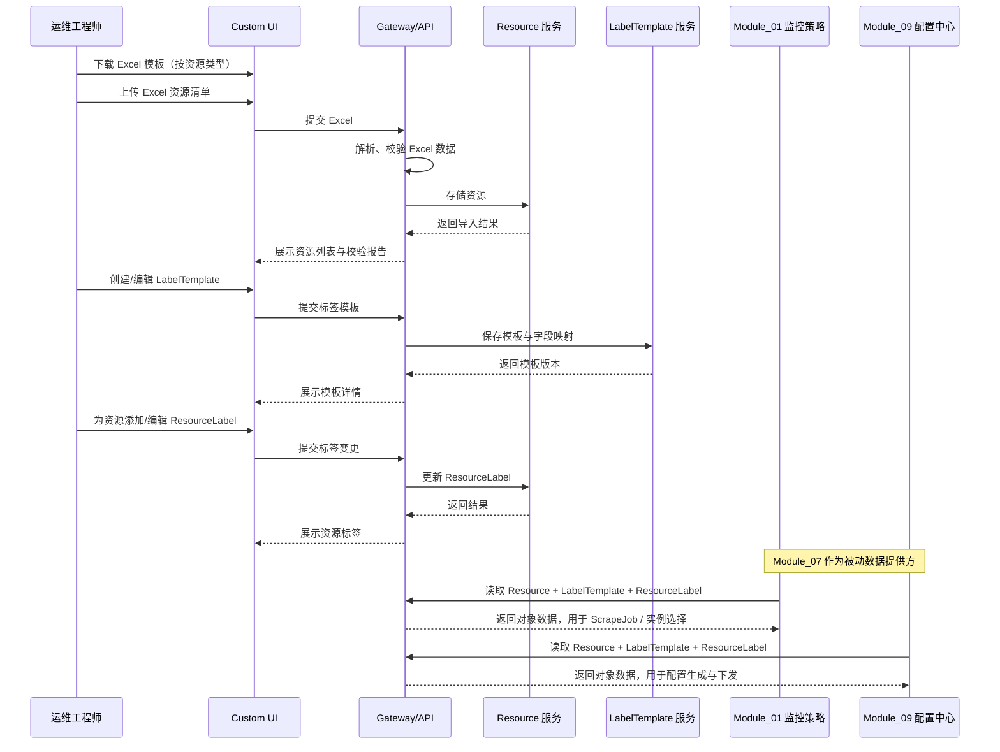

# Module 07: 监控对象管理

> **PRD 状态**: `设计中`（尚未经原型验证）
> **PRD 版本**: v1.2
> **产品版本覆盖**: MVP / v0.4 / v1.0
> **原型版本**: v1.2
> **更新日期**: 2026-08-03
> **对应原型**: `docs/prototypes/module-07/`

> **模块类型**: MVP 核心能力模块
> **依赖文档**: [00_Global_Architecture.md](../00_Global_Architecture.md)、[Module_01: 监控策略与指标管理](Module_01_Metric_Collection_Center.md)、[Module_09: 网域与边缘配置中心](Module_09_Network_Domain_and_Edge_Config_Center.md)
> **目标用户**: 运维工程师、运维架构师

---

## 1. 模块目标

Module 07 聚焦**监控对象的生命周期管理**，是 MetricCenter 的**对象数据层**。本模块负责维护可被监控的实体（Resource）、定义资源字段到 Prometheus Label 的映射规则（LabelTemplate），以及管理资源上附加的标签（ResourceLabel）。

> **核心定位**：Module 07 是 Module_01（监控策略与指标管理）和 Module_09（网域与边缘配置中心）的**被动数据提供方**。本模块不直接生成或下发 Prometheus 配置，也不负责 ScrapeJob、拨测、规则编辑等策略配置。

具体职责：

1. **资源管理**：维护四类监控资源（主机、中间件、应用服务、通用指标目标），支持 Excel 导入、手动录入、CRUD 与固定字段管理。
2. **标签模板管理**：按资源类型定义字段到 Prometheus Label 的映射规则，为策略模块生成 Job 提供稳定的标签契约。
3. **资源标签管理**：维护 ResourceLabel 的多种来源（system / user / cmdb）及冲突合并规则。
4. **Excel 导入**：提供固定列模板、状态映射字典与导入校验。
5. **扩展性**：为后续接入外部 CMDB（腾讯蓝鲸）预留统一 `CMDBProvider` 接口；具体的 CMDB 同步策略、失败处理与孤儿资源生命周期由 [Module_04](Module_04_Custom_Discovery.md) 负责。MVP 阶段通过 `ExcelProvider` / `SQLiteProvider` 本地维护资源。

> **MVP 边界**：
> - 资源管理最小化，字段固定，不做动态资源模型。
> - 本模块**不做** ScrapeJob 配置、Blackbox 拨测配置、配置生成、配置校验、配置下发、采集模板管理、目标筛选。
> - 上述策略与下发职责分别由 [Module_01](Module_01_Metric_Collection_Center.md) 和 [Module_09](Module_09_Network_Domain_and_Edge_Config_Center.md) 承担。
>
> **与 Module_01 的边界**：Module_01 是监控策略 Owner，负责 ScrapeJob、Exporter 模板绑定、实例选择、规则编辑；Module_07 仅向 Module_01 提供 Resource、LabelTemplate 与 ResourceLabel 数据契约。
>
> **与 Module_09 的边界**：Module_09 负责配置生成、预览与下发；Module_07 不生成 `prometheus.yml`，仅保证对象数据准确、完整。

---

## 2. 用户故事

- OPS-02：从 Excel 批量导入主机、中间件、应用服务资源
- OPS-05：临时添加一个资源用于验证（由策略模块决定是否纳入采集 Job）
- ARCH-03：查看平台整体采集覆盖率（通过 Resource 列表的「已监控 / 未监控」badge）

> 已移除：OPS-06（Blackbox 拨测配置）、ARCH-04（配置生成器注入 remote_write），分别由 Module_01 与 Module_09 承接。

---

## 3. 核心功能

### 3.1 资源管理

| 功能 | 说明 | 优先级 |
|------|------|--------|
| **资源类型管理** | 定义主机、中间件、应用服务、通用指标目标四类资源，字段固定 | P0 |
| **主机资源管理** | 主机列表、CRUD、Excel 导入 | P0 |
| **中间件资源管理** | 中间件列表、类型选择、CRUD、Excel 导入 | P0 |
| **应用服务资源管理** | 应用服务列表、CRUD、Excel 导入 | P0 |
| **通用指标目标管理** | 通用/自定义 Exporter 目标管理，支持自定义 IP、端口、metrics_path 与 Label | P0 |
| **展示字段控制** | 按资源类型固定展示列、默认排序 | P0 |
| **资源状态管理** | online / offline / maintenance 状态维护 | P0 |
| **已监控 / 未监控 badge** | 在 Resource 列表展示该资源是否被任意 ScrapeJob 选中；由 Module_01 写入关联关系，Module_07 只读展示 | P0 |
| **网域归属** | 资源按 `network_domain_id` 分组；网域生命周期由 [Module_09](Module_09_Network_Domain_and_Edge_Config_Center.md) 负责。**单网域模式下 Resource 列表仍展示「网域」列**，网域作为云区域概念从 CMDB/Excel 代入，不可隐藏 | P0（MVP 至少一个默认网域） |
| **CMDB 接入源** | 为 BlueKing CMDB 等外部 Provider 预留统一接口；MVP 通过 `ExcelProvider` / `SQLiteProvider` 维护资源；v0.4+ 由 [Module_04](Module_04_Custom_Discovery.md) 实现外部 CMDB 同步 | P0 / P2 |
| **资源关系** | 应用-实例-集群关系、依赖拓扑（未来） | P2 |

### 3.2 标签模板管理

| 功能 | 说明 | 优先级 |
|------|------|--------|
| **标签模板管理** | 按资源类型定义字段到 Prometheus Label 的映射 | P0 |
| **字段来源配置** | 支持 Resource 字段、Prometheus 内置字段、组合字段、CMDB 字段（v0.4+） | P0 |
| **默认标签模板** | 为四类资源预置默认模板 | P0 |
| **模板版本/克隆** | 支持复制、基于现有模板创建新版本（P1） | P1 |

### 3.3 资源标签管理

| 功能 | 说明 | 优先级 |
|------|------|--------|
| **ResourceLabel CRUD** | 为单个资源添加、编辑、删除标签 | P0 |
| **来源与合并规则** | 支持 `system` / `user` / `cmdb {v0.4+}` 三种来源，冲突优先级 `cmdb` > `user` > `system` | P0 |
| **内置 label 保护** | 禁止覆盖 Prometheus 内置 label（`instance`、`job`、`scheme`、`__address__` 等） | P0 |
| **CMDB 覆盖提示** | 当用户输入的 key 与 `source=cmdb` 的已有 label 冲突时，实时提示「该 key 将由 CMDB 覆盖，建议更换 key」 | P0 |
| **批量标签编辑** | 按资源类型或筛选条件批量增删改标签（P1） | P1 |

---

## 4. 核心流程

### 4.1 监控对象管理整体流程



> **流程说明**：
> - Module_07 的核心流程只到 Resource、LabelTemplate、ResourceLabel 的维护为止。
> - CMDB 存储、配置生成、配置下发均不在本模块职责范围内。
> - Module_01 与 Module_09 通过只读接口消费本模块数据。

---

## 5. 数据模型

### 5.1 资源类型枚举

```go
type ResourceType string

const (
    ResourceTypeHost          ResourceType = "host"
    ResourceTypeMiddleware    ResourceType = "middleware"
    ResourceTypeApplication   ResourceType = "application"
    ResourceTypeGenericTarget ResourceType = "generic_target"
)
```

### 5.2 资源基础结构（Resource）

所有资源类型共享的基础字段：

| 字段 | 类型 | 必填 | 说明 |
|------|------|------|------|
| resource_id | string | ✅ | 稳定唯一键，不用于展示；MVP 取自 `server_id` / `instance_name`；v0.4+ CMDB 接入时复用 `cmdb_ci_id` |
| resource_type | ResourceType | ✅ | host / middleware / application / generic_target |
| network_domain_id | string | ✅ | 所属网域 ID；MVP 默认值为 `default`；v0.2+ 按租户上下文填充 |
| source_type | enum | ✅ | 数据来源：`manual` / `import` / `cmdb {v0.4+}`，MVP 默认 `manual` |
| instance_name | string | ❌ | 可读实例名/展示名；host 模板中必填，对应 Excel `instance_name`，生成 `hostname` label |
| hostname | string | ❌ | 主机名；host 场景下默认与 `instance_name` 一致；也可从 CMDB `bk_host_name` 等字段同步 |
| instance_ip | string | ❌ | 目标 IP 或域名；host / generic_target 必填，作为 Prometheus scrape target 地址 |
| os_type | string | ❌ | 操作系统类型，如 `Linux`、`Windows`；host 场景下从 Excel `image` 或 CMDB 同步 |
| app_name | string | ✅ | 应用名 → 映射为 `app` label |
| env | string | ✅ | 环境 → 映射为 `env` label |
| cluster | string | ✅ | 集群/子应用 → 映射为 `cluster` label；host 场景下 `sub_app_code` 为空时取 `vpc` |
| owner | string | ❌ | 负责人；MVP 可由用户填写；v0.4+ CMDB 接入时优先取自 `cmdb_maintainer` |
| cmdb_ci_id | string | ❌ | {v0.4+} 对应 BlueKing CMDB 的 CI ID（`bk_inst_id`） |
| cmdb_business_path | string | ❌ | {v1.0+} 对应 BlueKing CMDB 业务路径，用于 ITSM 服务目录映射 |
| cmdb_module_path | string | ❌ | {v1.0+} 对应 BlueKing CMDB 模块路径，用于影响范围定位 |
| cmdb_maintainer | string | ❌ | {v1.0+} 对应 BlueKing CMDB 维护人，告警负责人来源之一 |
| status | string | ✅ | `online` / `offline` / `maintenance` / `orphan {v0.4+}`；导入时 Excel 中文状态需映射到该枚举 |
| is_monitored | bool | ❌ | 是否已被至少一个 ScrapeJob 选中；由 Module_01 维护，Module_07 只读展示 |
| created_at | datetime | ✅ | 创建时间 |
| updated_at | datetime | ✅ | 更新时间 |

> **`is_monitored` 字段说明**：
> - 该字段由 Module_01 在创建/更新/删除 ScrapeJob 时同步计算并写入（或 Module_07 通过只读接口查询 Module_01 的关联关系后展示）。
> - Module_07 不在本模块内维护 Job 与资源的关联关系，仅负责在 Resource 列表展示「已监控 / 未监控」badge。

### 5.3 资源 Label（ResourceLabel）

为支持 CMDB、用户、系统模板三类来源的 label 合并与冲突处理，每个资源关联的 label 单独维护：

| 字段 | 类型 | 说明 |
|------|------|------|
| id | string | 唯一标识 |
| resource_id | string | 关联的 `Resource.resource_id` |
| key | string | Label key；强制小写、下划线连接；禁止以 `__` 开头；禁止覆盖 Prometheus 内置 label（`instance`、`job`、`scheme`、`__address__` 等） |
| value | string | Label value |
| source | enum | `system` / `user` / `cmdb {v0.4+}` |
| created_at | datetime | 创建时间 |
| updated_at | datetime | 更新时间 |

**来源说明**：
- `system`：由 [LabelTemplate](#54-标签模板-labeltemplate) 根据 Resource 字段自动生成的默认 label，如 `app`、`env`、`cluster`、`hostname`。
- `user`：用户通过 UI 或 Excel 手动添加的 label。
- `cmdb`：v0.4+ 由 Module_04 CMDB 同步写入的 label。

**同 key 冲突优先级**：`cmdb` > `user` > `system`。即 CMDB 可覆盖用户和系统 label；用户可覆盖系统 label。

**前端提示**：
- 用户手动添加 label 时，输入框旁提示“禁止覆盖 Prometheus 内置 label（`instance`、`job`、`scheme`、`__address__` 等）”。
- 当用户输入的 key 与 `source=cmdb` 的已有 label 冲突时，实时提示“该 key 将由 CMDB 覆盖，建议更换 key”。
- key 校验规则：小写字母、数字、下划线；禁止以 `__` 开头；长度限制 128 字符。

### 5.4 网域（NetworkDomain）引用

网域是 MetricCenter 支持多网域物理隔离场景的核心维度。每个资源必须归属到一个网域。

`NetworkDomain` 数据模型、生命周期管理、Token 生成、Edge Agent 状态均由 [Module_09: 网域与边缘配置中心](Module_09_Network_Domain_and_Edge_Config_Center.md) 负责。**本模块仅读取 `network_domain_id` 作为资源分组的归属字段**。

本模块使用的最小字段：

| 字段 | 类型 | 必填 | 说明 |
|------|------|------|------|
| id | string | ✅ | 网域唯一标识，如 `default`、`gov-cloud-a` |
| name | string | ✅ | 网域展示名 |
| status | enum | ✅ | online / offline / unknown |

> **MVP 处理**：系统初始化时自动创建一个 `id=default` 的默认网域，所有未指定网域的资源自动归属到默认网域，保证单网域场景无感知。
>
> **网域列展示策略**：即使租户处于单网域模式（`Tenant.multi_site_enabled=false`），Resource 列表、详情页与 Excel 模板仍保留「网域」列。网域在此被视为云区域（Cloud Area）概念，是资源从 CMDB 或 Excel 导入时的必要属性，不随 UI 模式隐藏。

### 5.5 Excel 状态映射字典

Excel/外部数据源中的状态值通常是业务语言（如 `运行中`、`已停止`），需要映射到 MetricCenter `Resource.status` 枚举（`online` / `offline` / `maintenance`）。

#### 5.5.1 默认映射

| 来源状态值（不区分大小写） | 目标 `Resource.status` | 说明 |
|----------------------------|------------------------|------|
| `运行中`、`正常`、`online`、`active`、`running`、`up` | `online` | 正常运行 |
| `已停止`、`停止`、`offline`、`stopped`、`down`、`关机` | `offline` | 已停止/不可用 |
| `维护中`、`维修中`、`maintenance`、`maintaining` | `maintenance` | 维护中 |

#### 5.5.2 可配置映射

默认映射无法满足所有客户时，支持通过配置扩展或覆盖：

| 配置项 | 说明 |
|--------|------|
| `status_mapping.default_target` | 未匹配到任何规则时的 fallback 目标状态；默认 `offline` |
| `status_mapping.rules` | 规则列表，每条规则包含 `source_status`（来源值，支持精确匹配或正则）、`target_status`、`resource_type`（可选，为空时适用于所有类型）、`priority`（同 source 冲突时优先级） |
| `status_mapping.case_sensitive` | 是否区分大小写；默认 `false` |

**配置示例**：

```yaml
status_mapping:
  case_sensitive: false
  default_target: offline
  rules:
    - source_status: "运行中|正常|online|running"
      target_status: online
      resource_type: host
      priority: 100
    - source_status: "已停止|停止|offline|stopped"
      target_status: offline
      resource_type: host
      priority: 100
    - source_status: "维护中|维修中|maintenance"
      target_status: maintenance
      priority: 90
```

#### 5.5.3 数据模型

```go
type ResourceStatusMapping struct {
    ID             string        // 唯一标识
    SourceStatus   string        // 来源状态值（或正则表达式）
    TargetStatus   ResourceStatus // online / offline / maintenance
    ResourceType   *ResourceType // 仅对特定资源类型生效；nil 表示通用
    Priority       int           // 同 source 冲突时优先级，数值大的优先
    IsBuiltin      bool          // 是否系统内置，内置规则禁止删除但可禁用
    Enabled        bool          // 是否启用
    CreatedAt      time.Time
    UpdatedAt      time.Time
}
```

#### 5.5.4 映射优先级

1. 先匹配 `resource_type` 精确匹配的规则；无命中再匹配通用规则（`resource_type` 为空）。
2. 同一 `source_status` 存在多条规则时，按 `priority` 倒序取最高者。
3. 仍无命中时，使用 `default_target`（默认 `offline`）。
4. 映射结果无法识别时（如配置错误指向非法状态），记录导入错误并跳过该资源。

#### 5.5.5 UI 配置入口（P2）

- MVP 阶段通过配置文件或初始化 SQL 管理映射字典。
- v0.4+ 在 [Module_05: 自定义 UI](Module_05_Custom_UI.md) 的系统设置页面提供映射规则管理。

### 5.6 主机资源（Host）

| 字段 | 类型 | 必填 | 说明 |
|------|------|------|------|
| hostname | string | ✅ | 主机名 |
| instance_ip | string | ✅ | 管理 IP |
| os_type | string | ❌ | linux / windows |
| os_version | string | ❌ | 系统版本 |

### 5.7 中间件资源（Middleware）

| 字段 | 类型 | 必填 | 说明 |
|------|------|------|------|
| middleware_type | string | ✅ | mysql / redis / kafka / elasticsearch / ... |
| instance_ip | string | ✅ | 服务 IP |
| port | int | ✅ | 服务端口 |
| version | string | ❌ | 版本号 |
| connection_string | string | ❌ | 连接串（敏感信息可加密存储） |

### 5.8 应用服务资源（Application）

| 字段 | 类型 | 必填 | 说明 |
|------|------|------|------|
| service_name | string | ✅ | 服务名 |
| health_check_url | string | ❌ | 拨测 URL；作为资源字段由 Module_07 维护，Blackbox Job 配置由 Module_01 负责 |
| protocol | string | ❌ | http / https / tcp |
| endpoint | string | ❌ | 业务指标端点 |
| port | int | ❌ | 服务端口 |

### 5.9 通用指标目标（GenericTarget）

用于接入非标准 Exporter 设备（如 SNMP 交换机、GPU 服务器、Oracle 数据库、硬件光纤交换机等）。

| 字段 | 类型 | 必填 | 说明 |
|------|------|------|------|
| target_name | string | ✅ | 目标名称/描述 |
| instance_ip | string | ✅ | 目标 IP 或域名 |
| port | int | ❌ | 服务端口，空时不拼接 `instance` |
| metrics_path | string | ❌ | 默认 `/metrics` |
| scheme | string | ❌ | `http` / `https`，默认 `http` |
| custom_labels | map | ❌ | 自定义 Label，如 `device_type=snmp_switch`、`vendor=h3c` |
| exporter_type | string | ❌ | 设备/Exporter 类型，如 `snmp_exporter`、`gpu_exporter`、`oracle_exporter` |

### 5.10 标签模板（LabelTemplate）

| 字段 | 类型 | 说明 |
|------|------|------|
| id | string | 唯一标识 |
| name | string | 模板名称 |
| resource_type | ResourceType | 适用的资源类型 |
| mappings | []Mapping | 字段映射列表 |

> **变更说明**：原 `job_id` 字段已移除。LabelTemplate 只与资源类型绑定，ScrapeJob 在 Module_01 中引用 LabelTemplate。

### 5.11 字段映射（Mapping）

| 字段 | 类型 | 说明 |
|------|------|------|
| source_field | string | 来源字段名 |
| source_type | enum | `resource_field` / `prometheus_builtin` / `composite` / `cmdb_field {v0.4+}` |
| target_label | string | Prometheus Label 名 |
| enabled | bool | 是否启用 |
| transform | string | 转换规则（可选）：`lower`、`upper`、`prefix`、`replace` |

### 5.12 标签模板字段来源

#### A. Resource 字段

| 资源类型 | 来源字段 | Prometheus Label | 说明 |
|----------|-----------|------------------|------|
| 通用 | `app_name` | `app` | Resource 基础字段 |
| 通用 | `env` | `env` | Resource 基础字段 |
| 通用 | `cluster` | `cluster` | Resource 基础字段；host 场景下 `sub_app_code` 为空时取 `vpc` |
| 通用 | `instance_name` | `instance_name` | 可读实例名；host 模板中必填 |
| 主机 | `hostname` | `hostname` | host 场景下默认与 `instance_name` 一致 |
| 主机 | `instance_ip` | `instance_ip` | 采集目标地址 |
| 主机 | `os_type` | `os_type` | 操作系统类型 |
| 中间件 | `middleware_type` | `middleware_type` | 中间件类型 |
| 应用服务 | `service_name` | `service_name` | 应用服务名 |
| 通用 {v0.4+} | `cmdb_business_path` | `cmdb_business_path` | CMDB 接入后由 Module_04 同步 |
| 通用 {v0.4+} | `cmdb_module_path` | `cmdb_module_path` | CMDB 接入后由 Module_04 同步 |
| 通用 {v0.4+} | `cmdb_maintainer` | `cmdb_maintainer` | CMDB 接入后由 Module_04 同步 |

#### B. Prometheus 内置字段

| 内置字段 | 说明 |
|----------|------|
| `__address__` | 抓取地址 |
| `__scheme__` | 协议 |
| `__metrics_path__` | 采集路径 |
| `job` | Job 名称 |
| `instance` | 实例标识 |

#### C. 组合字段

| 组合字段 | 生成规则 |
|----------|----------|
| `instance` | 主机/中间件：`instance_ip` + `:` + `port` |

### 5.13 默认标签模板

按资源类型的默认映射：

**主机默认标签模板**

| 来源类型 | 来源字段 | 目标 Label |
|----------|----------|------------|
| composite | `instance_ip:port` | `instance` |
| resource_field | `app_name` | `app` |
| resource_field | `env` | `env` |
| resource_field | `cluster` | `cluster` |
| resource_field | `hostname` | `hostname` |
| resource_field | `instance_name` | `instance_name` |
| resource_field | `os_type` | `os_type` |

**中间件默认标签模板**

| 来源类型 | 来源字段 | 目标 Label |
|----------|----------|------------|
| composite | `instance_ip:port` | `instance` |
| resource_field | `app_name` | `app` |
| resource_field | `env` | `env` |
| resource_field | `cluster` | `cluster` |
| resource_field | `middleware_type` | `middleware_type` |

**应用服务默认标签模板**

| 来源类型 | 来源字段 | 目标 Label |
|----------|----------|------------|
| resource_field | `service_name` | `service_name` |
| resource_field | `app_name` | `app` |
| resource_field | `env` | `env` |
| resource_field | `cluster` | `cluster` |
| resource_field | `health_check_url` | `health_check_url` |

**通用指标目标默认标签模板**

| 来源类型 | 来源字段 | 目标 Label |
|----------|----------|------------|
| composite | `instance_ip:port` | `instance` |
| resource_field | `target_name` | `target_name` |
| resource_field | `app_name` | `app` |
| resource_field | `env` | `env` |
| resource_field | `cluster` | `cluster` |
| resource_field | `custom_labels.*` | 透传 |

---

## 6. Excel 导入规范

### 6.1 模板规则

MVP 阶段按资源类型提供**固定列模板**，不做动态字段映射。

**主机导入模板列**

```
network_domain | hostname | instance_ip | os_type | app_name | env | cluster | owner | status
```

**中间件导入模板列**

```
network_domain | middleware_type | instance_ip | port | version | app_name | env | cluster | owner | status
```

**应用服务导入模板列**

```
network_domain | service_name | health_check_url | protocol | endpoint | port | app_name | env | cluster | owner | status
```

**通用指标目标导入模板列**

```
network_domain | target_name | instance_ip | port | metrics_path | scheme | exporter_type | custom_labels | app_name | env | cluster | owner | status
```

其中 `custom_labels` 列支持 `key1=value1;key2=value2` 格式。

### 6.2 数据校验

| 校验项 | 规则 |
|--------|------|
| 必填项 | 检查资源类型对应的必填字段 |
| 网域存在性 | `network_domain` 必须对应已存在的 `NetworkDomain.id`；为空时自动填充为 `default` |
| IP 格式 | `instance_ip` 必须符合 IPv4 格式 |
| 端口范围 | `port` 必须在 1 ~ 65535 |
| URL 格式 | `health_check_url` 必须符合 HTTP/TCP URL 格式 |
| 环境枚举 | `env` 必须是 `dev/test/staging/prod` 之一 |
| 协议枚举 | `protocol` 必须是 `http/https/tcp` 之一 |
| 状态枚举 | `status` 必须是 `online/offline/maintenance` 之一 |
| 重复检测 | 同一资源类型下，`instance_ip:port` 或 `service_name` 不可重复 |
| 通用目标必填 | 通用目标 `instance_ip` 必填且符合 IPv4/域名格式 |
| 协议枚举 | 通用目标 `scheme` 必须是 `http/https` 之一 |
| 自定义标签格式 | `custom_labels` 必须符合 `key=value;key2=value2` 格式 |

### 6.3 导入结果

```json
{
  "status": "success",
  "data": {
    "total": 100,
    "success": 98,
    "failed": 2,
    "errors": [
      {
        "row": 5,
        "resource_type": "host",
        "field": "instance_ip",
        "value": "999.999.999.999",
        "reason": "IP 格式不正确"
      }
    ]
  }
}
```

---

## 7. simple-agent 标准采集示例（资源示例）

MetricCenter 内置 [`platform/examples/simple-agent/`](../../../platform/examples/simple-agent/main.go) 作为**应用服务资源**接入示例。

> **说明**：simple-agent 的 ScrapeJob、Exporter 模板、采集参数等策略配置由 [Module_01](Module_01_Metric_Collection_Center.md) 负责；本模块仅演示如何将其作为一条 Application 类型 Resource 录入。

### 7.1 启动示例

```bash
cd platform/examples/simple-agent
go mod tidy
go run main.go -listen-address ":9100" -app-name "order-service" -env "prod"
```

### 7.2 对应的资源示例

```yaml
resource_id: "simple-agent-order-service-prod"
resource_type: "application"
network_domain_id: "default"
source_type: "manual"
service_name: "order-service"
app_name: "order-service"
env: "prod"
cluster: "bj-01"
health_check_url: "http://localhost:9100/-/healthy"
protocol: "http"
endpoint: "localhost:9100"
port: 9100
status: "online"
```

> 完整的采集模板（含 `default_scrape_interval`、`default_metrics_path`、`default_port` 等）已移至 [Module_01](Module_01_Metric_Collection_Center.md) 的 Exporter 模板管理章节。

---

## 8. CMDB Provider 扩展设计

为后续接入腾讯蓝鲸等外部 CMDB 预留统一接口。MVP 实现由本模块提供本地录入能力；v0.4+ 外部 Provider（腾讯蓝鲸、Nacos、K8s、HTTP）由 [Module_04](Module_04_Custom_Discovery.md) 扩展，须遵循本接口。

> **边界说明**：CMDB 同步策略、失败处理、孤儿资源生命周期、CI 类型映射表、待分类队列等**外部数据源生命周期管理**均由 [Module_04](Module_04_Custom_Discovery.md) 负责；本模块只消费同步后的 `Resource` 数据并提供给 Module_01 / Module_09 使用。

```go
type CMDBProvider interface {
    Name() string
    ListResources(ctx context.Context, resourceType ResourceType, networkDomainID string, filter Filter) ([]Resource, error)
}
```

MVP 实现：
- `ExcelProvider`：Excel 导入
- `SQLiteProvider`：本地 SQLite 存储

v0.4+ 实现（由 Module_04 负责）：
- `BlueKingProvider`：腾讯蓝鲸 CMDB
- `HTTPProvider`：通用 HTTP CMDB
- `NacosProvider`：Nacos 注册中心
- `KubernetesProvider`：K8s Endpoints/Service

---

## 9. 前端页面

| 页面 | 功能 |
|------|------|
| 资源类型选择 | 选择主机/中间件/应用服务/通用指标目标进行管理 |
| 主机资源管理 | 主机列表、Excel 导入、编辑、删除 |
| 中间件资源管理 | 中间件列表、类型选择、Excel 导入 |
| 应用服务资源管理 | 应用服务列表、Excel 导入 |
| 通用指标目标资源管理页 | 通用指标目标 CRUD |
| 标签模板 | 按资源类型创建/编辑标签模板 |
| 资源标签 | 为单个资源添加/编辑/删除 label，展示来源与冲突提示 |
| 导入记录 | 查看 Excel 导入历史与校验报告 |

> 已移除页面：采集 Job、拨测配置、配置预览、下发历史。这些功能分别迁移至 [Module_01](Module_01_Metric_Collection_Center.md) 与 [Module_09](Module_09_Network_Domain_and_Edge_Config_Center.md)。

---

## 10. 依赖

- `platform/models/`：Resource、LabelTemplate、ResourceLabel 模型定义
- `platform/discovery/`：CMDB Provider 接口与 Excel/SQLite 实现
- [Module_01](Module_01_Metric_Collection_Center.md)：消费 Resource、LabelTemplate、ResourceLabel 数据，维护 `is_monitored` 状态
- [Module_09](Module_09_Network_Domain_and_Edge_Config_Center.md)：读取 Resource、LabelTemplate、ResourceLabel 数据生成并下发配置

---

## 11. 验收标准

- [ ] 可以维护主机、中间件、应用服务、通用指标目标四类资源
- [ ] 系统初始化后存在默认网域 `default`，单网域场景下用户无感知
- [ ] 可以按资源类型下载固定列的 Excel 模板，模板包含 `network_domain_id` 列
- [ ] 可以上传 Excel 并导入到对应资源类型；未填写 `network_domain_id` 时自动归属到 `default`
- [ ] 导入时能够基于资源类型校验必填字段，并校验 `network_domain_id` 存在性
- [ ] 导入时 Excel 中文 `status` 能够映射到 `Resource.status` 枚举（如 `运行中` → `online`）
- [ ] 可以创建/编辑标签模板，且标签模板按资源类型区分
- [ ] 标签模板字段来源包含 Resource 字段、Prometheus 内置字段和组合字段
- [ ] ResourceLabel 支持 `system` / `user` / `cmdb {v0.4+}` 三种来源，同 key 冲突优先级为 `cmdb` > `user` > `system`
- [ ] 用户手动添加 label 时禁止覆盖 Prometheus 内置 label，冲突 key UI 提示“将被 CMDB 覆盖”
- [ ] 可维护通用指标目标，配置自定义 `metrics_path` 与 `custom_labels`
- [ ] Resource 列表展示「已监控 / 未监控」badge，标识该资源是否被任意 ScrapeJob 选中
- [ ] 模块边界清晰：Module_07 不生成 `prometheus.yml`，不配置 ScrapeJob，不下发配置
- [ ] Module_01 与 Module_09 可通过只读接口稳定获取 Resource、LabelTemplate、ResourceLabel 数据
- [ ] {v0.4+} 资源模型预留 `cmdb_ci_id`、`cmdb_business_path`、`cmdb_module_path`、`cmdb_maintainer` 字段

## Change Log

| 版本 | 日期 | 变更类型 | 变更内容 | 影响范围 | 产品版本影响 | 状态 |
|------|------|----------|----------|----------|--------------|------|
| v1.2 | 2026-08-03 | 修改 | PRD 状态从 ready 修正为 设计中：尚未完成原型验证 | PRD 状态 | 文档自身 | 设计中 |
| v1.2 | 2026-08-03 | 修改 | 明确单网域模式下 Resource 列表仍展示「网域」列，网域作为云区域概念不可隐藏 | 功能范围、UI/UX、Excel 模板 | MVP | 设计中 |
| v1.1 | 2026-08-02 | 新增 | 完成 Volcengine 风格原型验证，输出独立可点击原型 | PRD 状态、UI/UX、原型目录 | 文档自身 | 设计中 |
| v1.0 | 2026-07-31 | 初始 | 模块 PRD 初始版本 | 全部 | MVP / v0.4 / v1.0 | draft |
