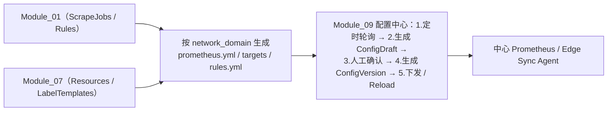
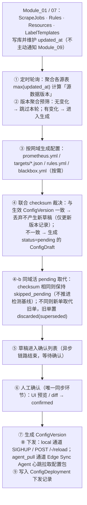
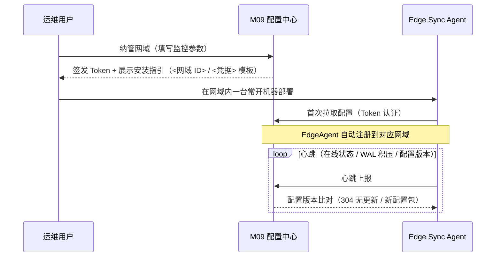
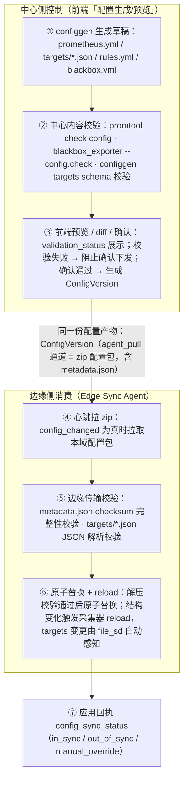
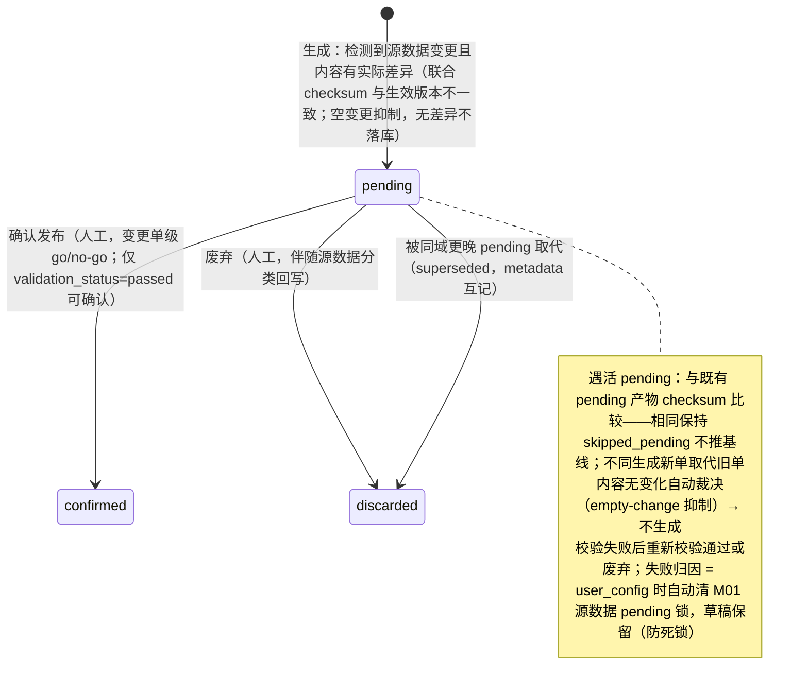
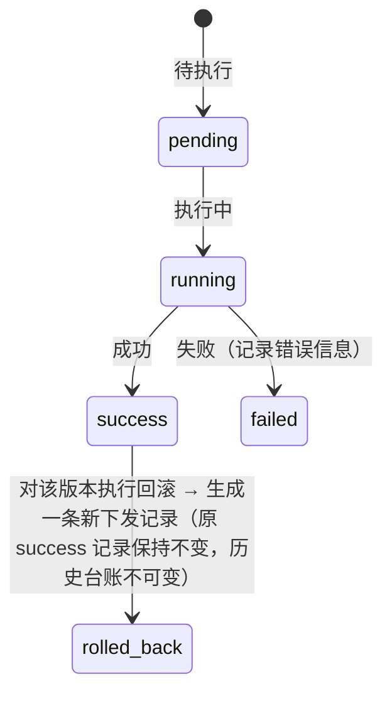
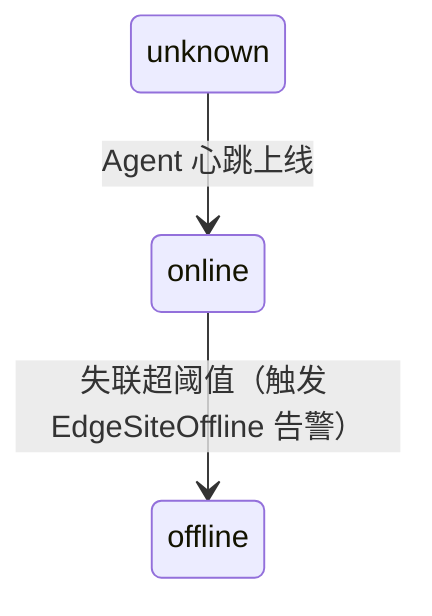
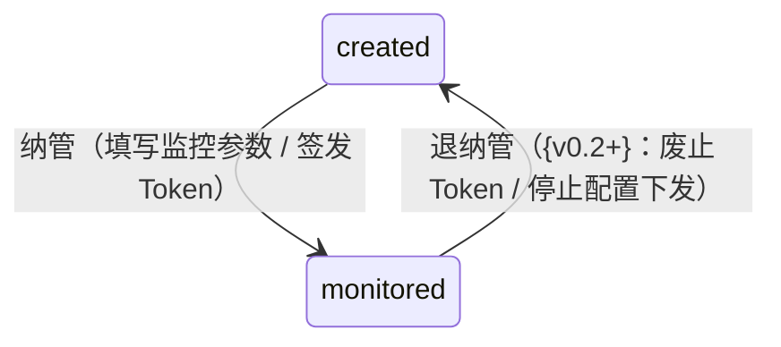

# Module 09: 网域与边缘配置中心

> **PRD 状态**: `ready`（可开发版本）
> **PRD 版本**: v1.79
> **产品版本覆盖**: MVP / v0.2 / v1.0
> **原型版本**: v1.72（PRD v1.79 为 §6 归属调整纯文档轮——网域地址语义与网闸约束迁 §3.1.5、配置变更触发链路新建 §4.4、systemd / 离线包交付与产物样例迁 design-decisions、确认页形态迁 §11.5、§6.9.3 摘要模板表化与 §6.8.2 去重，规格语义零变更、原型无需同步；PRD v1.77 为 §6 形态纪律 + §1/§5 内容逻辑性改造纯文档轮——§1 三段式重写、§4.3 补图、§5.1 必填列条件化与表下内容归位、§6.8/§6.9 重组补图；此前 v1.76 为 T6 形态纪律轮——§1/§5 引用块拍平、§5.2/5.3 表补「必填」列、§8.6 拆分归位 8.1/8.2，规格语义零变更，原型行为不变无需同步；此前 PRD v1.75 为 §3 对齐「用户可见能力」索引范式的纯文档轮——技术正文归位 §5/§6/§8/§11、§3 由规格正文改为能力索引，原型行为不变无需同步；此前 v1.74 重组轮、v1.73 瘦身轮同免同步；此前已同步：网域纳管页第 3 列「运行状态」更名为「采集节点在线」+ 列头粒度 tooltip（与「纳管状态」列一为运行态、一为配置态，非重复列）；**退纳管入口（v0.2+）与级联清退在 MVP 无 UI 落点**，均以 `docs/prototypes/module-09/package.json` 为准）
> **更新日期**: 2026-09-16
> **对应原型**: `docs/prototypes/module-09/`

> **模块类型**: 核心能力模块（v0.2+）
> **依赖文档**: [00\_Global\_Architecture.md](../00_Global_Architecture.md)、[03\_Functional\_Architecture.md](../03_Functional_Architecture.md)、[Module\_01\_Metric\_Collection\_Center.md](Module_01_Metric_Collection_Center.md)、[Module\_07\_Monitoring\_Object\_Management.md](Module_07_Monitoring_Object_Management.md)
> **目标用户**: 运维架构师、运维工程师

## 0. 需求背景与典型场景

### 这个模块解决什么问题

在政务网、跨专网、多 DMZ 或物理隔离场景下，监控配置无法直接推送到边缘节点，且配置变更缺乏审计与回滚能力。本模块作为「配置生成与下发中心」，把分散的采集策略、资源台账、告警规则转化为可审计、可确认、可下发的配置文件，并管理边缘 Agent 的接入与心跳。

### 用户需求的演进过程

从 MVP 开发期的真实反馈看，配置中心的需求随着监控规模扩大逐步暴露：

**阶段 1：配置生成期——「采集策略保存了，如何变成 Prometheus 配置？」**

- 用户在 M01 配置采集 Job 后，需要自动生成 `prometheus.yml`、`targets/*.json`、`rules.yml`
- 痛点：手工编写配置文件复杂易错，且无法按网域拆分
- 对应能力：配置生成服务（轮询 M01/M07 数据，按网域生成配置草稿）

**阶段 2：变更管控期——「配置变更需要人工确认，不能自动生效」**

- 用户在修改配置后，需要确认变更内容并控制生效时机
- 痛点：配置直接生效风险高，需要审计与回滚能力；变更单状态不透明（pending/confirmed/deployed）
- 对应能力：ConfigDraft → 人工确认 → ConfigVersion 流水线 + 变更清单 diff + 状态回写

**阶段 3：边缘接入期——「边缘节点网络不通，如何下发配置？」**

- 政务网、跨专网场景下，中心无法直接访问边缘节点
- 痛点：需要 Edge Agent 主动拉取配置，且要管理 Agent 生命周期与心跳
- 对应能力：Edge Agent 管理（`agent_pull` 通道）+ 心跳与状态监控 + 配置包下载

**阶段 4：一致性保障期——「配置下发后，如何确保与源数据一致？」**

- 用户在测试中发现：Job 保存后配置没生效、target 端口不对、规则没加载
- 痛点：配置生成与源数据脱节、变更检测不及时、校验失败无具体错误信息
- 对应能力：自动变更检测（30s 轮询 + 自适应退避）+ promtool/blackbox 校验 + 校验归因展示

**阶段 5：废弃与回滚期——「变更单废弃后，源数据怎么处理？」**

- 用户在废弃变更单后，发现 Job 状态仍显示「待生效」，形成幽灵单
- 痛点：废弃操作只改变更单状态，不回写源数据，导致状态不一致
- 对应能力：废弃分类回写（新建回 draft / 已生效修改保留 / 删除自动恢复）+ `change_status` 统一回写

### 不同技术背景用户的痛点分层

同一个配置中心能力，不同技术背景的用户会提出完全不同的问题：

| 用户类型       | 典型问题                   | 本模块的应对                                                  |
| ---------- | ---------------------- | ------------------------------------------------------- |
| **平台架构师**  | 「配置下发失败如何回滚？变更历史如何审计？」 | ConfigVersion 版本留痕 + 按文件 diff + 下发记录                    |
| **有经验的运维** | 「我改了 Job，为什么配置预览没有更新？」 | 自动变更检测（watcher）+ 保存后即时触发草稿生成                            |
| **普通运维**   | 「变更单显示校验失败，我该怎么办？」     | 校验归因展示（`validation_cause`/`validation_details`）+ 重新校验入口 |
| **边缘运维**   | 「边缘节点网络不稳定，配置会不会丢失？」   | Edge Agent 心跳 + WAL 积压监控 + 配置版本一致性校验                    |

### 典型场景（基于真实用户反馈）

| 场景            | 角色    | 触发条件             | 用户目标                      | 成功标准                                  | 来源    |
| ------------- | ----- | ---------------- | ------------------------- | ------------------------------------- | ----- |
| 纳管新网域         | 运维架构师 | 新增一个医院专网环境       | 将网域标记为已纳管并配置采集通道          | 网域状态变为「已纳管」，Edge Agent 可正常接入          | 原始需求  |
| 配置变更确认与下发     | 运维工程师 | 修改了采集 Job 或规则    | 确认变更内容后下发到 Prometheus     | 变更单人工确认，配置按网域正确下发并生效                  | 原始需求  |
| 边缘 Agent 状态监控 | 运维工程师 | 某网域数据采集中断        | 查看该网域 Agent 是否在线、配置版本是否一致 | 快速定位是 Agent 离线还是配置未下发                 | 原始需求  |
| 配置变更自动检测      | 运维工程师 | 保存采集 Job 后       | 变更单自动生成，无需手动触发            | 保存后即时触发 + 30s 轮询兜底，变更单及时出现            | F-6   |
| 变更单废弃后状态回写    | 运维工程师 | 废弃一个 pending 变更单 | 源数据状态正确回写，不形成幽灵单          | 新建未生效 Job 回退 draft，已生效 Job 清除 pending | 决策 43 |
| 配置校验失败归因      | 运维工程师 | 变更单校验失败          | 知道失败原因并能定位修复              | 展示具体校验错误（文件/行号/原因）+ 区分用户配置问题与平台故障     | 决策 45 |

> 本模块覆盖的用户故事详见 [§2 用户故事](#2-用户故事)。

***

## 1. 模块目标

管理 MetricCenter 的**网域（Network Domain）生命周期**与**边缘 Agent（Edge Agent）接入状态**，同时作为监控配置的**生成 / 预览 / 下发中心**，支撑政务网、跨专网、多 DMZ、弱网或物理隔离场景下的 Edge-Cloud 架构。

整体架构为「**中心控制面 + 网域级采集分组**」：所有配置变更与管控操作在中心控制面完成，网域作为逻辑操作上下文与采集边界，不构成独立控制面层级。

核心职责：

1. **网域监控纳管**：从 M06 已有网域中标记「已纳管监控」，下发通道按网域确定（见 §3.1）。
2. **网域行政模型**：行政字段与约束以 [Module\_06](Module_06_Multi_Tenant.md) 为单一事实来源，本模块只持有监控纳管字段（见 §5.1）。
3. **边缘 Agent 生命周期**：记录各网域采集器类型（`vmagent` / `prometheus-agent`）、版本与在线状态。
4. **配置生成服务**：轮询 M01 / M07 源数据，按网域生成 `prometheus.yml`、`targets/*.json`、`rules.yml` 草稿（见 §6.8）。
5. **草稿与预览**：提供配置预览、diff 对比与人工确认，确认后转待下发版本（见 §3.3；`alertmanager.yml` 由 M08 生成、纳入本流水线）。
6. **配置下发中心**：`local` 通道中心写盘 reload；`agent_pull` 通道 Agent 心跳拉包（见 §6.8.1）。
7. **配置拉取服务**：为 Edge Sync Agent 提供安全的配置包下载接口（见 §6.3）。
8. **心跳与状态监控**：接收 Agent 心跳，展示在线状态、WAL 积压、配置版本（见 §3.2）。
9. **安全基础**：Token 认证与拉取接口鉴权，{v1.0} 支持 mTLS 证书轮转。

**MVP 边界**：

- **MVP 做**：网域数据模型与默认网域 `default`（固定 `local` 通道，不强制部署 Edge Sync Agent）；中心 Prometheus 配置由配置中心生成、UI 确认后 reload。
- **MVP 不做**：同一网域混合通道、通道切换与单网域分布式采集（均 {v0.4+}）；M06 行政禁用**不联动**纳管状态（`IsMonitored` 独立维护，禁用后仍显示已纳管并保留监控参数 / Token——「禁用是否联动取消纳管 / 冻结 Token」属 {v0.2} 待决项）。
- **退纳管（{v0.2+}）**：废止 Token → 停止配置下发 → `registration_status` 归位 `created`；与 M06 禁用**正交**、不可互相替代（语义边界对照见 [Module\_06 §3.2](Module_06_Multi_Tenant.md)，状态流转见 §8.5）；MVP 由 M06 删除网域的级联清退覆盖（`EdgeAgent` 记录标 `retired`）。
- **{v0.2} 阶段**：配置生成 / 预览 / 下发、Edge Sync Agent 配置拉取、心跳上报、采集节点状态列表展示。
- **{v1.0} 阶段**：mTLS、证书自动轮转、Token 轮换。

***

## 2. 用户故事

> 完整用户故事条目（角色 / 我希望 / 以便于）见**全局用户故事库** **[01\_User\_Stories.md](../01_User_Stories.md)** **4.9 节**；本模块用户故事使用模块命名空间编码（`M09-ROLE-NN`，全局唯一），仅在此列出编码与一句话摘要。

- **M09-ARCH-11**：从 M06 已存在的隔离网域中选择一个完成监控纳管，填写监控参数并生成 Edge Agent 接入 Token。
- **M09-ARCH-12**：查看所有网域列表及每个网域 Edge Agent 的在线状态（列表页形式）。
- **M09-OPS-11**：在 采集节点状态列表页查看某个网域 Edge Agent 的最后心跳、WAL 积压和配置版本。
- **M09-OPS-12**：当某个网域 Edge Agent 失联时，触发 `EdgeSiteOffline` 告警（告警规则由 Module\_08 管理）。
- **M09-OPS-13**：重置某个网域的 Edge Agent Token。
- **M09-OPS-14**：查看按网域生成的配置草稿（`prometheus.yml` / `targets/*.json` / `rules.yml` 等），并与当前生效配置做按文件 diff 对比。
- **M09-OPS-15**：确认配置草稿后，一键下发并 reload 中心 Prometheus 或 Edge Agent。
- **M09-OPS-16**：查看历史配置版本与下发记录，必要时回滚到上一版本。

## 3. 核心功能

> 决策依据：design-decisions.md 决策 44-2（同域 pending 取代）/ 45（校验归因）/ 71 / 73 / 75（安装命令静态模板）/ 79（网域术语统一）/ 82（网域生命周期三动作正交）/ dev-feedback F-15 / F-19

> 本章按「用户可见能力」组织：每个子节给出**一句用户价值 + 3\~5 条行为要点 + 优先级 + 交付版本**。「优先级」（P0/P1/P2）回答「本轮是否必做」，「交付版本」回答「哪个产品版本交付」（`MVP` / 花括号阶段标签 `{v0.2}` / `{v1.0}` / `后续版本`），两轴正交、口径与 `02_Product_Roadmap.md` §1.5 功能-版本矩阵一致；背景与场景见 §0、模块职责与边界见 §1；字段语义见 §5、接口与配置产物见 §6、状态机见 §8、页面状态与全局行为见 §11、术语口径见 §10，定版论证见 design-decisions.md。

M09 的 Web 门户菜单分两个一级菜单组：「网域与节点管理」（接入面——3.1 网域纳管、3.2 采集节点状态）与「配置下发」（配置面——3.3 配置变更确认、3.4 下发记录）。3.5 配置生成引擎为**后台能力、不对应菜单页面**；3.6 为跨页面共用口径。

### 3.1 网域纳管

> **用户价值**：把 M06 已创建的网域接入监控——拿到凭据、按指引把采集节点接进来，并在同一处维护该网域的监控参数。

#### 3.1.1 网域列表与纳管

> **用户价值**：一张表看清本租户有哪些网域、哪些还没纳管、采集节点在不在线。

| 行为要点        | 说明                                                                                                             | 优先级 | 交付版本                  |
| ----------- | -------------------------------------------------------------------------------------------------------------- | --- | --------------------- |
| 网域列表        | 展示本租户下所有被授权网域，5 列：网域 / 纳管状态 / 采集节点在线 / 凭据 / 操作；列结构与操作槽位见 11.3                                                  | P0  | MVP；节点在线 / 凭据列 {v0.2} |
| 网域纳管（登记制）   | 从 M06 已有网域中选择一个完成纳管：填写监控参数、Token 自动签发；Agent IP / 主机名 / 状态等运行态信息由心跳上报补全                                         | P0  | {v0.2}                |
| 网域编辑        | 修改监控参数（Agent 类型 / Remote Write 目标 / 描述）与 WAL 队列参数；下发通道只读展示；行政字段由 M06 维护                                        | P1  | {v0.2}                |
| 删除联动（本页无入口） | 本页不设删除入口；M06 删除已纳管网域时，本页同步**级联清退**——废止 Token、停止配置下发、`EdgeAgent` 记录标 `retired`，与 M06 软删在**同一次请求内**完成，任一环节失败整体回滚 | P0  | {v0.2}                |
| 退纳管         | 对已纳管网域执行「停止监控」：废止 Token → 停止配置下发 → `registration_status` 归位 `created`（保留历史记录）；与 M06 禁用**正交**、不可互相替代            | P1  | {v0.2+}               |
| 默认网域        | 系统初始化自动创建 `default` 网域并默认已纳管，MVP 单网域场景无感知                                                                      | P0  | MVP                   |

#### 3.1.2 凭据与安装指引

> **用户价值**：接入采集节点不必记命令——凭据一处复制、安装命令一处复制，都是复制即用。

| 行为要点       | 说明                                                                                                | 优先级 | 交付版本   |
| ---------- | ------------------------------------------------------------------------------------------------- | --- | ------ |
| Token 管理   | 仅 `channel=agent_pull` 网域有效：查看 / 重置 Edge Sync Agent 认证 Token；UI **完全脱敏**（不显示任何明文片段），完整值仅经「复制」按钮获取 | P0  | {v0.2} |
| 安装指引       | 页面顶部常驻提示区（仅采集节点域）：3 步人工步骤 + 边缘节点组件构成 + 凭据获取方式 + 单节点部署口径；入口收敛于该提示区单一位置，明细见 11.3                    | P1  | {v0.2} |
| 一键复制安装命令   | 静态模板、占位符形态（`<网域 ID>` / `<凭据>`），**不含真实凭据**；一版模板适配任意网域，页面展示一律掩码                                     | P1  | {v0.2} |
| 纳管取凭据为前置条件 | 纳管成功后自动滚动定位到指引区并提示本次要接入的网域；该动作不计入 3 步编号                                                           | P1  | {v0.2} |
| 跨模块深链入口    | M06 网域列表对「已纳管未上线」网域提供「查看安装指引」，深链至本页并定位该网域                                                         | P1  | {v0.2} |

#### 3.1.3 下发通道与多网域能力

> **用户价值**：单机场景不需要理解「网域」这层概念；政务网 / 专网的多个隔离域也能各自接入、各自下发。

| 行为要点       | 说明                                                                                                          | 优先级 | 交付版本                      |
| ---------- | ----------------------------------------------------------------------------------------------------------- | --- | ------------------------- |
| 通道按网域固定    | `default` 固定 `local`（中心直接写盘并 reload）；其他网域固定 `agent_pull`（配置包由 Agent 主动拉取）。MVP 不提供通道选择 / 切换入口，通道语义与产物形态见 6.8 | P0  | MVP；agent\_pull 通道 {v0.2} |
| 单网域能力（默认）  | 租户级开关 `multi_site_enabled` 关闭时，系统预置并默认展示 `default` 网域，无法创建额外网域                                              | P0  | MVP                       |
| 多网域能力      | 开关开启后可在 M06 创建多个网域并在本页逐个纳管；「网域纳管」「采集节点状态」子菜单**常驻**，无 `EdgeAgent` 实例时进入空态引导页                                 | P0  | {v0.2}                    |
| 入口与字段由数据驱动 | 该开关**不是 UI 顶栏的运行时切换器**，本模块内不存在全局「单 / 多网域模式」切换控件；Token / 安装指引 / 运行态字段仅对 `agent_pull` 网域展示                    | P0  | MVP；agent\_pull 字段 {v0.2} |
| 关闭后的数据可见性  | 关闭后系统仅展示 `default` 网域数据，其他网域数据不删除仅隐藏，再次开启即恢复显示                                                              | P1  | MVP                       |

#### 3.1.4 WAL 与 Remote Write 参数

> **用户价值**：弱网网域的本地缓冲上限与回传节奏可调，不必改配置文件、不必重启采集器。

| 行为要点    | 说明                                              | 优先级 | 交付版本   |
| ------- | ----------------------------------------------- | --- | ------ |
| 参数按网域配置 | 在网域纳管 / 编辑表单中配置本地缓冲上限、回传时间窗、批量大小、并发分片、限流重试与压缩算法 | P1  | {v0.2} |
| 默认值开箱可用 | 六个参数均有平台默认值，不配置即按默认生效；参数清单与默认值见 6.4.1               | P1  | {v0.2} |

#### 3.1.5 地址语义与网闸约束

> **用户价值**：两个地址只在纳管网域时填一次，隔离网域内的全部边缘通信自动成立，无需为每台机器单独申请策略。

| 行为要点 | 说明 | 优先级 | 交付版本 |
| ------- | ---- | --- | ----- |
| 两类地址登记在网域 | `center_endpoint`（管理面：心跳 + 配置拉取）与 `remote_write_url`（数据面：指标回传）均登记在**网域**上；MVP 一网域一条通道，通道参数属于网域而非某台机器 | P0 | MVP |
| 采集节点是地址的使用者 | 节点身份为「网域 ID + 凭据」，中心不登记也不需要节点地址 | P0 | MVP |
| 方向恒为「采集节点 → 中心」 | 心跳、配置拉取、指标回传全部由边缘 Agent 主动上行；转发场景填**转发侧可达地址** | P0 | MVP |
| 回传地址可自动推导 | 两地址同走一个转发入口时，`remote_write_url` 由平台按 `center_endpoint` 推导，无需重复填写 | P1 | MVP |
| 网闸隔离适配 | 政务云等网闸场景禁止任何「中心 → 边缘」方向的主动连接，平台不提供该能力（安全合规 + 网闸映射地址通常不存在） | P0 | {v0.2} |
| 网闸穿透待实测 | 长连接（指标回传）与大文件（配置包）能否稳定穿过双向网闸按「标准 HTTPS 可穿透」设计，待 MVP 后在客户环境验证；不通过时的备选布置不影响本模块数据模型 | P2 | MVP 后 |

> **决策依据**：design-decisions「网域-采集节点部署口径与两类地址用户指引」条目（含 {v0.4+} 同域多节点共用通道的影响面）。

### 3.2 采集节点状态

> **用户价值**：一眼看出哪个边缘采集节点的链路出了问题，并能下钻到组件级定位。

#### 3.2.1 节点列表与组件诊断

> **用户价值**：以「在哪台机器上装了什么」的心智看节点，不必先理解进程模型。

| 行为要点           | 说明                                                                                     | 优先级 | 交付版本   |
| -------------- | -------------------------------------------------------------------------------------- | --- | ------ |
| 节点平铺表          | 主对象为**采集节点**，一行一个节点：节点 / 网域 / 整体状态 / 采集器状态 / 拨测器状态 / 配置同步 / WAL 积压 / 最后心跳；列设计与筛选见 11.4 | P0  | {v0.2} |
| 整体状态三档聚合       | 正常 / 部分异常 / 离线：Agent 离线判「离线」；必装组件异常判「部分异常」                                             | P0  | {v0.2} |
| 组件明细抽屉         | 点「查看」开右侧抽屉，列出 Edge Sync Agent / 采集器 / blackbox exporter 三个进程的状态、版本、配置版本与最近错误，并附组件关系说明  | P0  | {v0.2} |
| 采集节点注册         | Edge Sync Agent 首次拉取配置时自动注册到对应网域，无需人工登记                                                | P0  | {v0.2} |
| 采集器类型          | 按网域配置 `vmagent`（MVP 固定）或 `prometheus-agent`（{v0.2+} 开放）；字段定义见 5.1                      | P0  | {v0.2} |
| 仅展示有 Agent 的网域 | 中心直连域不产生 `EdgeAgent` 实例，不出现在本页（仅出现在空态说明中）                                              | P0  | {v0.2} |

#### 3.2.2 配置同步状态与引导

> **用户价值**：中心改了配置，一眼知道边缘有没有生效；没生效时给出下一步该点哪里。

| 行为要点            | 说明                                                                          | 优先级 | 交付版本   |
| --------------- | --------------------------------------------------------------------------- | --- | ------ |
| 配置同步列           | 展示中心配置版本与边缘实际生效版本是否一致；形态为 **Badge + 成因分档标签**与引导按钮一一对应；分档口径见 8.3，标签与按钮见 11.4 | P0  | {v0.2} |
| 未下发配置           | Agent 已上线但网域尚无成功下发过的版本 → 引导「去配置采集 Job」，跳 M01 并预选该网域                         | P0  | {v0.2} |
| 未同步（按成因分档）      | 待确认变更 → 标签「待确认变更」+「前往配置确认」；生效中 → 纯展示等待 +「查看下发记录」；本地校验失败 → 标签「本地校验失败」+「立即同步」 | P0  | {v0.2} |
| 已同步 / 人工覆盖 / 未知 | 纯展示，不提供引导按钮                                                                 | P0  | {v0.2} |
| 进程健康与配置同步解耦     | 组件进程异常属健康问题，本列不给引导按钮，由「整体状态」列 + 行级高亮 + 详情抽屉高危横幅承载                           | P0  | {v0.2} |

#### 3.2.3 空态引导与跨页深链

> **用户价值**：还没接入任何节点时看到的不是一张空表，而是明确的下一步；从别的页面跳进来也不会迷失在整张表里。

| 行为要点  | 说明                                                                         | 优先级 | 交付版本   |
| ----- | -------------------------------------------------------------------------- | --- | ------ |
| 空态引导页 | 无 `EdgeAgent` 实例时进入空态引导页，提示先到「网域纳管」完成纳管并按安装指引接入 Edge Sync Agent            | P0  | {v0.2} |
| 深链预筛  | 支持 `?network_domain=<id>` 深链：按该网域预筛并在页顶展示来源提示，含「查看全部网域」退出入口（退出同时清筛选值与 URL） | P0  | {v0.2} |
| 空态三支  | 筛选后为空（纯陈述）/ 该网域尚无采集节点（引导「去复制安装命令」并定位网域纳管页指引区）/ 中心直连域（说明其不部署采集节点）           | P0  | {v0.2} |
| 来源方   | M06「安装采集节点」行内主操作、本模块网域详情抽屉「查看采集节点状态」                                       | P0  | {v0.2} |

#### 3.2.4 边缘诊断看板（P1/P2）

> **用户价值**：政务网 / 专网抖动或封堵时，有趋势可查，而不是只看一个瞬时状态。

| 行为要点              | 说明                          | 优先级 | 交付版本 |
| ----------------- | --------------------------- | --- | ---- |
| 心跳 RTT 趋势         | 边缘 Agent 到中心的网络延迟趋势图        | P1  | 后续版本 |
| WAL 积压趋势          | 本地磁盘未发送数据大小趋势图              | P1  | 后续版本 |
| Remote Write 队列状态 | 发送速率、失败重试次数、当前队列长度          | P1  | 后续版本 |
| 最近错误列表            | 最近 N 条配置拉取或 Remote Write 错误 | P1  | 后续版本 |
| 24h 断网时长统计        | 最近 24 小时累计断网时长              | P2  | 后续版本 |
| 详细诊断仪表板           | 综合图表视图，支持按网域 / 时间范围下钻       | P2  | 后续版本 |

### 3.3 配置变更确认与预览

> **用户价值**：不懂 Prometheus 的运维也能安全审批——平台把「改了什么」翻译成人话，用户只回答「这次要不要上线」。

#### 3.3.1 变更摘要与变更清单

> **用户价值**：不用读 YAML，一眼知道为什么变了、影响了什么。

| 行为要点    | 说明                                                                                | 优先级 | 交付版本 |
| ------- | --------------------------------------------------------------------------------- | --- | ---- |
| 人话变更摘要  | 每项待确认变更给出摘要，回答「为什么发生变更」，如「新增 1 台服务器（10.0.1.11）加入 node-exporter 采集」；生成机制见 6.9      | P0  | MVP  |
| 结构化变更清单 | 按「变更类型（新增 / 修改 / 移除）+ 变更对象 + 影响的配置文件 + 人话说明 + 风险等级」拆条                             | P0  | MVP  |
| 变更对象口径  | 变更对象取**源数据对象**（采集 Job / 采集目标 / 告警规则 / 拨测目标 / 标签模板），而非配置文件本身；同时派生「影响的配置文件」列，两列并排呈现 | P0  | MVP  |
| 风险等级    | 低风险 = 新增目标；高风险 = 删除目标导致监控断点、告警规则变更导致误报 / 漏报；高风险在列表与详情醒目提示                         | P0  | MVP  |
| 规则变更提示  | 告警规则变更（新增 / 修改 / 删除）生成 `rules.yml` 差异，属高风险变更，**必须**在变更清单中醒目提示                     | P0  | MVP  |

#### 3.3.2 变更单列表与按网域视图

> **用户价值**：变更单天然归属网域，切网域即切上下文，不会看到别的网域的待确认单。

| 行为要点    | 说明                                                                       | 优先级 | 交付版本 |
| ------- | ------------------------------------------------------------------------ | --- | ---- |
| 网域切换器   | 页面顶部「选择网域」仅展示**已纳管网域**（未纳管网域不生成配置草稿）；仅存在 `default` 单域时默认选中 `default`     | P0  | MVP  |
| 变更单列表   | 展示当前网域的变更单：变更单号（用户可读唯一标识）/ 变更摘要 / 状态 / 风险等级 / 确认人 / 已发布版本 / 下发前校验 / 生成时间 | P0  | MVP  |
| 状态筛选    | Segmented 切换：待确认 / 已确认 / 已废弃 / 全部，默认待确认                                  | P0  | MVP  |
| 通道标记    | 行内保留下发通道标记（`local` / `agent_pull`）；确认动作仍为**变更单级**，与网域切换无关                | P0  | MVP  |
| 变更检测状态卡 | 按选中网域展示三类引导性提示（有待确认变更 / 无变更 / 生成失败）；上次检测时间与源数据版本等技术信息折叠展示                | P0  | MVP  |

#### 3.3.3 变更详情与配置预览

> **用户价值**：审批看人话、排障看 YAML——两类信息分区，互不干扰。

| 行为要点      | 说明                                                                                                                                                       | 优先级 | 交付版本 |
| --------- | -------------------------------------------------------------------------------------------------------------------------------------------------------- | --- | ---- |
| 详情抽屉      | 点变更行开右侧抽屉：标题 = 变更单号 + 状态 / 风险 / 校验标签 + 人话摘要；核心为变更清单，其后依次为基本信息、技术信息（折叠）、配置产物结构、预览 / Diff、下发前校验说明                                                          | P0  | MVP  |
| 配置预览      | 多文件只读预览，按配置产物类型分 Tab 展示变更内容；自动判定受影响的文件集并加「变更」标记、默认聚焦首个受影响文件；产物结构与文件清单见 6.8 / 6.7 | P0  | MVP  |
| Diff 对比   | 与当前生效版本**按文件**并排 diff，标红新增 / 删除 / 修改项                                                                                                                    | P0  | MVP  |
| 技术产物为次级信息 | 配置 YAML / Diff / checksum / 源数据版本仅供追溯排障，**不构成审批上下文**；对接外部审批平台（ITSM）时审批上下文仅含人话摘要 + 影响范围 + 风险等级                                                            | P0  | MVP  |
| 被取代旧单     | 被同域更晚 pending 取代的旧单，详情顶部 Alert 提示「已被新变更单取代」，仅展示、无确认 / 废弃操作                                                                                               | P0  | MVP  |

#### 3.3.4 确认发布与废弃

> **用户价值**：确认即发布、废弃即回退，两个动作都有明确后果说明，不留幽灵状态。

| 行为要点       | 说明                                                                                                                                        | 优先级 | 交付版本                      |
| ---------- | ----------------------------------------------------------------------------------------------------------------------------------------- | --- | ------------------------- |
| 变更单级确认     | 一次确认 / 废弃整张变更单（go/no-go），不逐行确认、不拆分发布；确认后 draft 转 `ConfigVersion` 并进入待下发                                                                   | P0  | MVP                       |
| 确认门槛与留痕    | 仅 `validation_status=passed` 可确认发布；确认动作记录确认人（MVP 预置登录用户上下文，M06 用户管理接入后同步为真实用户）                                                            | P0  | MVP                       |
| 确认抽屉标注发布通道 | `local`「确认后立即 reload 生效」；`agent_pull`「发布为配置包，待边缘 Agent 下次心跳拉取生效」                                                                          | P0  | MVP；agent\_pull 文案 {v0.2} |
| 废弃伴随源数据回写  | 废弃前调 `discard-impact` 获取分类影响并弹窗知情告知，按分类回写（新建未生效 → 回退 `draft`；已生效修改 → 提示 + 复现；删除 / 停用型 → 自动恢复）；`change_status` 统一回写、无 `pending` 残留；语义见 6.9 | P1  | MVP                       |
| 已发布版本入口    | 已确认 / 已废弃变更展示已发布配置版本号并提供「查看发布记录」，跳转下发记录页定位回滚                                                                                              | P0  | MVP                       |

### 3.4 配置下发与分发

> **用户价值**：每次发布与回滚都有台账可查，出问题能一键回到上一个可用版本。

#### 3.4.1 下发记录

> **用户价值**：它是「配置变更执行台账 + 回滚中心」，不是日常高频流水页。

| 行为要点        | 说明                                                                                                     | 优先级 | 交付版本   |
| ----------- | ------------------------------------------------------------------------------------------------------ | --- | ------ |
| 下发记录字段      | 来源变更单号 / 配置版本 / 目标 / 操作人 / 时间 / 结果 / 失败原因；回滚动作产生的记录状态为 `rolled_back`，列表与详情以「已回滚」标签标识；单号与版本号系统自动生成、不可手填 | P0  | MVP    |
| 全链路可追溯      | 变更单号 → 配置版本 → 下发记录双向可追溯：用户从变更确认页按变更单号找到配置版本号，再到本页按版本一键回滚                                               | P0  | MVP    |
| 查看版本配置内容    | 记录详情提供「查看版本配置」入口，只读展示该次下发的完整配置产物（按文件分 Tab）；**产物含凭据明文，按管理员级权限开放**，非管理员隐藏入口                              | P0  | MVP    |
| 多目标分发       | 按网域分发到对应 Edge Sync Agent，支持批量选择网域下发                                                                    | P1  | {v0.2} |
| 与 M06 审计的边界 | 本页是领域业务对象台账（配置版本 / 下发记录），与 M06 平台级横切审计日志联动不重复                                                          | P1  | MVP    |

#### 3.4.2 版本回滚

> **用户价值**：配置出问题时有确定性的应急恢复动作，且回滚前先知道会带回什么。

| 行为要点      | 说明                                                                                             | 优先级 | 交付版本                      |
| --------- | ---------------------------------------------------------------------------------------------- | --- | ------------------------- |
| 回滚动作      | 选择历史 `ConfigVersion` 重新下发、覆盖当前生效配置；回滚本身生成一条新下发记录，被回滚的历史记录保持不变（历史台账不可变）                         | P0  | MVP                       |
| 生效语义按通道区分 | `local` 重新下发后立即 reload 生效；`agent_pull` 重新发布历史版本为配置包，依赖 Agent 下次心跳拉取生效；UI 分别给出对应提示              | P0  | MVP；agent\_pull 生效 {v0.2} |
| 回滚前知情     | 确认弹窗展示「回滚目标版本 vs 当前生效版本」之间的**源数据操作差异清单**，并固定提示「回滚不恢复 M01/M08 中的启停状态」                           | P0  | MVP                       |
| 回滚边界      | 回滚只恢复配置产物，**不回滚 M01/M08 源数据状态**（恢复入口永远在源模块）；分裂态显式化与防「自动反悔」变更单标记为 {v0.2}，语义见 8.2（回滚）/ 8.1（废弃回写） | P0  | MVP；分裂态显式化 {v0.2}         |
| 重试下发      | 对 `status=failed` 的 `local` 通道记录提供「重试」（复用最近一次该版本的下发动作）；`agent_pull` **不提供重试**（中心不主动触达边缘）       | P0  | MVP                       |

#### 3.4.3 下发前校验与失败出口

> **用户价值**：配置在出门前先校验；校验失败也能自己闭环，不会被一张不可确认的单子卡住。

| 行为要点      | 说明                                                                                                                             | 优先级 | 交付版本 |
| --------- | ------------------------------------------------------------------------------------------------------------------------------ | --- | ---- |
| 校验项       | 中心侧对配置产物做语法与结构校验（Prometheus 主配置、blackbox 模块、targets JSON 等），分层关系见 6.5；具体校验项与工具链见 6.5.1 | P0  | MVP  |
| 失败出口      | 校验失败保持 `validation_status=failed`、不进入下发流程；变更单提供「重新校验」（仅重校、不重生成源内容）与「废弃」两个变更单级出口                                                | P0  | MVP  |
| 三态操作口径    | 仅 `passed` 可确认发布；`failed` 与 `pending` 均不可确认，均提供「重新校验 + 废弃」出口                                                                   | P0  | MVP  |
| 失败归因      | 持久化 `validation_cause`（`user_config` 可修复 / `platform_fault` 平台故障）与 `validation_details`（文件 / 行号 / 原因结构化定位）；归因判定规则见 6.5         | P0  | MVP  |
| 失败单不锁死源数据 | `failed + user_config` 时自动清除 M01 源数据的 `pending` 锁（草稿保留，可重校可废弃）；`platform_fault` 不清锁；清锁不得推进源数据版本                                | P0  | MVP  |

### 3.5 配置生成引擎（后台能力）

> **用户价值**：改完采集策略或资源不必手写配置——平台按网域自动算出「这次该下发什么」，内容没变化时不打扰用户。

#### 3.5.1 生成产物与触发

> **用户价值**：用户在 M01 / M07 保存即完成职责，不必感知配置中心的存在。

| 行为要点      | 说明                                                                                                                                         | 优先级 | 交付版本 |
| --------- | ------------------------------------------------------------------------------------------------------------------------------------------ | --- | ---- |
| 按网域生成产物   | 为每个网域生成一套配置产物（主配置、目标文件、规则、拨测、告警投递配置等），按网域独立确认与下发；产物结构与生成规则见 6.8 | P0  | MVP  |
| 数据来源与自动触发 | 采集 Job / 告警规则（M01）与资源 / 标签模板（M07）变更后自动重算，无需用户手动触发；源表清单与触发条件见 6.9                                                                           | P0  | MVP  |
| 保存后即时触发   | 用户在策略 / 资源页保存后前端 best-effort 即时触发一次草稿生成，并提供「前往配置变更确认」入口；轮询为兜底保底                                                                            | P0  | MVP  |
| 草稿先行      | 生成结果先写入 `ConfigDraft`，不直接覆盖生效版本                                                                                                            | P0  | MVP  |
| 不做隐式建域    | 平台不因陌生 Agent 首包自报 ID 就创建网域：网域必须先由 M06 创建并分配租户；`EdgeAgent` 实例由首次成功握手自动创建，与网域创建是两件事                                                          | P0  | MVP  |
| 标签注入边界    | `external_labels` 只注入部署级物理维度元数据；租户标签与业务标签由 M07 标签模板按 target 级注入，M09 不单独注入，边界见 5.1 / 10.1                                                   | P0  | MVP  |

#### 3.5.2 空变更抑制与草稿取代

> **用户价值**：内容没变的变更不会反复要求确认；同一网域永远只有一张待确认单，确认的总是最新状态。

| 行为要点          | 说明                                                                                   | 优先级 | 交付版本 |
| ------------- | ------------------------------------------------------------------------------------ | --- | ---- |
| 内容无变化不打扰      | 生成后计算配置内容联合 checksum，与当前生效版本一致则不生成新草稿、不进入确认列表（空变更抑制）                                 | P0  | MVP  |
| 同域 pending 取代 | 同一网域同时最多一张「活」的 `pending` 变更单；源数据前进时新单**取代**旧单，旧单置 `discarded(superseded)` 并互记单号供审计追溯 | P0  | MVP  |
| 草稿噪音过滤        | 配置生成候选集仅含 `draft_status=ready` 且 `enabled=true` 的对象；草稿对象不参与生成，不会在确认页产生噪音             | P0  | MVP  |
| 检测状态可见        | 检测为异步后台行为，页面须给出「上次检测时间 / 当前源数据版本 / 本轮结果」，以免用户困惑变更为什么没生效；展示口径见 11.5                   | P1  | MVP  |

#### 3.5.3 生成期门禁

> **用户价值**：错引用的规则、缺租户标签的模板在出门前就被拦住，不会带着错误上线。

| 行为要点             | 说明                                                                                                                                | 优先级 | 交付版本   |
| ---------------- | --------------------------------------------------------------------------------------------------------------------------------- | --- | ------ |
| 规则 job 引用校验（发布期） | 校验规则表达式引用的采集 Job 是否在本网域生效 Job 列表中：存活类规则不匹配 = **error 阻断确认**；其他规则不匹配 = warning 允许确认但高亮提示       | P0  | MVP    |
| 与 M01 编辑期共用同一判定  | M01 编辑期与 M09 发布期使用**同一套判定逻辑与实现**；M09 发布期是部署期最终护栏，防规则保存后 Job 改名 / 停用 / 删除等时序漂移导致错误上线                                               | P0  | MVP    |
| 校验失败动线           | 行内展示具体规则名、引用 Job 与缺失 Job 清单；error 提供「前往修改」并按失败来源分流（规则 → M01 规则编辑页；采集 Job / 目标文件 → 采集 Job 页），禁止硬编码跳转 | P0  | MVP    |
| 实例下线排除           | 生成目标文件时按资源状态过滤已下线实例，下一配置生成周期即从目标集合移除                                                    | P0  | MVP    |
| 租户标签校验           | 多租户开启时校验「被引用 Job 的标签模板含 `tenant` 映射」，缺失则 `validation_status=failed`，经同一门禁模式路由回 M07 标签模板                                           | P0  | {v0.2} |

### 3.6 通用口径

> **用户价值**：三个跨页面共用的约定——紧急时怎么兜底、证书怎么管、边缘软件怎么交付。

#### 3.6.1 本地手工兜底

> **用户价值**：紧急情况下允许绕过平台直接改本地配置，作为平台自身故障时的最后一道自救手段。

| 行为要点   | 说明                                                                                     | 优先级 | 交付版本 |
| ------ | -------------------------------------------------------------------------------------- | --- | ---- |
| 平台保证范围 | 平台只保证通过 UI 下发并成功 reload 的配置与数据库期望态一致；允许运维在紧急情况下直接修改本地磁盘上的配置，平台不自动强制 reconcile          | P0  | MVP  |
| 用户可见后果 | 手工修改后配置同步状态显示为 `out_of_sync` 或 `manual_override`（统一文案「人工覆盖」）；用户需自行在 UI 重新确认并下发以恢复平台一致性 | P0  | MVP  |
| 设计目的   | 防止平台自身 bug 导致监控系统整体不可用                                                                 | P0  | MVP  |

#### 3.6.2 安全与证书（P2）

> **用户价值**：隔离网域通信与凭据的加固手段，随多域场景逐步启用。

| 行为要点      | 说明                                  | 优先级 | 交付版本   |
| --------- | ----------------------------------- | --- | ------ |
| mTLS 证书下发 | 为 Edge Sync Agent 签发客户端证书           | P2  | {v1.0} |
| 证书自动轮转    | 证书到期前自动更新，Agent 热加载                 | P2  | {v1.0} |
| Token 轮换  | 支持重置 Token 并强制 Edge Sync Agent 重新认证 | P2  | {v1.0} |

#### 3.6.3 边缘 Agent 交付方式

> **用户价值**：物理隔离与合规受限环境也能装上——不依赖公网、不依赖一键脚本。

| 行为要点             | 说明                                                                                                                                  | 优先级     | 交付版本   |
| ---------------- | ----------------------------------------------------------------------------------------------------------------------------------- | ------- | ------ |
| 离线二进制包 + systemd | 物理隔离政务网首选；离线包为**一体化包**，含 Edge Sync Agent + 采集器 + blackbox exporter（有拨测 Job 时），一次安装完成全部组件部署                                          | P0      | {v0.2} |
| 一键脚本明确不提供        | **不提供** `curl \| bash` 一键部署脚本（政务网 / 金融专网普遍禁用）；所有交付物提供校验和与签名验证说明                                                                     | P0      | {v0.2} |
| 其他交付形态           | Docker / Docker Compose（P1）；RPM / DEB 安装包、Helm Chart（P2）                                                                            | P1 / P2 | 后续版本   |
| 部署定位与通信方向        | Edge Sync Agent 是部署在边缘节点的独立客户端程序、**非中心平台内置进程**；与中心通过 outbound HTTPS 443 + 每网域 Token 通信（心跳 / 拉包 / 指标回传全部由边缘主动出站），中心无入站端口、无需开放防火墙入站规则 | P0      | {v0.2} |
| 单节点部署口径          | MVP 一个网域只需安装一个采集节点；同域多节点（规模分片 / HA / 拨测多探测点）属 {v0.4+} 演化，由容量与可用性驱动、**非网络连通性**                                                       | P0      | {v0.2} |

> 边缘节点组件构成、启动顺序与职责边界见 6.4。

## 4. 核心流程

### 4.1 轮询生成流程



### 4.2 确认与下发时序

> 以下为**变更检测与配置生成全链路时序**。除「人工确认」外，整条链路均为 **Module\_09 异步轮询链路**（默认 30s 周期）；**人工确认是唯一同步环节**。



1. **轮询触发**：配置中心定时（默认 30s）读取 Module\_01 与 Module\_07 的数据；先聚合各源表 `max(updated_at)` 为「源数据版本」，仅当源数据版本变化时才进入生成（详见 [6.9.1](#691-触发模式与三层机制)）。
2. **草稿生成**：按网域聚合 ScrapeJobs、Rules、Resources、LabelTemplates，生成 `ConfigDraft`。
3. **差异检测**：计算草稿内容的联合 checksum，与当前生效 `ConfigVersion` 对比；一致则草稿标记 `discarded` 或丢弃（无实际变化），不一致则保持 `pending` 进入确认。
4. **人工确认**：运维在 UI 预览 draft，查看 diff，确认后 draft 状态变为 `confirmed`，并生成新的 `ConfigVersion`。
5. **下发执行**：

- `local` 通道：将配置产物写中心 Prometheus 配置目录，调用 `POST /-/reload` 或发送 `SIGHUP`；
- `agent_pull` 通道：Edge Sync Agent 下次心跳检测到 `config_changed=true` 后拉取配置包。

1. **下发记录**：写入 `ConfigDeployment`，记录成功/失败状态。
2. **校验分层**：中心内容校验（下发前，见 [6.5](#65-中心边缘校验分层与衔接)）与边缘传输校验（Agent 拉包后，见 [6.4](#64-edge-sync-agent-本地行为)）由同一份配置产物（ConfigVersion / zip 包）衔接，分层关系见 [6.5](#65-中心边缘校验分层与衔接)。

***

### 4.3 网域接入动线（纳管 → 安装指引 → 自动上线）


`channel=agent_pull` 网域闭环流程：

1. **M06 创建网域**：行政记录（网域名称 + 租户归属/授权，ID 规则见 [Module\_06](Module_06_Multi_Tenant.md)）。
2. **M09 纳管**：登记制，非 `default` 网域固定 `agent_pull` 通道，填写监控参数，Token 自动签发，Remote Write URL 自动推导。
3. **安装指引**：下载一体化离线包，注入凭据，systemd 部署。
4. **Agent 心跳自动上线**：上线后出现在「采集节点状态」页。

`channel=local` 的网域（如默认 `default`）不经过安装指引 / Token 环节，配置确认后直接由中心写盘并 reload。

技术层接入时序（`channel=agent_pull` 网域）：



用户侧部署口径：MVP 阶段**一个网域只需安装一个采集节点**——在网域内挑一台常开机器（K8S 集群选 master 节点、VM 网域选一台常开虚拟机）执行安装命令即完成该网域接入；「网域 = 一组网络互通的机器」保证单节点可覆盖全域目标，安装指引按**单节点口径**表述、不引导多节点部署。同域多采集节点（规模分片 / HA / blackbox 多探测点）为 {v0.4+} 演化场景——驱动力为容量、可用性与拨测探测点语义、**非网络连通性**；数据模型 `EdgeAgent` 天然支持 1:N（多对一挂 `network_domain_id`），MVP 以「网域固定单通道、单逻辑采集组」约束保证 1:1，{v0.4+} 开放时无需破坏性 schema 变更。

### 4.4 配置变更触发链路

> 对应能力：后台链路，无独立 UI 落点。**完整链路时序**（含三层裁决与人工确认）见 [4.2](#42-确认与下发时序)；本节只界定跨模块责任边界与即时性分工，三层机制的判定逻辑与参数见 [6.9.1](#691-触发模式与三层机制)。

| 环节 | 承担方 | 责任边界 |
| --- | --- | --- |
| 写库即完成 | Module_01 / Module_07 | 策略 / 资源保存即生效，**不通知、不感知**本模块存在；只维护各源表 `updated_at` |
| 变化检测 | Module_09 | 轮询各源表 `max(updated_at)` 聚合为源数据版本，触发按网域重算；轮询是唯一保底机制 |
| 实时性优化 | 前端 best-effort 即时触发 | 保存后即时触发一次是**优化项**，失败不影响闭环（下一轮轮询兜底） |
| 差异裁决 | Module_09 | 联合 checksum 比对 + 同域活 pending 取代，决定要不要进人工确认 |
| 人工卡点 | 运维 | 变更单 go/no-go 确认后才生成 `ConfigVersion` 并下发，页面见 [11.5](#115-配置变更确认页与下发记录页) |

> **决策依据**：design-decisions 决策 44-2（pending 取代机制）。

## 5. 数据模型

### 5.1 网域（NetworkDomain）

**职责边界**：`NetworkDomain` 数据模型由 **Module\_06（行政 Owner）** 与 **Module\_09（监控纳管 Owner）** 共同维护；**NetworkDomain 行政模型以** **[Module\_06](Module_06_Multi_Tenant.md)** **为单一事实来源**——本模块不再重复声明行政字段表与行政约束（ID 规则、租户归属与跨租户共享等），下表仅列出本模块持有 / 纳管涉及的字段：

- **M06 维护行政字段**：`id`、`name`、`description`、`domain_type`、`tenant_id`、`authorized_tenant_ids`、配额与启用状态；网域创建/编辑/禁用/租户分配在 M06 完成（字段表与约束语义见 [Module\_06 5.1](Module_06_Multi_Tenant.md)）。
- **M09 维护监控纳管字段**：**`channel`**、`agent_type`、`remote_write_url`、`token`、运行态字段（`status` / `last_heartbeat` / `agent_version`）及关联的 `EdgeAgent` 实例；网域监控纳管、配置生成、下发、Agent 生命周期在 M09 完成。`channel` 决定哪些字段必填/展示。

M09 不创建新的 `NetworkDomain` 行政记录，只把 M06 已存在的网域标记为「已纳管监控」。

**网域地位**：NetworkDomain 是**逻辑操作上下文 + 采集边界**，MVP 阶段一个网域对应一个逻辑采集组；网域不是控制面层级，不构成独立管理面或独立控制面。

| 字段                      | 类型       | 必填    | UI 展示名       | 说明                                                                                                                                                                                                                                                             |
| ----------------------- | -------- | ----- | ------------ | -------------------------------------------------------------------------------------------------------------------------------------------------------------------------------------------------------------------------------------------------------------- |
| id                      | string   | ✅     | 网域 ID        | 网域唯一标识，必须全局唯一；ID 规则（含前缀约定）由 [Module\_06](Module_06_Multi_Tenant.md) 统一定义，本模块只读引用                                                                                                                                                                               |
| name                    | string   | ✅     | 网域名称         | 网域展示名；`default` 网域的 `name` / `description` 允许修改以匹配客户云区域命名                                                                                                                                                                                                      |
| description             | string   | ❌     | 描述           | 网域描述                                                                                                                                                                                                                                                           |
| domain\_type            | enum     | ✅     | 域类型          | 网域类型：`management`（管理域，如 `default`）/ `edge`（边缘域）；`management` 类型网域禁止删除                                                                                                                                                                                          |
| zone\_type              | string   | ❌     | 网络区域类型       | 网络隔离/位置语义分类，**M06 行政字段**（创建/编辑网域时登记，M09 纳管只读引用）；值集为部署级字典（政务云预置 `internet` 互联网区 / `extranet` 政务外网区等，公有云预置 region 列表），见 [Module\_06 3.1](Module_06_Multi_Tenant.md)；配置生成时注入指标标签                                                                                  |
| tenant\_id              | string   | ✅     | 租户           | M06 行政字段（登记归属），本模块只读引用；租户归属 / 跨租户共享约束见 [Module\_06 5.1](Module_06_Multi_Tenant.md)                                                                                                                                                                             |
| cmdb\_cloud\_area\_id   | string   | ❌     | 仅技术信息        | 对应 BlueKing CMDB 云区域 ID（`bk_cloud_id`）                                                                                                                                                                                                                         |
| cmdb\_cloud\_area\_path | string   | ❌     | 仅技术信息        | 对应 BlueKing CMDB 云区域路径                                                                                                                                                                                                                                         |
| **channel**             | **enum** | **✅** | **下发通道**     | **配置下发通道：`local`（中心同机写盘 reload）/** **`agent_pull`（Edge Sync Agent 心跳拉包）；MVP 按网域固定（`default`** **域 =** **`local`，其他网域 =** **`agent_pull`），不提供切换；同一网域混合通道与通道切换为 {v0.4+} 演化场景**                                                                                   |
| token                   | string   | 条件必填：channel=agent_pull | 认证 Token（脱敏） | `channel=agent_pull` 时必填；Edge Sync Agent 拉取配置时的认证 Token。`channel=local` 时为空且不展示                                                                                                                                                                                |
| agent\_type             | enum     | 条件必填：channel=agent_pull | Agent 类型     | `channel=agent_pull` 时必填；边缘采集器类型：**MVP 阶段固定** **`vmagent`**（纳管时无需选择）；`prometheus-agent` 保留枚举、**{v0.2+} 开放**为可选。`channel=local` 时为空                                                                                                                             |
| center\_endpoint        | string   | 条件必填：channel=agent_pull | 中心接入地址       | **采集节点所在网络访问中心所用的地址**（方向：采集节点 → 中心；承载**管理面流量**——Agent 心跳 + 配置包下载）：机器可直连中心时填中心地址，需经 nginx / 网闸等转发时填**转发侧地址**（语义为该网域视角的中心可达地址，如 `https://10.8.0.5:8443`，网闸/防火墙地址映射后的地址，由运维按该区网闸策略填写）；用于合成心跳响应中的配置包绝对下载地址（见 6.2）；`channel=agent_pull` 时**必填**；`channel=local` 时为空 |
| remote\_write\_url      | string   | 条件必填：channel=agent_pull | 回传地址         | **采集节点回传指标数据的目标地址**（方向：采集节点 → 中心；承载**数据面流量**，由采集器使用）；通常 = 中心接入地址 + `/api/v1/write`，可由平台按中心接入地址自动推导；若数据面与管理面走不同代理 / 网闸映射，需手动填写。语义为**该网域视角的可达地址**（网闸映射后地址），非中心自认地址；`channel=agent_pull` 时必填，`channel=local` 时为空                                                  |
| status                  | enum     | 条件必填：channel=agent_pull（系统生成） | 状态           | `channel=agent_pull` 时必填；online / offline / unknown（运行态字段，由心跳上报更新）。`channel=local` 时为空                                                                                                                                                                         |
| last\_heartbeat         | datetime | ❌     | 最后心跳         | `channel=agent_pull` 时由心跳上报更新；`channel=local` 时为空                                                                                                                                                                                                              |
| agent\_version          | string   | ❌     | Agent 版本     | `channel=agent_pull` 时由心跳上报更新；`channel=local` 时为空                                                                                                                                                                                                              |
| created\_at             | datetime | ✅     | 仅技术信息        | 创建时间                                                                                                                                                                                                                                                           |
| updated\_at             | datetime | ✅     | 仅技术信息        | 更新时间                                                                                                                                                                                                                                                           |

**MVP 处理**：系统初始化时自动创建一个 `id=default`、`domain_type=management`、**`channel=local`** 的默认网域；**M09 不做「未指定网域资源自动归 default」的隐式归集**——资源 `network_domain_id` 由 [Module\_07](Module_07_Monitoring_Object_Management.md) 在导入校验强制必填（缺失即拒绝，避免掩盖导入漏填）；仅用户显式选择 `default` 网域的资源才归入默认网域。默认网域 `default` 的登记归属为 `platform_admin` 租户（行政语义见 Module\_06）。`default` 网域的 `name` / `description` 允许用户修改以匹配云区域命名，但禁止删除；`channel` 固定 `local`，切换能力预留至 {v0.4+}。

> **行政约束 / 跨模块边界 / 标签注入 / 多网域能力**：`NetworkDomain` 行政字段与租户归属以 [Module\_06](Module_06_Multi_Tenant.md) 为单一事实来源，本模块只读引用；网域与业务域正交关系见 [10.2](#102-网域与业务域正交关系)；标签注入机制见 [6.8.3](#683-标签注入与-target-归属)；多网域能力见 [3.1.3](#313-下发通道与多网域能力)。
### 5.2 边缘 Agent（EdgeAgent）

| 字段                   | 类型       | 必填 | UI 展示名   | 说明                                                                                                                                                                         |
| -------------------- | -------- | -- | -------- | -------------------------------------------------------------------------------------------------------------------------------------------------------------------------- |
| id                   | string   | ✅  | 仅技术信息    | 唯一标识                                                                                                                                                                       |
| network\_domain\_id  | string   | ✅  | 网域       | 所属网域 ID                                                                                                                                                                    |
| agent\_type          | enum     | ✅  | Agent 类型 | `vmagent` / `prometheus-agent`                                                                                                                                             |
| version              | string   | ✅  | Agent 版本 | Agent 版本                                                                                                                                                                   |
| hostname             | string   | ❌  | 部署主机名    | 部署主机名（可选）                                                                                                                                                                  |
| status               | enum     | ✅  | 状态       | online / offline / unknown（运行态字段）                                                                                                                                          |
| last\_heartbeat      | datetime | ✅  | 最后心跳     | 最后心跳时间（运行态字段）                                                                                                                                                              |
| heartbeat\_rtt\_ms   | int      | ✅  | 心跳延迟     | 心跳往返延迟（毫秒）                                                                                                                                                                 |
| last\_config\_pull   | datetime | ❌  | 最后拉取配置   | 最后配置拉取时间                                                                                                                                                                   |
| config\_version      | string   | ❌  | 配置版本     | 当前生效配置版本                                                                                                                                                                   |
| config\_sync\_status | enum     | ✅  | 配置同步     | `in_sync` / `out_of_sync` / `unknown` / `manual_override` / `no_version`（未下发配置：Agent 已上线但网域尚无成功下发过的 `ConfigVersion`）                                                       |
| out\_of\_sync\_cause | enum     | ❌  | 未同步成因    | 仅当 `config_sync_status=out_of_sync` 时有值；三成因引导：`pending_draft`=中心存在待确认变更草稿 / `pull_pending`=无待确认变更、Agent 拉包/生效延迟 / `local_reset`=本地环境/地址变化、checksum 校验失败保留旧配置等；决定「立即同步」是否展示 |
| wal\_backlog\_bytes  | int      | ✅  | WAL 积压   | WAL 积压字节数                                                                                                                                                                  |
| remote\_write\_url   | string   | ✅  | 回传地址     | Remote Write 目标地址                                                                                                                                                          |
| last\_error          | string   | ❌  | 最近错误     | 最近错误信息                                                                                                                                                                     |
| components           | json     | ✅  | 组件清单     | 本节点组件清单：组件类型 / 名称 / 运行状态 / 版本 / 配置版本 / 最近错误（由心跳附带上报，PRD 5.3）；采集节点状态页按组件类型分类展示                                                                                              |
| collector\_status    | enum     | ✅  | 采集器状态    | 顶层采集器运行状态（与 `components` 中 `type=collector` 的 status 一致；online / offline / unknown / not\_deployed）                                                                        |
| collector\_version   | string   | ❌  | 采集器版本    | 顶层采集器版本（与 `components` 中 `type=collector` 的 version 一致；未部署为空）                                                                                                              |
| created\_at          | datetime | ✅  | 仅技术信息    | 创建时间                                                                                                                                                                       |
| updated\_at          | datetime | ✅  | 仅技术信息    | 更新时间                                                                                                                                                                       |

**模型语义**：`EdgeAgent` 实例代表「**边缘节点上的 Agent 部署 = Edge Sync Agent + 采集器组合**」，即一个边缘监控代理节点上的完整 Agent 部署单元；`agent_type` 字段为**采集器类型**（`vmagent` / `prometheus-agent`），由网域在 M09 纳管时在 `NetworkDomain.agent_type` 登记（见 [5.1](#51-网域networkdomain)），Edge Sync Agent 为必装组件、无需单独登记。

**default 域不产生 EdgeAgent 实例**：`default` 固定走 `local` 通道、由中心 Prometheus 直接采集，因此不存在 `network_domain_id='default'` 的 `EdgeAgent` 实例（MVP 不支持通道切换，{v0.4+} 再评审）。「采集节点状态」页展示所有存在 `EdgeAgent` 实例的网域，与 `domain_type` 无关。

心跳（[5.3](#53-心跳上报edgeheartbeat)）由 **Edge Sync Agent** 上报，携带采集器类型（`agent_type`）、版本（`version`）、`config_version`、WAL 积压（`wal_backlog_bytes`）等，用于更新 `EdgeAgent` 的在线状态、最后心跳、配置同步状态与 WAL 积压字段。

**组件清单**：`components` 描述该边缘节点上全部组件实例（Edge Sync Agent 必装 + 采集器必装 + blackbox exporter 可选 + {v0.4+} vmalert / alertmanager），由心跳附带上报（见 5.3），是「采集节点状态」页组件分类展示的数据来源；采集器组件状态 / 版本与顶层 `collector_status` / `collector_version` 保持一致。

### 5.3 心跳上报（EdgeHeartbeat）

| 字段                         | 类型       | 必填 | UI 展示名 | 说明                                                                                          |
| -------------------------- | -------- | -- | ------ | ------------------------------------------------------------------------------------------- |
| network\_domain\_id        | string   | ✅  | 仅技术信息  | 所属网域 ID                                                                                     |
| agent\_type                | enum     | ✅  | 仅技术信息  | `vmagent` / `prometheus-agent`                                                              |
| version                    | string   | ✅  | 仅技术信息  | Agent 版本                                                                                    |
| config\_version            | string   | ❌  | 仅技术信息  | 当前生效配置版本                                                                                    |
| wal\_backlog\_bytes        | int      | ✅  | 仅技术信息  | WAL 积压字节数                                                                                   |
| remote\_write\_queue\_size | int      | ✅  | 仅技术信息  | Remote Write 发送队列长度                                                                         |
| remote\_write\_last\_error | string   | ❌  | 仅技术信息  | 最近 Remote Write 错误                                                                          |
| components                 | json     | ✅  | 仅技术信息  | 本节点组件清单（组件类型 / 名称 / 运行状态 / 版本 / 配置版本 / 最近错误），用于更新 `EdgeAgent.components` 并支撑「采集节点状态」页组件分类展示 |
| timestamp                  | datetime | ✅  | 仅技术信息  | 心跳时间戳                                                                                       |

### 5.4 配置草稿（ConfigDraft）

| 字段                  | 类型       | 必填 | UI 展示名 | 说明                                                                                                                                                                                                                                                                                |
| ------------------- | -------- | -- | ------ | --------------------------------------------------------------------------------------------------------------------------------------------------------------------------------------------------------------------------------------------------------------------------------- |
| id                  | string   | ✅  | 仅技术信息  | 草稿唯一标识（内部技术键）                                                                                                                                                                                                                                                                     |
| change\_no          | string   | ✅  | 变更单号   | **变更单号**：用户可读唯一标识（如 `CHG-20260803-003`），类比工单号 / PR 号，用于变更沟通与审计追溯（「回滚变更单 CHG-20260803-003」）；**自动生成**：configgen 在生成草稿时自动分配（用户不可手填），格式 `CHG-{YYYYMMDD}-{当日序列}`（如 `CHG-20260803-003`），全局唯一                                                                                            |
| network\_domain\_id | string   | ✅  | 网域     | 所属网域 ID                                                                                                                                                                                                                                                                           |
| source\_version     | string   | ❌  | 仅技术信息  | 基于哪个 ConfigVersion 生成，可为空（首次生成）                                                                                                                                                                                                                                                   |
| prometheus\_yml     | text     | ✅  | 仅技术信息  | 生成的 prometheus.yml 内容（仅 job 骨架，targets 见 `targets_files`）                                                                                                                                                                                                                         |
| rules\_yml          | text     | ❌  | 仅技术信息  | 生成的 rules.yml 内容（可选）                                                                                                                                                                                                                                                              |
| blackbox\_yml       | text     | ❌  | 仅技术信息  | 生成的 blackbox.yml 内容（可选）                                                                                                                                                                                                                                                           |
| targets\_files      | json     | ❌  | 仅技术信息  | 生成的 targets 内容承载字段：按 job 名组织的 targets 列表（file\_sd 目标文件，如 `{"node-exporter": [{"targets": [...], "labels": {...}}], "blackbox-http": [...]}`；网域无任何目标时为空对象）                                                                                                                         |
| metadata            | json     | ✅  | 仅技术信息  | 生成时间、生成器版本、`source_data_version`、`trigger_summary`（触发来源 job/rule/表 + 时间）、联合 checksum（sha256(prometheus.yml+rules\_yml+blackbox\_yml+targets 内容)）、来源 job/rule 摘要；被同域更晚 pending 取代时记录 `superseded_by_change_no`（指向新变更单号），新单记录 `supersedes_change_no`（指向被取代旧单）                       |
| summary             | string   | ✅  | 变更摘要   | **人话变更摘要**：由 configgen 对比当前生效版本与草稿的产物差异生成，面向运维回答「为什么发生了变更」，如「新增 1 台服务器（10.0.1.11）加入 node-exporter 采集」                                                                                                                                                                             |
| change\_items       | json     | ✅  | 变更清单   | **结构化变更清单**：`[{type: add/modify/remove, target: 源数据对象枚举（采集 Job / 采集目标 / 告警规则 / 拨测目标 / 标签模板）, description, risk: low/high, affected_files: 影响的配置文件（prometheus.yml / targets / rules.yml / blackbox.yml）}]`，供「配置变更确认」页结构化展示（变更类型 / 变更对象 / 说明 / 风险等级 / 影响的配置文件）                      |
| validation\_status  | enum     | ✅  | 校验     | 下发前校验结果：`passed` / `failed` / `pending`（见 3.4.3）；仅 `passed` 可确认发布                                                                                                                                                                                                                 |
| validation\_cause   | enum     | ❌  | 校验原因   | 校验失败归因：`user_config`（用户配置问题，可修复，提供「重新校验 + 前往修改」）/ `platform_fault`（平台技术故障，提供手动「重新校验」自愈出口）；MVP 判定：targets schema 类失败归 `user_config`、promtool/blackbox 不可用归 `platform_fault`。**失败单不锁死源数据**：`failed + user_config` 自动清除 M01 源数据 `change_status=pending` 锁（草稿保留）；`platform_fault` 不清锁 |
| validation\_details | json     | ❌  | 校验详情   | 结构化校验失败定位：`[{file, line, message, source}]`，前端行内 Popover 定位并跳转 Module\_01 修改源数据；**`source`** **标识问题来源（`rule`** **/** **`scrape_job`** **/** **`targets`），前端据此分流跳转** **`/rules`** **或** **`/scrape-jobs`**                                                                         |
| status              | enum     | ✅  | 状态     | pending / confirmed / discarded；`discarded` 承载四语义——人工废弃（含废弃回写源数据） / 内容无变化自动丢弃 / 校验失败后废弃 / **被同域更晚 pending 取代（superseded）**。**注意**：草稿 `status` 与 `validation_status` 解耦——校验失败**不**改 `status`（仍 `pending`），失败单的「不可确认」由 `validation_status=failed` 表达、「不锁源数据」由自动清锁承担                 |
| created\_at         | datetime | ✅  | 仅技术信息  | 创建时间                                                                                                                                                                                                                                                                              |
| updated\_at         | datetime | ✅  | 仅技术信息  | 更新时间                                                                                                                                                                                                                                                                              |
| confirmed\_by       | string   | ❌  | 确认人    | 确认人                                                                                                                                                                                                                                                                               |
| confirmed\_at       | datetime | ❌  | 确认时间   | 确认时间                                                                                                                                                                                                                                                                              |

`blackbox_yml` 在所属网域存在 `job_type=blackbox` 的 ScrapeJob 时必填，且必须随 `prometheus.yml` 一同下发。

`targets_files` 下发时按 job 名拆分为 `targets/<job_name>.json` 文件（固定文件名覆盖写），job 名中的非法文件名字符需做安全转换，保证文件名稳定可预测。

### 5.5 配置版本（ConfigVersion）

| 字段                  | 类型       | 必填 | UI 展示名 | 说明                                                                                                        |
| ------------------- | -------- | -- | ------ | --------------------------------------------------------------------------------------------------------- |
| id                  | string   | ✅  | 配置版本   | 版本唯一标识（`cv-xxx`），建议作为配置包版本号                                                                               |
| network\_domain\_id | string   | ✅  | 网域     | 所属网域 ID                                                                                                   |
| draft\_id           | string   | ✅  | 仅技术信息  | 来源 ConfigDraft ID                                                                                         |
| change\_no          | string   | ✅  | 来源变更单号 | **来源变更单号**：确认时继承来源 draft 的 `change_no`，全链路追溯 `change_no → cv → deploy`                                    |
| prometheus\_yml     | text     | ✅  | 仅技术信息  | 生效的 prometheus.yml 内容                                                                                     |
| rules\_yml          | text     | ❌  | 仅技术信息  | 生效的 rules.yml 内容                                                                                          |
| blackbox\_yml       | text     | ❌  | 仅技术信息  | 生效的 blackbox.yml 内容                                                                                       |
| targets\_files      | json     | ❌  | 仅技术信息  | 生效的 targets 内容（按 job 名组织，与草稿一致；随配置包按 `targets/<job_name>.json` 落地）                                        |
| metadata            | json     | ✅  | 仅技术信息  | 版本号、生成时间、联合 checksum（与草稿一致，供差异检测与边缘完整性校验；sha256(prometheus.yml+rules\_yml+blackbox\_yml+targets 内容)）、来源摘要 |
| created\_at         | datetime | ✅  | 仅技术信息  | 创建时间                                                                                                      |

`blackbox_yml` 在所属网域存在 `job_type=blackbox` 的 ScrapeJob 时必填；下发记录需体现 `blackbox.yml` 是否参与本次下发及重载结果。

**版本一致性语义澄清**：版本模型为**网域级版本**——每个网域独立 `ConfigVersion`（配置按网域生成，各域内容不同，符合网域隔离设计），**一致性保障在网域内**：

- **网域内一致性**：同一网域所有 Edge Agent 仅拉取该域**同一个经审批的** **`ConfigVersion`** **快照**（心跳 `config_version` 比对返回 304 + `metadata.checksum` 完整性校验，防传输损坏 / 篡改 / 半新半旧）；
- **跨域同一批变更**：不同网域的 ConfigVersion 内容不同（各自域内产物），但同属一张变更单——`ConfigVersion.change_no`（继承来源 draft）透传，全链路可追溯「哪张变更单发了哪些域」；
- **非全局同一版本**：不引入"所有网域共享同一 cv"的全局版本模型（与网域隔离设计冲突）；跨域变更节奏一致性由变更单确认流程保障（各域经确认后各自发布）。

### 5.6 配置下发记录（ConfigDeployment）

| 字段                  | 类型       | 必填 | UI 展示名         | 说明                                                                                         |
| ------------------- | -------- | -- | -------------- | ------------------------------------------------------------------------------------------ |
| id                  | string   | ✅  | 部署 ID          | 下发记录唯一标识（`deploy-xxx`，系统自动生成）                                                              |
| network\_domain\_id | string   | ✅  | 网域             | 目标网域 ID                                                                                    |
| config\_version\_id | string   | ✅  | 配置版本           | 下发的 ConfigVersion ID（`cv-xxx`，系统自动生成）                                                      |
| source\_change\_no  | string   | ✅  | 来源变更单号         | **来源变更单号**：经 `config_version_id` → `ConfigVersion.change_no` 透传，全链路可追溯「哪个变更单发的、回滚它」        |
| channel             | enum     | ✅  | 下发通道           | `local`（中心直接 reload）/ `agent_pull`（Edge Sync Agent 拉包），与对应 `NetworkDomain.channel` 一致      |
| target\_address     | string   | ❌  | 目标地址           | 目标地址，`local` 通道记录 Prometheus reload URL；`agent_pull` 通道记录 Edge Agent 标识或留空                 |
| status              | enum     | ✅  | 状态             | pending / running / success / failed / rolled\_back                                        |
| validation\_status  | enum     | ✅  | 下发前校验          | 下发前校验结果：passed / failed / pending（与草稿 `validation_status` 衔接；失败时 `error_message` 记录校验失败原因） |
| includes\_blackbox  | boolean  | ✅  | 含 blackbox.yml | 本次下发配置包是否包含 blackbox.yml（存在 `job_type=blackbox` 的 ScrapeJob 时必含）                           |
| error\_message      | text     | ❌  | 错误信息           | 失败原因                                                                                       |
| triggered\_by       | string   | ✅  | 操作人            | 操作人/系统                                                                                     |
| triggered\_at       | datetime | ✅  | 开始时间           | 触发时间                                                                                       |
| completed\_at       | datetime | ❌  | 结束时间           | 完成时间                                                                                       |

**`change_status`** **回写 M01 规则**：

- `ConfigDraft` 生成后，M09 根据 `change_items` 中涉及的源数据对象（`ScrapeJob` / `MonitoringRule`），将其 `change_status` 回写为 `pending`；
- `ConfigDraft` 确认并生成 `ConfigVersion` 后，回写为 `confirmed`；
- `ConfigDeployment.status=success`（`local` 通道 reload 成功 / `agent_pull` 通道配置包被 Agent 成功应用）后，回写为 `deployed`（{v0.2} 起 Job、{v0.3} 起规则；MVP 阶段 `deployed` 由 `none` 占位，即确认下发成功后直接回写 `none`）；
- 回滚到历史 `ConfigVersion` 同样生成新的 `ConfigDeployment`（成功时 `status=rolled_back`，见 §8 状态机），其回写语义视同 `success`——成功后回写为 `deployed`；
- 无相关在途变更时回写为 `none`；
- 回写为异步 pull 模式（M09 不主动推送，M01 读取时由 M09 接口返回或 M01 本地冗余字段展示）。

### 5.7 网域与 BlueKing Cloud Area 映射

> 本节映射关系在 {v0.4+} 由 [Module\_04](Module_04_Custom_Discovery.md) 同步时落地。

`NetworkDomain` 必须与 BlueKing CMDB 的云区域（Cloud Area）模型一一对应，保证 CMDB 作为监控对象唯一数据源时，网域边界与 CMDB 网络边界一致。

| MetricCenter 对象 | BlueKing CMDB 对象 | 映射规则 | 说明                                                                                                                         |
| --------------- | ---------------- | ---- | -------------------------------------------------------------------------------------------------------------------------- |
| NetworkDomain   | Cloud Area（云区域）  | 1:1  | 一个网域唯一对应一个蓝鲸云区域；`default` 网域可映射到默认云区域或保留为空                                                                                 |
| Tenant          | Business（业务）     | 1:1  | 网域归属的租户对应蓝鲸业务，由 [Module\_06](Module_06_Multi_Tenant.md#32-%E7%A7%9F%E6%88%B7%E4%B8%8E-blueking-cmdb-%E6%98%A0%E5%B0%84) 定义 |

**约束**：禁止绕过 CMDB 云区域直接在 MetricCenter 中定义网络隔离边界；网域的创建与编辑应支持同步拉取/校验蓝鲸云区域信息。

**归属解析链**：`bk_cloud_id` → `NetworkDomain` 映射是资源网域归属四级解析链的第①级（字段映射 > 同步通道绑定 > IP 段推导 > 待分配队列），同步任务侧配置映射表，平台侧数据、不回写 CMDB；完整链路见 [Module\_07 5.16.4](Module_07_Monitoring_Object_Management.md)。

## 6. 接口设计

### 6.1 接口可达性与地址约束

地址语义（两类登记地址的方向与推导）与网闸策略见 [3.1.5](#315-地址语义与网闸约束)。本节只声明它们对 §6 接口形态的影响：

| 约束 | 对接口的影响 |
| --- | --- |
| 交互一律由边缘 Agent 主动发起 | 本节所列 edge 协议接口均为**上行**调用（心跳上报、配置包拉取），中心不主动连接边缘、不提供下行接口 |
| 两地址登记在网域而非节点 | 身份参数为 `NETWORK_DOMAIN_ID` + `TOKEN`（网域级凭据），不是节点地址，见 [6.2](#62-心跳与配置检查接口) / [6.3](#63-配置包拉取接口) |
| 拉取地址必须是绝对地址 | 网闸场景下 Agent 无法自行推导中心映射地址，禁止返回相对路径，合成规则见 [6.2](#62-心跳与配置检查接口) |
| `local` 通道网域不走本协议 | 中心直接写盘并 reload（无 `center_endpoint`、无拉取地址），通道与产物形态见 [6.8.1](#681-下发通道与配置产物形态) |

### 6.2 心跳与配置检查接口

```http
POST /api/v2/platform/edge/heartbeat
Authorization: Bearer <NetworkDomain.token>
Content-Type: application/json

{
  "network_domain_id": "gov-cloud-a",
  "agent_type": "vmagent",
  "version": "v1.101.0",
  "config_version": "20260724-120000",
  "wal_backlog_bytes": 1048576,
  "components": [
    {
      "type": "edge_sync_agent",
      "name": "metric-center-edge-agent",
      "status": "online",
      "version": "v1.2.0",
      "config_version": "20260724-120000"
    },
    {
      "type": "collector",
      "name": "vmagent",
      "status": "running",
      "version": "v1.101.0",
      "config_version": "20260724-120000"
    },
    {
      "type": "blackbox_exporter",
      "name": "blackbox-exporter",
      "status": "running",
      "version": "v0.25.0",
      "config_version": "20260724-120000"
    }
  ]
}
```

响应：

```json
{
  "config_changed": true,
  "config_version": "20260724-121500",
  "config_download_url": "https://10.8.0.5:8443/api/v2/platform/edge/config?network_domain=gov-cloud-a"
}
```

> **`config_download_url`** **合成规则**：返回**绝对地址** = 该网域 `center_endpoint`（该网域视角的中心可达地址，见 5.1）+ 固定相对路径 `/api/v2/platform/edge/config?network_domain=<id>`。禁止返回相对路径由 Agent 自行拼接——网闸场景下 Agent 无法推导中心映射地址。`center_endpoint` 缺失（如 `channel=local` 网域）时不走本协议。

### 6.3 配置包拉取接口

```http
GET /api/v2/platform/edge/config?network_domain=gov-cloud-a
Authorization: Bearer <NetworkDomain.token>
```

响应：

```
HTTP/1.1 200 OK
Content-Type: application/zip
Content-Disposition: attachment; filename="edge-config-gov-cloud-a.zip"

[zip body]
```

> 本节描述的 **zip 配置包结构是** **`agent_pull`** **通道 Agent 拉取**的配置载体：`channel=agent_pull` 的网域确认下发后由 Edge Sync Agent 通过本接口心跳拉取。**`channel=local`** **的网域为本地文件集**（`prometheus.yml` + `targets/*.json` + `rules.yml` + `blackbox.yml`，**不打包、无 metadata.json**），确认后直接写中心 Prometheus 配置目录并 SIGHUP / `POST /-/reload`，版本一致性由 `ConfigVersion` 记录保证（见 3.1.3 下发通道与多网域能力）。`alertmanager.yml` **不进入** **`agent_pull`** **配置包**；MVP `local` 通道下由本模块在变更单确认后写中心 Alertmanager 配置路径并触发其 reload（管理域 scope）。

配置包结构：

```
edge-config-<network_domain_id>.zip
├── prometheus.yml          # 本域 scrape_configs（仅 job 骨架，已注入 external_labels.network_domain / zone_type / replica；以 file_sd_configs 引用 targets/*.json；边缘包不含 alerting / rule_files）
├── targets/                # file_sd 目标文件（按 job 分文件，固定文件名覆盖写）
│   └── <job_name>.json     # 如 node-exporter.json / blackbox-http.json（targets 列表 + labels）
├── blackbox.yml            # 本域 Blackbox 探测模块（可选）
├── rules.yml               # 本域 edge/both 告警规则（{v0.4+}）
└── metadata.json           # config_version、生成时间、agent_type、联合 checksum（sha256(prometheus.yml + rules_yml + blackbox_yml + targets 内容)，供拉取后完整性校验）
```

**配置目录组织（MVP）**：产物按 `network_domain` 分目录组织（zip 包 / 本地文件集，见 [6.3](#63-配置包拉取接口)）；多租户命名空间（按 tenant + network\_domain 分目录）为 {v0.2+} 占位，详细目录与命名空间规则见 design-decisions `deploy-package-and-edge-agent-code-organization.md`。配置只随物理网域 / 采集目标变化重新生成，不因租户数量复制采集基础设施，MVP 不展开。

> **MVP 后实测验证**：以下两点依赖真实政务云网闸环境，MVP 阶段按"标准 HTTPS 可穿透"假设设计，**待 MVP 后在客户环境实测验证**：
>
> 1. **网闸对长连接 / 大文件的支持**：remote\_write 持续 HTTPS 数据流（边缘→中心上行）与配置包 zip 下载能否稳定穿过双向网闸（部分网闸基于协议代理 / 内容交换，可能截断长连接或限制文件大小）；
> 2. **互联网区代理服务器复用**：客户拓扑中互联网区的出访代理服务器是否可复用为监控流量出口；若网闸穿透实测不通过，备选方案为在互联网区侧部署监控专用的缓冲 / 转发组件（不影响 MVP 数据模型，`center_endpoint` / `remote_write_url` 的 per-domain 地址设计已为此预留）。

### 6.4 Edge Sync Agent 本地行为

1. 启动后负责部署并守护**本节点**采集器（vmagent / prometheus-agent，按网域 `agent_type` 二选一）与 blackbox exporter 进程（一体化离线包自带，非手动安装；启动顺序 **blackbox exporter → 采集器**）；进程异常自动重启，并将采集器版本与运行状态纳入心跳上报；保留手动兜底（运维可手工替换采集器配置/二进制，见 3.6.1）。
2. 启动时从环境变量或配置文件读取 `NETWORK_DOMAIN_ID` 和 `TOKEN`。
3. 每 30s 向 MetricCenter 发送心跳，上报当前配置版本和 WAL 积压。
4. 若响应提示 `config_changed=true`，拉取最新配置包。
5. 校验配置包 checksum（`metadata.json` 中携带），失败则记录错误并保留最后一份有效配置，不进入解压步骤；通过后解压到本地目录。
6. 解压后对 `targets/*.json` 做解析校验（JSON 结构、`targets` / `labels` 字段合法性），校验失败则**回滚并保留旧 targets 文件**，避免采集器加载损坏文件导致目标丢失。
7. 仅当 `prometheus.yml` 结构变化时调用本地采集器 `/-/reload`（vmagent 与 Prometheus Agent Mode 均支持）；**targets 文件更新不触发采集器 reload**，由 file\_sd 自动感知（磁盘监听 / 轮询）应用。
8. 若配置包包含 `blackbox.yml`，触发同域 blackbox exporter 重载（`SIGHUP` 或对应 API）。
9. 网络中断时保留最后一份有效配置，按原配置继续采集和 WAL 缓存。
10. 当配置包包含 `rules.yml` 时，边缘 Agent 启动本地 vmalert 实例，负责网域内自治告警；`alertmanager.yml` 不随本配置包下发（中心告警配置由 M08 生成、经 M09 管理域变更确认下发；边缘自治告警的本地 Alertmanager 配置为 {v0.4+}）。

> **断网期间草稿/版本显式说明**：断网**不影响配置生成与草稿存储**——变更检测（pull 模式，中心轮询）与 `ConfigDraft` / `ConfigVersion` 持久化均在中心侧完成，断网期间生成的草稿 / 版本正常落库待确认 / 待发布；边缘侧断网时按第 9 条保留**最后一份有效配置**继续自治采集（本地快照，不依赖中心在线），网络恢复后心跳上报 `config_version` → 中心响应 `config_changed=true` → 拉取最新已审批版本（版本一致性见 5.5：网域内同一快照 + checksum 校验）。

**Edge Sync Agent 部署定位**：Edge Sync Agent 是**部署在边缘监控代理节点的独立客户端程序**，**非中心平台内置进程**；与中心通过 **outbound HTTPS 443 + 每网域 Token** 通信（心跳 / 配置拉取 / remote\_write 全部由边缘主动出站，中心无入站端口、无需开放防火墙入站规则）。隔离网域 / 多网域场景每个边缘节点部署一个 Edge Sync Agent；同域内因规模分片、HA、blackbox 多探测点在多节点部署属 {v0.4+} 演化，MVP 不支持（网域固定单通道、单逻辑采集组）。MVP 最小化单网域部署：`default` 域固定 `local` 通道，由中心 Prometheus 直接采集、无需部署 Edge Sync Agent。

**边缘节点组件构成与一体化交付**：边缘监控代理节点由三部分构成——① **Edge Sync Agent（必装）**：与中心通信（心跳 / 配置拉取）、控制本地采集器 reload；② **采集器（vmagent 或 prometheus-agent，二选一）**：由 `NetworkDomain.agent_type` 登记，负责抓取与 remote\_write，由 Edge Sync Agent 控制；③ **blackbox exporter（可选）**：网域存在 `job_type=blackbox` 的 ScrapeJob 时随离线包附带。离线二进制包为**一体化包**，一次安装即完成边缘节点全部组件部署，**无需手动分别安装**；安装后由 Edge Sync Agent 自动管理**本节点**组件（随包安装、启动守护、健康检查、配置包更新时 reload、进程异常自动重启），启动顺序为 **blackbox exporter → 采集器**；采集器版本与运行状态纳入心跳上报与采集节点状态展示（见 6.4）。

**离线二进制包补充**：网域存在 blackbox 拨测 Job 时，离线二进制包必须同时包含 blackbox exporter 二进制；打包清单、capability 设置与 systemd 单元依赖声明见 design-decisions `deploy-package-and-edge-agent-code-organization.md`（启动顺序约束：blackbox exporter 先于采集器监听）。

**职责边界**：**职责边界**：Edge Sync Agent 只管理**本节点**组件生命周期——**不做**下游节点 exporter 安装（目标主机 node-exporter 等由 Module\_01 的 Exporter 安装流程负责）、**不做**指标抓取（采集器职责）、**不做**告警求值（MVP\~{v0.3} 中心统一求值，{v0.4+} 边缘自治由 vmalert 负责）。**组件清单随心跳附带上报**（组件类型 / 版本 / 运行状态 / 配置版本 / 最近错误，见 [5.3](#53-心跳上报edgeheartbeat)），平台据此在「采集节点状态」页按组件类型分类展示。**登记语义**：纳管时登记的 `agent_type` 是**采集器类型**（`vmagent` / `prometheus-agent`），Edge Sync Agent 为必装组件、无需登记；`EdgeAgent` 实例即代表「Edge Sync Agent + 采集器」组合（见 [5.2](#52-边缘-agentedgeagent)）。


#### 6.4.1 WAL 与 remote_write 参数默认值

Edge Sync Agent / 采集器运行时读取以下参数，均在网域纳管 / 编辑表单中按网域配置，未配置时使用平台默认值。

| 参数                                        | 默认值    | 说明                   |
| ----------------------------------------- | ------ | -------------------- |
| `wal.max_size`                            | 20GB   | 本地 WAL 最大磁盘占用        |
| `wal.min_backfill_age`                    | 1h     | 只回传最近 1 小时内数据，避免历史风暴 |
| `remote_write.queue.max_samples_per_send` | 2000   | 每批次发送样本数             |
| `remote_write.queue.max_shards`           | 50     | 并发发送分片数              |
| `remote_write.queue.retry_on_rate_limit`  | true   | 触发限流时自动退避重试          |
| `remote_write.compression`                | snappy | 传输压缩算法               |

### 6.5 中心/边缘校验分层与衔接

同一份 `ConfigVersion` 产物经历两段链路：**中心侧**完成生成与内容校验，**边缘侧**由 Agent 拉取并完成传输校验后应用。两层的责任划分与协作边界见 §7.1.1（跨模块维度），本节只定义校验分层本身与边缘侧的消费行为。



| 校验层         | 校验内容                                                                                                                                                                     | 防什么风险                                                                   | 谁执行                       | 结果展示位置                                                                     |
| ----------- | ------------------------------------------------------------------------------------------------------------------------------------------------------------------------ | ----------------------------------------------------------------------- | ------------------------- | -------------------------------------------------------------------------- |
| **中心①内容校验** | `promtool check config` 校验 `prometheus.yml`；存在 `blackbox.yml` 时 blackbox exporter `--config.check` 校验；configgen 侧 targets schema 校验（JSON 结构、`host:port` 地址格式、labels 合法性） | **生成错误**（语法 / 引用 / schema 非法；校验①失败会**阻止确认下发**，见 [6.5](#65-中心边缘校验分层与衔接)） | 配置中心（configgen 生成时 + 下发前） | 前端配置生成/预览页 `validation_status`                                             |
| **边缘②传输校验** | 拉包后按 `metadata.json` 联合 checksum 做完整性校验（[6.4](#64-edge-sync-agent-本地行为) 第 5 条）；解压后 `targets/*.json` JSON 解析校验（结构、`targets` / `labels` 字段合法性，6.4 第 6 条）                   | **传输损坏 / 篡改 / 半写文件**（校验失败保留最后一份有效配置并记录错误，不进入解压 / 应用步骤）                  | Edge Sync Agent（边缘侧）      | 采集节点状态列表「最近错误」/ `config_sync_status` 异常态（out\_of\_sync / manual\_override） |

**边缘侧行为要点**

1. **Agent 为「哑校验」**：Edge Sync Agent 只做传输层机械校验（产物包 checksum 完整性 + targets JSON 解析），不做 promtool 级语法校验——后者已在中心侧完成。
2. **联合 checksum 双用途**：同一份联合 checksum 在两端各司其职，草稿去重裁决见 §6.9，完整性校验见 §6.4。
3. **状态闭环**：`config_sync_status` 是 Agent 的应用回执（随心跳上报），取值语义与流转见 §8.3、页面呈现见 §3.2。
4. **Reload 通知**：Agent 解压配置包后需通知同域 blackbox exporter 重新加载配置（推荐 `SIGHUP`，提供 reload API 时可调用）；采集器侧的生效方式按 §6.4。

**下发前校验项与失败出口**（含 `ValidationStatus` 三态出口、失败归因、不锁死源数据等）：见 §3.4.3，本节不重复。
### 6.6 管理面 REST API 详细契约

本节给出前端「网域纳管 / 采集节点状态 / 配置变更确认 / 下发记录」所需的**管理面 REST 接口清单**（方法 / 路径 / 请求要素 / 响应语义 / 业务错误码）；字段级结构体与完整错误码字典见同族文档 `docs/05-execution-records/module-09/api-contract-snapshot.md` §3–§6。所有接口统一返回 `platform/api/response` 格式：

```json
{ "status": "success", "data": {} }
{ "status": "error", "errorType": "bad_request", "error": "human readable message" }
```

通用 `errorType`：`bad_request`、`unauthorized`、`forbidden`、`not_found`、`internal`。

#### 6.6.1 网域纳管

| 方法   | 路径                                                  | Query / 请求体                                                                  | 响应 data 说明                                                                   | 业务错误                                       |
| ---- | --------------------------------------------------- | ---------------------------------------------------------------------------- | ---------------------------------------------------------------------------- | ------------------------------------------ |
| GET  | `/api/v2/platform/network-domains`                  | Query: `tenant_id?`、`keyword`、`page`、`page_size`                             | `{ items: [...], total: N }`，item 字段见 5.1（含 `is_monitored` / `token_masked`） | `forbidden`：越权访问其他租户                       |
| POST | `/api/v2/platform/network-domains/{id}/monitor`     | `{ agent_type: 'vmagent', remote_write_url?: string, description?: string }` | 纳管后的网域（生成/返回 Token 一次）                                                       | `bad_request`：网域未在 M06 创建或已被纳管；`not_found` |
| PUT  | `/api/v2/platform/network-domains/{id}/monitor`     | `{ agent_type?, remote_write_url?, description?, is_monitored? }`            | 更新监控参数                                                                       | `not_found`；`bad_request`：网域未纳管            |
| POST | `/api/v2/platform/network-domains/{id}/reset-token` | —                                                                            | `{ token: '<一次性明文>', token_masked: '****abcd' }`（明文仅本次返回）                    | `not_found`；`bad_request`：非已纳管网域           |

> **MVP 阶段**：`agent_type` 仅允许 `vmagent`；`prometheus-agent` 为 {v0.2+} 预留枚举。

#### 6.6.2 配置变更确认（ConfigDraft）

| 方法   | 路径                                                      | Query / 请求体                                                                                        | 响应 data 说明                                                                                     | 业务错误                                                              |
| ---- | ------------------------------------------------------- | -------------------------------------------------------------------------------------------------- | ---------------------------------------------------------------------------------------------- | ----------------------------------------------------------------- |
| GET  | `/api/v2/platform/config-drafts`                        | Query: `network_domain_id`、`status`（pending/confirmed/discarded/all，默认 pending）、`page`、`page_size` | `{ items: [...], total: N }`，item 含 `change_no`、`summary`、`risk`、`affected_files`、`created_at` | `bad_request`：未选择已纳管网域                                            |
| GET  | `/api/v2/platform/config-drafts/{change_no}`            | —                                                                                                  | 变更单详情，含 `prometheus_yml`、`targets_files`、`rules_yml`、`blackbox_yml`、`change_items`、`metadata`  | `not_found`                                                       |
| POST | `/api/v2/platform/config-drafts/{change_no}/confirm`    | `{ confirmed_by: string }`（MVP 预置用户）                                                               | 生成的 `ConfigVersion`（含 `id`、`change_no`、`config_version`）                                       | `bad_request`：`validation_status=failed` / 已非 pending；`not_found` |
| POST | `/api/v2/platform/config-drafts/{change_no}/revalidate` | —                                                                                                  | 重新执行中心内容校验，返回新 `validation_status`；校验通过后该草稿恢复为可确认 `pending`，可继续 confirm                        | `bad_request`：校验仍 `failed` / 已非 failed 草稿；`not_found`             |
| POST | `/api/v2/platform/config-drafts/{change_no}/discard`    | `{ discarded_by?: string }`                                                                        | 废弃后的变更单（含校验失败态草稿的废弃出口）                                                                         | `bad_request`：已非 pending（校验失败态 failed 亦可废弃）；`not_found`           |

#### 6.6.3 配置版本与下发记录（ConfigVersion / ConfigDeployment）

| 方法   | 路径                                                          | Query / 请求体                                                          | 响应 data 说明                                                                                                  | 业务错误                                                 |
| ---- | ----------------------------------------------------------- | -------------------------------------------------------------------- | ----------------------------------------------------------------------------------------------------------- | ---------------------------------------------------- |
| GET  | `/api/v2/platform/config-versions`                          | Query: `network_domain_id`、`change_no?`、`page`、`page_size`           | `{ items: [...], total: N }`                                                                                | —                                                    |
| GET  | `/api/v2/platform/config-versions/{id}`                     | —                                                                    | 配置版本详情（含完整产物，用于 diff 与下发记录详情「查看版本配置」）；产物含凭据明文，按管理员级权限开放（RequireAdmin）                                       | `not_found`                                          |
| GET  | `/api/v2/platform/deployments`                              | Query: `network_domain_id`、`status?`、`change_no?`、`page`、`page_size` | `{ items: [...], total: N }`，item 字段见 5.6                                                                   | —                                                    |
| POST | `/api/v2/platform/deployments/{config_version_id}/rollback` | `{ triggered_by: string }`                                           | 新的 `ConfigDeployment`（成功时 `status=rolled_back`，回滚目标版本；失败时 `status=failed` 并记录 `error_message`）；被回滚的历史记录保持不变 | `not_found`；`bad_request`：目标版本不存在或不是同一网域             |
| POST | `/api/v2/platform/deployments/{deployment_id}/retry`        | `{ triggered_by: string }`                                           | 重新执行该下发（仅 `local` 通道，复用最近一次版本的下发动作），生成新的 `ConfigDeployment`                                                 | `bad_request`：非 `local` 通道 / 原记录非 failed；`not_found` |

#### 6.6.4 采集节点状态查询

| 方法  | 路径                                  | Query / 请求体                                                                | 响应 data 说明                                                                                                | 业务错误        |
| --- | ----------------------------------- | -------------------------------------------------------------------------- | --------------------------------------------------------------------------------------------------------- | ----------- |
| GET | `/api/v2/platform/edge-agents`      | Query: `network_domain_id?`、`component_type?`、`status?`、`page`、`page_size` | `{ items: [...], total: N }`，item 字段见 5.2（含顶层 `collector_status` / `collector_version` 与 `components` 明细） | —           |
| GET | `/api/v2/platform/edge-agents/{id}` | —                                                                          | Agent 详情                                                                                                  | `not_found` |

### 6.7 配置产物生成示例

保留 1 个最小示例（blackbox 拨测 Job 骨架 + `targets/*.json`，最能体现「骨架引用 / 目标外置」这一产物分工）；`external_labels` 与 `alerting` 段注入样例迁 design-decisions「PRD v1.79 §6 归属调整」小节。

**blackbox 拨测 job 骨架与 targets 文件（3.5.3）**

```yaml
# prometheus.yml（job 骨架，targets 不内联）
scrape_configs:
  - job_name: 'blackbox-http'
    metrics_path: /probe
    params:
      module: [http_2xx]
    file_sd_configs:
      - files:
          - 'targets/blackbox-http.json'
    relabel_configs:
      - source_labels: [__address__]
        target_label: __param_target
      - source_labels: [__param_target]
        target_label: instance
      - target_label: __address__
        replacement: 127.0.0.1:9115
```

```json
// targets/blackbox-http.json（file_sd 目标文件）
[
  {
    "targets": ["https://api.example.com/health"],
    "labels": {}
  }
]
```

### 6.8 配置产物生成规则与结构

> 对应 §3.5 配置生成引擎；生成示例见 6.7。

#### 6.8.1 下发通道与配置产物形态

**下发通道（`channel`）**——通道绑定到**采集节点位置**而非网域类型：

| 通道           | 含义                               | MVP 适用网域           | 配置产物形态                                                                       | 下发 / 校验机制                                                                                                       |
| ------------ | -------------------------------- | ------------------ | ---------------------------------------------------------------------------- | --------------------------------------------------------------------------------------------------------------- |
| `local`      | 采集器与中心同机 / 同 Pod，中心可直接写盘并 reload | `default` 管理域（固定）  | **本地文件集**：`prometheus.yml` + `targets/*.json` + `rules.yml` + `blackbox.yml` | 直接写中心 Prometheus 配置目录，确认后 SIGHUP / `POST /-/reload`；**无 zip、无 metadata.json 下载校验**（版本一致性由 `ConfigVersion` 记录保证） |
| `agent_pull` | 采集器位于中心无法直接触及的远端节点（隔离网域等）        | 非 `default` 网域（固定） | **zip 配置包**（含 `metadata.json`）                                               | 由 Edge Sync Agent 心跳拉取，拉取后按 `metadata.json` 中的 checksum 做完整性校验                                                  |

- **MVP 边界**：一个网域同一时刻只有一种下发通道、对应一个逻辑采集组；`channel` 由网域确定（`default` 固定 `local`，其他网域固定 `agent_pull`），不提供通道切换入口；同一网域内不混合通道（`local` 与 `agent_pull` 并存属 {v0.4+} 演化）。
- **{v0.4+} 演化**：同一网域内多采集节点（vmagent 分片、HA、blackbox 多探测点）、混合通道、`local` ↔ `agent_pull` 通道切换届时一并评审；影响面（M09 下发粒度细化到节点、M01 Job 分片 / 绑定、external\_labels 节点标签、通道切换历史版本处理）已记录于 design-decisions 的「v0.4+ 演化影响备忘」。

#### 6.8.2 文件分工与生成规则

生成规则要点（用户层语义见 [3.5.1](#351-生成产物与触发)；配置文件的层级归属与驱动源见下方「配置文件 × 源数据映射语义」表）：

- **输入与候选集**：轮询 Module\_01 / Module\_07 各源表 `max(updated_at)` 做版本预筛（源表清单与自适应退避见 [6.9.1](#691-触发模式与三层机制)）；候选集只含 `draft_status=ready` 且 `enabled=true` 的 `ScrapeJob`（{v0.2} 起）与 `MonitoringRule`（{v0.3} 起），草稿对象与停用对象不参与生成。
- **文件分工**：按网域为每个网域生成 `prometheus.yml`（仅含 job 骨架：`job_name`、`metrics_path`、`params`、relabel、`file_sd_configs` 引用）与 `targets/*.json`（固定文件名覆盖写），并按网域汇聚 `rules.yml`、`blackbox.yml`、`alertmanager.yml`；targets 列表统一外置到 targets JSON 文件。
- **{v0.2} 起 Job 网域扇出**：M01 逻辑 Job 可绑定网域集合，生成器按网域自动拆分——为每个目标网域生成各自的 scrape\_configs 片段与 targets 文件，分别进入各域的变更检测 / 校验 / 确认 / 下发流程（流程不变，无需用户按网域克隆 Job）。
- **targets 目标列表**：按 Job 勾选实例或筛选条件从 Module\_07 `Resource` 解析；{v0.2} 起 `instance_selection_mode=filter` 按 Resource 属性条件在**每次生成周期实时求值**（新导入资源自动纳入、下线 / 属性变化自动移出）；`Resource.status=offline` 的实例在生成 `targets/*.json` 时排除，下一周期即从 targets 移除（跨模块契约，对齐 [Module\_07 8.1](Module_07_Monitoring_Object_Management.md)）。
- **rules.yml 组织**：由 `MonitoringRule` 按 Prometheus `group` 语法组织（M09 内部自动派生规则分组，MVP 不暴露用户可管理的 RuleGroup 实体）；规则内容按 `content_mode` 二选一——`yaml_passthrough`（MVP）将 `rule_content` 原样并入，`structured`（{v0.3+}）按字段化生成（对齐 [Module\_01 5.5](Module_01_Metric_Collection_Center.md#55-规则编辑模型monitoringrule)）。
- **rules.yml 作用域与交付版本差量**：`scope=central`/`both` 的规则进入候选集；`channel=local` 网域直接包含候选集，`channel=agent_pull` 网域在 {v0.4+} 仅包含 `scope=edge`/`both`（MVP `scope` 固定 `central`，所有通道同一套规则、中心统一求值）。各作用域的业务场景见下方「scope 业务场景」。
- **规则 job 引用校验**：见下方「规则 job 引用校验双层模型」，此处不重复。
- **alertmanager.yml**：内容由 Module\_08 生成并提交（文件挂载），MVP 起纳入本模块变更确认与下发（管理域 scope、不参与按网域扇出）。


**target 端口解析链（{v0.2} 规划，对齐 M01）**：生成 `targets/*.json` 目标地址时按以下优先级解析端口——①`Resource.scrape_port`（实例级覆盖，{v0.2} 新增，M07 资源可选字段）→ ②网域覆盖表 `CITypeExporterMappingOverride`（{v0.2}）→ ③`CITypeExporterMapping.default_port` → ④回落 `ExporterTemplate.default_port`。实例级端口在配置生成期解析、无需用户在 Job 层操作；**「Job 级端口映射表」明确不做**——与 filter 实时求值 / `service_discovery` 动态纳入模式冲突（Job 级静态映射无法覆盖动态纳入的实例）。

**scope 业务场景**：MVP\~{v0.3} 阶段 `scope` 固定 `central`（中心统一求值，用户无需配置 scope）；`edge`/`both` 为 {v0.4+}（P2）预留，核心场景为边缘断网自治告警；完整场景论述归档见 design-decisions「PRD v1.79 就地瘦身归档」。

**规则粒度**：聚合规则与 per-instance 规则在生成侧一视同仁，仅前端展示形态不同（「全局/聚合」vs 实例 IP/名称）；per-instance 规则可视化编辑为 M01 {v0.3} 规划。两类定义与生成处理原文归档见 design-decisions「PRD v1.79 就地瘦身归档」。

**规则 job 引用校验双层模型**：M01 编辑期 / M09 发布期两层校验职责、逃生门与放行规则见 [7.1.1](#711-与-module_01-的边界)「规则 job 引用校验双层模型」。

**配置文件 × 源数据映射语义**（按网域生成的配置结果按「层级」分文件，驱动源不同）：

| 配置文件 | 归属层级 | 驱动源 |
| --- | --- | --- |
| `prometheus.yml` | 网域级 + job 结构级 | `global.external_labels`（network\_domain / zone\_type / replica）与 `remote_write` 由 `NetworkDomain`（`agent_type`、`remote_write_url`、`tenant_id` 等）驱动；`alerting.alertmanagers`（仅中心）由中心 Alertmanager 地址驱动；scrape\_configs 的 job 骨架（job\_name、metrics\_path、params、relabel\_configs、file\_sd 引用）由 `ScrapeJob`、`CITypeExporterMapping`、`ExporterInstallationConfirmation` 驱动 |
| `targets/*.json` | 资源级 + 标签模板级 | 目标列表由 `Resource` 实例选择（Job 中手动勾选的实例或筛选条件）驱动；targets 中的 labels 由 `LabelTemplate` 静态展开驱动 |
| `rules.yml` | 规则级（MonitoringRule） | `content_mode=yaml_passthrough`（MVP）的规则将 `rule_content` 原样并入，`content_mode=structured`（{v0.3+}）按字段化生成；规则保存 / 启停 / 删除引起 `updated_at` 变化即触发本文件重算（pull 模式，对齐 Module\_01 5.5「规则文件挂载」） |

**推论**：`LabelTemplate` / `Resource` 变更触发的是 `targets/*.json` 中 labels 与目标列表的变化，**而非** **`prometheus.yml`** **结构变化**；相应差异体现在 targets 文件内容上（targets 内容已纳入联合 checksum 裁决，见 6.9.1）。`prometheus.yml` 仅在网域属性或 job 结构（job 增删、抓取参数、relabel 变化）变化时才改变。

**reload 策略分离（targets vs 结构）**：

| 变化类型 | 处理方式 | 是否触发采集器 reload |
| --- | --- | --- |
| targets 变化（增删实例、标签变更） | 仅原子重写对应 `targets/*.json` 文件（临时文件 + rename，避免采集器读到半写文件） | 否——file\_sd 由采集器磁盘监听 / 轮询自动感知并应用 |
| `prometheus.yml` 结构变化（job 骨架、external\_labels、remote\_write、relabel 等） | 重写主配置 | 是 |

**targets 数据驱动与 labels 归属层级**：`targets/<job_name>.json` 由 configgen 按 job 名自动生成（固定文件名覆盖写）；前端预览的 targets 子 Tab **动态遍历** **`ConfigDraft.targets_files`** **数据渲染**，**新增 job 无需前端改动**（三层解耦：文件命名=后端生成、展示=数据驱动、用户入口=Module\_01/07 策略配置）。`targets/*.json` 中每个 target 的 `labels` **挂 target 级**（`[{"targets": [...], "labels": {...}}]`，与 Prometheus file\_sd 语义 + 资源实例级差异化一致），**Job 级 labels 仅保留系统字段**；`ScrapeJob.label_template_id` 为 Job 级引用，配置生成时按该模板把**每个 target 对应资源属性**转换为 target 级 `labels`（`business_domain → biz`、`tenant_id → tenant` 等业务标签由 M07 LabelTemplate 注入，见 6.8.3；`instance` 组合标签随地址自动带端口）。标签模板变更 → 命中引用 Job 的 target labels → 触发 `targets/*.json` 重写与变更单（变更对象=标签模板、风险 high）。

#### 6.8.3 标签注入与 target 归属

- **标签注入**：自动注入 `external_labels.network_domain`（登记 `zone_type` / 部署 `replica` 时同步注入）；实例级业务标签 `biz` 与租户标签 `tenant` 均由 M07 LabelTemplate 以 target 级注入（`business_domain → biz`、`tenant_id → tenant` 映射），注入 `targets/*.json` 的 `static_configs[].labels`，M09 不单独注入（**P0**）

**业务指标标签规范消费（对齐 Module\_07 5.15 / Module\_01 v3.4）**：业务指标（接口 QPS / 延迟 / 错误率）↔ 静态资源的关联在本模块配置生成侧落地——

- **机制 A（MVP）**：`targets/*.json` 中每个 target 的 labels 由 LabelTemplate 静态展开（含 `app_name→app`、`business_domain→biz` 等映射，即 `static_configs[].labels` 注入）——Prometheus 抓取时自动附加到该 target 全部序列（业务指标自动带资源标签，零业务侧成本）；
- **机制 B（兜底，MVP 提供）**：`metric_relabel_configs` 归一化业务侧非规范标签（如 `biz` / `service` → `app`）；关键限制：relabel 只能操作指标自带标签、**不能引入资源侧数据**（关联键值一致性依赖业务侧按规范埋点，见 Module\_07 5.15）；
- **关联键**：`app`（值 = 平台 `app_name`）、`biz`（值 = `business_domain`）；**不用** **`instance`**（动态实例漂移，{v0.2+} 服务发现沿用同一规范）；
- **{v0.2+} 服务发现**：targets 由服务发现结果生成（K8s / Nacos），`__meta_*` → `app` / `service` 标签由 `relabel_configs` 映射（对应 Module\_01 5.4 `service_discovery` 预留）。

**`external_labels` 注入**：M09 生成每个网域的 `prometheus.yml` 时，在该网域 Agent 配置的 `global.external_labels` 中注入**部署级、物理维度的不可变元数据**（机制说明与注入效果原文归档见 design-decisions「PRD v1.79 就地瘦身归档」；注入示例见 6.7）：

- `network_domain`：取值对应 `NetworkDomain.id`，用于标识指标来源网域。
- `zone_type`：网络区域类型（政务云 `internet` / `extranet` 等），仅当网域登记了 `zone_type` 时同步注入。
- `replica`：部署级高可用副本标识，随部署拓扑注入。

注入效果：边缘 Agent 回传中心的全部指标自动携带上述三标签；M02 查询时可基于 `network_domain` 对用户有权限的网域做过滤或展示来源网域。

- **租户 / 业务标签不由 `external_labels` 注入**：租户标签 `tenant` 与业务标签 `biz` 均由 [Module\_07](Module_07_Monitoring_Object_Management.md) LabelTemplate 以 **target 级**注入（生成 `targets/*.json` 时作为 `static_configs[].labels`）；`external_labels` **不承担**租户标签，本模块**不生成**任何租户标签——「租户不进入采集拓扑」落地口径，{v0.2} 起不变；MVP 单租户下 `tenant` 映射不注入，租户数据隔离在查询网关层通过 PromQL 注入实现。
- **M09 生成期门禁职责（{v0.2}）**：{v0.2} 开启多租户时，生成期校验「被引用 Job 的标签模板含 `tenant` 映射」，缺失则 `validation_status=failed`（与规则 job 引用校验同一门禁模式，经 `validation_details.source` 路由，「前往修改」跳回 Module\_07 标签模板）——防止普通租户对无 `tenant` 标签的序列按 fail-closed 严格派**静默不可见**。

**命名空间与标签键规约**：对象字段 `network_domain_id` / Prometheus 标签键 `network_domain` / Query 参数-Excel 列-envelope 字段 `network_domain` 三个命名空间不得混用；完整三层对照表、三级解析（`models.ResolveNetworkDomain`，过渡层常驻）与通用命名规约见 [10.1](#101-命名空间与标签键规约)。


#### 6.8.4 `alerting` 投递接线（中心 → Alertmanager）

- **alerting 投递接线**：在中心求值器的 `prometheus.yml` 中生成 `alerting` 段，使 Prometheus 向中心 Alertmanager 投递告警；三个约束（条件注入 / 地址参数化 / 仅中心生成）见 6.8.4（**P0**）

中心求值器的 `prometheus.yml` 必须生成 `alerting` 段，使 Prometheus 把求值出的告警投递给中心 Alertmanager——这是 M08「告警分发最小闭环」的接线环节（Prometheus → Alertmanager 投递）。注入示例见 6.7。

三个约束：

1. **条件注入**：仅当存在 `alertmanager.yml` 产物（M08 已挂载内容）时才生成 `alerting` 段——与 `rule_files` 的条件注入模式对称，避免指向不存在的 Alertmanager。
2. **AM 地址参数化**：由 `env/env.sh` 集中注入（MVP 单机默认 `127.0.0.1:9093`）；**禁止在生成器中硬编码地址**。{v0.2} 多域时注入**中心 Alertmanager 地址**。
3. **仅中心生成**：`alerting` 段**只进中心求值器**的 `prometheus.yml`；边缘配置包（`channel=agent_pull`）**永不生成** `alerting` 与 `rule_files`——vmagent 不支持 `alerting` / `rule_files` / `remote_read`，prometheus-agent Agent Mode 明确禁止这三个字段（证据见 [Module\_01 技术可行性](../../05-execution-records/module-01/tech-feasibility.md) §4.2 与 §7.2）。`alerting` 与 `rule_files` 的生成条件**必须由同一处「是否中心」判定驱动**，禁止各自 `if`。

校验链路不变：`promtool check config` 正常校验 `alerting` 段；草稿生成 / 重校路径自动覆盖。

**与 Module\_10 的边界**：Module\_09 只负责为**内部 Edge Agent**（vmagent / prometheus-agent）生成配置时注入 `external_labels`；外部异构监控源的标签归一化由 Module\_10 负责（见 [7.1.4](#714-与-module_10-的边界)）。

#### 6.8.5 blackbox 配置生成

- **blackbox 配置生成**：当网域存在 `job_type=blackbox` 的 ScrapeJob 时，生成并打包 `blackbox.yml`；生成规则见 6.8.5（**P0**）
- **blackbox 重载**：配置包更新后，Edge Sync Agent 需触发 blackbox exporter 重载（SIGHUP 或对应 API）（**P0**）

当网域内存在 `job_type=blackbox` 的 `ScrapeJob` 时，Module\_09 必须同时生成 `prometheus.yml` 中对应的 scrape\_config、`targets/` 下对应的目标文件与同域 `blackbox.yml` 中的探测模块：

- blackbox Job 的 scrape\_config 必须设置 `metrics_path: /probe`，并通过 `params.module` 引用 `blackbox.yml` 中的模块名；
- blackbox Job 的目标（`ScrapeJob.blackbox_targets`）与其他 job 一样写入 targets JSON 文件（如 `targets/blackbox-http.json`），`prometheus.yml` 的 blackbox scrape\_config 保留 `metrics_path` / `params` / `relabel_configs` 骨架并用 `file_sd_configs` 引用该文件；
- 通过 `relabel_configs` 将原 `__address__` 写入 `__param_target`，并把 `__address__` 替换为本地 blackbox exporter 地址，例如 `127.0.0.1:9115`；
- `blackbox.yml` 仅写入本域 ScrapeJob 实际引用的模块，避免下发无关配置。

生成示例（prometheus.yml 骨架与 targets JSON）见 6.7。

targets 统一采用 file\_sd（JSON 目标文件）；由中心 HTTP API 动态下发 targets（`http_sd_configs`）为未来演进选项，**当前不采用**——不落本地磁盘、断网重启后 targets 丢失且依赖中心 SD API 在线，与「断网自恢复、本地自治」原则冲突（完整论证见 design-decisions「规格归位外迁」）。

#### 6.8.6 认证 / TLS 透传与端口解析

- **认证/TLS 透传**：将 `ScrapeJob` 的认证 / TLS 最小集映射进对应 `scrape_configs`：`auth_type=basic` → `basic_auth`、`auth_type=bearer` → `authorization`、`tls_skip_verify` → `tls_config.insecure_skip_verify`、`ca_file` → `tls_config.ca_file`；全部可选、默认不启用（无认证裸 http 场景不受影响）——M09 仅透传映射、无新机制；blackbox 拨测的 HTTP/HTTPS 模块同理透传 `tls_config`（**P0**）

### 6.9 变更检测、摘要与草稿生命周期机制

> 对应 §3.5.2 / §3.5.3；状态机见 8.1。

#### 6.9.1 触发模式与三层机制

> 决策依据：design-decisions.md 决策 44-2（pending 取代机制）/ dev-feedback F-15（自适应退避）/ F-19（即时性优化与空变更抑制）

> **跨模块数据流**（源数据写库 → 检测 → 重算 → 裁决 → 人工确认）见 [4.2](#42-确认与下发时序) 全链路图与 [4.4](#44-配置变更触发链路) 责任边界；本节只定义每一层的判定逻辑与参数。

**触发模式声明（pull 模式）**：变更检测采用 **pull 模式**——Module\_09 异步轮询检测 Module\_01/07 各源表的 `updated_at` 变化，Module\_01/07 **不主动通知、不感知 Module\_09 的存在**，策略/资源写库即完成其职责。本文档（及设计中「XX 变更触发 Module\_09 重算」的表述，实际语义均为「Module\_09 轮询时检测到 XX 的 `updated_at` 变化」，而非事件推送。轮询为**兜底保底**，配合前端保存后 best-effort 即时触发（见下「即时性优化」）保证变更单在合理时间内出现。

Module\_09 采用\*\*「源数据版本触发预筛 + 生成后 checksum 裁决」\*\*的混合机制，避免两个问题：无谓轮询（版本未变化却重算）、草稿噪音（内容无变化却反复进入人工确认）。

**第一层：版本触发预筛（决定"要不要算"）**

- 配置中心异步轮询读取参与配置生成的各源表 `max(updated_at)`，聚合为「源数据版本」（`source_data_version`）；轮询间隔采用**自适应退避**：最近源数据有活动时按短间隔（默认 5s）检测，持续无变化时指数退避至最大间隔（默认 120s），兼顾单网域实时性与多网域资源开销；轮询间隔可通过启动参数与环境变量覆盖（完整参数清单见 design-decisions F-15 条目）；检测延迟不超过当前退避间隔。
- 参与聚合的源表（与设计一致）：
- `ScrapeJob`（含 blackbox 类型）、`MonitoringRule`（Module\_01）；
- `CITypeExporterMapping`（Module\_01）；
- `Resource`、`LabelTemplate`（Module\_07）；
- `ExporterInstallationConfirmation`（Module\_01）；
- 仅当 `source_data_version` 大于「上次生成时间」时才触发该网域重新生成，否则跳过本轮。
- **草稿状态过滤（{v0.2}/{v0.3}）**：生成配置时，`ScrapeJob` / `MonitoringRule` 候选集必须过滤为 `draft_status=ready` 且 `enabled=true`；`draft_status=draft` 或 `enabled=false` 的对象不参与配置生成，因此其 `updated_at` 变化不会触发有效配置变更；但 M09 仍可在 `source_data_version` 聚合中感知其变化，生成空跑后通过 checksum 裁决丢弃（内容无变化），避免草稿对象在确认页产生噪音。
- **即时性优化（MVP 落地）**：轮询为**兜底保底**；用户在策略/资源页保存后，前端**best-effort 即时触发一次** `createDraft`（同域活 pending 保活约束保证不重复、不覆盖轮询语义），并提供「前往配置变更确认」跳转入口。即时触发仅做实时性优化，检测闭环不依赖它——即使触发失败，下一轮轮询仍会按源数据版本变化自动生成。

**第二层：checksum 裁决（决定"算出来要不要确认"）**

- 生成完成后，对配置内容计算**联合 checksum**：`sha256(prometheus.yml + rules_yml + blackbox_yml + targets 内容)`（按需拼接，缺失文件按空串处理；`targets 内容` 为按固定顺序拼接的本域全部 `targets/*.json` 文件内容，保证 targets 变化可被裁决覆盖）；
- 与当前生效 `ConfigVersion.metadata.checksum` 对比：
- **一致（空变更抑制）**：内容无实际变化，**不生成新草稿 / 不落库、不进入确认列表**（`ErrNoChanges`）——watcher 推进检测基线但不落变更单；用户手动触发生成时返回 200 + `no_changes` 提示；仅更新 `source_data_version` 记录；
- **不一致**：生成 `status=pending` 的 `ConfigDraft`，`metadata` 记录 `trigger_summary`（触发来源：变更的 job / rule / 表 + 时间），进入人工确认。

**第三层：同域 pending 取代（防堆积，checksum 比较取代）**

- watcher 或生成器遇**活** **`pending`** 时，先对「当前源数据产物 checksum」与「既有 pending 产物 checksum」做比较（而非直接跳过）：
- **checksum 相同**：源数据无实质变化，保持 `skipped_pending`、**不推进检测基线**，不生成新单；
- **checksum 不同**：源数据已前进，生成新 `pending` 草稿**取代旧单**——旧单置 `discarded(superseded)`，`metadata` 互记 `superseded_by_change_no`（旧单指向新单）/ `supersedes_change_no`（新单指向旧单）供审计追溯；
- 效果：同一网域**同时最多一张「活」的** **`pending`** **变更单**，确认页不会出现同域多张待确认单，运维确认的永远是最近一次源状态的发布审批（go/no-go），避免确认过期状态；被取代旧单在详情页以 Alert 提示「已被新变更单取代」。
- 边界：`superseded` 仅发生在「确认前」；已 `confirmed` / 已 `discarded` 的草稿不受影响；若无更早 `pending` 则无需取代。

**Edge Agent 侧（场景 B）与中心侧职责划分**

| 环节          | 机制                                              | 职责          |
| ----------- | ----------------------------------------------- | ----------- |
| 中心：是否重新生成草稿 | `source_data_version` 触发预筛 + 联合 checksum 裁决     | 防无谓轮询、防草稿噪音 |
| 边缘：是否重新拉取   | `config_version`（`ConfigVersion.id`）比对，心跳返回 304 | 拉取协议最简      |
| 边缘：拉到的包是否正确 | `metadata.json.checksum` 完整性校验                  | 防传输损坏 / 篡改  |

#### 6.9.2 审批分级与确认页形态

**审批分级策略**：

- **人工确认（go/no-go）**：`prometheus.yml`、`targets/*.json`、`rules.yml`、`blackbox.yml` 的变更进入待确认列表，由运维审批后发布；
- **人工确认（含告警配置）**：`alertmanager.yml` 由 [Module\_08](Module_08_Alertmanager_Notification_Management.md) 生成提交（文件挂载 + amtool 校验），作为**管理域（`default`）scope** 配置产物进入本模块 `ConfigDraft` / 配置变更确认流程，人工确认后由本模块写中心 Alertmanager 配置路径并触发 reload；**不参与按网域扇出、不进入** **`agent_pull`** **配置包**（中心 Alertmanager 全局单例）；
- **混单规则**：`alertmanager.yml` 变更单网域恒为管理域（`default`），与采集配置变更单相互独立；若同一批次同时涉及多类文件，按变更单分别确认；
- **规则变更风险**：`MonitoringRule` 变更（新增/修改/删除）生成 `rules.yml` 差异，属高风险变更（可能导致误报/漏报），必须在变更清单中醒目提示。

#### 6.9.3 变更摘要生成机制

**变更摘要生成机制**：变更摘要**不是**"策略操作日志"，而是由 configgen 对比**配置产物差异**生成（数据层 diff 而非 YAML 文本 diff），与既有 pull 模式 / checksum 裁决架构一致、**不依赖 Module\_01/07 改造**。

| 变更对象 | 对比依据 | 摘要话术模板 | 风险判定 |
| --- | --- | --- | --- |
| 采集实例（targets） | 新旧 `targets/*.json` 的实例地址集合 | 新增 / 移除 `${n}` 台服务器（`${ip}`）加入 / 退出 `${job}` 采集 | 默认 `low`；整 Job 的 targets 清空或批量移除超阈值 → `high` |
| 采集 Job（骨架） | `job_name` + 关键参数（`metrics_path` / `params` / relabel） | 新增 / 修改 / 移除采集 Job `${job_name}`，变更项：…… | 默认 `low`；抓取频率 / relabel 影响面大时 → `high` |
| 规则（rules） | 按 alert 名匹配的规则对象 | 规则 `${alert}` 新增 / 修改 / 移除 | 规则类恒为 `high` |
| 标签模板 | 模板映射表的新旧键值对 | 标签模板「`${template}`」修改映射（`${old_key}` → `${new_key}`），影响引用它的 `${n}` 个采集任务 | 恒为 `high`（标签穿透到 target labels） |

- **输出**：每条变更产出 `change_items`（类型 / 对象 / 说明 / 风险等级），供确认页列表与详情抽屉逐条展示，展示形态见 [11.5](#115-配置变更确认页与下发记录页)。
- **精度边界**：阈值只嵌在 PromQL 字符串中时精确提取需解析 PromQL，退化为「`${alert}` 规则表达式已修改」级别；规则模型结构化阈值参数后可直接生成「阈值由 80 调整为 85」——MVP 建议规则模型结构化阈值（Module\_08 协同），原型以 mock 字段演示完整话术。


#### 6.9.4 变更对象与全链路关联

**变更对象 = 源数据对象 + 影响的配置文件**：变更清单的「变更对象」统一为**源数据对象**（用户在 Module\_01 / 07 中修改的根源对象），而非配置文件本身——targets 变化（新增实例）与抓取频率变化（job 骨架）源头都在「采集 Job」，仅看变更对象无法区分影响范围。configgen 在生成 `change_items` 时同时派生\*\*「影响的配置文件」\*\*维度（仅 targets 变化 → `targets/*.json`；job 骨架 / relabel 变化 → `prometheus.yml`；规则变化 → `rules.yml`；blackbox 模块变化 → `blackbox.yml`；可能多文件同时变化），确认页两列并排呈现，用户无需理解 Prometheus 文件结构即可判断影响。

**全链路关联**：变更确认与下发记录建立**双向可追溯**关联——`变更单号（CHG-xxx）→ 配置版本（cv-xxx）→ 下发记录（deploy-xxx）`：

- `ConfigVersion` 继承来源 draft 的 `change_no`（确认时写入），用户看到「已确认」即知其发布版本号；
- `ConfigDeployment` 记录 `source_change_no`（来源变更单号），下发记录页展示该列；
- 变更确认页：已确认 / 已废弃变更展示**已发布配置版本**并提供\*\*「查看发布记录」\*\*入口（跳转下发记录页）；列表「已发布版本」列提供「记录」快捷入口；
- 业务出问题时用户路径：从变更确认页按变更单号找到对应**配置版本号** → 进入下发记录页按版本一键**回滚**（回滚中心仍以下发记录页为主，变更页提供入口不重复实现）。

## 7. 依赖

### 7.1 模块边界与依赖关系

#### 7.1.1 与 Module\_01 的边界

| 职责                                                                       | Module\_01（监控策略与指标管理）         | Module\_09（网域与边缘配置中心）                                                                                                        |
| ------------------------------------------------------------------------ | ----------------------------- | ---------------------------------------------------------------------------------------------------------------------------- |
| ScrapeJob 数据模型定义                                                         | ✅                             | ❌ 仅读取                                                                                                                        |
| 规则（Rule）数据模型定义                                                           | ✅                             | ❌ 仅读取                                                                                                                        |
| CI 类型 ↔ Exporter 模板绑定                                                    | ✅                             | ❌ 仅消费                                                                                                                        |
| 规则编辑 UI                                                                  | ✅                             | ❌                                                                                                                            |
| 按网域生成 `prometheus.yml` / `targets/*.json` / `rules.yml` / `blackbox.yml` | ❌                             | ✅ 读取 `ScrapeJob.job_type`、`blackbox_module`、`blackbox_targets` 生成 blackbox.yml、targets JSON 与对应 scrape\_configs（file\_sd 骨架） |
| 配置草稿 / 预览 / Diff                                                         | ❌                             | ✅                                                                                                                            |
| 配置下发 / Reload                                                            | ❌                             | ✅                                                                                                                            |
| 策略定义与实例选择                                                                | ✅                             | ❌                                                                                                                            |
| 变更检测 / 配置生成触发                                                            | ❌ 仅维护各源表 `updated_at`，不承担通知职责 | ✅ 异步轮询（pull 模式，默认 30s）消费 Module\_01/07 各源表 `updated_at` 变化触发重算                                                               |

    - **校验分层：谁校验什么（v1.78 由 §6.5 迁入）**
      | 校验层 | 防什么风险 | 承担方 | 失败时的出口 |
      | --- | --- | --- | --- |
      | 中心内容校验 | 生成错误（产物本身非法） | 中心 configgen | 变更单保持原状、展示失败态；出口见 §3.4.3 |
      | 边缘传输校验 | 传输损坏 / 篡改 / 半写（产物合法但拉取被破坏） | Edge Sync Agent | 保留旧配置并上报 `out_of_sync`（成因 `local_reset`），引导「立即同步」 |

      **分层依据**：两类校验防的是不同风险，因此边缘侧无需重复中心的 promtool 级语法校验；反过来，promtool 对 `file_sd_configs` 只检查文件存在性（缺失仅 WARNING）、不校验 SD 文件内容，该缺口由 configgen 侧 targets schema 校验补齐。

    - **规则 job 引用校验双层模型（v1.79 由 §6.8.2 迁入）**：M01 编辑期校验（`up`/`absent(up)` 不匹配 = error，其他 = warning；**error 默认阻断「提交生效」并展示逐条问题清单，用户可经「已知晓：先挂规则，稍后补建 Job」逃生门显式覆盖后放行**，warning 只提示）与 M09 发布期校验（error 阻断确认发布，是部署期最终护栏，防止规则保存后 Job 改名/停用/删除等时序漂移导致配置错误上线）使用**同一套判定逻辑与实现**。校验失败动线：error/warning 详情行内展示具体规则名、引用 job、缺失 job 清单，error 提供「前往修改」并按 `validation_details[].source` 分流（`rule` → Module\_01 规则编辑页、`scrape_job` / `targets` → 采集 Job 页，禁止硬编码）；失败单不锁死源数据（见 3.4.3）。{v0.2} 多域口径（纯约定、MVP 不实现多域逻辑）：规则是全局资源，**central 规则的 job 引用门禁须按「全域 job 并集」校验**，逐域配置包对 central 规则单独门禁、不得按单域名单直接判 `failed`；M01/M09 统一调用 scope 感知的 `effectiveJobNames(db, scope, domainID)`；`change_status` **标量锁保留**（不建逐域锁表），多域陈旧草稿由同域 pending 取代机制兜底。
#### 7.1.2 与 Module\_07 的边界

| 职责                                        | Module\_07（监控对象管理）     | Module\_09（网域与边缘配置中心） |
| ----------------------------------------- | ---------------------- | --------------------- |
| Resource 数据模型定义                           | ✅                      | ❌ 仅读取                 |
| LabelTemplate 数据模型定义                      | ✅                      | ❌ 仅读取                 |
| Resource CRUD / Excel 导入                  | ✅                      | ❌                     |
| 「已监控 / 未监控」badge                          | ✅ 展示                   | ❌ 消费 badge 状态辅助生成配置   |
| 按网域生成 `prometheus.yml` / `targets/*.json` | ❌                      | ✅                     |
| 配置包拉取接口                                   | ❌                      | ✅                     |
| Edge Sync Agent 协议                        | ❌                      | ✅                     |
| Edge Agent 心跳接收与状态展示                      | ❌                      | ✅                     |
| NetworkDomain 数据模型定义                      | ❌ 仅引用 `id/name/status` | ✅ 数据模型归属              |
| NetworkDomain 生命周期 UI/API                 | ❌                      | ✅ 功能 Owner            |

#### 7.1.3 与 Module\_06 的边界

| 职责                        | Module\_06（租户与平台管理） | Module\_09（网域与边缘配置中心）                 |
| ------------------------- | ------------------- | ------------------------------------- |
| Tenant 数据模型定义             | ✅                   | ❌ 仅引用 `tenant_id`                     |
| NetworkDomain 与 Tenant 关系 | ❌ 仅展示/校验            | ✅ 数据模型归属（`tenant_id` 在 NetworkDomain） |

**与 M09 下发记录的边界**：下发记录（`ConfigDeployment`）是 Module\_09 的**领域业务对象**（有状态机 pending/success/failed/rolled\_back、可操作回滚、含配置版本/目标/校验等结构化字段），承担**领域审计**（每个网域发过什么版本、结果如何）；Module\_06 的**全局审计日志**是平台级横切操作留痕（actor/action/resource/time，P2，请求级事件由 Module\_03 收集）。两者**联动不重复**：下发/回滚动作可同时写入一条全局审计日志，但领域数据不迁移、互不替代。

**「接入进度」四态聚合映射**：M06 网域列表「接入进度」四态（已登记 → 已纳管 → 采集节点已上线 → 已出数据）为**聚合视图**——已登记 = M06 行政状态、已纳管 = M09 网域纳管状态（`registration_status`）、采集节点已上线 = M09 运行状态 online（Agent 心跳）、已出数据 = M01 生效配置聚合；数据流向 = M06 列表接口拉本模块 / M01 数据。M09 网域纳管页保持「纳管状态 + 运行状态（含最后心跳）」原子粒度、不对齐展示四态、不聚合「已出数据」（运维诊断需要心跳时间细节，且「已出数据」数据源在 M01，反向聚合属职责倒置）；全局接入动线由 M06 承载。

#### 7.1.4 与 Module\_10 的边界

| 职责                                     | Module\_09（网域与边缘配置中心）                                                         | Module\_10（外部监控源接入与标签归一化） |
| -------------------------------------- | ----------------------------------------------------------------------------- | ------------------------- |
| 内部 Edge Agent 的 `external_labels` 注入   | ✅ 在生成 `prometheus.yml` 时注入 `network_domain` / `zone_type` / `replica` 等部署级元数据 | ❌                         |
| 外部异构监控源（第三方 Prometheus/Zabbix/云监控）接入   | ❌                                                                             | ✅ 负责标签归一化、映射、补全           |
| 外部来源的 `network_domain` / `tenant` 标签对齐 | ❌ 可提供网域/租户定义供引用                                                               | ✅ 负责将外部指标映射到本网域模型         |

> **原则**：Module\_09 管「内部 Agent 出身标签」，Module\_10 管「外部来源入场标签」。两者都可能在指标上产生 `network_domain` 等标签，但生成时机和 responsibility 不同：Module\_09 通过 Agent 配置注入，Module\_10 通过接入网关/转换器在数据入平台时打标或改写。

***

### 7.2 技术依赖

- `platform/edge/`
- `platform/config/`（读取按网域生成的配置）
- `platform/configgen/`（配置生成服务）
- `platform/gateway/`（统一 API 入口、鉴权）
- `platform/models/`
- Module\_01 API：读取 ScrapeJobs、Rules
- Module\_07 API：读取 Resources、LabelTemplates
- 中心 Prometheus reload 接口（SIGHUP 或 HTTP `/-/reload`）
- `vmagent` 或 `prometheus-agent`（边缘部署）

***

## 8. 数据模型状态机

**说明**：集中定义本模块核心对象的状态流转（与 4.2 时序图互为参照，供后端实现与前后端契约对齐）。所有状态机中的"操作"均为系统自动或用户操作触发，UI 展示状态标签与操作入口。

### 8.1 ConfigDraft（变更单）状态机



| 状态        | 含义               | 进入条件                                                                                                                                                                                                                              | 后续流转                                                                                                                                                                                                                                               |
| --------- | ---------------- | --------------------------------------------------------------------------------------------------------------------------------------------------------------------------------------------------------------------------------- | -------------------------------------------------------------------------------------------------------------------------------------------------------------------------------------------------------------------------------------------------- |
| pending   | 待确认              | configgen 检测到变更且产物有实际差异；仅 `validation_status=passed` 可确认                                                                                                                                                                          | 确认 → confirmed（生成 ConfigVersion）；废弃 → discarded（分类回写源数据）；校验失败 / 未校验（pending）不可确认，提供「重新校验 + 废弃」（见 3.4.3）；**校验失败归因** **`user_config`** **→ 自动清 M01 源数据** **`pending`** **锁、草稿保留**（防死锁；`platform_fault` 不清锁）；被同域更晚 pending 取代 → discarded(superseded) |
| confirmed | 已确认              | 运维确认发布（记录确认人，变更单级 go/no-go）                                                                                                                                                                                                       | 生成 ConfigVersion（继承 change\_no，分配 cv-xxx）→ 进入下发流程；下发成功后 M01 `change_status` 回写 `deployed`                                                                                                                                                          |
| discarded | 已废弃 / 自动丢弃 / 已取代 | 人工废弃（**伴随源数据分类回写：新建回退 draft / 已生效修改保留提示复现 / 删除·停用自动恢复，`change_status`** **清理防 pending 残留**）；或重算后 checksum 与生效版本一致（空变更抑制、不落库）；或被同域更晚 pending 取代（superseded，`metadata.superseded_by_change_no` 指向新单，新单 `supersedes_change_no` 指向旧单） | 终态，保持当前生效配置不变；废弃审计历史由本变更单承载                                                                                                                                                                                                                        |

**废弃回写语义（MVP 落地）**：变更单**废弃（discard）不是「数据不动只废单」**——full-render 模型下废弃不处理源数据必然导致鬼影复现（下一轮轮询因「源版本 > 基线」重新生成内容相同的变更单）。废弃必须伴随源数据分类回写：

- **分类判定**：废弃前由后端 `discard-impact` 计算影响分类，前端弹窗**分类知情告知**后再确认（`new_reverted` 新建未生效 / `modified_kept` 已生效修改 / `deleted_restored` 删除停用 / `missing` 未命中）；
- **新建未生效 Job（new\_reverted）**：随单回退 `draft`（撤回「提交生效」，等待下次提交）；
- **已生效 Job 修改（modified\_kept）**：MVP 选 **「提示 + 复现」**——提示「修改将不生效、随复现变更单再次进入确认」，并说明 `deployed_snapshot` + 「随单回滚」备注至 **{v0.3}**；
- **删除 / 停用型（deleted\_restored）**：自动恢复（删除恢复启用 / 停用恢复启用）；
- **`change_status`** **统一回写**：不允许 `pending` 残留（废弃即清除，防假锁）；job 表**不引入 rejected/discarded 终态**，废弃审计历史由 M09 变更单承载；废弃后下一轮轮询因「源版本=基线」而无空单复现；
- **规则侧回写**：规则 `change_status` 与采集 Job 同口径——确认下发后回写 `deployed`，废弃场景的规则回滚登记待 {v0.3}（`deployed_snapshot`）。

### 8.2 ConfigDeployment（下发记录）状态机



| 状态           | 含义  | 进入条件                                                                                                            | 后续流转                     |
| ------------ | --- | --------------------------------------------------------------------------------------------------------------- | ------------------------ |
| pending      | 待执行 | 确认发布后创建下发任务                                                                                                     | 执行 → running             |
| running      | 执行中 | 下发动作开始（reload / 推送 Agent）                                                                                       | 成功 → success；失败 → failed |
| success      | 成功  | 下发成功                                                                                                            | 可作为回滚目标；自身状态不再变化         |
| failed       | 失败  | 下发失败（记录 `error_message` / 校验失败）；回滚动作失败也进入 failed                                                                | 可重试                      |
| rolled\_back | 已回滚 | 回滚动作生成的新记录下发成功（`status=rolled_back` 仅标记「该记录由回滚动作产生」，与正常发布区分；其下发结果语义等同 success，参与 `change_status` 回写与「最近成功版本」判定） | 终态；可再次作为回滚目标             |

**回滚语义边界与分裂态治理**：回滚只恢复**配置产物**（ConfigVersion 快照内容），**不回滚源数据状态**——M01 的 Job/规则启停、M08 的 `alertmanager.yml` 挂载属人为显式操作，配置层不得越权改回（恢复入口永远在源模块）。由此产生的「生效配置 ≠ 源数据期望」分裂态按三步治理：

1. **回滚前知情（MVP）**：回滚确认弹窗展示「回滚目标版本 vs 当前生效版本」之间的源数据操作差异清单（经两版本 `change_no` → `change_items` 推导，如「Job host\_linux\_default 已停用（M01）——回滚后该 Job 将恢复采集，但 M01 仍显示已停用」），并固定提示「回滚不恢复 M01/M08 中的启停状态，如需一致请前往对应模块操作」；
2. **分裂态显式化（{v0.2}）**：回滚后若生效配置与源数据期望不一致，`config_sync_status` 新增成因 `rollback_diverged`（标签「已回滚·待源数据对齐」），在下发记录页与采集节点状态页可见，引导路径指向 M01/M08 核对源数据（对齐后产生新变更单、确认下发，分裂态收敛）；
3. **防「自动反悔」（{v0.2}）**：回滚后下一轮变更检测基于源数据产出的新变更单（内容可能是「再次停用某 Job」）**不抑制**（源数据是真相源），但变更单必须带「回滚后源数据对齐」醒目标记与说明文案（「本变更单将使配置与源数据恢复一致，将覆盖此前的回滚结果」），避免用户习惯性确认导致回滚被静默抵消。

### 8.3 配置同步状态（`config_sync_status`）状态机

```mermaid
stateDiagram-v2
    unknown --> in_sync: 中心版本 = 边缘生效版本
    unknown --> out_of_sync: 中心版本与边缘生效版本不一致（按 out_of_sync_cause 区分引导）
    unknown --> manual_override: 边缘本地手工修改（平台不强制回拉，需人工确认恢复）
    unknown --> no_version: Agent 已上线但网域尚无成功下发过的 ConfigVersion（引导「去配置采集 Job」）
    note right of out_of_sync
      按 out_of_sync_cause 区分引导：
      pending_draft → 中心存在待确认变更草稿 → 引导「前往配置确认」
      pull_pending → 无待确认变更、Agent 拉包/生效延迟 → 纯展示等待 +「查看下发记录」
      local_reset → 本地环境/地址变化、checksum 校验失败保留旧配置 → 引导「立即同步」（force_pull）
      rollback_diverged → {v0.2} 回滚后生效配置与源数据期望不一致 → 标签「已回滚·待源数据对齐」，引导前往 M01/M08 核对
    end note
```



### 8.4 网域运行态（`NetworkDomain.status`）状态机



### 8.5 网域纳管状态（`registration_status`）状态机



| 状态（用户可见标签）      | 枚举值（代码）     | 含义                   | 进入条件                              | 后续流转                  |
| --------------- | ----------- | -------------------- | --------------------------------- | --------------------- |
| 已创建未纳管（简称「未纳管」） | `created`   | 已由 M06 完成行政登记、尚未接入监控 | 网域由 M06 创建后的初始态；或退纳管后的归位态（保留历史记录） | 纳管 → 已纳管              |
| 已纳管             | `monitored` | 已完成监控纳管              | M09 完成纳管（填写监控参数、签发 Token）         | 退纳管 → 已创建未纳管（{v0.2+}） |

**网域删除不在本状态机内**：M06 删除网域时网域**软删、直接从本页列表消失**，其纳管态不需要「已清退」终态——已经不在列表里的对象无需状态。级联清退留下的 **`retired`（已清退）标记打在「该网域的** **`EdgeAgent`** **采集节点记录」上**（该记录的生命周期终态，保留供审计追溯，见 §3.1 / §9.2），**不是**网域的 `registration_status` 取值，两者不可混用。

**三个「状态」的分工**：`registration_status`（纳管状态，本组 ⑤）回答「这个网域**接没接入监控**」；`NetworkDomain.status`（运行态，④ 组）回答「采集节点**在不在线**」；M06 的 `Status`（行政态 `enabled`/`disabled`）回答「网域**准不准用**」。三者**维度不同、独立维护，不得互相推导**——尤其 M06 禁用**不改变**本模块两个状态（禁用是准入冻结，不是停采）。

***

## 9. 验收标准

> **分层说明**：验收标准分「用户验收」（用户能在界面感知 / 操作 / 验证，对应原型演示）与「技术验收」（后端机制 / 协议 / 数据契约可验证，对应后端测试与接口验收）。

### 9.1 用户验收（用户可感知与操作）

> **MVP 验收范围收敛**：**P0 是主干能力排序，不等于 MVP 交付**。**MVP 子集 =** **`default`** **域 +** **`local`** **通道 + 配置生成/预览/确认/reload 全链路**——凡涉及 Edge Agent / `agent_pull` / 多网域 / 节点状态 / Token / 安装指引 的条目均标注 **{v0.2}**，MVP 仅验收子集内可闭合项（default 域存在、配置生成 → 变更检测 → 确认 → diff/preview → reload 生效、local 重试/回滚、下发记录）。
>
> 本清单内显式含「v0.2 阶段」「采集节点状态」「Edge Agent」「agent\_pull」字样的条目**归属 v0.2 验收**，不阻塞 MVP。

- [ ] {P0} MVP 阶段存在默认网域 `default`，资源可无感知归属默认网域
- [ ] {P0} M09 不提供网域删除入口（行政 CRUD 归 Module\_06）；可从 M06 已有网域中选择并**监控纳管**（填监控参数、签 Token、Remote Write URL）
- [ ] {P0} 可以为网域生成/重置 Edge Agent Token
- [ ] {P0} Token 在 UI 中完全脱敏展示（不显示任何明文片段，含首尾 6 位），完整值仅可通过复制按钮获取
- [ ] {P0} 变更列表默认仅展示待确认（pending）草稿，历史草稿可切换查看；「人工确认下发」仅对 pending 生效
- [ ] {P0} 变更检测状态可观测：展示每网域上次检测时间、`source_data_version` 与检测结果（生成草稿 / 跳过重算 / checksum 一致自动丢弃）
- [ ] {P0} v0.2 阶段，可多文件预览配置草稿（`prometheus.yml` / targets / `rules.yml` / `blackbox.yml`）并与生效版本按文件 diff
- [ ] {P0} v0.2 阶段，可查看各网域 Edge Agent 在线状态、配置版本、WAL 积压（MVP 落在采集节点状态列表页）
- [ ] {P0} **导航结构**：M09 两个一级组——「网域与节点管理」（网域纳管、采集节点状态）与「配置下发」（配置变更确认、下发记录）；「采集节点状态」常驻，无实例时空态引导
- [ ] {P0} **纳管入口单一化**：仅行内「纳管」按钮完成监控参数配置，右上角无「纳管网域」按钮
- [ ] {P0} **网域纳管页固定 5 列**（网域含名称 + 网域 ID（供与 `NETWORK_DOMAIN_ID` 核对）+ 接入方式 Tag（措辞取 `domain_type`）/ 纳管状态 / 采集节点在线（仅 `agent_pull`）/ 凭据（仅 `agent_pull`）/ 操作）：接入方式与 zone\_type 不单列，其余配置字段进详情抽屉
- [ ] {P0} **采集节点状态页为节点平铺表**：一行一节点，列为节点 / 网域 / 整体状态（三档聚合）/ 采集器状态 / 拨测器状态 / 配置同步 / WAL 积压 / 最后心跳；「查看」进组件分区抽屉
- [ ] {P0} **采集节点状态页组件关系说明**：页顶可关闭 Alert 横幅（默认展示、关闭后记住选择）说明「一次安装 = 三个进程：Edge Sync Agent（管理进程）+ 采集器 vmagent + 拨测器 blackbox（可选），Agent 负责拉配置并守护另两个进程」
- [ ] {P0} 下发记录 `ConfigDeployment` 可查询成功/失败历史与失败原因；详情提供「查看版本配置」只读入口
- [ ] {P1} 平台明确允许本地手工兜底，并在 UI 中展示 `manual_override` 状态
- [ ] {P0} 提供安装指引：明确边缘节点组件构成（Edge Sync Agent 必装 + 采集器 + blackbox exporter 可选）与部署步骤（离线交付、校验和、`NETWORK_DOMAIN_ID` / `TOKEN` 环境变量、systemd），消除「Agent 是中心内置」误解；纳管登记的 `agent_type` 为采集器类型
- [ ] {P0} 安装指引为 **3 步人工步骤**（① 校验并解压一体化离线包 ② 配置 `NETWORK_DOMAIN_ID` / `TOKEN` 环境变量 ③ 启动 Edge Sync Agent）；采集器与 blackbox exporter 由 Agent 启动后自动部署，不单列步骤
- [ ] {P0} 安装指引明确 **MVP 单节点部署口径**：一个网域装**一个**采集节点即可完成接入，不引导多节点部署
- [ ] {P0} 纳管 / 编辑表单对「中心接入地址」与「Remote Write URL」展示**方向性提示**：均为「节点→中心」方向（前者心跳与配置拉取、后者指标回传），直连填中心地址、经转发填转发侧地址
- [ ] {P0} **网域详情抽屉不含组件明细**：仅配置字段与网域粒度采集节点运行摘要（N / 在线数 / 最近心跳）；组件明细与诊断归「采集节点状态」页
- [ ] {P0} **抽屉采集节点摘要区三态出口**：未纳管 → 陈述「尚未纳管」；已纳管未上线 → 「查看本页安装指引」（页内定位）；已纳管已上线 → 「查看采集节点状态」（跨页深链）；中心直连域 → 陈述无采集节点
- [ ] {P0} **采集节点状态页支持** **`network_domain`** **深链**：按 URL 参数预筛该网域，页顶给来源提示 + 「查看全部网域」退出；空态按成因三支（筛选后为空 / 网域无节点 / 中心直连域）
- [ ] {P0} **MVP 阶段采集器类型固定** **`vmagent`**（`agent_pull` 网域纳管时无需选择），`prometheus-agent` 保留枚举、v0.2+ 开放；列表按「网域为主 + 组件分类」渐进呈现并支持按网域筛选
- [ ] {P0} 离线包为一体化包（Agent + 采集器 + blackbox exporter 可选），安装后 Agent 自动部署并守护采集器与 blackbox 进程，采集器健康/版本纳入节点状态上报
- [ ] {P0} **进程维修提示**：Agent 自动重启后仍持续异常时，抽屉「最近错误」展示摘要并提示到边缘节点 systemd 重启或重装离线包；中心侧远程重启（`force_restart`）留 v0.2+ 评审
- [ ] {P0} **网域纳管为登记制闭环**：M09 纳管表单最小化（填监控参数、Token 自动签发、Remote Write URL 自动推导可覆盖）；纳管是安装指引的前置步骤，M06 创建 → M09 纳管 → 安装指引 → 心跳自动上线闭环成立
- [ ] {P0} **采集节点状态页组件分区抽屉**：按组件类型分区展示实例（Edge Sync Agent / 采集器 / blackbox exporter / v0.4+ vmalert、alertmanager，含状态 / 版本 / 最近错误）；组件清单由心跳 `EdgeHeartbeat.components` → `EdgeAgent.components` 上报，采集器状态 / 版本与 `collector_status` / `collector_version` 一致；拨测器仅当存在 `job_type=blackbox` 的 ScrapeJob 时展示
- [ ] {P0} **配置同步列展示 5 档状态并按成因给引导**：`未下发配置`（`config_sync_status=no_version`）→ 跳 M01 采集 Job 页；`未同步`（`config_sync_status=out_of_sync`）按 `out_of_sync_cause` 三成因（`pending_draft` / `pull_pending` / `local_reset`）分别给前往确认 / 查看记录 / 立即同步（置 `force_pull` 强制重拉）；其余档纯展示
- [ ] {P0} **default 域固定** **`channel=local`** **/ 字段条件化**：`default` 由中心直接采集、无 `EdgeAgent` 实例；Token / Agent 类型 / Remote Write URL / 安装指引 / 运行态字段仅对 `channel=agent_pull` 网域展示；纳管表单仅维护监控配置字段（MVP 采集器仅 `vmagent`，`prometheus-agent` 保留枚举），行政字段归 M06
- [ ] {P0} **安装指引为页面顶部常驻提示区**（3 步步骤 + 组件构成 + 凭据获取方式），**行内不提供安装指引按钮 / 弹窗**；纳管成功后自动滚动并高亮该区。边界：行内「复制凭据」与顶部「复制安装命令模板」属复制动作、不受此限，模板为静态占位符、不含真实凭据
- [ ] {P0} **配置变更确认心智**：以人话摘要（`summary`）与结构化清单（`change_items`）为核心回答「为什么变更 / 影响如何」；技术字段下沉折叠仅排障；高风险变更（删除目标 / 告警规则变更）醒目提示；「确认发布到监控」= go/no-go 审批
- [ ] {P0} **变更对象 = 源数据对象 + 影响的配置文件**：变更对象枚举与 M01 / M07 功能对象对齐（采集 Job / 采集目标 / 告警规则 / 拨测目标 / 标签模板），每行携带影响的配置文件（新增实例 → `targets/*.json`、改频率 → `prometheus.yml`、规则变化 → `rules.yml`）；确认为**变更单级**（不逐行确认）；`ConfigVersion` 继承 `change_no`、`ConfigDeployment` 记录 `source_change_no`
- [ ] {P0} **受影响配置文件高亮**：预览自动判定受影响的配置文件，受影响 Tab 加「变更」标记并默认聚焦第一个，提示「本次变更影响 N/M 个配置文件」
- [ ] {P0} **历史变更记录展示风险等级与确认人**：列表展示「风险等级」（取最高）与「确认人」（pending 未确认、discarded 已废弃）；确认发布记录当前登录用户
- [ ] {P0} **下发记录定位为回滚中心 + 变更执行台账**：每次发布与回滚自动留痕（谁 / 何时 / 版本 / 结果），支持按历史版本一键回滚；与 Module\_06 全局审计日志边界清晰
- [ ] {P0} **变更单号**：每个变更分配用户可读唯一单号（`change_no`，如 `CHG-YYYYMMDD-NNN`），列表 / 详情 / 确认 / 回滚均以单号为审计标识（`id` 为内部技术键）
- [ ] {P0} **变更详情抽屉式**：点击变更行打开右侧抽屉，配置预览 / Diff、技术信息折叠、确认 / 废弃按钮均收纳于抽屉
- [ ] {P0} **变更检测状态为引导性状态**：不记录检测历史；有待确认变更时提示「检测到 N 个待确认变更，请前往列表确认后发布」，无变更时提示「策略/资源变更后自动生成」
- [ ] {P0} **确认人 MVP 预置**：MVP 确认人 = 预置登录用户上下文（无用户管理）；Module\_06 用户管理接入后同步为真实用户
- [ ] {P0} **变更列表支持状态筛选**（待确认 / 已确认 / 已废弃 / 全部，默认待确认），替代「待确认 / 历史」二分切换
- [ ] {P0} / **按网域组织确认视图**：确认页提供「选择网域」切换器，列表展示当前选中网域的变更单（行内保留 `local` / `agent_pull` 标记）；确认为变更单级；确认抽屉标注发布通道与生效时机
- [ ] {P0} / **回滚异步生效提示**：回滚 `local` 网域提示「已回滚，配置已 reload 生效」；回滚 `agent_pull` 网域提示「已发布历史版本，待下次心跳拉取生效」，进度经 `config_sync_status` 可见
- [ ] {P0} **下发记录详情可查看版本配置**：只读展示该次下发 `ConfigVersion` 的完整产物（`prometheus.yml` / `rules.yml` / `blackbox.yml` / `targets/*.json`，按文件分 Tab）；回滚产生的记录同样可查看；非管理员不展示（产物含凭据明文）
- [ ] {P0} **回滚记录可辨识**：回滚生成的新记录状态为 `rolled_back`，以「已回滚」标签标识；确认弹窗文案与实际行为一致（「回滚到所选版本 `cv-xxx`」）
- [ ] {P0} **回滚前差异知情**：回滚确认弹窗展示「回滚目标版本 vs 当前生效版本」的源数据操作差异清单（由两版本 `change_no` → `change_items` 推导），并固定提示「回滚不恢复 M01/M08 中的启停状态」
- [ ] {v0.2} **回滚分裂态显式化**：回滚后生效配置与源数据期望不一致时，`out_of_sync_cause=rollback_diverged`（标签「已回滚·待源数据对齐」），引导前往 M01/M08 核对
- [ ] {v0.2} **防「自动反悔」变更单标记**：回滚后产出的对齐型变更单带「回滚后源数据对齐」标记与说明文案，不静默抵消回滚
- [ ] {P0} **变更单号自动生成**：configgen 生成草稿时自动分配（用户不可手填），格式 `CHG-{YYYYMMDD}-{当日序列}`，全局唯一
- [ ] {P0} **提示分区规范**：用户可见文案不含「决策 X」「PRD X.X」等实现层引用；设计决策依据集中折叠在页面底部「原型与实现说明」区（默认折叠）
- [ ] {P2} P1/P2 阶段，边缘诊断看板可展示 WAL 积压趋势、Remote Write 队列状态、最近错误、24h 断网时长等图表

> **MVP 缺憾补漏验收（决策 42 系列，均为 MVP 子集内可闭合项）**：

- [ ] {P0} **同域至多一张活** **`pending`** **变更单**：连续变更时旧的 `pending` 自动置 `discarded`（superseded），确认列表同时最多一张待确认单
- [ ] {P0} **校验失败草稿闭环**：`validation_status=failed` 的草稿不可确认，展示失败原因并提供「重新校验」与「废弃」两出口；`pending` 同样不可确认；重新校验通过后恢复可确认
- [ ] {P0} **废弃回写知情告知**：废弃前弹窗按分类告知源数据影响（新建回退 / 已生效修改保留 / 删除停用自动恢复），确认后按分类回写、`change_status` 不残留 pending
- [ ] {P0} **`local`** **重试下发**：`channel=local` 且 `status=failed` 的下发记录提供「重试」（复用最近版本动作、生成新记录）；`agent_pull` 不提供重试
- [ ] {P0} **变更检测「生成失败」可观测**：configgen 异常时明确提示「本次变更生成失败 + 原因」，不推进 `source_data_version`，下一轮自动重试
- [ ] {P1 / v0.2} **退纳管动作**：已纳管网域提供「退纳管」——废止 Token、停止下发、`registration_status` 归位 `created`，`EdgeAgent` 心跳鉴权失败转离线；**不改变 M06** **`Status`（保持** **`enabled`）**，与「禁用」正交；退纳管后可重新纳管

### 9.2 技术验收（后端机制 / 协议 / 数据契约可验证）

- [ ] {P0} **网域删除级联清退**：M06 删除已纳管网域时，本模块在**同一次请求内**完成清退——废止 Token / 停止下发 / `EdgeAgent` 记录标记 `retired`；任一环节失败整体回滚（不得出现「网域已删但 Token 仍有效」的中间态）；清退后该网域不出现在可选范围
- [ ] {P0} **M06 禁用不改变本模块状态**：M06 置 `disabled` 时，本模块 `registration_status` 与 `NetworkDomain.status`（online/offline）**均不变**——Token 保持有效、下发与心跳不受影响；三态独立维护、不得互相推导
- [ ] {P2} `network_domain_id` 必须全局唯一（规则由 Module\_06 定义并校验，本模块只读引用）
- [ ] {P0} 配置生成时排除 `Resource.status=offline` 资源：不进入 `targets/*.json`，下一生成周期即从 targets 移除
- [ ] {P2} 网域可维护 BlueKing CMDB 云区域 ID 与路径映射
- [ ] {P0} v0.2 阶段，配置中心可轮询 Module\_01 与 Module\_07 数据并生成按网域的 `prometheus.yml` 与 `targets/*.json` 草稿
- [ ] {P0} Module\_01/07 写库后无需主动通知 Module\_09，配置生成由 Module\_09 异步轮询（pull 模式）检测 `updated_at` 变化触发
- [ ] {P0} 策略变更到草稿生成的检测延迟不超过当前轮询间隔（自适应退避：有活动 5s，静默期退避至 120s，间隔可配置覆盖）
- [ ] {P0} 配置中心按源数据版本（各源表 `max(updated_at)` 聚合）触发重算；源数据未变化时不产生无谓轮询
- [ ] {P0} 生成的草稿与当前生效 `ConfigVersion` 一致（联合 checksum 相同）时，不进入人工确认列表
- [ ] {P0} `ConfigDraft.metadata` 记录 `source_data_version`、`trigger_summary` 与联合 checksum，可追溯变更来源
- [ ] {P1} 边缘拉取配置包后按 `metadata.json` 的 checksum 校验完整性，失败时保留旧配置并记录错误
- [ ] {P0} `channel=local` 网域产物为**本地文件集**（`prometheus.yml` + `targets/*.json` + `rules.yml` + `blackbox.yml`），直接写中心 Prometheus 配置目录，确认后 SIGHUP / `POST /-/reload`；不打包 zip、无 `metadata.json` 校验（版本一致性由 `ConfigVersion` 保证）
- [ ] {P1} `channel=agent_pull` 网域产物为 **zip 配置包**（含 `metadata.json` 供 checksum 校验），由 Agent 心跳拉取；形态按**下发通道**分层、与域类型解耦；MVP 通道按网域固定（`default` = `local`，其余 = `agent_pull`）
- [ ] {P1} v0.2 阶段，人工确认后配置中心可生成 `ConfigVersion` 并触发下发
- [ ] {P0} MVP 阶段，单网域场景下确认后的配置可通过 SIGHUP / HTTP reload 应用到中心 Prometheus
- [ ] {P1} v0.2 阶段，Edge Sync Agent 可通过 Token 拉取本域配置包
- [ ] {P1} v0.2 阶段，Edge Sync Agent 心跳可更新网域最后在线时间、配置版本、WAL 积压
- [ ] {P1} Edge Agent 失联超过阈值（默认 5 分钟）时，触发 `EdgeSiteOffline` 告警
- [ ] {P1} 配置包含 `prometheus.yml`、`targets/*.json` 与 `metadata.json`，`prometheus.yml` 注入 `external_labels.network_domain`（`zone_type` / `replica` 按登记注入），**不注入租户标签** **`tenant`** **与业务标签**（消费侧对历史 `network_domain_id` 键双读兼容）
- [ ] {P0 / v0.2} **租户标签生成期门禁**：被引用 Job 的标签模板缺 `tenant` 映射时生成期阻断（`validation_status=failed`、`validation_details.source` 指向 M07），「前往修改」按 source 跳回标签模板；含映射时 `targets/*.json` 的 `static_configs[].labels` 携带 `tenant`
- [ ] {P0} **`alerting`** **投递接线**：中心 `prometheus.yml` 生成 `alerting.alertmanagers[].static_configs[].targets` 使 Prometheus 向中心 Alertmanager 投递；AM 地址由 `env/env.sh` 注入（禁硬编码）；仅当存在 `alertmanager.yml` 产物时生成；`channel=agent_pull` 配置包不含 `alerting` / `rule_files`
- [ ] {P0} **端到端告警链路可验证**：触发测试规则 → 中心 Alertmanager `GET /api/v2/alerts` 返回非空 → M08 告警状态页「Alertmanager 通知状态」可见该告警
- [ ] {P0} **规则组织与交付**：按 `MonitoringRule` 字段派生 `group` 生成 `rules.yml`；`content_mode=yaml_passthrough`（MVP）将 `rule_content` 原样并入、`content_mode=structured`（v0.3+）按字段化生成；MVP 所有 `channel` 均含全部 `enabled=true` 规则（`scope` 固定 `central`）；v0.4+ `channel=agent_pull` 网域仅含 `scope=edge`/`both` 规则，`channel=local` 网域仍含全部规则
- [ ] {P0} **`alertmanager.yml`** **纳入 M09 变更确认**：作为管理域（`default`）scope 产物进入 ConfigDraft / 变更单 / ConfigVersion；不按网域扇出、不进 `agent_pull` 配置包；MVP `local` 通道确认后写中心 AM 配置路径并 reload，`change_status` 回写 M08
- [ ] {P1} 心跳响应 `config_download_url` 为绝对地址（网域 `center_endpoint` + 相对路径合成）；网闸 / 隔离区下不存在中心→边缘的主动连接，交互均由边缘发起
- [ ] {P0} 配置包必须含 `targets/*.json`（按 job 分文件、固定文件名覆盖写），且 `prometheus.yml` 以 `file_sd_configs` 引用、不内联 targets 列表
- [ ] {P0} 联合 checksum 涵盖 targets 内容（sha256(prometheus.yml+rules\_yml+blackbox\_yml+targets)），targets 变化可经 checksum 裁决进入草稿
- [ ] {P0} `LabelTemplate` / `Resource` 变更的差异体现在 `targets/*.json` 内容（labels / 目标列表），而非 `prometheus.yml` 结构
- [ ] {P1} targets 变更仅重写 `targets/*.json`（原子写：临时文件 + rename），不触发采集器 reload；仅 `prometheus.yml` 结构变化触发 reload
- [ ] {P1} 生成 targets JSON 时执行 schema 校验（结构、`host:port`、labels 合法性），弥补 `promtool check config` 对 file\_sd 不校验的缺口
- [ ] {P1} Edge Sync Agent 解压后解析校验 `targets/*.json`，失败时回滚并保留旧文件
- [ ] {P0} 网域存在 `job_type=blackbox` 的 ScrapeJob 时，配置包必须含 `blackbox.yml`，且 `prometheus.yml` 中 blackbox job 的 `__address__` 指向本地 blackbox exporter，拨测目标写入 targets JSON 并由 `file_sd_configs` 引用
- [ ] {P0} 下发前调用 `promtool check config` 校验 `prometheus.yml`；存在 `blackbox.yml` 时调用 blackbox exporter `--config.check`；targets JSON 经 configgen 侧 schema 校验
- [ ] {P0} 中心内容校验（`validation_status`）与边缘传输校验（`config_sync_status`）分层：Agent 为哑校验，仅做 `metadata.json` checksum + `targets/*.json` 解析校验，不做 promtool 级语法校验
- [ ] {P1} Edge Sync Agent 在配置包更新后触发同域 blackbox exporter 重载
- [ ] {P1} 离线二进制包交付方式包含 blackbox exporter 二进制、capability 设置示例与 systemd 启动依赖
- [ ] {P0} **变更摘要由产物 diff 生成**：`summary` / `change_items` 由 configgen 对比「当前生效版本」与「新草稿」的**产物差异**生成，**不依赖 Module\_01/07 改造**
- [ ] {P0} 提供离线二进制包 + systemd 服务文件的交付方式
- [ ] {P0} 不提供 `curl | bash` 一键部署脚本
- [ ] {P2} v1.0 阶段支持 mTLS 证书下发与自动轮转（可选）
- [ ] {P0} {v0.2} 配置生成候选集**仅含** `draft_status=ready` 且 `enabled=true` 的 `ScrapeJob`；`draft_status=draft` 的 Job 不参与生成
- [ ] {P0} {v0.3} 配置生成候选集**仅含** `draft_status=ready` 且 `enabled=true` 的 `MonitoringRule`；`draft_status=draft` 的规则不参与生成
- [ ] {P0} {v0.2} `ScrapeJob` / `MonitoringRule` 的 `updated_at` 变化且 `draft_status=draft` 时，源数据版本聚合可感知变化，但生成时过滤草稿对象，经 checksum 裁决避免噪音草稿
- [ ] {P0} {v0.2} 确认下发成功后回写相关 `ScrapeJob` 的 `change_status=deployed`；`agent_pull` 在 Agent 应用配置包后回写，`local` 在中心 reload 成功后回写
- [ ] {P0} {v0.2} 规则编辑 UI 落地后，M09 按同样逻辑回写 `MonitoringRule` 的 `change_status`

> **MVP 缺憾补漏技术验收（决策 42 系列）**：

- [ ] {P0} **同域 pending 取代**：生成新 `pending` 且产物与生效版本有实质差异时，同域更早 `pending` 自动置 `discarded(superseded)` 且 `metadata.superseded_by_change_no` 指向新单
- [ ] {P0} **校验失败闭环**：`validation_status=failed` 草稿禁止 confirm；`revalidate` 仅重校、通过后恢复可确认；`discard` 支持校验失败态草稿
- [ ] {P0} **local 重试**：`retry` 仅对 `local` 通道 + 原记录 failed 生效、生成新 `ConfigDeployment`；`agent_pull` 通道 `retry` 返回 `bad_request`
- [ ] {P0} **生成失败不推进版本**：configgen 异常时不推进 `source_data_version`、标记失败待重算，下一轮轮询自动重试

> **MVP 缺憾补漏技术验收（决策 43 / 44 / 45 系列）**：

- [ ] {P0} **空变更抑制**：产物与生效版本一致时不生成 / 不落库变更单（`ErrNoChanges`），watcher 推进基线但不落库；手动触发返回 200 + `no_changes`
- [ ] {P0} **pending 期源数据锁定**：`change_status=pending` 期间禁止编辑 / 启停 / 删除采集 Job（后端 409 + 前端禁用）
- [ ] {P0} **同域 pending checksum 比较取代**：相同保持 `skipped_pending` 不推进基线；不同生成新单取代旧单，`metadata` 互记 `superseded_by_change_no` / `supersedes_change_no`
- [ ] {P0} **废弃分类回写源数据**：`discard` 前经 `discard-impact` 计算分类并弹窗告知；新建未生效 Job 回退 `draft`、已生效修改提示+复现（`deployed_snapshot` 回滚备注 v0.3）、删除/停用自动恢复；`change_status` 清理不留 `pending` 残留
- [ ] {P0} **校验三态确认出口**：仅 `validation_status=passed` 可确认发布；`pending` 与 `failed` 均禁确认并提供「重新校验 + 废弃」；`platform_fault` 也给手动「重新校验」自愈出口
- [ ] {P0} **校验归因字段**：`ConfigDraft` 持久化 `validation_cause`（`user_config` / `platform_fault`）与 `validation_details`（`[{file,line,message}]`），失败响应透传具体校验信息
- [ ] {P0} **targets labels target 级**：`targets/*.json` 每个 target 的 `labels` 由 `label_template_id` 按资源属性转换（target 级），Job 级 labels 仅保留系统字段
- [ ] {P0} **规则 change\_status 回写**：确认下发成功后 `MonitoringRule.change_status` 回写 `deployed`（与 Job 同口径），废弃场景规则回滚登记待 v0.3
- [ ] {P0} **回滚** **`rolled_back`** **状态落地**：回滚生成的新 `ConfigDeployment` 成功时 `status=rolled_back`（失败 `failed` 并记原因），被回滚的历史记录状态不变；`rolled_back` 视同 `success` 参与 M01 `change_status` 回写为 `deployed` 与「最近成功版本」判定
- [ ] {P0} **回滚差异清单推导**：由「回滚目标版本 `change_no` → 变更单 `change_items`」与当前生效版本对比推导，仅展示源数据操作（启停/增删/修改）；推导失败降级为固定提示文案

## 10. 术语映射（用户词汇表）

> 后端术语 ↔ 用户语言的唯一权威对照（与 4.x 数据模型「UI 展示名」列一致）。用户可见文案、前端页面、接口文档均以本表对齐；「仅技术信息」术语只出现在技术层（折叠区 / 代码注释 / 接口契约），不作为用户界面文案。

| 后端术语                                           | 用户语言        | 说明                                                                                                                                                                                                                                                                                                                     |
| ---------------------------------------------- | ----------- | ---------------------------------------------------------------------------------------------------------------------------------------------------------------------------------------------------------------------------------------------------------------------------------------------------------------------- |
| `ConfigDraft`                                  | 变更单 / 待确认变更 | 配置生成的草稿，进入人工确认的发布审批对象                                                                                                                                                                                                                                                                                                  |
| `change_no`                                    | 变更单号        | `CHG-YYYYMMDD-NNN`，用户可读唯一标识（类比工单号）                                                                                                                                                                                                                                                                                     |
| `ConfigVersion` / `cv-xxx`                     | 配置版本        | 变更确认后生成的生效配置版本号                                                                                                                                                                                                                                                                                                        |
| `ConfigDeployment` / `deploy-xxx`              | 发布记录 / 下发记录 | 每次发布或回滚的留痕记录                                                                                                                                                                                                                                                                                                           |
| `source_change_no`                             | 来源变更单号      | 发布记录追溯到其来源变更单                                                                                                                                                                                                                                                                                                          |
| 网域监控纳管                                         | 网域纳管        | M09 将 M06 已存在的网域接入监控：填写监控参数、生成/重置 Edge Agent Token、提供安装指引；页面/菜单名，区别于 M06 的「网域管理」                                                                                                                                                                                                                                       |
| 退纳管（{v0.2+}）                                   | 退纳管         | M09 对已纳管网域执行「**停止监控**」：废止 Token、停止配置下发、`registration_status` 归位未纳管；**与 M06「禁用」（准入冻结）正交、不可互替**——禁用管「能不能新建」、退纳管管「现有采集停不停」                                                                                                                                                                                                |
| 采集节点状态页                                        | 采集节点状态      | 展示边缘采集节点（Edge Sync Agent + 采集器组合）在线状态、组件分类、配置同步与引导操作；原称「Agent 状态」                                                                                                                                                                                                                                                      |
| `ConfigChangeItem.target`                      | 变更对象        | 源数据对象：采集 Job / 采集目标 / 告警规则 / 拨测目标 / 标签模板                                                                                                                                                                                                                                                                               |
| `ConfigChangeItem.affected_files`              | 影响的配置文件     | prometheus.yml / targets/\*.json / rules.yml / blackbox.yml                                                                                                                                                                                                                                                            |
| `ConfigChangeItem.risk`                        | 风险等级        | 低风险（新增目标）/ 高风险（删除目标 / 告警规则变更）                                                                                                                                                                                                                                                                                          |
| `validation_status`                            | 下发前校验       | 配置内容合法性与目标格式检查结果（通过 / 失败）                                                                                                                                                                                                                                                                                              |
| `config_sync_status`                           | 配置同步        | 边缘 Agent 实际生效版本与中心版本是否一致；五档：`in_sync` / `out_of_sync` / `unknown` / `manual_override` / `no_version`（未下发配置）                                                                                                                                                                                                            |
| `out_of_sync_cause`                            | 未同步成因       | `out_of_sync` 时的引导成因，三档：`pending_draft`（中心存在待确认变更草稿）/ `pull_pending`（Agent 拉包/生效延迟）/ `local_reset`（本地环境/地址变化、checksum 失败保留旧配置等）                                                                                                                                                                                        |
| `manual_override`                              | 本地手工兜底      | 边缘节点本地手工修改过配置，平台不强制回拉                                                                                                                                                                                                                                                                                                  |
| `wal_backlog_bytes`                            | WAL 积压      | 弱网 / 断网期间边缘暂存的待回传数据量                                                                                                                                                                                                                                                                                                   |
| `job_type`                                     | 采集 / 拨测     | `standard`=标准采集；`blackbox`=拨测                                                                                                                                                                                                                                                                                          |
| `agent_type`                                   | Agent 类型    | `vmagent` / `prometheus-agent`（采集器类型）                                                                                                                                                                                                                                                                                  |
| `domain_type`                                  | 接入方式        | 管理域 / 边缘域（行政分类，M06 维护）；**用户侧叫法**：中心直连域 / 采集节点域，页面只读展示「接入方式：中心直连域 / 采集节点域」                                                                                                                                                                                                                                              |
| `Edge Sync Agent`                              | 采集节点        | 网域内的采集执行单元（Edge Sync Agent 管理进程 + 采集器 + 可选拨测器）；用户文案一律称「采集节点」，Edge Sync Agent 仅保留在技术名 / 安装命令 / 文档（M06 §10 同口径）                                                                                                                                                                                                          |
| `channel`                                      | 下发通道        | `local`（中心同机写盘 + reload）/ `agent_pull`（Edge Sync Agent 心跳拉包）；决定 Token / Agent 字段 / 安装指引是否展示及配置产物形态                                                                                                                                                                                                                     |
| 「下发」（动词）                                       | 下发语义分级      | 本文「下发」在不同上下文承载四个语义，讨论 / 实现时按「下发通道 + 环节」判定归属：**① 确认发布**（变更单 go/no-go 确认动作）；**② local 通道 reload**（`channel=local`：确认后 SIGHUP / `/-/reload` 立即生效）；**③ agent\_pull 分发**（中心生成 zip 配置包并开放拉取接口）；**④ agent\_pull 拉取**（Edge Sync Agent 心跳拉取 zip 应用）。④与②不重复——②是 `local` 通道、④是 `agent_pull` 通道，二者由同一份 `ConfigVersion` 产物衔接（见 6.5） |
| `source_data_version`                          | 仅技术信息       | 各源表 `max(updated_at)` 聚合的触发版本                                                                                                                                                                                                                                                                                          |
| `center_endpoint`                              | 中心接入地址      | / 该网域视角的中心可达地址（网闸映射后地址），`channel=agent_pull` 时必填，用于合成配置包绝对下载地址                                                                                                                                                                                                                                                         |
| `zone_type`                                    | 网络分区（可选）    | 网域行政分类标签（M06 登记；不影响采集、可留空）：政务云 = 安全分区（互联网区 / 政务外网区等），公有云 = region；部署级字典                                                                                                                                                                                                                                                |
| 联合 checksum                                    | 仅技术信息       | 配置内容完整性校验值（草稿去重 + 拉包校验）                                                                                                                                                                                                                                                                                                |
| `generator_version`                            | 仅技术信息       | 配置生成器版本                                                                                                                                                                                                                                                                                                                |
| `trigger_summary` / `source_summary`           | 仅技术信息       | 变更触发来源摘要                                                                                                                                                                                                                                                                                                               |
| `metadata.json`                                | 仅技术信息       | 边缘配置包元数据（版本 / 校验值等）                                                                                                                                                                                                                                                                                                    |
| `EdgeHeartbeat`                                | 仅技术信息       | 边缘 Agent 心跳上报协议                                                                                                                                                                                                                                                                                                        |
| `file_sd_configs` / `targets/*.json`           | 仅技术信息       | 采集目标文件机制                                                                                                                                                                                                                                                                                                               |
| `external_labels`                              | 仅技术信息       | 回写指标自动携带的网域 / 网络区域 / 副本标签（注入键为 `network_domain` / `zone_type` / `replica`）                                                                                                                                                                                                                                             |
| `network_domain`（标签） / `network_domain_id`（字段） | 仅技术信息       | **两个不同命名空间**：`network_domain` 是 Prometheus 标签键与 Query/Excel 参数名；`network_domain_id` 是对象与 API 字段（`NetworkDomain.id`、`Resource.network_domain_id`）。不得混用                                                                                                                                                                  |
| `tenant`（标签） / `tenant_id`（字段）                 | 仅技术信息       | **两个不同命名空间**：`tenant` 是 Prometheus 标签键（**由 Module\_07 LabelTemplate target 级注入，本模块不承担**）与 Query/Excel 参数名；`tenant_id` 是对象与 API 字段（`Tenant.id`、`NetworkDomain.tenant_id`）。**标签键不带** **`_id`** **后缀**（通用命名规约）                                                                                                            |
| `alerting.alertmanagers`                       | 仅技术信息       | 中心求值器向 Alertmanager 投递告警的配置段（仅中心生成、地址由 `env/env.sh` 注入）                                                                                                                                                                                                                                                                |

### 10.1 命名空间与标签键规约

平台存在三个**互不相同**的命名空间，不得混用——本模块与所有消费方（M02 查询代理 / M08 告警代理 / M07 模板 / 静默 matcher）必须严格区分：

| # | 命名空间                             | 名称                   | 说明                                                                                                                                               |
| - | -------------------------------- | -------------------- | ------------------------------------------------------------------------------------------------------------------------------------------------ |
| ① | 对象字段 / API JSON 字段               | `network_domain_id`  | `NetworkDomain.id`、`Resource.network_domain_id`、M09 管理面 Query 参数 `network_domain_id`、`ConfigDraft` / `ConfigVersion` 字段——**它是 ID，保留不变**          |
| ② | **Prometheus 标签键**               | **`network_domain`** | `global.external_labels` 注入键、查询注入 matcher、静默 matcher、`targets/*.json` 标签回写、`/api/v1/alerts` 与 `/api/v1/alerts/history` 消费键——**全平台统一**（M02 为权威口径） |
| ③ | Query 参数 / Excel 列 / envelope 字段 | `network_domain`     | 筛选参数、导入模板列、`meta.network_domains`                                                                                                                |

**兼容期（消费侧，永久保留）**：历史 TSDB 序列与边缘网域经 `remote_write` 回传的序列仍可能携带旧键 `network_domain_id`，故消费侧统一按 `network_domain` → 兼容 `network_domain_id` → 兜底 `default` 三级解析（`models.ResolveNetworkDomain`，唯一入口），并把解析结果回写到响应字段 `network_domain`。该双读是**过渡层常驻**，不得因「已收敛」而删除。

`tenant` 与 `network_domain` 是同一命名规约的两个实例——① 字段层 `tenant_id`（`Tenant.id` / `NetworkDomain.tenant_id`）保留；② **Prometheus 标签键** **`tenant`**（由 [Module\_07](Module_07_Monitoring_Object_Management.md) target 级注入，非本模块）不带 `_id` 后缀；③ Query 参数 / envelope 字段同为 `tenant`。**通用命名规约**：**Prometheus 标签键、以及与之对齐的 Query 参数 / Excel 列 / envelope 字段，一律不带** **`_id`** **后缀；`_id`** **后缀只用于 DB 列与 API JSON 字段。** 三层命名空间各自自洽，新增标签只要遵守此规约即自洽，无需再逐次评审命名。

## 11. 前端交互契约

### 11.1 页面状态矩阵

| 页面      | 状态         | 表现与文案                                                         |
| ------- | ---------- | ------------------------------------------------------------- |
| 网域纳管页   | 加载中        | 表格骨架屏；顶部提示区展示「加载网域列表中…」                                       |
| 网域纳管页   | 空态         | 暂无已授权网域；引导联系管理员在「租户与平台管理」中分配网域                                |
| 网域纳管页   | 接口错误       | Alert 提示「网域列表加载失败，请稍后重试」；提供「重新加载」按钮                           |
| 网域纳管页   | 权限不足       | 页面级空态提示「当前账号无此网域查看权限」                                         |
| 网域纳管页   | 数据超量       | 表格分页（默认 20 条/页）；支持按名称/网络区域类型筛选                                |
| 采集节点状态页 | 加载中        | 表格骨架屏；可关闭 Alert 组件关系横幅默认展示，关闭状态由 `localStorage` 决定            |
| 采集节点状态页 | 空态         | 「尚未接入采集节点」引导卡片：提示先到「网域纳管」完成纳管并按安装指引接入采集节点（复制预填凭据的安装命令到目标机器执行） |
| 采集节点状态页 | 接口错误       | Alert 提示「节点状态加载失败，请稍后重试」；提供「重新加载」按钮                           |
| 采集节点状态页 | 权限不足       | 页面级空态提示「当前账号无此页面查看权限」                                         |
| 采集节点状态页 | 数据超量       | 表格分页；支持按网域/组件类型/状态筛选                                          |
| 配置变更确认页 | 加载中        | 网域切换器 skeleton + 变更单列表 skeleton                               |
| 配置变更确认页 | 空态（无待确认变更） | 提示「当前网域暂无待确认变更；策略/资源变更后将自动生成」                                 |
| 配置变更确认页 | 接口错误       | Alert 提示「变更单加载失败，请稍后重试」                                       |
| 配置变更确认页 | 权限不足       | 空态提示无权限                                                       |
| 配置变更确认页 | 数据超量       | 列表分页；默认展示 pending，可切换全部/已确认/已废弃                               |
| 下发记录页   | 加载中        | 表格 skeleton                                                   |
| 下发记录页   | 空态         | 「该网域暂无下发记录」                                                   |
| 下发记录页   | 接口错误       | Alert 提示「下发记录加载失败，请稍后重试」                                      |
| 下发记录页   | 权限不足       | 空态提示无权限                                                       |
| 下发记录页   | 数据超量       | 表格分页；支持按状态/来源变更单号筛选                                           |

### 11.2 全局行为规则

- **轮询间隔**：配置变更检测状态区域按自适应退避间隔自动刷新（有活动短间隔默认 5s，静默期指数退避至默认 120s）；采集节点状态页每 30s 自动刷新；下发记录页进入时刷新，不自动轮询。
- **保存后即时触发与跳转**：策略 / 资源页保存成功后，提供「前往配置变更确认」跳转入口，并 best-effort 即时触发一次 `createDraft`（同域活 pending 保活约束保证不重复，仅实时性优化；30s 轮询兜底）。
- **破坏性操作二次确认**：重置 Token、废弃变更单、回滚配置版本操作前弹出 Modal 要求用户二次确认，并明确提示影响范围。
- **表单校验提示位置**：表单字段校验失败时，错误提示置于字段下方；全局错误使用 Alert 置顶展示。
- **提交中防重复**：确认发布、重试下发、重置 Token 等按钮在提交期间置为 loading 并禁用，等待接口返回后再恢复。
- **跨模块跳转与网域预选**：从采集节点状态页点击「去配置采集 Job」跳转 Module\_01 采集 Job 页并预选当前网域；点击「前往配置确认」跳转配置变更确认页并预选当前网域；**规则 job 引用校验 error 时，变更单校验详情提供「前往修改」跳转入口，且必须按** **`validation_details[].source`** **分流**——`rule` → Module\_01 规则编辑页（`/rules`）、`scrape_job` / `targets` → 采集 Job 页（`/scrape-jobs`），**不得硬编码固定跳转目标**；{v0.2} 增强为携带规则名/ID query 参数并自动定位。
- **提示分区规范**：页面提示按受众分三类，避免相互干扰——① **用户 UI 文案**：面向运维工程师，不含「决策 X」「PRD X.X」等实现层引用，讲人话；② **产品 / 技术评审说明**：设计决策依据与 PRD 引用集中折叠在页面底部「原型与实现说明（面向产品 / 技术评审）」区，默认折叠，用户无感知；③ **开发 / AI 注释**：代码注释与 PRD 数据模型 / 技术字段承载实现细节与决策引用。完整规范见 `.kimi/agents/prototype-designer.md`「提示分区规范」。

### 11.3 网域纳管页

**用户任务**：查看本租户已授权网域，并完成采集节点接入前的纳管与凭据签发。

**入口与路径**：侧边栏「网域纳管」；M06 网域管理列表对「已纳管未上线」网域提供「查看安装指引」深链至本页并定位该网域。

**布局与列设计（5 列）**

- **网域列三合一**：第一行网域名称，第二行网域 ID（等宽字体，便于与安装命令模板逐字符核对）+ 接入方式 Tag（措辞「中心直连域 / 采集节点域」，与 M06「接入方式」列同源同措辞）。
- **纳管状态列**：配置态，回答「接没接入监控」。
- **采集节点在线列**：节点状态与最后心跳合并、按网域粒度聚合，仅采集节点域展示；回答「采集节点在不在线」。与纳管状态一为配置态、一为运行态，两者独立维护；节点与组件级诊断归采集节点状态页（网域层概览 → 节点层诊断的层级关系，非重复列）。
- **凭据列**：脱敏 Token + 复制图标，仅采集节点域展示。
- **操作列三槽位**：主操作（纳管 / 编辑，随行状态变化，§8 主操作品牌色 + 600 字重、全行唯一）；详情常驻按钮；更多菜单仅采集节点域已纳管行显示「重置 Token」（二次确认），中心直连域行与未纳管行隐藏。

**关键交互规则**

- **渐进披露**：zone_type、中心接入地址、Remote Write URL、Agent 类型、描述等配置字段全部进右侧详情 Drawer（与 M01/M07 一致）；纳管入口收敛为行内「纳管」按钮单一路径（页面右上角无独立按钮）。
- **表单与字段分工**：纳管 / 编辑表单仅维护监控配置字段，行政字段由 M06 维护；字段分类、条件化展示（哪些字段仅哪种通道存在或展示）与取值语义见 §5.1。
- **详情抽屉三态出口**（按网域状态）：未纳管 → 陈述「尚未纳管，纳管签发凭据后才能接入采集节点」；已纳管未上线 → 「查看本页安装指引」（页内定位 + 对应行高亮）；已纳管已上线 → 「查看采集节点状态」（跨页深链，见 §3.2）；中心直连域 → 陈述由中心直接采集、无采集节点。
- **纳管表单要点**：下发通道按网域固定（默认网域固定 local、其他网域固定 agent_pull，MVP 不提供通道选择或切换）；Remote Write URL 由平台自动推导可手动覆盖；表单对两个中心地址提供方向性提示（均为「采集节点访问中心」方向，需经转发时填转发侧地址）。采集器类型 MVP 固定 vmagent，其余枚举的开放节奏见 §3.1.3。
- **安装指引区**（页面顶部常驻提示区，仅采集节点域）：① 下载并校验一体化离线包 → ② 配置环境变量 `NETWORK_DOMAIN_ID` / `TOKEN` → ③ 启动 Edge Sync Agent（systemd，其余组件由 Agent 自动部署）；指引区同时说明边缘节点组件构成与凭据获取方式（取值经网域行内复制按钮获取，UI 完全脱敏）。
- **单节点部署口径**：一个网域挑一台常开机器安装一个采集节点即完成接入（同域多采集节点为 {v0.4+}）；「纳管取凭据」为安装指引的前置条件，纳管成功后自动滚动定位到指引区，不计入 3 步编号。
- **一键复制安装命令模板**：模板不含真实凭据、以占位符（`<网域 ID>` / `<凭据>`）出现，用户从行内凭据列复制取值后填入执行；一版适配任意网域（批量接入无需逐网域切换），页面展示一律掩码、脱敏责任收敛到行内复制单一入口。

**状态与边界**：本页始终展示默认网域及本租户下所有已授权网域（多网域能力开关不影响本页）；其余加载中 / 空态 / 接口错误 / 权限不足 / 数据超量状态见 §11.1。

**跨模块跳转**：M06 网域管理「查看安装指引」深链至本页并定位该网域；抽屉「查看采集节点状态」跳本模块采集节点状态页（见 §3.2）。
### 11.4 采集节点状态页

**用户任务**：查看各网域采集节点的在线情况、组件健康与配置同步状态，并对未同步节点执行针对性处理。

**入口与路径**：侧边栏「采集节点状态」子菜单常驻；网域纳管页抽屉「查看采集节点状态」深链进入。页面对象与上报口径见 §5.2 / §5.3。

**布局与列设计**

- **网域列**：仅展示名称 + ID（接入方式 Tag 归网域纳管页——本页实例按定义均属采集节点域，中心直连域不产生实例、仅出现在空态说明，恒定信息不进列）。
- **整体状态列**：聚合三档——正常 / 部分异常 / 离线（Agent 离线 → 离线；必装组件异常 → 部分异常）。
- **配置同步列**：Badge + 成因分档标签与引导按钮一一对应；列头 Tooltip 只保留一句短定义，各档明细与引导随单元格悬浮展示（「表头短定义 + 单元格悬浮明细」拆分，避免五档全口径塞列头）。
- **组件明细**：进「查看」右侧抽屉（非展开行嵌套子表），列 Edge Sync Agent / vmagent / blackbox exporter 三个进程的状态、版本、配置版本、最近错误，并配组件关系说明。

**关键交互规则**

- **配置同步分档引导**（按状态与成因分支配差异化标签 + 按钮，避免三种按钮并存时统一显示「未同步」造成认知混淆）：未下发配置 → 「去配置采集 Job」；存在待确认草稿 → 标签「待确认变更」+「前往配置确认」；拉包 / 生效延迟 → 标签「生效中」+「查看下发记录」；本地校验失败 → 标签「本地校验失败」+「立即同步」；已同步 / 人工覆盖 / 未知 → 纯展示。**各状态取值、成因分支与流转见 §8.3。**
- **进程健康与配置同步解耦**：采集器 / 拨测器进程异常属组件健康问题，本列不给引导按钮，由整体状态列 + 行级高亮 + 详情抽屉高危横幅承载。
- **筛选**：网域、整体状态、采集器状态、拨测器状态、配置同步，全部作用于平铺列。
- **顶部横幅**：组件关系说明可关闭 Alert，默认展示（关闭后记住 localStorage）——一次安装 = 三个进程（管理进程 + 采集器 + 可选拨测器），管理进程负责拉取配置并守护其余两个进程，某个进程异常会被自动重启并在此处展示。

**状态与边界**：无采集节点实例时进入空态引导页（提示先到网域纳管完成纳管并按安装指引接入），其余状态见 §11.1；仅展示有 Agent 的网域。

**跨模块跳转**：「去配置采集 Job」跳 M01 采集 Job 页并预选该网域（见 §3.2）。
### 11.5 配置变更确认页与下发记录页

**用户任务**：确认本网域的配置变更是否可上线（预览 / Diff → 确认或废弃），并在下发记录页查看执行台账与执行回滚。

**入口与路径**：侧边栏「配置变更确认」/「下发记录」；策略 / 资源页保存成功后的「前往配置变更确认」入口；采集节点状态页标签「前往配置确认」。

**布局与列设计**

- **配置变更确认页**：按网域组织视图（网域切换器列出所有已纳管网域），行内标注通道与对应生效提示；主体为变更单列表 + 详情抽屉，列表与抽屉分工为「变更摘要 = 列表总览（一句话），变更清单 = 抽屉详情（逐条明细）」。
- **检测状态可观测区**（回答「变更为什么还没生效」）：展示每个网域的上次检测时间、当前源数据版本、本轮检测结果——检测到变更则显示生成了哪些草稿（引用草稿 ID / 触发摘要）；未检测到变更则显示本轮无变更、跳过重算；内容无变化则自动丢弃且不落库（空变更抑制）、不进入确认；生成失败则提示失败原因并要求查看日志，标记失败待重算、下一轮重试。**取值口径、空变更抑制与失败不推进版本的语义见 §6.9。**

**关键交互规则**：变更单列表、详情抽屉、配置预览 / Diff、确认与废弃的交互细则见 §3.3 各行为要点；下发记录页字段与操作见 §3.4。

- **审批上下文与技术产物的主次**：审批区主信息为人话摘要 / 变更清单 / 影响范围 / 风险等级；配置预览 YAML、Diff、`checksum`、源数据版本为次级折叠区，属运维排查工具而非审批上下文。对接外部审批平台时，审批上下文只传人话摘要 + 影响范围 + 风险等级，技术产物不出平台（详见 design-decisions「规格归位外迁」条目）。

**状态与边界**：空态为「当前网域暂无待确认变更；策略 / 资源变更后将自动生成」；其余见 §11.1。

**跨模块跳转**：校验失败时按校验详情来源提供「前往修改」跳转对应模块（如 M01 采集 Job / M07 资源），见 §11.2 跨模块跳转规则。
## Change Log

> 本表为业务沟通决策的精简记录，保留最近 3 版一句话摘要；更早版本（v1.70 及以前）的完整历史见 `docs/05-execution-records/module-09/design-decisions.md`「Change Log（完整历史）」小节。

| 版本    | 日期         | 变更类型 | 变更内容                                                                                                                                                                                                                                                                                                                                                                                                                                                                                                                                                                                                                                                                                                                                                                                                                                                                                                                                                                                                                                                                                                                                                                                                                                                                                                                                                         | 影响范围                            | 产品版本影响       | 状态    |
| ----- | ---------- | ---- | ------------------------------------------------------------------------------------------------------------------------------------------------------------------------------------------------------------------------------------------------------------------------------------------------------------------------------------------------------------------------------------------------------------------------------------------------------------------------------------------------------------------------------------------------------------------------------------------------------------------------------------------------------------------------------------------------------------------------------------------------------------------------------------------------------------------------------------------------------------------------------------------------------------------------------------------------------------------------------------------------------------------------------------------------------------------------------------------------------------------------------------------------------------------------------------------------------------------------------------------------------------------------------------------------------------------------------------------------------------ | ------------------------------- | ------------ | ----- |
| v1.79 | 2026-09-16 | 优化 | **§6 归属调整**——地址语义迁 §3.1.5、变更触发链路新建 §4.4、systemd 与多余产物样例迁 DD、确认页形态迁 §11.5（详版见 design-decisions） | §3.1.5 / §4.4 / §6.1 / §6.3 / §6.4 / §6.7 / §6.9 / §11.5 / design-decisions | 文档自身 | ready |
| v1.78 | 2026-09-16 | 优化 | **§11 页面交互契约重构 + Change Log 压缩**——§11.3/11.4/11.5 改六段模板、字段语义归位 §5/§8；Change Log 内容列 ≤120 字符（详版见 design-decisions） | §11.3 / §11.4 / §11.5 / Change Log / design-decisions | 文档自身 | ready |
| v1.77 | 2026-09-16 | 优化 | **§1/§5/§6 内容逻辑性改造 + §6 形态纪律**——§1 三段式重写、§4.3 补图、§5.1 必填列条件化、§6.8/§6.9 重组（详版见 design-decisions） | §1 / §4.3 / §5.1 / §6.8 / §6.9 / §3.1.3 / §3.1.4 / §6.3 / §11.3 / design-decisions | 文档自身 | ready |

