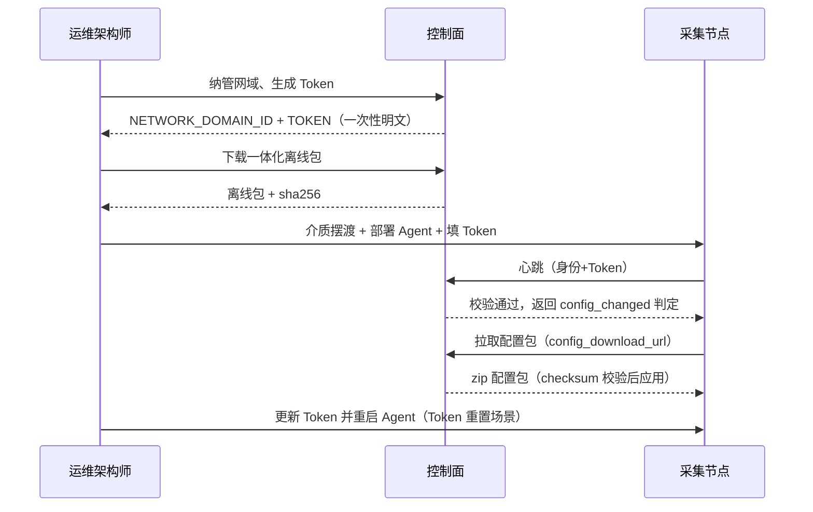
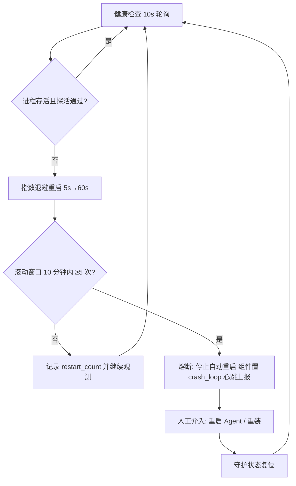
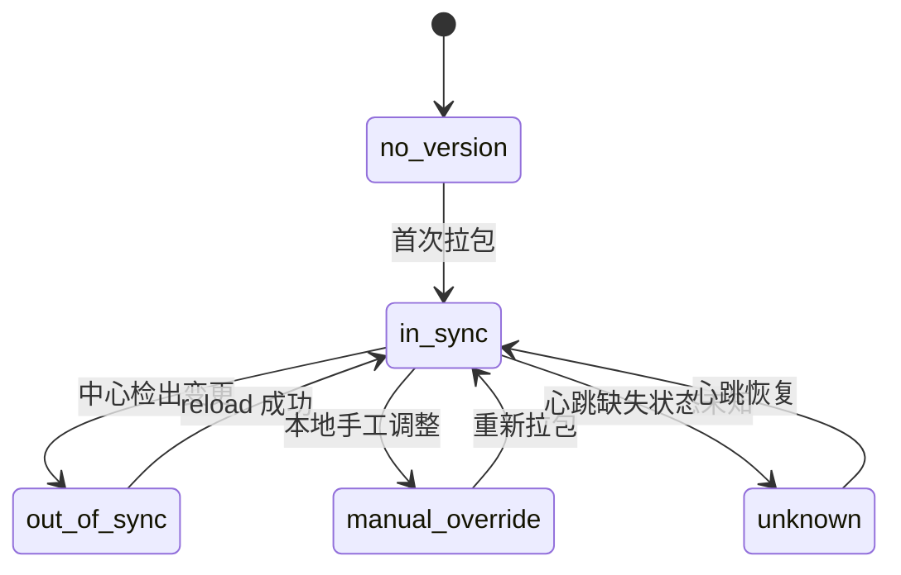
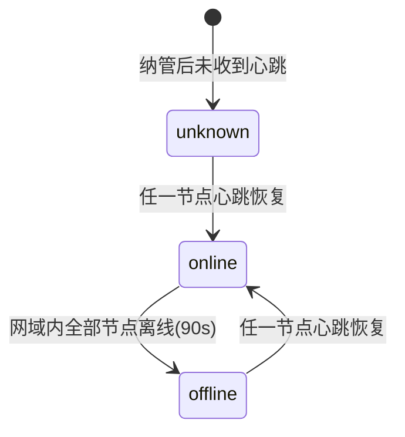
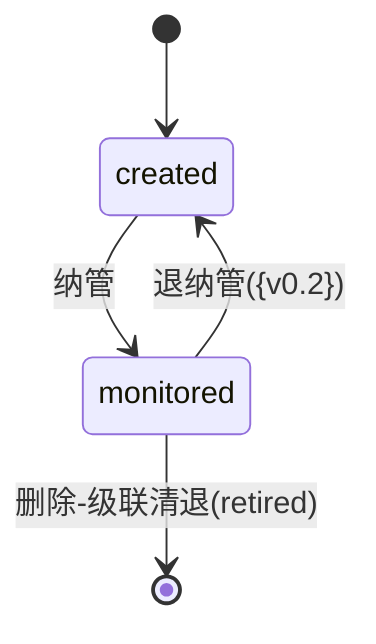
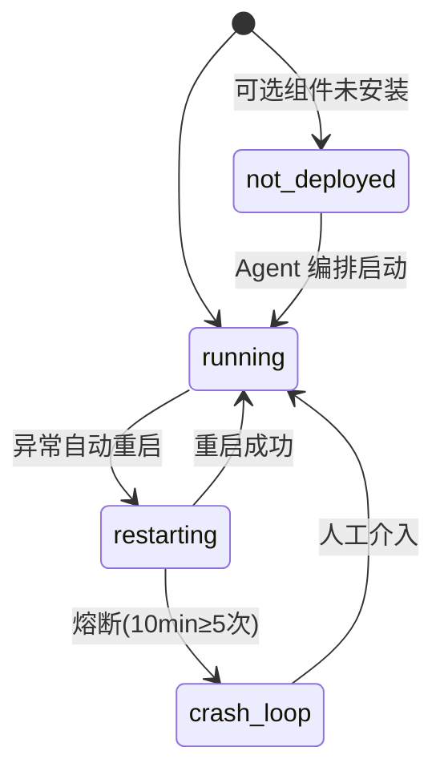

# Module_11 网域边缘接入与 Agent 交付

> **PRD 状态**：draft
>
> **PRD 版本**：v0.4
>
> **产品版本覆盖**：MVP / v0.2 / v0.3 / v1.0（MVP 子集 = default 网域与 local 通道只读展示；{v0.2} 为核心交付段；{v0.3} = 升级流程增强；v1.0 = mTLS 与证书轮转；{v0.4+} = K8s 采集、同域多节点演化占位）
>
> **原型版本**：v0.1（与 M09 共用 `docs/prototypes/module-09/`，不新建 module-11 目录；原网域纳管页 / 采集节点状态页骨架原位复用，见 [design-decisions.md 决策 87](../../05-execution-records/module-09/design-decisions.md)）
>
> **更新日期**：2026-09-20
>
> **模块类型**：核心能力模块（v0.2+）
>
> **依赖文档**：[00_Global_Architecture](../00_Global_Architecture.md)、Module_06（网域行政）、Module_09（配置生成与下发）、Module_07（监控对象）、Module_08（告警收敛）
>
> **目标用户**：运维架构师、运维工程师

---

## 0. 需求背景与典型场景

> **决策依据**：本模块由 M09 PRD v1.79 拆分边缘接入域而来，权威依据见 design-decisions.md 决策 86 及其边界表。

### 0.1 背景

MetricCenter 控制面部署在中心，而监控目标可能位于与中心网络隔离的政务网 / 隔离网段。为覆盖这类「中心够不到」的采集节点域，需在边缘侧部署采集进程（vmagent / blackbox_exporter），以「采集节点 → 中心」单向出站方式上报心跳、拉取配置、回传指标。

M09 原先同时承载「配置生成与下发」（配置面）与「网域纳管、Agent 生命周期」（接入面）两个任务域。二者用户任务、交付节奏、代码交付物差异大，经模块拆分独立为两个模块：

- **Module_09**（配置面）：配置生成、变更确认、下发与回滚；
- **Module_11**（接入面）：网域监控纳管、Edge Sync Agent 生命周期与观测、edge 协议、离线包交付与升级、进程守护。

### 0.2 典型场景

| 场景 | 用户 | 说明 |
|------|------|------|
| 纳管新网域并接入采集节点 | 运维架构师 | 登记采集节点域 → 生成 Token → 下载离线包 → 摆渡到边缘部署 Edge Sync Agent → 节点心跳上线 |
| 查看采集节点状态 | 运维工程师 | 查看节点在线状态、心跳时间、回传积压、采集器/拨测器运行情况与配置同步进度 |
| 采集进程挂掉 | 运维工程师 | vmagent / blackbox 异常时 Agent 自动 restart，重启后仍崩溃触发熔断，页面高亮提示 |
| 下载离线安装包并摆渡 | 运维工程师 | 在中心门户下载一体化离线包（含 sha256），经介质人工摆渡到隔离网域 |
| 边缘版本升级 | 运维工程师 | 中心发布新包后，节点状态页提示版本差异与升级指引 |
| Token 重置后节点失联 | 运维工程师 | 重置 Token 使旧凭据失效，节点心跳鉴权失败转离线，需到节点更新并重启 Agent |

---

## 1. 模块目标

> **决策依据**：范围边界与版本归属见 design-decisions.md 决策 86 结论第 1 / 5 条。

### 1.1 核心职责

| 职责 | 说明 |
|------|------|
| 网域监控纳管接入面 | 采集节点域的纳管、Token 管理、纳管状态机（M06 行政 / 本模块纳管 / 运行态 三态分工见 §8） |
| Edge Sync Agent 生命周期与观测 | 边缘采集节点记录、心跳上报、在线/离线判定、组件运行态观测 |
| edge 协议 | 心跳与配置检查、配置包拉取等边缘侧出站协议 |
| 进程守护与本地自治 | 采集器/拨测器进程监测、自动重启与 crash-loop 熔断 |
| 离线包交付与升级维护 | 离线安装包下载入口、sha256、版本差异展示与升级指引 |
| 安全基础 | Token 鉴权，mTLS 与证书轮转 {v1.0} |

### 1.2 边界声明

| 边界 | 说明 |
|------|------|
| K8s 采集场景 | 中心不可直达 Pod 网络、采集器须与中心分离的场景整体推迟 {v0.4+}，与同域多节点 / 混合通道 / 通道切换一并评审（补「网络可达性」驱动因素） |
| force_restart | 中心远程重启边缘进程的指令通道**不做**，维持「中心不主动入站、outbound-only」安全边界 |
| channel 字段 | 本模块纳管写入（{v0.2}），Module_09 只读消费以决定产物形态 |
| 配置生成/确认/下发 | 归 Module_09，本模块的 Agent 仅作为配置包拉取方，不参与生成与确认 |
| 部署形态 | 默认形态 = **方案 A**：中心（控制面 + 数据面 + UI）整体部署在政务云互联网区，采集节点（vmagent）部署在隔离网域 / 公有云区，全部出站接入；UI 与中心同址，走单机一体化托管（metric-center 托管前端静态文件 + 相对路径），不引入 nginx；**UI 外移（腾讯云静态机 + 反代回源）为演进备选形态**，仅当运维访问动线成为瓶颈时启用（设计论证见 `design-proposals/edge-delivery-topology-and-agent-upgrade.md` §5.7） |
| 数据库 | MVP 维持 SQLite（`metric_center.db`）；生产期按需迁移 PostgreSQL，为独立改造（`platform/db` 按 DSN 前缀分派 driver），与 UI 部署形态正交 |
| 文档过渡态 | M09 PRD 瘦身 v2.0 完成前，两模块边缘内容暂有重叠；接入域以本文档为权威 |

---

## 2. 用户故事

> **决策依据**：故事编码迁移与新增见 design-decisions.md 决策 86「用户故事迁移映射」。全文登记于全局库 `01_User_Stories.md` §4.11。

| 故事 ID | 角色 | 我希望 | 以便于 |
|---------|------|--------|--------|
| M11-ARCH-11 | 运维架构师 | 注册一个新的隔离网域并生成 Edge Agent 接入 Token | 建立网域身份 |
| M11-ARCH-12 | 运维架构师 | 查看所有网域列表及每个网域采集节点的在线状态 | 全局掌握网域 |
| M11-OPS-11 | 运维工程师 | 在列表页查看某网域采集节点的最后心跳、回传积压和配置版本 | 排查边缘状态 |
| M11-OPS-12 | 运维工程师 | 当某网域采集节点失联时触发 EdgeSiteOffline 告警 | 及时感知失联 |
| M11-OPS-13 | 运维工程师 | 重置某个网域的接入 Token | 安全轮换凭据 |
| M11-OPS-14 | 运维工程师 | 下载一体化离线安装包（含 sha256 校验和） | 在隔离网域离线部署 |
| M11-OPS-15 | 运维工程师 | 查看边缘组件版本与中心发布版本的差异并按指引升级 | 保持边缘版本可控 |
| M11-OPS-16 | 运维工程师 | 查看采集器/拨测器重启次数与 crash-loop 熔断状态 | 排查进程不稳定 |

---

## 3. 核心功能

> **用户价值**：运维能在隔离网域完成「登记网域 → 下载包 → 部署 Agent → 观测节点 → 升级维护」的完整接入闭环，并对边缘进程自动守护与可视化。

### 3.1 网域纳管

> **用户价值**：运维架构师能登记采集节点域、管理接入凭据，并获取部署 Agent 所需参数与安装指引。

| 功能项 | 说明 | 优先级 | 交付版本 |
|--------|------|--------|----------|
| 网域列表与纳管 | 已纳管网域列表、纳管状态、采集节点在线聚合态；行内主操作按状态推进「去纳管 → 查看安装指引 → 去配置采集」 | P0 | MVP |
| 网域纳管（登记制） | 从 Module_06 已有网域中选择一个完成纳管：填写监控参数、Token 自动签发；Agent IP / 主机名 / 状态等运行态信息由心跳上报补全 | P0 | {v0.2} |
| 网域编辑 | 修改监控参数（回传地址 / 描述）与发送队列参数；采集器固定 vmagent 不可改；下发通道只读展示；行政字段由 Module_06 维护 | P1 | {v0.2} |
| 删除联动级联清退 | 本页无删除入口；M06 删除已纳管网域时级联清退——废止 Token、停止配置下发、节点记录标 `retired`，与 M06 软删在同一次请求内完成，任一环节失败整体回滚 | P0 | {v0.2} |
| 默认网域 | 系统初始化自动创建 `default` 网域并默认已纳管（固定 local 通道）；资源归域校验归 Module_07，本模块不做「未指定网域资源自动归 default」的隐式归集 | P0 | MVP |
| 多网域能力开关 | 租户级开关 `multi_site_enabled`：关闭时仅预置 default 网域（MVP 默认），开启后可在 M06 创建多网域并在本页逐个纳管；开关非 UI 运行时切换器，字段可见性由数据驱动（Token / 指引 / 运行态仅 agent_pull 网域展示）；关闭后其他网域数据隐藏不删除 | P0 | MVP / {v0.2} |
| 纳管取凭据 | Token 自动签发；UI **完全脱敏**（不显示任何明文片段），完整值仅经「复制」按钮获取；展示 `NETWORK_DOMAIN_ID` / `TOKEN` 预填环境变量块 | P0 | MVP |
| 一键复制安装命令 | 静态模板、占位符形态（`<网域 ID>` / `<凭据>`），不含真实凭据；一版模板适配任意网域，页面展示一律掩码 | P1 | {v0.2} |
| 跨模块深链 | M06 网域列表对「已纳管未上线」网域提供「查看安装指引」，深链至本页并定位该网域 | P1 | {v0.2} |
| 通道与多网域能力 | `channel` 按网域固定（default = local，其他 = agent_pull），不提供切换；单网域只需一台常开机器部署一个采集节点（K8s 集群选 master、VM 选常开虚机）；同域多采集节点为 {v0.4+} 演化 | P0 | MVP / {v0.2} |
| 发送队列与 Remote Write 参数 | 发送队列参数按网域配置（见 §6.4.1），默认值开箱可用；**采集器落盘持久队列默认启用**，保障网闸断流期间积压不丢、恢复后续传；`remote_write_url` 方向为「采集节点 → 中心」，通常可自动推导 | P0 | {v0.2} |
| 地址语义与网闸约束 | `center_endpoint`（管理面心跳+拉包）/ `remote_write_url`（数据面回传）均登记在网域上、方向恒为「采集节点 → 中心」；转发场景填转发侧可达地址；网闸按「标准 HTTPS 可穿透」设计、待客户环境实测（P2） | P0 | {v0.2} |
| 退纳管动作 | 废止 Token → 停止配置下发 → 纳管状态归位 created（保留历史记录）；与 M06 禁用正交、不可互相替代 | P1 | {v0.2} |

### 3.2 采集节点状态

> **用户价值**：运维工程师能查看每个采集节点的在线情况、组件运行态与配置同步进度，并按成因获得引导。

| 功能项 | 说明 | 优先级 | 交付版本 |
|--------|------|--------|----------|
| 节点列表与组件诊断 | 节点平铺表：节点 / 网域 / 整体状态 / 采集器状态 / 拨测器状态 / 配置同步 / 回传积压 / 最后心跳；行内「查看」开组件抽屉（Agent / 采集器 / 拨测器三进程的状态、版本、配置版本、最近错误） | P0 | {v0.2} |
| 整体状态三档聚合 | 正常 / 部分异常 / 离线：Agent 离线判「离线」；必装组件异常判「部分异常」 | P0 | {v0.2} |
| 采集节点自动注册 | Edge Sync Agent 首次拉取配置时自动注册到对应网域，无需人工登记；default 域（local 通道）不产生节点实例 | P0 | {v0.2} |
| 配置同步状态与引导 | 五档状态（未下发 / 未同步 / 已同步 / 人工覆盖 / 未知）Badge + 成因分档差异化引导：未下发→「去配置采集 Job」（跳 M01 预选网域）；待确认变更→「前往配置确认」；生效中→「查看下发记录」；本地校验失败→「立即同步」；其余纯展示 | P0 | {v0.2} |
| 进程守护可观测 | 组件重启次数 / 最近重启时间上屏；crash-loop 状态标签 + 高危横幅；进程健康与配置同步解耦（进程异常不给同步引导按钮，由整体状态列承载） | P0 | {v0.2} |
| 版本差异与升级提示 | 组件上报版本 vs 中心发布包版本差异 →「可升级」提示 + 升级指引 | P1 | {v0.2} |
| 空态引导与深链 | 空态三支：筛选后为空（纯陈述）/ 尚无采集节点（引导去复制安装命令）/ 中心直连域（说明不部署采集节点）；支持 `?network_domain=<id>` 深链预筛，含退出入口 | P0 | {v0.2} |
| 筛选 | 网域、整体状态、采集器状态、拨测器状态、配置同步五维筛选 | P0 | {v0.2} |
| 边缘诊断看板 | 心跳 RTT 趋势、回传积压趋势、Remote Write 队列状态、最近错误列表、24h 断网时长统计、详细诊断仪表板（按网域 / 时间下钻） | P1/P2 | 后续版本 |

### 3.3 离线包交付与升级

> **用户价值**：运维能在中心门户下载一体化离线包，并在隔离网域无法直连中心的情况下，通过介质摆渡与人工升级完成边缘部署维护。

| 功能项 | 说明 | 优先级 | 交付版本 |
|--------|------|--------|----------|
| 下载入口 | 纳管页安装指引区并入「下载离线安装包」区块：包清单（edge-sync-agent + vmagent + blackbox_exporter 版本）、sha256、包大小、下载按钮；页面明示「隔离网域不可直连，请介质摆渡」 | P0 | {v0.2} |
| 版本清单来源 | {v0.2} 版本清单来自构建产物元数据，不建 DB 模型；`EdgePackageRelease` 模型 {v0.3} 再评估 | P0 | {v0.2} |
| 升级维护 | 节点状态页展示版本差异 →「可升级」提示 + 指引（下载新包 → 覆盖安装保留 Token/配置 → `systemctl restart edge-sync-agent`） | P1 | {v0.2} |
| 完整升级流程 | 升级窗口提示、升级期采集暂停说明；{v0.3} 起在规模门槛内由 Agent 拉模式自升级承载（见下） | P2 | {v0.3} |
| Agent 自升级 | {v0.3} 引入拉模式自升级（默认关闭）：心跳带版本 → 中心返回最新版本与签名包下载地址 → 验签 → 原子替换 → systemd 重启，启动失败回滚上一版本；按网域灰度，升级结果与错误进心跳上报。**规模门槛**：采集节点数 ≥ 10 或年升级次数 ≥ 3 时启用，低于门槛维持人工引导升级（升级链路见 §4.4） | P1 | {v0.3} |
| 交付形态 | 离线二进制包 + systemd 一体化包（含 Agent + 采集器 + 拨测器，一次安装完成全部组件）；**不提供** `curl\|bash` 一键脚本（政务网 / 金融专网普遍禁用）；所有交付物提供校验和与签名验证说明；Docker/Compose P1、RPM/DEB/Helm P2 | P1 | {v0.2} |

### 3.4 进程守护与本地自治

> **用户价值**：边缘 vmagent / blackbox 异常时由 Agent 自动重启恢复；持续崩溃时熔断防抖动，并让状态在中心可见。

| 功能项 | 说明 | 优先级 | 交付版本 |
|--------|------|--------|----------|
| 健康检查 | 进程存活 + HTTP 端点探活双判定（vmagent/blackbox `/-/healthy`），默认 10s 间隔；进程存活但探活失败视为异常 | P0 | {v0.2} |
| 自动重启 | Agent 守护子进程，异常时指数退避重启（5s→60s 上限） | P0 | {v0.2} |
| 熔断 | 滚动窗口 10 分钟内重启 ≥5 次 → 停止自动重启、组件置 `crash_loop` 终态、记 last_error 并心跳上报 | P0 | {v0.2} |
| 熔断恢复 | 人工介入（重启 Agent / 重装）后守护自动恢复 | P0 | {v0.2} |
| 人工兜底 | 平台只保证 UI 下发并成功 reload 的配置与期望态一致；紧急情况允许直接改本地配置，平台**不自动强制 reconcile**，同步状态显示 `out_of_sync` / `manual_override`（「人工覆盖」），需在 UI 重新确认下发恢复一致性；设计目的为平台自身故障时的最后自救手段 | P0 | MVP |

### 3.5 安全与证书

> **用户价值**：接入凭据最小暴露，链路可在后续版本升级为双向认证。

| 功能项 | 说明 | 优先级 | 交付版本 |
|--------|------|--------|----------|
| Token 鉴权 | 身份 = `NETWORK_DOMAIN_ID` + `TOKEN`；Token 脱敏存储、一次性明文规则 | P0 | MVP |
| mTLS | 双向证书认证 | P2 | v1.0 |
| 证书轮转 | 认证证书自动/半自动轮转 | P2 | v1.0 |
| Token 轮换 | 轮换机制（含边缘侧 401 行为，见 §6.2） | P1 | v1.0 |

---

## 4. 核心流程

> **决策依据**：接入动线与心跳 / 拉包循环迁移自 M09 v1.79 拆分前版本；进程守护与升级为决策 86 新增流程。

### 4.1 网域接入动线



### 4.2 心跳与拉包循环

Agent 以 30s 周期执行：发送心跳（带身份与组件状态）→ 中心校验身份并返回 `config_changed` 判定 → 若变更则按 `config_download_url` 拉取配置包 → 校验 checksum → 原子替换本地配置 → 按需 reload 采集器。local 通道不走本协议。离线判定：连续 3 个心跳周期（默认 90s）无心跳 → 节点 offline；网域内全部节点离线 → 网域 offline 并触发 EdgeSiteOffline。

### 4.3 进程守护流程



### 4.4 升级流程（{v0.3}）

**默认人工引导（低于规模门槛）**：运维下载新版本离线包 → 覆盖安装保留 Token / 配置 → 重启 `edge-sync-agent` → Agent 恢复守护并心跳上报新版本。中心侧可在节点状态页核对版本与守护状态。升级期该节点采集短暂中断，需在运维窗口内执行。

**拉模式自升级（{v0.3}，默认关闭，规模门槛内启用）**：Agent 心跳上报当前版本 → 中心比对发布包版本并返回最新版本与签名包下载地址 → Agent 验签 → 原子替换本地二进制 → systemd 重启 → 心跳上报升级结果；启动失败自动回滚上一版本。按网域灰度推进。

---

## 5. 数据模型

> **决策依据**：数据模型迁移自 M09 v1.79 拆分前版本并按决策 86 补齐字段（hostname / ip / restart_count / last_restart_at）与时间基准口径。

### 5.1 NetworkDomain（监控纳管字段）

所有者声明：本模块维护 `channel` / `token` / `agent_type` / `center_endpoint` / `remote_write_url` 及运行态字段；行政字段（名称、分区、授权租户等）以 Module_06 为 SSOT；Module_09 只读 `channel` 决定产物形态。三家共管口径见 §7.1 模块边界。

| 字段 | 类型 | 必填 | UI 展示名 | 说明 |
|------|------|------|-----------|------|
| network_domain_id | string | 是 | 网域 ID | 身份主键；ID 规则由 Module_06 统一定义，本模块只读引用 |
| channel | enum | 是 | 下发通道 | 按网域固定：default = `local`，其他 = `agent_pull`；不提供切换（混合通道 / 切换为 {v0.4+}）；M11 写入、M09 只读 |
| agent_type | enum | 条件 | 采集器类型 | agent_pull 时必填；固定 `vmagent`（唯一采集器，纳管时无需选择；网闸断流保障依赖其磁盘持久队列，故不开放其他选型）；local 时为空 |
| center_endpoint | string | 条件 | 中心接入地址 | agent_pull 时必填；管理面地址（心跳 + 配置包下载），方向为采集节点→中心；转发场景填转发侧可达地址；用于合成配置包绝对下载地址 |
| remote_write_url | string | 条件 | 回传地址 | agent_pull 时必填；数据面地址（指标回传），通常 = 中心接入地址 + `/api/v1/write` 可自动推导，数据面走不同代理时手动填写 |
| token | string | 条件 | 认证 Token | agent_pull 时必填，脱敏存储；local 时为空且不展示 |
| status | enum | 条件 | 状态 | agent_pull 时必填（系统生成）：online / offline / unknown，由心跳更新；local 时为空 |
| last_heartbeat / agent_version | datetime / string | 否 | 最后心跳 / Agent 版本 | agent_pull 时由心跳更新；local 时为空 |
| registration_status | enum | 是 | 纳管状态 | 见 §8.3 |

**default 网域处理**：系统初始化自动创建 `id=default`、`channel=local` 的默认网域并默认已纳管；`name` / `description` 允许修改以匹配云区域命名，禁止删除；不做「未指定网域资源自动归 default」的隐式归集（资源 `network_domain_id` 必填校验归 Module_07）；default 域不产生 EdgeAgent 实例。

### 5.2 EdgeAgent

| 字段 | 类型 | 必填 | UI 展示名 | 说明 |
|------|------|------|-----------|------|
| network_domain_id | string | 是 | 网域 | 归属网域 ID |
| agent_type | enum | 是 | 采集器类型 | 固定 `vmagent`，取网域登记值 |
| version | string | 是 | Agent 版本 | Agent 自身版本 |
| hostname | string | 是 | 部署主机名 | 由心跳上报，无需手工登记 |
| ip | string | 有条件 | 出站 IP | Agent 上报，中心以连接对端 IP 兜底校验 |
| status | enum | 是 | 状态 | online / offline / unknown（运行态，由心跳更新）；整体状态三档聚合见 §3.2 |
| last_heartbeat | datetime | 是 | 最后心跳 | 以中心接收时间为准 |
| heartbeat_rtt_ms | int | 是 | 心跳延迟 | 心跳往返延迟（毫秒） |
| last_config_pull | datetime | 否 | 最后拉取配置 | 以中心接收时间为准 |
| config_version | string | 否 | 配置版本 | 当前生效配置版本 |
| config_sync_status | enum | 是 | 配置同步 | `in_sync` / `out_of_sync` / `unknown` / `manual_override` / `no_version`，见 §8.1 |
| out_of_sync_cause | enum | 否 | 未同步成因 | 仅 out_of_sync 时有值：`pending_draft`（中心存在待确认变更，只读消费 M09 ConfigDraft）/ `pull_pending`（拉包 / 生效延迟）/ `local_reset`（本地校验失败保留旧配置等）；决定「立即同步」是否展示 |
| queue_backlog_bytes | int | 是 | 回传积压 | 磁盘持久发送队列积压字节数（vmagent `vm_persistentqueue_bytes_pending`） |
| components | json | 是 | 组件清单 | 采集器 / 拨测器 / Agent 自身；单组件含 type / name / status / version / config_version / last_error；守护扩展 `restart_count` / `last_restart_at`，status 含 `restarting` / `crash_loop` |
| last_error | string | 否 | 最近错误 | 最近错误信息 |

**模型语义**：一个 `EdgeAgent` 实例 = 一个边缘节点上的完整部署单元（Agent 必装 + 采集器必装 + 拨测器可选）；default 域固定 local 通道、不产生本表实例；心跳由 Agent 上报并更新本表运行态字段。

### 5.3 EdgeHeartbeat

| 字段 | 类型 | 必填 | UI 展示名 | 说明 |
|------|------|------|-----------|------|
| network_domain_id | string | 是 | 网域 ID | 身份 |
| agent_type | enum | 是 | 采集器类型 | 同网域登记值 |
| version | string | 是 | Agent 版本 | Agent 自身版本，升级差异对照来源 |
| config_version | string | 否 | 配置版本 | 当前生效配置版本，中心据此判定 config_changed |
| queue_backlog_bytes | int | 是 | 回传积压字节 | 磁盘持久发送队列积压字节数（vmagent `vm_persistentqueue_bytes_pending`） |
| remote_write_queue_size | int | 是 | 发送队列长度 | Remote Write 发送队列长度 |
| remote_write_last_error | string | 否 | 最近回传错误 | 最近 Remote Write 错误 |
| hostname / ip | string | 是 | 主机名 / 出站 IP | Agent 尽力上报；中心以连接对端 IP 兜底校验 |
| components | json | 是 | 组件状态 | 每组件含 type / name / status / version / config_version / last_error；守护扩展 restart_count / last_restart_at |
| timestamp | datetime | 是 | 上报时间 | 仅作参考；中心以接收时间写 last_heartbeat |

### 5.4 离线包版本（{v0.3} 占位）

{v0.2} 不建包版本模型，版本清单来自构建产物元数据；`EdgePackageRelease` 模型（版本、sha256、构建时间、组件清单）在 {v0.3} 引入。

---

## 6. 接口设计

> **决策依据**：edge 协议迁移自 M09 v1.79 拆分前版本（决策 86 拆分边界）并补全守护细则与协议缺口；管理面 API 含新增下载接口。

### 6.1 接口可达性与地址约束

- 边缘侧走向全部为**上行**（采集节点 → 中心），中心不主动入站。
- 身份 = `NETWORK_DOMAIN_ID` + `TOKEN`，缺任一项返回鉴权失败。
- `center_endpoint` 为绝对地址；local 通道不走本协议。
- 中继场景（仅网闸实测不穿透时引入）：管理面必须**应用层反向代理**、数据面必须**存储转发**（带持久化队列），**禁用 L4/TCP 纯端口转发**。

### 6.2 心跳与配置检查接口

```http
POST /api/v2/platform/edge/heartbeat
Authorization: Bearer <NetworkDomain.token>
Content-Type: application/json
```

请求示例（含守护扩展字段 hostname / ip / restart_count / last_restart_at）：

```json
{
  "network_domain_id": "gov-cloud-a",
  "agent_type": "vmagent",
  "version": "v1.2.0",
  "config_version": "20260724-120000",
  "queue_backlog_bytes": 1048576,
  "remote_write_queue_size": 120,
  "hostname": "edge01",
  "ip": "10.0.2.15",
  "components": [
    {
      "type": "collector",
      "name": "vmagent",
      "status": "restarting",
      "version": "v1.101.0",
      "config_version": "20260724-120000",
      "restart_count": 3,
      "last_restart_at": "2026-09-17T08:12:03Z"
    },
    {
      "type": "blackbox_exporter",
      "name": "blackbox-exporter",
      "status": "running",
      "version": "v0.25.0",
      "config_version": "20260724-120000"
    }
  ]
}
```

响应示例：

```json
{
  "config_changed": true,
  "config_version": "20260724-121500",
  "config_download_url": "https://10.8.0.5:8443/api/v2/platform/edge/config?network_domain=gov-cloud-a"
}
```

- **`config_download_url` 合成规则**：绝对地址 = 该网域 `center_endpoint` + 固定相对路径 `/api/v2/platform/edge/config?network_domain=<id>`；禁止返回相对路径由 Agent 自行拼接——网闸场景下 Agent 无法推导中心映射地址。
- **组件 version 上报**：组件级 `version` 为「版本差异与升级提示」功能的数据来源（对照中心发布包版本）。
- 离线判定阈值：连续 3 个心跳周期（默认 90s）无心跳 → 节点 offline；网域内全部节点离线 → 网域 offline，触发 EdgeSiteOffline 告警（规则归 M08）。
- Token 失效边缘行为：Agent 收到 401 → 指数退避重试（5s→60s 上限）→ 持续 401 超 10 分钟 → 降为低频探测（5 分钟一次）并写本地 syslog；中心 reset-token UI 事前警示「重置后该网域节点将失联，需到节点更新 TOKEN 并重启 Agent」。

### 6.3 配置包拉取接口

```http
GET /api/v2/platform/edge/config?network_domain=gov-cloud-a
Authorization: Bearer <NetworkDomain.token>
```

响应为 zip 附件（`Content-Type: application/zip`，`Content-Disposition: attachment; filename="edge-config-<network_domain_id>.zip"`）。配置包由 Module_09 的 ConfigVersion 产物生成，本接口为 Module_11 Agent 的拉取协议：

```
edge-config-<network_domain_id>.zip
├── prometheus.yml    # 本域 scrape_configs（job 骨架 + external_labels.network_domain；file_sd 引用 targets/）
├── targets/          # file_sd 目标文件（按 job 分文件，固定文件名覆盖写）
├── blackbox.yml      # 本域 Blackbox 探测模块（可选）
├── rules.yml         # 本域 edge/both 告警规则（{v0.4+}）
└── metadata.json     # config_version、生成时间、agent_type、联合 checksum（sha256 校验）
```

- `channel=local` 网域为本地文件集（不打包、无 metadata.json），由 M09 确认后直接写中心 Prometheus 配置目录并 reload，不走本接口。
- `alertmanager.yml` 不进入 agent_pull 配置包（中心告警配置归 M08 / M09 管理域）。

### 6.4 Edge Sync Agent 本地行为

Agent 是部署在边缘监控代理节点的独立客户端程序，与中心通过 outbound HTTPS 443 + 每网域 Token 通信（心跳 / 配置拉取 / remote_write 全部由边缘主动出站，中心无入站端口）。核心行为：

1. 启动时从环境变量或配置文件读取 `NETWORK_DOMAIN_ID` 和 `TOKEN`；每 30s 发送心跳，上报配置版本、回传积压与组件状态。
2. 响应 `config_changed=true` 时拉取最新配置包；校验 checksum（metadata.json 携带），失败则记录错误并保留最后一份有效配置，不进入解压步骤。
3. 解压后对 `targets/*.json` 做解析校验（JSON 结构、targets / labels 合法性），失败则回滚并保留旧 targets 文件。
4. 仅当 `prometheus.yml` 结构变化时调用采集器 `/-/reload`；targets 文件更新不触发 reload，由 file_sd 自动感知。
5. 配置包含 `blackbox.yml` 时触发 blackbox exporter 重载（SIGHUP 或对应 API）。
6. 网络中断时保留最后一份有效配置，按原配置继续采集；指标积压于磁盘持久发送队列（vmagent），网络恢复后心跳上报 config_version，中心响应 config_changed 拉取最新已审批版本，队列自动续传。
7. 配置包含 `rules.yml` 时启动本地 vmalert 实例承载网域内自治告警（{v0.4+}）。
8. 职责边界：只管理**本节点**组件生命周期——不做下游节点 exporter 安装（归 Module_01）、不做指标抓取（采集器职责）、不做告警求值（中心统一求值至 {v0.3}）。
9. 组件构成：Edge Sync Agent（必装，与中心通信）+ 采集器（vmagent，唯一采集器）+ blackbox exporter（网域存在 blackbox Job 时随包附带）；启动顺序 blackbox → 采集器，由 Agent 内编排。

#### 6.4.1 发送队列与 remote_write 参数默认值

参数在网域纳管 / 编辑表单中按网域配置，未配置时使用平台默认值。采集器统一为 vmagent，缓冲模型为 scrape →（磁盘持久队列）→ remote_write，无 Prometheus 式 WAL：

| 参数 | 默认值 | 说明 |
|------|--------|------|
| queue.disk_usage_max | 20GB | 磁盘持久发送队列最大占用（映射 vmagent `-remoteWrite.maxDiskUsagePerURL`） |
| queue.disk_path | 采集器数据目录 | 持久队列落盘目录（映射 vmagent `-remoteWrite.tmpDataPath`，**默认启用**；不配置则退化为内存缓冲、进程退出即丢，不作为交付形态） |
| queue.backfill_window | 1h | 只回传最近 1 小时数据，避免历史风暴 |
| queue.max_samples_per_send | 2000 | 每批次发送样本数 |
| queue.max_shards | 50 | 并发发送分片数 |
| queue.retry_on_rate_limit | true | 触发限流时自动退避重试 |
| queue.drop_on_overload | false | 队列满时禁止静默丢样本（默认保持背压；置 true 则满时丢弃新样本） |
| remote_write.compression | snappy | 传输压缩算法 |

#### 6.4.2 进程守护工程化细则

| 参数 | 默认值 | 说明 |
|------|--------|------|
| 心跳周期 | 30s | Agent → 中心 |
| 健康检查间隔 | 10s | 进程存活 + 探活双判定 |
| 重启退避 | 5s→60s | 指数退避（5/10/20/40/60s） |
| 熔断窗口 / 阈值 | 10 分钟 / 5 次 | 触发 crash_loop |
| 离线判定 | 3 周期 / 90s | 无心跳判离线 |

细则：

- **健康检查双判定**：进程存活 + HTTP 端点探活（vmagent / blackbox 均 `/-/healthy`），默认 10s 间隔；进程存活但探活失败视为异常。
- **熔断**：滚动窗口 10 分钟内重启 ≥5 次 → 停止自动重启、组件置 `crash_loop`、记 `last_error`、心跳上报。
- **熔断恢复**：人工介入（重启 Agent / 重装）后守护自动恢复。
- **systemd 部署**：单 service `edge-sync-agent.service` 父进程模式，Agent 守护子进程，Agent 自身 `Restart=always` 兜底；blackbox ICMP 拨测需 `AmbientCapabilities=CAP_NET_RAW`。

### 6.5 管理面 REST API

| 方法 | 路径 | 说明 | 版本 |
|------|------|------|------|
| POST | /api/v2/platform/network-domains/:id/monitor | 网域纳管 | MVP |
| POST | /api/v2/platform/network-domains/:id/reset-token | 重置 Token | {v0.2} |
| DELETE | /api/v2/platform/network-domains/:id/monitor | 退纳管 | {v0.2} |
| GET | /api/v2/platform/edge-agents | 采集节点状态列表 | MVP / {v0.2} |
| GET | /api/v2/platform/edge-agents/:id | 节点详情 | MVP / {v0.2} |
| GET | /api/v2/platform/edge-packages | 离线包清单（组件/版本/sha256/大小） | {v0.2} |
| GET | /api/v2/platform/edge-packages/latest/download | 下载最新离线包（需认证） | {v0.2} |

响应统一用 `platform/api/response` 格式，错误类型复用规范 errorType（NOT_FOUND / VALIDATION / UNAUTHORIZED 等）。

---

## 7. 依赖

> **决策依据**：模块边界与耦合点见决策 86「耦合点处理」。

### 7.1 模块边界

| 模块 | 依赖方向 | 说明 |
|------|----------|------|
| Module_06 | M11 消费 | 网域行政 SSOT：创建/编辑/禁用/删除；删除级联清退由 M06 发起、M11 同请求完成 |
| Module_09 | M11 消费 / M09 消费 | M09 只读 `channel`；M09 产出 ConfigVersion/zip 配置包供 M11 拉取；`out_of_sync_cause=pending_draft` 只读 M09 ConfigDraft 状态；配置变更确认/下发/回滚归 M09 |
| Module_07 | M11 消费 | 资源 `network_domain_id` 必填校验 |
| Module_01 | M11 消费 | blackbox Job 存在性决定 blackbox_exporter 是否安装；目标主机 exporter 安装归 M01 |
| Module_08 | M08 消费 | EdgeSiteOffline 告警规则定义与收敛归 M08；触发数据（网域 / 节点离线状态）由本模块提供 |

### 7.2 技术依赖

- `platform/edge-sync-agent/` 为独立 Go module，最小依赖以便交叉编译，不强依赖 Gin / GORM（中心侧 API 在 `platform/cmd/metric-center/`）。交付包结构与 systemd 单元见 `docs/05-execution-records/module-09/deploy-package-and-edge-agent-code-organization.md`。
- **中心侧 remote_write 接收端（{v0.2} 阻断级前置）**：中心 Prometheus 需开启 `--web.enable-remote-write-receiver` 并在 `platform/` 提供指标写入通路，否则边缘 vmagent 的 `remote_write_url` 无处可写（设计提案 §7-G1）。
- **数据库**：MVP 维持 SQLite（`metric_center.db`）；生产期按需迁移 PostgreSQL，`platform/db` 按 `METRIC_CENTER_DB_DSN` 前缀分派 driver（引入 `gorm.io/driver/postgres`），模型与迁移零改动，与 UI 部署形态正交。

---

## 8. 数据模型状态机

> **决策依据**：配置同步 / 运行态 / 纳管状态迁移自 M09 v1.79 拆分前版本；组件守护状态为决策 86 新增。

### 8.1 配置同步 config_sync_status



| 状态 | 含义 | 进入条件 | 本状态 | 退出条件 |
|------|------|----------|--------|----------|
| no_version | 未下发配置 | 首次纳管，无配置版本 | 待首次拉包 | 拉到配置 → in_sync |
| out_of_sync | 未同步 | 中心检出变更 / 拉包待处理 | 附 `out_of_sync_cause` 三成因（pending_draft / pull_pending / local_reset），决定差异化引导 | reload 成功 → in_sync |
| in_sync | 已同步 | 本地版本与中心一致 | 稳态 | 检出变更 → out_of_sync；本地手工调整 → manual_override |
| manual_override | 人工覆盖 | 本地手工调整配置 | 运维介入态 | 重新拉包 → in_sync |
| unknown | 未知 | 心跳缺失、状态不可知 | 无引导按钮 | 心跳恢复 → 按实际版本判定 |

### 8.2 网域运行态 NetworkDomain.status

未纳管网域不进入本状态机；纳管后未收到心跳前为 unknown。



| 状态 | 含义 | 进入条件 | 本状态 | 退出条件 |
|------|------|----------|--------|----------|
| online | 在线 | 网域内任一采集节点在线 | 正常 | 网域内全部节点连续 90s 无心跳 → offline |
| offline | 离线 | 网域内全部节点离线 | 触发 EdgeSiteOffline | 任一节点心跳恢复 → online |
| unknown | 未知 | 纳管后未收到心跳 / 状态不可知 | 待首次心跳 | 收到心跳 → online |

### 8.3 纳管状态 registration_status



| 状态 | 含义 | 进入条件 | 本状态 | 退出条件 |
|------|------|----------|--------|----------|
| created | 未纳管 | 网域创建（M06） | 未建立监控接入身份 | 纳管动作 → monitored |
| monitored | 已纳管 | 完成纳管（生成 Token、登记采集参数） | 心跳 / 拉包生效中 | 退纳管（{v0.2}）→ created；网域删除级联清退 → retired 终态（供审计） |

### 8.4 组件守护状态（组件级）



| 状态 | 含义 | 进入条件 | 本状态 | 退出条件 |
|------|------|----------|--------|----------|
| running | 正常运行 | 启动成功 / 重启成功 | 稳态 | 健康检查异常 → restarting |
| restarting | 自动重启中 | 健康检查异常，指数退避重启 | 短暂过渡态，restart_count 递增 | 重启成功 → running；熔断 → crash_loop |
| crash_loop | 熔断 | 滚动窗口 10 分钟内重启 ≥5 次 | 停止自动重启，需人工介入 | 人工介入（重启 Agent / 重装）→ running |
| not_deployed | 未部署 | 可选组件（blackbox）未安装 | 不参与守护与心跳上报 | Agent 编排启动 → running |

---

## 9. 验收标准

> **决策依据**：验收条目迁移自 M09 v1.79 拆分前版本的边缘部分，并按决策 86 新增进程守护 / 下载 / 升级项。

### 9.1 用户验收

| 验收项 | 优先级 | 交付版本 |
|--------|--------|----------|
| 网域纳管后 Token 自动签发，UI 完全脱敏、完整值仅复制可取 | P0 | MVP |
| 节点状态页展示在线状态、最后心跳、回传积压、配置同步与成因分档引导 | P0 | {v0.2} |
| 离线包下载入口提供包清单 / sha256 / 大小 / 下载按钮 | P0 | {v0.2} |
| 组件重启次数与最近重启时间上屏 | P0 | {v0.2} |
| 采集器 crash-loop 时节点页高亮 + 高危横幅 | P0 | {v0.2} |
| Token 重置前弹出「节点将失联，需到节点更新并重启」警示 | P0 | {v0.2} |
| 退纳管后 Token 失效、节点转离线、网域可重新纳管 | P1 | {v0.2} |
| 版本差异提示与升级指引 | P1 | {v0.2} |

### 9.2 技术验收

| 验收项 | 优先级 | 交付版本 |
|--------|--------|----------|
| kill 采集器后 10s 内检测重启且 restart_count +1 | P0 | {v0.2} |
| 模拟 crash-loop，10 分钟 5 次后熔断停止自动重启 | P0 | {v0.2} |
| 停心跳 90s 判离线并触发 EdgeSiteOffline | P0 | {v0.2} |
| Token 401 走指数退避并最终降为低频探测 | P0 | {v0.2} |
| 时间基准：last_heartbeat 以中心接收时间为准 | P0 | {v0.2} |
| 中心侧 remote_write 接收通路可用：边缘回传指标可落库，节点状态页积压归零 | P0 | {v0.2} |
| 模拟网络断流后 vmagent 磁盘持久队列积压指标，恢复后自动续传、不丢样本 | P0 | {v0.2} |
| 规模门槛内 Agent 拉模式自升级：验签失败拒绝安装、启动失败回滚上一版本、升级结果进心跳 | P1 | {v0.3} |
| local 通道网域在本模块只读展示，不走 edge 协议 | P0 | MVP |

---

## 10. 术语映射

| 术语 | 定义 | 归属 |
|------|------|------|
| 网域 / NetworkDomain | 网络可达性区域；中心直连域 / 采集节点域 | M06 + M11 |
| 纳管 | 建立监控接入身份（生成 Token、登记采集类型与地址） | M11 |
| 采集节点 | 部署了 Edge Sync Agent 的边缘主机（数据模型支持同域 1:N；多节点部署形态 {v0.4+}） | M11 |
| Edge Sync Agent | 边缘守护进程，负责心跳 / 拉包 / 进程守护 | M11 |
| 采集器 | vmagent（承载抓取与 remote_write） | M11 |
| 拨测器 | blackbox_exporter（承载拨测） | M11 |
| 回传积压 | 采集器磁盘持久发送队列中未回传中心的指标缓冲量（vmagent，无 Prometheus 式 WAL） | M11 |
| 配置同步 | 边缘配置版本与中心一致程度（no_version/out_of_sync/in_sync/manual_override） | M11 |
| 人工覆盖 / manual_override | 本地手工配置导致同步档 | M11 |
| 离线包 | 一体化离线交付包（Agent + 采集器 + 拨测器 + systemd 单元） | M11 |
| 退纳管 | 停止监控、废止凭据但保留网域 | M11 |
| 变更确认 / 下发 / 回滚 | 配置面动作，归 Module_09 | M09 |

---

## 11. 前端交互契约

> **决策依据**：两页随数据所有权由 M09 迁入本模块（决策 86 页面归属），新增能力落两页内，Web 菜单结构不变。

### 11.1 页面状态矩阵

| 页面 | 状态 | 关键交互 |
|------|------|----------|
| 网域纳管页 | 未纳管 / 已纳管 | 纳管获取凭据；已纳管给安装指引与下载入口 |
| 采集节点状态页 | 在线 / 离线 / 同步进行中 | 组件抽屉诊断；立即同步操作；版本升级提示 |

### 11.2 全局行为规则

- 组件 `crash_loop` / `restarting` 触发行级高亮与抽屉高危横幅（进程异常醒目提示口径）。
- Token 重置、退纳管等破坏性动作二次确认并展示影响。
- 时钟字段一律展示中心接收时间，避免边缘时钟偏差误导。

### 11.3 网域纳管页

**用户任务**：运维架构师在此完成隔离网域的登记纳管、获取接入凭据、下载离线安装包并查看安装指引。

**页面结构**：单一网域列表页；列表为 5 列口径（名称 + 网域 ID + 接入方式 Tag + 纳管状态 + 采集节点运行态聚合），行内主操作按状态推进「去纳管 → 查看安装指引 → 去配置采集」。

**纳管取凭据**：点击纳管弹出右侧抽屉，提交后一次性明文展示网域 ID 与 Token，随后脱敏。

**安装指引区（含下载入口）**：以步骤式引导展示部署动线，并并入下载区块——包清单表格（组件 / 版本 / sha256 / 大小）+ 下载按钮 + 摆渡提示文案「隔离网域不可直连，请介质摆渡」。

**数据来源**：网域行政数据由 Module_06 提供；接入参数与包清单由本模块接口提供。

### 11.4 采集节点状态页

**用户任务**：运维工程师在此查看各采集节点的在线情况、组件运行态与配置同步进度，并处理异常与升级。

**页面结构**：节点平铺表（在线状态、最后心跳、回传积压、配置版本），行内展开组件抽屉。

**组件抽屉**：展示采集器 / 拨测器运行态 + 重启次数 / 最近重启列；`crash_loop` / `restarting` 打状态标签并叠加高危横幅；提供「可升级」提示与升级指引。

**配置同步**：四档状态 Badge + 成因分档提示（含未确认下发引导），配合跨页深链预筛网域。

**数据来源**：节点状态、心跳、组件守护与版本差异均由本模块接口提供；`pending_draft` 成因广播自 Module_09。

---

## Change Log

| 版本 | 日期 | 变更类型 | 变更内容 | 影响范围 | 产品版本影响 | 状态 |
|------|------|----------|----------|----------|--------------|------|
| v0.4 | 2026-09-20 | 修订 | 第五轮拍板回填：Agent 自升级由「不做」改为 {v0.3} 拉模式自升级（默认关闭 + 规模门槛 + 验签 / 原子回滚 / 按网域灰度）；§4.4 升级流程补自升级链路；§6.1 补中继选型一句话约束（应用层反代 + 存储转发、禁 L4/TCP） | §3.3 / §4.4 / §6.1 | {v0.3} | 设计中 |
| v0.3 | 2026-09-20 | 修订 | 四轮讨论结论回填：部署形态方案 A 入 §1.2（中心 + UI 同址 G2、A2 形态、UI 外移降级为演进备选）；MVP 不引入 PostgreSQL；采集器强制 vmagent 单一化；契约字段 `wal_backlog_bytes` → `queue_backlog_bytes`；发送队列落盘持久参数；中心 remote_write 接收端（{v0.2} 前置）；§9 验收补接收通路与断流续传 | §1.2 / §3.1 / §5 / §6.4 / §7.2 / §9 / §10 / §11.4 | MVP 不变；{v0.2} 微调 | 设计中 |
| v0.2 | 2026-09-17 | 修订 | 语义保真回填：Token 完全脱敏口径、agent_type 枚举（prometheus-agent）、人工兜底不自动 reconcile、unknown 运行态；补默认网域处理、多网域能力开关、删除级联清退、网域编辑、三档聚合、成因三档引导、心跳 RTT / RW 队列字段、诊断看板占位 | §3 / §5 / §8 / §9 | 不变 | 设计中 |