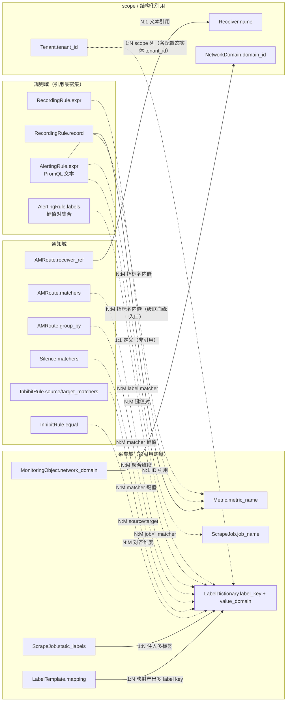

# 监控配置数据治理：实体模型与标准实践

> 文档类型：数据治理标准实践 / 跨模块实体模型（讨论基线版）
> 讨论日期：2026-09-17（v2 同日修订：补全指标↔告警规则血缘语义；新增治理 scope / 变更交付 / 静默抑制共 6 个实体）
> 参与者：chenrt（产品 + 架构师）、AI 架构讨论助手
> 适用读者：产品经理、技术经理、SRE 工程师（v0.2 数据治理评审讨论用）
> 关联模块：M01（规则）/ M04（CMDB 同步）/ M06（租户）/ M07（对象与标签模板）/ M08（路由与通知）/ M09（配置下发与变更单）
> 目的：为「规则 × 指标 × Job × Label × AM 路由」建立统一的概念模型、术语表与治理标准，作为 v0.2 数据治理立项的讨论基线

---

## 1. 为什么需要这份文档

### 1.1 问题陈述

MetricCenter 的两类核心配置——**采集侧**（prometheus.yml / ScrapeJob）与**告警侧**（rules.yml / alertmanager.yml）——在 Prometheus 原生体系中**没有任何数据库级关联**，全部靠 YAML 文本里的字符串约定（job 名、指标名、label 键值、receiver 名）互相"对暗号"。

这带来两类治理风险：

1. **静默失败**：语法全部合法、promtool / amtool 全部通过，但规则匹配不到任何序列、或告警发出后无人接收——没有任何报错，监控在"裸奔"。
2. **配置腐化**：资源下线、Job 禁用、标签改名后，下游规则与路由无人感知，留下一堆孤儿配置。

### 1.2 核心论点

> **这些实体之间不存在外键，引用完整性必须由平台的校验层补齐。**

业界（Monitoring-as-Code、Google SRE MRR、kube-prometheus Mixin、GitOps）的标准做法是：YAML 是构建产物而非手写物，管线中必须包含**语法 → 语义 → 关系**三层校验，其中"关系校验"（引用可达性）是开源 Prometheus 缺失、商业平台（Datadog / PagerDuty）核心溢价的部分，也是本产品在 AI 时代（BYO-AI 模式：用户外部 AI 生成 YAML、平台负责契约与校验）的差异化价值所在。

---

## 2. 治理对象：实体清单与归属

按**配置态**（平台元数据，SQLite 落库）与**运行态**（Prometheus TSDB / 运行时产生）分界，共 18 个实体、5 个域：

| # | 实体 | 通俗名 | 域 | 态 | 落库/落盘位置 | 责任模块 | 责任人（数据管家） |
|---|------|--------|-----|-----|--------------|----------|------------------|
| 1 | Tenant | 租户 | 治理 scope | 配置态 | SQLite | M06 | 租户管理员 |
| 2 | NetworkDomain | 网域 | 治理 scope | 配置态 | SQLite | M09 | 平台管理员 |
| 3 | MonitoringObject | 监控对象（主机/中间件/K8s 集群…） | 采集 | 配置态 | SQLite（CMDB） | M07 / M04（外部同步） | 资源 Owner |
| 4 | LabelTemplate | 标签模板 | 采集 | 配置态 | SQLite | M07 | 平台管理员 |
| 5 | ScrapeJob | 采集任务 | 采集 | 配置态 | SQLite → prometheus.yml | M01 | 采集 Owner |
| 6 | Metric | 指标 | 采集 | 运行态 | Prometheus TSDB（`/api/v1/label/__name__/values`） | （无，治理缺口） | 见 §8 议题 5 |
| 7 | TimeSeries | 时间序列 | 采集 | 运行态 | Prometheus TSDB | — | — |
| 8 | LabelDictionary | 标签字典 | 采集 | 运行态（注入类为配置态） | 见 §4.6 | M07（注入类）/ 时序反查（原生类） | 见 §8 议题 2 |
| 9 | RuleGroup | 规则组 | 规则 | 配置态 | SQLite → rules.yml | M01 | 规则 Owner |
| 10 | AlertingRule | 告警规则 | 规则 | 配置态 | SQLite → rules.yml | M01 | 规则 Owner |
| 11 | RecordingRule | 记录规则 | 规则 | 配置态 | SQLite → rules.yml | M01 | 规则 Owner |
| 12 | AMRoute | AM 路由 | 通知 | 配置态 | SQLite → alertmanager.yml | M08 | 通知 Owner |
| 13 | Receiver | 接收器（通知渠道） | 通知 | 配置态 | SQLite → alertmanager.yml | M08 | 通知 Owner |
| 14 | Silence | 静默规则 | 通知 | 配置态 | SQLite → AM API | M08 | 静默创建人（自动过期） |
| 15 | InhibitRule | 抑制规则 | 通知 | 配置态 | SQLite → alertmanager.yml | M08 | 通知 Owner |
| 16 | Alert | 告警实例 | 运行 | 运行态 | Prometheus 内存 → AM | — | — |
| 17 | ChangeOrder | 变更单 | 变更交付 | 配置态 | SQLite | M09 | 变更发起人 |
| 18 | ConfigArtifact | 配置产物 | 变更交付 | 派生态 | config-output/*.yml、边缘 zip 包 | M09 | 平台（构建过程） |

**治理分界原则**：配置态实体是平台的**权威源**（Source of Truth），运行态实体是**事实数据**（Fact），派生态（ConfigArtifact）是权威源经管线渲染的**构建产物**（Build Artifact，不可手改、可随时从源重放）。三者只能通过查询对账，不能相互覆写。

---

## 3. ER 图

```mermaid
erDiagram
    %% ===== 治理 scope 域 =====
    TENANT ||--o{ MONITORING_OBJECT : "租户纳管"
    TENANT ||--o{ SCRAPE_JOB : "租户隔离"
    TENANT ||--o{ RULE_GROUP : "租户隔离"
    TENANT ||--o{ RECEIVER : "租户隔离"
    NETWORK_DOMAIN ||--o{ MONITORING_OBJECT : "归属网域"
    NETWORK_DOMAIN ||--o{ SCRAPE_JOB : "网域采集组"

    %% ===== 采集域（上游） =====
    LABEL_TEMPLATE ||--o{ MONITORING_OBJECT : "按资源类型生成标签"
    MONITORING_OBJECT }o--o{ SCRAPE_JOB : "采集覆盖"
    SCRAPE_JOB ||--o{ TIME_SERIES : "抓取产出"
    METRIC ||--o{ TIME_SERIES : "名称聚合"
    LABEL_DICTIONARY }o--o{ TIME_SERIES : "实例化取值"

    %% ===== 规则域（中游） =====
    RULE_GROUP ||--o{ ALERTING_RULE : "包含"
    RULE_GROUP ||--o{ RECORDING_RULE : "包含"
    ALERTING_RULE }o--o{ METRIC : "expr 引用（血缘，见 §3.3）"
    ALERTING_RULE }o--o{ LABEL_DICTIONARY : "matcher / labels 引用"
    RECORDING_RULE }o--o{ METRIC : "expr 读取"
    RECORDING_RULE ||--o| METRIC : "record 产出定义"

    %% ===== 通知域（下游） =====
    AM_ROUTE }o--|| RECEIVER : "指向"
    AM_ROUTE }o--o{ LABEL_DICTIONARY : "matchers 引用"
    SILENCE }o--o{ LABEL_DICTIONARY : "matchers 引用"
    INHIBIT_RULE }o--o{ LABEL_DICTIONARY : "source/target matchers 引用"

    %% ===== 运行态（告警实例） =====
    ALERTING_RULE ||--o{ ALERT : "求值触发"
    ALERT }o--o{ LABEL_DICTIONARY : "携带标签集"
    ALERT }o--o{ AM_ROUTE : "运行时匹配（无外键）"
    ALERT }o--o{ RECEIVER : "实际投递"
    ALERT }o--o{ SILENCE : "时间窗匹配"
    ALERT }o--o{ INHIBIT_RULE : "抑制命中"

    %% ===== 变更交付域（Monitoring-as-Code 管线） =====
    CHANGE_ORDER ||--o{ CONFIG_ARTIFACT : "产出新版本"
    SCRAPE_JOB ||--o{ CONFIG_ARTIFACT : "渲染 prometheus.yml"
    RULE_GROUP ||--o{ CONFIG_ARTIFACT : "渲染 rules.yml"
    AM_ROUTE ||--o{ CONFIG_ARTIFACT : "渲染 alertmanager.yml"
    CONFIG_ARTIFACT }o--|| NETWORK_DOMAIN : "按网域分发"

    TENANT {
        string tenant_id UK "租户标识"
        string name "租户名"
        boolean multi_site_enabled "是否允许多网域（M06）"
    }
    NETWORK_DOMAIN {
        string domain_id UK "网域标识"
        string channel "下发通道 local|agent_pull"
        string state "网域状态"
    }
    LABEL_TEMPLATE {
        string template_name UK "模板名"
        string resource_type "绑定的资源类型"
        string mapping "资源字段→label key 映射"
    }
    MONITORING_OBJECT {
        string identifier UK "CMDB 唯一标识"
        string resource_type "host|middleware|k8s_cluster"
        string address "采集端点"
        string status "enabled|disabled|orphan"
        string network_domain "所属网域（M09）"
    }
    SCRAPE_JOB {
        string job_name UK "job 名称（用户点名属性）"
        string metrics_path "默认 /metrics"
        string scheme "http|https"
        string scrape_interval "抓取周期"
        string static_labels "静态注入标签"
        boolean enabled "启停状态"
    }
    METRIC {
        string metric_name UK "如 node_cpu_seconds_total"
        string type "counter|gauge|histogram|summary"
        string help "指标说明"
        string origin "exporter 暴露|recording 产出"
    }
    TIME_SERIES {
        string metric_name "所属指标名"
        string label_set "标签键值集合"
        string job "抓取来源 Job"
        timestamp last_sample "最后样本时间"
    }
    LABEL_DICTIONARY {
        string label_key UK "如 env、severity、app"
        string value_domain "合法值域（如 prod|staging|dev）"
        string source "exporter 原生|平台注入|relabel"
        string authority "CMDB|时序反查"
        string owner "数据管家"
    }
    RULE_GROUP {
        string group_name UK "全局唯一（M01 已强制）"
        string interval "组内求值周期"
        string file "所属 rules.yml"
    }
    ALERTING_RULE {
        string rule_name UK "规则名"
        string expr "PromQL 表达式"
        string for_duration "持续时长才触发"
        string severity "critical|warning|info（用户点名属性）"
        string labels "自定义标签集（用户点名属性：label 内容）"
        string annotations "摘要 / 描述"
        boolean enabled "启停状态"
    }
    RECORDING_RULE {
        string rule_name UK "规则名"
        string expr "源表达式"
        string record "产出的新指标名"
    }
    AM_ROUTE {
        string matchers "label 匹配条件"
        string match_continue "是否继续匹配兄弟路由"
        string group_by "聚合维度"
        string receiver_ref "文本引用 → RECEIVER.name"
    }
    RECEIVER {
        string name UK "接收器名"
        string channel_type "email|webhook|..."
        string target "目标地址 / 端点"
        boolean enabled "启停状态"
    }
    SILENCE {
        string silence_id UK "静默标识"
        string matchers "label 匹配条件"
        timestamp starts_at "静默起始"
        timestamp ends_at "静默结束（自动过期）"
        string created_by "创建人"
    }
    INHIBIT_RULE {
        string rule_id UK "抑制规则标识"
        string source_matchers "源告警匹配（如 critical）"
        string target_matchers "目标告警匹配（如同集群 warning）"
        string equal "对齐维度（如 cluster）"
    }
    ALERT {
        string fingerprint UK "label 集哈希"
        string labels "实例化标签集"
        string state "firing|pending|resolved"
        timestamp starts_at "触发时间"
    }
    CHANGE_ORDER {
        string order_id UK "变更单标识"
        string status "draft|pending|confirmed|applied|discarded"
        string source_entity_type "被变更实体类型（多态引用）"
        string source_entity_id "被变更实体 ID"
        string checksum "源数据快照校验和"
        timestamp applied_at "应用时间"
    }
    CONFIG_ARTIFACT {
        string artifact_id UK "产物标识"
        string type "prometheus.yml|rules.yml|alertmanager.yml|targets.json|edge.zip"
        string version "产物版本"
        string checksum "产物校验和（漂移对账依据）"
        string domain "归属网域"
    }
```



### 3.1 阅读指引（给三类读者）

- **产品经理**：只看主线——`租户/网域 → 监控对象 → 标签 → Job → 指标 → 规则 → 路由 → 接收器`。每个箭头都是一条"可以断掉的链"，断掉的方式见 §5 矩阵的"失败模式"列。
- **技术经理**：关注基数与键。`job_name`、`group_name`、`metric_name`、`receiver.name` 是**自然键**（文本标识符），所有跨实体引用都是对这些文本的"裸引用"，没有数据库约束兜底；`CHANGE_ORDER.source_entity_type/id` 是多态引用（一条变更单可指向任意配置态实体）。
- **SRE 工程师**：关注四条"运行时匹配（无外键）"连线——`ALERT }o--o{ AM_ROUTE`（告警黑洞）、`ALERT }o--o{ SILENCE`（静默失效）、`ALERT }o--o{ INHIBIT_RULE`（抑制失效）、`TIME_SERIES.last_sample`（停采判据）；以及 §3.3 血缘的级联坑。

### 3.2 指标 ↔ 告警规则：血缘语义（本次补全重点）

ER 图中的 `ALERTING_RULE }o--o{ METRIC` 连线是**结构关系**；血缘（Lineage）是把这些连线当作**图**来遍历后的语义。规则与指标之间的血缘有四个维度：

**（1）双向遍历——同一条边、两种治理动作**

| 方向 | 语义 | 治理动作 |
|---|---|---|
| 向上（指标 → 规则） | 依赖该指标的所有规则 | **影响分析**：指标停采 / 改名前反查受影响规则，进变更单强制确认 |
| 向下（规则 → 指标） | 该规则依赖的全部指标（含级联展开） | **覆盖分析**：规则提交 / 校验时逐个判定引用可达性 |

**（2）直接血缘 vs 级联血缘**

- **直接血缘**：expr 里写原始指标名（`node_cpu_seconds_total`）——ER 图一条边直达。
- **级联血缘**：expr 里写 recording 产出（`job:avg_cpu_util`），需递归展开该 recording rule 自己的 expr，直到触达原始指标——血缘图是 **DAG**，不是扁平列表。业界标准实践（先 record 聚合、再 alert 消费）使级联链成为常态，血缘必须支持递归展开并显示完整路径（如 `node_cpu_seconds_total → job:avg_cpu_util → HighCPU`）。

**（3）级联血缘的两个静默坑（血缘校验必须检测）**

1. **前向引用**：Prometheus 同一 group 内规则**按出现顺序**求值；recording A 引用 recording B 的产出，若 A 定义在 B 之前，A 拿到的是 B **上一求值周期的旧值或空**——无报错、数据系统性偏差。血缘校验应输出"前向引用"warning。
2. **环**：A 的 expr 引用 B 的 record，B 的 expr 又引用 A 的 record——求值永远拿旧值。血缘图需做环检测（DAG 校验），error 级阻断。

**（4）运行时血缘（label 传播链）**

expr 的 `group by` / label 传播决定 alert 实例的 label 集 → label 集决定路由 / 静默 / 抑制的匹配结果。即：**指标的 label 结构通过告警实例间接决定了通知行为**。这是 `METRIC → TIME_SERIES → LABEL_DICTIONARY → ALERT → AM_ROUTE` 的隐式链路，静态分析只能保证"最小 label 集"（见 §5.2 的诚实局限）。

### 3.3 未入图的可扩展实体（v0.3+ 视需要补充）

- **ExporterRegistry（M10 监控源注册）**：指标 schema 的注册与发现，是 §8 议题 5 的正解方向；
- **EdgeSyncAgent（M09 边缘采集节点）**：ConfigArtifact 的拉取方（产物消费端），当前作为 ConfigArtifact 分发说明存在；
- **User / Role**：owner / 数据管家属性的具体化（M06 用户体系落地时引入）。

---

## 4. 实体属性明细与治理注意点

### 4.1 ScrapeJob（采集任务）

| 属性 | 说明 | 治理注意点 |
|---|---|---|
| `job_name` | 全局唯一自然键 | 被 AlertingRule 的 matcher 裸引用（`job="xxx"`）；禁用 Job 前必须做反向影响分析 |
| `metrics_path` / `scheme` | 采集路径与协议 | M07 决策 85 已删除「高级采集设置」，统一走默认值 + 出口 |
| `static_labels` | 静态注入标签 | 与 LabelTemplate 产物合并后写入 target |
| `enabled` | 启停状态 | 禁用 ≠ 删除：序列进入停采态，是孤儿规则检测的触发条件之一 |

### 4.2 Metric（指标）

| 属性 | 说明 | 治理注意点 |
|---|---|---|
| `metric_name` | 全局唯一名称 | 被 PromQL 裸引用；同一指标名可来自多个 Job（N:M 通过 TimeSeries） |
| `origin` | exporter 暴露 / recording 产出 | recording 产出的"虚拟指标"没有采集端点，校验语义不同；级联血缘展开的入口 |
| `type` | counter / gauge / histogram / summary | type 误用（对 counter 做 avg）是 PromQL 语义校验的输入 |

**关键特性**：Metric 是**运行态实体**，没有配置表。它的"存在性"只能通过 Prometheus `/api/v1/label/__name__/values` 反查，且受冷启动影响（新 Job 首次抓取前查不到）。这是 metric 级校验必须分级（error/warning）+ 逃生门的根因。

### 4.3 LabelDictionary（标签字典）

| 属性 | 说明 | 治理注意点 |
|---|---|---|
| `label_key` | 标签键（如 `env`、`severity`、`app`） | 被五类消费者裸引用：规则 matcher、规则 labels 段、AM 路由 matchers、静默 matchers、抑制 matchers——**全图被引用最广的实体** |
| `value_domain` | 合法值域 | 平台注入类可强校验；原生类只能时序反查 |
| `authority` | 权威源（CMDB / 时序反查） | 值域冲突时的仲裁依据（见 §8 议题 2） |
| `owner` | 数据管家 | 标签改名 / 弃用的审批责任人 |

**标签的两类来源**（数据治理的核心区分）：

| 类别 | 来源 | 示例 | 平台能力 |
|---|---|---|---|
| 指标原生 label | exporter 定义 | `mode`、`cpu`、`device`、`path` | 只能从时序数据反查值域 |
| 平台注入 label | relabel / M07 标签模板 | `job`、`env`、`app`、`resource_id` | **CMDB 持有权威值域，可做强校验** |

### 4.4 AlertingRule（告警规则）

| 属性 | 说明 | 治理注意点 |
|---|---|---|
| `rule_name` | 组内唯一 | 告警事件的身份字段之一 |
| `expr` | PromQL 表达式 | 同时裸引用 Metric（指标名）、Label（matcher 键值）、ScrapeJob（`job="..."`）三类实体，是全图引用最密集的配置实体；与 Metric 的血缘语义见 §3.3 |
| `severity` | critical / warning / info 枚举 | **与 AMRoute / InhibitRule matcher 的枚举对齐**——`warn` vs `warning` 拼写漂移是告警黑洞与抑制失效的最常见诱因 |
| `labels` | 自定义标签集 | 决定 alert 走哪条路由、是否被静默/抑制；是通知域全部 matcher 的**唯一输入** |
| `for` | 持续时长 | 无治理风险，仅语义参数 |

### 4.5 RecordingRule（记录规则）

产出新指标（`record: xxx`）的规则。治理特殊性：

- **双重身份**：既是 Metric 的消费者（expr 读取），又是 Metric 的生产者（record 产出）——引用完整性校验需要双向处理；
- **级联血缘的中间节点**：血缘展开的递归入口（§3.3）；
- **顺序敏感**：同 group 内前向引用拿旧值（§3.3 坑 1），产出的虚拟指标是否入 Metric 字典是 §8 议题 5。

### 4.6 AMRoute / Receiver / Silence / InhibitRule（通知域四实体）

| 实体 | 关键属性 | 治理注意点 |
|---|---|---|
| AMRoute | `matchers`、`receiver_ref`、`continue` | matchers 消费 alert 的 label 集；匹配不到叶子 = 告警黑洞；`continue` 影响可达性判定算法 |
| Receiver | `name`、`channel_type`、`target` | 被 route 文本引用；无路由指向 = 孤儿接收器 |
| Silence | `matchers`、`starts_at/ends_at` | **时效性实体**：过期自动失效；matcher 空匹配 = 永不着火的静默（用户以为在静默，告警实际照发） |
| InhibitRule | `source_matchers`、`target_matchers`、`equal` | source 永不匹配 = 抑制规则整体失效；`equal` 维度的 label 缺失同样静默失效 |

### 4.7 Tenant / NetworkDomain（治理 scope 边界）

| 实体 | 作用 | 治理注意点 |
|---|---|---|
| Tenant | 所有配置态实体的 scope 维度（`tenant_id`） | 跨租户引用（A 租户规则引用 B 租户 Job）是越权数据泄露面，校验必须含租户边界判定 |
| NetworkDomain | 部署域边界，ConfigArtifact 的分发范围 | M09 按域生成配置产物（决策 32：通道绑定采集节点位置而非网域类型） |

### 4.8 ChangeOrder / ConfigArtifact（变更审批与配置产物）

| 实体 | 作用 | 治理注意点 |
|---|---|---|
| ChangeOrder | 唯一合法的配置变更通道（草稿 → 校验 → 确认 → 应用 → 落盘/reload） | `source_entity_type/id` **多态引用**任意配置态实体；`checksum` 幂等防重复变更；废弃单回滚源数据（决策 43） |
| ConfigArtifact | 权威源渲染出的构建产物（prometheus.yml / rules.yml / alertmanager.yml / targets.json / 边缘 zip） | **只读派生数据，禁止手改**；`checksum` 是漂移对账依据（§5 关系面 #8）；渲染血缘：ScrapeJob → prometheus.yml、RuleGroup → rules.yml、AMRoute+Receiver → alertmanager.yml |

### 4.9 属性级引用地图（基数落在哪个字段上）

ER 图的连线（`}o--o{`、`||--o{`）是实体级抽象；本节把每条关系**下沉到具体属性字段**：关系的基数由"宿主属性能容纳多少个目标键值"决定。**这是 §5 校验矩阵的实现规格**——校验器解析的就是下列字段。



**A. 文本裸引用（N:M 主力，治理风险最高）**——关系藏在自由文本里，无任何库级约束：

| 宿主属性 | 目标键属性 | 基数 | 承载方式 |
|---|---|---|---|
| `AlertingRule.expr` | `Metric.metric_name` | **N:M** | PromQL 文本内嵌多个指标名 |
| `AlertingRule.expr` | `ScrapeJob.job_name` | **N:M** | matcher 键值对 `job="xxx"` |
| `AlertingRule.expr` + `AlertingRule.labels` | `LabelDictionary.label_key / value_domain` | **N:M** | matcher 键值对 + labels 键值对集合 |
| `AlertingRule.severity` | `LabelDictionary.value_domain`（severity 条目） | N:1（单值） | 枚举值，须落值域 |
| `RecordingRule.expr` | `Metric.metric_name` | **N:M** | PromQL 文本（级联血缘递归入口） |
| `AMRoute.matchers` | `LabelDictionary` | **N:M** | matcher 列表（含 severity 枚举对齐） |
| `AMRoute.group_by` | `LabelDictionary.label_key` | **N:M** | 聚合维度列表 |
| `Silence.matchers` | `LabelDictionary` | **N:M** | matcher 列表 |
| `InhibitRule.source_matchers / target_matchers` | `LabelDictionary` | **N:M** | 两段 matcher 列表 |
| `InhibitRule.equal` | `LabelDictionary.label_key` | **N:M** | 对齐维度列表 |

**B. 结构化字段引用（平台可控）**——字段即关系，可加库级约束：

| 宿主属性 | 目标键属性 | 基数 | 承载方式 |
|---|---|---|---|
| `ScrapeJob.static_labels` | `LabelDictionary` | **1:N** | 一个 Job 注入多对标签（键值对列表） |
| `LabelTemplate.mapping` | `LabelDictionary.label_key` | **1:N** | 一个模板映射产出多个 label key |
| `MonitoringObject.network_domain` | `NetworkDomain.domain_id` | N:1 | ID 列 |
| `ConfigArtifact.domain` | `NetworkDomain.domain_id` | N:1 | ID 列 |
| `ChangeOrder.source_entity_type + source_entity_id` | 任意配置态实体主键 | N:1（多态） | 类型 + ID 二元组 |
| 监控对象 ↔ ScrapeJob | `MonitoringObject.identifier` + target label | **N:M** | target（address + label 组合）实例化 |

**C. 定义型 / 派生型（产出而非引用）**：

| 宿主属性 | 目标 | 基数 | 说明 |
|---|---|---|---|
| `RecordingRule.record` | `Metric.metric_name` | 1:1 | 定义新指标名（非引用）；**同名 record 被多条规则重复定义 = 冲突，需唯一性校验** |
| `Alert.fingerprint` | `Alert.labels` | 1:1 | label 集哈希派生，非引用 |

**D. 反向 1:N（从被引用方看）**：

| 键属性 | 被谁多路引用 | 基数 |
|---|---|---|
| `Tenant.tenant_id` | 各配置态实体的 `tenant_id` scope 列 | **1:N** |
| `NetworkDomain.domain_id` | MonitoringObject / ScrapeJob / ConfigArtifact | **1:N** |
| `RuleGroup.group_name` | 组内 AlertingRule / RecordingRule | **1:N** |
| `Metric.metric_name` | TimeSeries（名称聚合）+ 各规则 expr | **1:N** |
| `Receiver.name` | AMRoute.receiver_ref（可被多条路由复用） | **1:N** |
| `Metric.metric_name`（origin=recording） | TimeSeries 无 job 抓取来源 | 1:N（注意：此类序列 `job` 标签为规则组名，非 ScrapeJob） |

**三个阅读要点**：

1. **N:M 的载体几乎全是自由文本**（expr、matchers）——这就是"无外键"论点的属性级证据：校验器必须做 PromQL 解析和 matcher 解析，而不是简单 join。
2. **`AlertingRule.expr` 是全图唯一同时承载三类 N:M 引用的单字段**（指标名 + job matcher + label matcher），一个字段断三层关系，故关系面 #1/#2/#3 的校验入口相同，可一次解析三查。
3. **`LabelDictionary` 被十类字段多路引用**（A 类全部 + B 类两项），属性级再次印证 §6.5：标签字典是杠杆率最高的治理对象。

---

## 5. 关系契约与引用完整性矩阵

**这是本文档的核心表**。八个关系面，每个都有独立的失败模式与校验方法：

| # | 关系面 | 引用方式 | 失败模式 | 校验方法 | 现状 |
|---|--------|---------|---------|---------|------|
| 1 | 规则 → Job | expr / matcher 里的 `job="xxx"` 文本引用 | 悬空规则（Job 已禁用/删除） | 与生效 ScrapeJob 列表比对 | **M01 已有**（job_ref 分级 + 逃生门） |
| 2 | 规则 → Metric | expr 里的指标名文本引用 | 拼写错误 / 指标未采集 / 级联链断裂 | 解析 PromQL 指标名（含 recording 级联展开），与 `/api/v1/label/__name__/values` 比对 | v0.2 建议 |
| 3 | 规则 → Label 值 | expr selector 里的键值匹配 | **空匹配 → 静默失效**（见 §5.1） | `/api/v1/series?match[]=` 返回空即警告；注入类按 CMDB 值域强校验 | v0.2 建议 |
| 4 | 规则 → AM 路由 | alert label 组合 vs 路由 matchers（运行时推断，无引用文本） | **告警黑洞**（见 §5.2） | 收集规则最小 label 集，批量 `amtool config routes test` 判定可达性 | v0.2 建议 |
| 5 | AM 路由 → 规则（反向） | matchers 是否可被任何规则满足 | 死路由（配置腐化） | 对每个叶子路由反查规则集 | v0.2 建议 |
| 6 | Job → 规则（反向） | 禁用 Job 影响哪些规则 | 变更无感知 | 变更单联动列出受影响规则（血缘向上遍历） | M09 已有雏形（M07 标签模板同款联动可复用） |
| 7 | 静默/抑制 → Label 值 | matchers 键值匹配（运行时推断） | 永不着火的静默 / 失效的抑制（用户以为在防护，实际裸奔） | 同 #3 的空匹配检测 + 过期时间巡检 | v0.2 建议 |
| 8 | 产物 ↔ 源数据 | ConfigArtifact.checksum vs 重新渲染结果 | **配置漂移**（盘上 yml 被手改、源数据与产物脱节） | 定期重渲染比对 checksum；边缘节点上报产物哈希 | v0.2 建议（M09 checksum 幂等已有基础） |

另有两个**规则域内部**的完整性约束（血缘算法层面）：

- **前向引用检测**：recording A 引用同 group 内后置 recording B 的产出 → warning（旧值偏差）；
- **环检测**：recording 规则相互引用成环 → error（DAG 校验）。

### 5.1 失败模式一：空匹配（静默失效）

```promql
# 规则里写的 selector
node_cpu_seconds_total{job="node-exporter", mode="idlee"}
#                                     实际值是 "idle" ↑
```

结果：匹配 **0 条序列 → 永远不触发 → 无告警无报错**。promtool 拦不住（语法合法）。这是 label 值级校验存在的理由，也是 **AI 生成 YAML 的最高频错误**（label 值幻觉），是 BYO-AI 契约包必须包含值域字典的原因。

### 5.2 失败模式二：告警黑洞（规则 → 路由断裂）

规则 `labels:` 写 `severity: critical, team: dba`，但 AM 路由树没有叶子匹配该组合 → alert 进入 AM 后落到默认 receiver / 无人接收。规则页面一片红，手机永远不响。反向则是**死路由**：matcher 定义了 `team="middleware"` 但没有任何规则会打这个 label，路由分支永远空转。

现成工具即可支撑（M08 已引入 amtool）：

```bash
# 模拟 label 组合走路由树，直接输出落点 receiver
amtool config routes test --config.file=alertmanager.yml severity=critical team=dba
```

**诚实的局限**：`group by (instance)` 传播的动态 label 静态分析不全，只能保证"最小 label 集"可达，因此校验必须按 error/warning 分级——与 M01 的 job_ref 交互（红/黄面板 + 逃生门 + 留痕）**完全同构，可直接复用**。

---

## 6. 数据治理标准实践（六项）

### 6.1 校验三防线

| 防线 | 内容 | 工具 | 覆盖关系面 |
|---|---|---|---|
| 语法 | YAML 结构、组名唯一性 | promtool / amtool / 自研解析 | — |
| 语义 | PromQL 可解析可求值 | PromQL parser + 试求值 | — |
| 关系 | 引用可达性（§5 矩阵） | 平台自研（血缘图遍历） | #1–#8 |

### 6.2 孤儿检测（双向清单）

- 规则侧孤儿：引用的 Job 已禁用（#1）、指标已停采（#2）、label 值已不存在（#3）、路由不可达（#4）。
- 配置侧孤儿：死路由（#5）、孤儿接收器（无路由指向）、标签字典条目无序列使用、永不匹配的静默/抑制（#7）。
- 产物侧孤儿：漂移的 ConfigArtifact（#8）。
- 对齐 M04 已有的"孤儿资源清理"模式（保留 7 天 → 标记 `orphan` → 人工处置：恢复 / 转手动 / 删除），规则侧孤儿复用同一生命周期语义。

### 6.3 变更影响分析

任何上游实体变更（禁用 Job、改标签模板、改 severity 枚举）前，通过血缘**向上遍历**反查受影响下游，在 M09 变更单中**强制列出**——把"静默断裂"变成"显式知情确认"（勾选逃生门 = 留痕的知情决策）。变更单是多态引用（§4.8），所有配置态实体统一走同一条审批管线。

### 6.4 血缘（五层链路 + 级联展开）

`监控对象 → 标签 → Job → 指标 → 规则 → 路由 → 接收器`。其中指标 → 规则一环含 recording 级联展开（§3.3），规则 → 路由一环含运行时 label 传播。前四层元数据 SQLite 已基本具备（M07/M01），规则层 M01 已有，路由层 M08 已有——血缘视图是**拼装既有元数据**，不是新建数据。

### 6.5 标签字典治理

- 每个平台注入类标签必须有 owner（数据管家）与值域；
- 标签新增 / 改名 / 弃用走审批（复用 M09 变更单）；
- 改名 = 破坏性变更，触发 §5 矩阵 #3/#4/#6/#7 四个关系面的重校验（规则、路由、静默、抑制全部是它的消费者）。

### 6.6 契约治理（BYO-AI 配套）

平台不内置 LLM（零 GPU 预算），但把全部契约 Schema 化并导出为**提示词契约包**（Prompt Pack）：生效 Job 字典 + 标签值域 + severity 枚举 + recording 产出指标清单 + rules.yml / alertmanager.yml 的 JSON Schema + 黄金示例。用户拿去外部 AI 生成 YAML，粘贴回平台走三防线校验，结构化校验报告可回贴给 AI 修正，形成"生成 → 校验 → 修正"闭环。**契约机器可读 = 未来智能体直接消费同一份契约，换发动机不换底盘。**

---

## 7. 实体 × 模块责任矩阵

| 实体 | M01 | M04 | M06 | M07 | M08 | M09 | M10 |
|---|---|---|---|---|---|---|---|
| Tenant | | | **权威** | | | 网域归属 | |
| NetworkDomain | | | | | | **权威** | |
| MonitoringObject | | 同步源 | scope | **权威** | | 网域关联 | |
| LabelTemplate | | | | **权威** | | 变更联动 | |
| ScrapeJob | **权威** | | scope | 标签注入 | | 网域渲染 prometheus.yml | exporter 注册 |
| RuleGroup / AlertingRule / RecordingRule | **权威**（内容+校验+血缘） | | scope | | 路由可达性预检（建议） | 渲染 rules.yml | |
| Metric / TimeSeries / LabelDictionary | 引用校验+血缘遍历 | | | 值域权威（注入类） | | | schema 注册（v0.3+） |
| AMRoute / Receiver | label 契约对齐 | | scope | | **权威** + amtool 校验 | 渲染 alertmanager.yml | |
| Silence / InhibitRule | | | | | **权威** | | |
| ChangeOrder / ConfigArtifact | 被变更对象之一 | | | | | **权威**（checksum 幂等 / 漂移对账） | |

---

## 8. 开放问题（评审会议程）

| # | 议题 | 背景 | 建议讨论切入点 |
|---|------|------|--------------|
| 1 | v0.2 校验矩阵优先级 | 关系面 #2/#3/#4/#5/#7 均为增量，资源有限 | 先做 #2（metric 级，语义价值最高）还是 #4（路由可达性，用户感知最痛）？#7 可与 #3 共用空匹配检测 |
| 2 | Label 值域的权威源仲裁 | 注入类 CMDB 权威 vs 原生类时序反查，两者冲突时谁赢 | 建议：注入类 CMDB 胜；原生类时序数据胜；冲突降级为 warning |
| 3 | Metric 级校验的冷启动 | 新 Job 首次抓取前 API 查不到指标 | 建议：按 error/warning 分级 + 逃生门（复用 job_ref 交互），新 Job 24h 内降级 |
| 4 | 路由可达性校验归属 | 天然横跨 M01（规则）与 M08（路由） | 建议：规则提交时 M01 侧预检（amtool routes test），alertmanager.yml 挂载时 M08 侧反向覆盖检查 |
| 5 | 虚拟指标（recording 产出）是否入 Metric 字典 | 影响 metric 级校验的判定基准 | 建议：入字典并标 `origin=recording`，校验语义单列；长期看 M10 注册中心是正解 |
| 6 | 死路由 / 孤儿规则的处置 | 自动禁用风险大，仅告警则腐化继续 | 建议：对齐 M04 孤儿资源生命周期（标记 → 保留期 → 人工处置） |
| 7 | 前向引用与环检测是否进 v0.2 | recording 链求值顺序坑无原生报错 | 建议：环检测进 v0.2（error 级，DAG 校验成本低）；前向引用降为 warning 提示 |
| 8 | 漂移对账的频率与通道 | #8 需要定期重渲染比对，边缘节点需上报产物哈希 | 建议：local 通道每次 reload 前自检；agent_pull 通道心跳携带 checksum，中心定期巡检 |

---

## 9. 版本与演进

- 2026-09-17 v1：12 实体 / 6 关系面基线。
- 2026-09-17 v2：补全指标↔告警规则血缘语义（§3.3，双向往返 / 级联展开 / 前向引用与环检测 / 运行时 label 传播）；新增 Tenant、NetworkDomain、ChangeOrder、ConfigArtifact、Silence、InhibitRule 六实体（18 实体 / 8 关系面）；补 AMRoute/Silence/InhibitRule 对 LabelDictionary 的引用关系、Alert 对 Receiver 的投递闭环、渲染血缘与漂移对账。
- 2026-09-18 v3：新增 §4.9 属性级引用地图——关系基数下沉到具体属性字段（宿主属性 → 目标键），按引用形式分四类（文本裸引用 N:M / 结构化引用 / 定义派生型 / 反向 1:N），作为 §5 校验矩阵的实现规格。
- 本文档为 v0.2 数据治理讨论基线，评审通过后结论落档 `design-decisions.md`，实施任务按模块派生。
