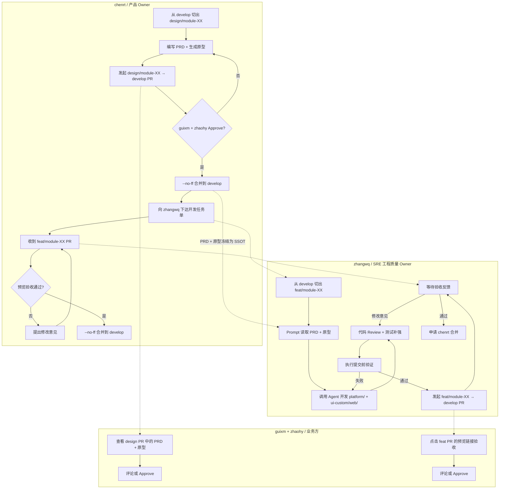

# MetricCenter 代码编写与提交环节详细流程

> 文档类型：团队协作规范\
> 目标读者：chenrt、zhangwq、guixm、zhaohy\
> 更新日期：2026-07-23

***

## 1. 目标

明确 MetricCenter 项目从**需求设计**到**代码合并到 develop** 的完整工程流程，确保：

- 产品侧 Vibe Coding（PRD + 原型）与开发侧 Vibe Coding（生产代码）清晰分离
- AI 代码生成在受控范围内执行
- 每个 `feat/module-XX` 分支都有清晰的边界和验收标准
- 代码质量由 AI 自检 + 人类 Review + 在线预览验收三重保障
- 合并到 `develop` 的代码可随时回滚

***

## 2. 流程总览

### 2.1 按阶段视角

```
Phase 1: 产品侧 Vibe Coding（chenrt）
├── 基于 develop 创建 design/module-XX
├── 编写 PRD：docs/02-product-requirements/Modules/Module_XX_*.md
├── 生成原型：docs/prototypes/module-XX/
├── 发起 design/module-XX → develop 的 PR
├── guixm + zhaohy review
└── chenrt --no-ff 合并到 develop
         │
         ▼
Phase 2: 开发侧 Vibe Coding（zhangwq）
├── 基于 develop 创建 feat/module-XX
├── Prompt 强制读取 PRD + 原型代码
├── 调用 Agent 生成 platform/ 和 ui-custom/web/ 代码
├── 人工 Review + 测试补强
├── 执行提交前验证
├── 发起 feat/module-XX → develop 的 PR
├── GitHub Actions 自动部署预览环境
├── chenrt + zhaohy + guixm 通过预览链接验收
└── chenrt --no-ff 合并到 develop
         │
         ▼
Phase 3: develop 验证
└── 再次执行提交前验证
```

### 2.2 按角色视角流程图



### 2.3 关键合并规则

| 分支                 | 合并目标               | 谁发起 PR  | 谁 Review                    | 谁合并               |
| ------------------ | ------------------ | ------- | --------------------------- | ----------------- |
| `design/module-XX` | `develop`          | chenrt  | guixm、zhaohy                | chenrt（`--no-ff`） |
| `feat/module-XX`   | `develop`          | zhangwq | zhangwq、zhaohy、guixm、chenrt | chenrt（`--no-ff`） |
| `release/*`        | `main` + `develop` | chenrt  | -                           | chenrt（`--no-ff`） |
| `hotfix/*`         | `main` + `develop` | zhangwq | chenrt                      | chenrt（`--no-ff`） |

***

## 3. Phase 1：产品侧 Vibe Coding

### 3.1 触发条件

- 需求拆解会已明确模块范围
- chenrt 决定进入设计阶段

### 3.2 负责人

- **设计分支 Owner**：chenrt（项目整体负责人 / 产品 Owner）
- **Review 方**：
  - guixm（业务架构师 / 管理视角）
  - zhaohy（业务需求提出方 / 一线业务视角）
- **技术可行性咨询**：zhangwq（SRE 工程师 / 工程质量 Owner）

> 各角色详细职责见 [`01_Role_Responsibilities.md`](01_Role_Responsibilities.md)。

### 3.3 创建设计分支

```bash
cd "/Users/chenrt/S-03Python/03 AIopsAgent-study/CNCF_Monitor-worktree"
git checkout develop
git pull origin develop
git checkout -b design/module-XX
```

### 3.4 生成 PRD

在 `docs/02-product-requirements/Modules/Module_XX_*.md` 中编写结构化 PRD：

```markdown
# Module XX: XXX

## 1. 背景与目标

## 2. 用户故事

## 3. 功能范围

## 4. UI/UX 规范
- Figma 链接：...
- 原型路径：docs/prototypes/module-XX/

## 5. 数据模型

## 6. API 规范

## 7. 验收标准（AC）
1. ...
2. ...
```

### 3.5 生成原型代码

通过 AI 工具（如 v0.dev、Bolt.new、Cursor）生成原型代码，保存到：

```text
docs/prototypes/module-XX/
├── index.html 或 App.tsx
├── components/
├── mocks/
└── README.md
```

原型代码要求：

- 能独立运行或简单预览
- 不依赖真实后端 API
- 不与 `platform/` 或 `ui-custom/web/` 共享文件

### 3.6 提交并发起 PR

```bash
git add docs/02-product-requirements/Modules/Module_XX_*.md
git add docs/prototypes/module-XX/
git commit -m "design(module-XX): 添加 XXX 模块 PRD 与原型

- 新增 PRD
- 新增可点击原型代码
"
git push origin design/module-XX
```

在 GitHub 上发起 `design/module-XX → develop` 的 Pull Request，Reviewer 指定 guixm 和 zhaohy。

### 3.7 Review 关注点

| Reviewer    | 关注重点                |
| ----------- | ------------------- |
| guixm       | 业务战略价值、MVP 范围、管理视角  |
| zhaohy      | 一线业务逻辑、用户故事完整性、验收标准 |
| zhangwq（可选） | 技术可行性、是否超出当前架构能力    |

### 3.8 合并到 develop

Review 通过后，chenrt 在主仓库执行：

```bash
cd "/Users/chenrt/S-03Python/03 AIopsAgent-study/CNCF_Monitor"
git checkout develop
git pull origin develop
git merge --no-ff design/module-XX
git push origin develop
```

合并后，`develop` 上该模块的 PRD + 原型即冻结，成为开发 AI 的 SSOT。

***

## 4. Phase 2：开发侧 Vibe Coding

### 4.1 触发条件

- `design/module-XX` 已合并到 `develop`
- chenrt 向 zhangwq 下达开发任务单

### 4.2 任务单内容

```markdown
## 开发任务单

**模块名称**：XXX
**设计分支**：design/module-XX
**功能分支**：feat/module-XX
**来源 PRD**：docs/02-product-requirements/Modules/Module_XX_*.md
**来源原型**：docs/prototypes/module-XX/
**验收标准**：
1. ...
2. ...
**预计工期**：X 天
**优先级**：高/中/低
**风险提示**：XXX
```

### 4.3 创建功能分支

```bash
cd "/Users/chenrt/S-03Python/03 AIopsAgent-study/CNCF_Monitor-worktree"
git checkout develop
git pull origin develop
git checkout -b feat/module-XX
```

### 4.4 Prompt 设计

zhangwq 的 prompt 必须强制 AI 读取 PRD 和原型代码：

```markdown
请作为 backend-developer 和 frontend-developer，基于以下输入实现 Module XX 的生产级代码：

**必读文档**：
- docs/02-product-requirements/Modules/Module_XX_*.md
- docs/prototypes/module-XX/ 下的所有原型文件
- docs/03-engineering-standards/03_API_Standard.md
- docs/03-engineering-standards/04_Testing_Standard.md
- docs/03-engineering-standards/01_Code_Isolation_Standard.md

**任务**：
1. 在 platform/ 下实现后端 API 与业务逻辑
2. 在 ui-custom/web/ 下实现前端页面与交互
3. 补充单元测试和集成测试

**约束**：
- 只能修改 platform/ 和 ui-custom/web/，禁止修改 docs/
- 前端使用 React 18 + TypeScript + Vite + Ant Design 5
- 后端使用 Gin + GORM + SQLite
- 平台能力 API 使用 /api/v2/platform/* 前缀
- 所有导出函数必须有注释
- URL 解析必须校验 scheme 和 host，防范 SSRF

**验收标准**：
1. go test ./platform/... 通过
2. go vet ./platform/... 通过
3. pnpm test 通过
4. pnpm lint 通过（0 errors / 0 warnings）
5. 服务启动后关键接口/页面可访问

关联执行记录：docs/04-execution-records/module-XX/
```

### 4.5 AI 开发

- 后端开发：调用 `backend-developer`
- 前端开发：调用 `frontend-developer`
- Prometheus 扩展：调用 `prometheus-developer`
- 构建修复：调用 `build-resolver`

zhangwq 在 AI 开发过程中应：

- 确保 AI 在正确的 `feat/module-XX` 分支上工作
- 确保 AI 只修改 `platform/` 和 `ui-custom/web/`
- 及时纠正偏离需求或原型的实现方向
- 遇到阻塞及时升级给 chenrt

### 4.6 人工 Review

#### Review 负责人

- **第一责任人**：zhangwq（SRE 工程师 / 工程质量 Owner）
- **第二责任人**：chenrt（项目整体负责人 / 产品 Owner，合并前最终 Review）

#### Review 清单

**安全性**

- [ ] URL 解析是否校验 scheme（仅 `http`/`https`）和 host
- [ ] 是否防范 SSRF
- [ ] 是否防范 SQL 注入
- [ ] 文件写入是否校验路径
- [ ] 配置下发是否有权限控制
- [ ] 是否有敏感信息泄露风险

**正确性**

- [ ] 实现是否符合 Module 文档
- [ ] 是否符合 `docs/prototypes/module-XX/` 原型表达的业务意图
- [ ] API 路径和响应格式是否符合 `03_API_Standard.md`
- [ ] 数据模型是否与 Module 文档一致
- [ ] 错误处理是否完善

**可维护性**

- [ ] 函数长度是否小于 50 行
- [ ] 文件长度是否小于 800 行
- [ ] 命名是否清晰
- [ ] 是否有重复代码
- [ ] 是否有过度工程化

**可测试性**

- [ ] 是否覆盖 happy path
- [ ] 是否覆盖边界情况
- [ ] 是否覆盖错误路径

### 4.7 测试补强

AI 通常能写出 happy path 测试，但容易遗漏：

- 异常输入
- 并发场景
- 权限边界
- 集成依赖

zhangwq 应补充：

**后端**

- 空输入、超大值、特殊字符
- 404、400、校验失败
- 并发读写
- 数据库迁移兼容性

**前端**

- 空列表状态
- 加载失败状态
- 表单校验边界
- 网络异常处理

### 4.8 提交前验证

#### 后端验证

```bash
# 静态检查
go test ./platform/...
go vet ./platform/...

# 服务启动验证
go run ./platform/cmd/metric-center/main.go

# 验证接口
curl http://localhost:8080/api/v1/health
curl http://localhost:8080/api/v1/health/db
curl http://localhost:8080/api/v1/status
```

#### 前端验证

```bash
cd ui-custom/web
pnpm test
pnpm lint

# 服务启动验证
exec ./node_modules/.bin/vite --host

# 验证页面
curl -I http://localhost:5173/
```

#### 通过标准

| 检查项                      | 通过标准                  |
| ------------------------ | --------------------- |
| `go test ./platform/...` | 全部通过                  |
| `go vet ./platform/...`  | 无问题                   |
| `pnpm test`              | 全部通过                  |
| `pnpm lint`              | 0 errors / 0 warnings |
| 后端服务启动                   | 关键接口返回 200            |
| 前端 dev server            | 页面返回 200              |

### 4.9 提交代码

```bash
git add <具体文件>
git commit -m "feat(module-XX): <动作> - <简短描述>

<详细说明>

关联: docs/04-execution-records/module-XX/<agent>.md"
```

### 4.10 发起 PR 并部署预览

```bash
git push origin feat/module-XX
```

在 GitHub 上发起 `feat/module-XX → develop` 的 Pull Request。

PR 描述必须包含：

```markdown
## 功能实现

**分支**：feat/module-XX
**来源设计**：design/module-XX
**来源 PRD**：docs/02-product-requirements/Modules/Module_XX_*.md
**来源原型**：docs/prototypes/module-XX/

## 变更范围

- platform/...
- ui-custom/web/...

## 测试结果

- [ ] go test ./platform/... 通过
- [ ] go vet ./platform/... 通过
- [ ] pnpm test 通过
- [ ] pnpm lint 通过

## 服务验证

- 后端服务启动成功，/api/v1/health 返回 200
- 前端 dev server 启动成功，/ 返回 200

## 预览链接

- 待 GitHub Actions 部署后 Bot 自动回复

## Reviewer

- [ ] zhangwq（代码 Review）
- [ ] zhaohy（业务验收）
- [ ] guixm（管理价值验收）
- [ ] chenrt（最终审批）
```

推送后 Vercel 自动部署该分支的 Preview 环境，Vercel Bot 在 PR 评论区回复：

```
Project        Deployment   Actions         Updated
---            ---          ---             ---
cncf-monitor   Ready        Preview Comment Jul 24, 2026
```

点击 `Preview` 即可打开当前 PR 的独立预览链接，例如：

```
https://cncf-monitor-git-feat-module-XX-chenrt-team.vercel.app
```

> **Vercel 配置要点**（已在本项目配置完成）：
> - Framework Preset: `Other`
> - Root Directory: `ui-custom/web`
> - Build Command: `tsc && vite build --base /`
> - Output Directory: `dist`
> - Install Command: `pnpm install`
> - Environment Variables: `VITE_STATIC_PREVIEW=true`（Production + Preview）
>
> 相关配置见 `ui-custom/web/vercel.json`。

***

## 5. Phase 3：业务验收与合并

### 5.1 验收方式

| 角色      | 项目角色                 | 验收动作              | 验收重点                 |
| ------- | -------------------- | ----------------- | -------------------- |
| zhangwq | SRE 工程师 / 工程质量 Owner | 代码 Review + 提交前验证 | 安全、正确性、可维护性、可测试性     |
| zhaohy  | 业务需求提出方 / 验收者        | 点击 Vercel Bot 的 `Preview` 链接验收 | 业务逻辑、一线操作习惯、是否解决实际问题 |
| guixm   | 业务架构师 / 需求共创者        | 点击 Vercel Bot 的 `Preview` 链接验收 | 管理价值、战略方向            |
| chenrt  | 项目整体负责人 / 产品 Owner   | 点击 Vercel Bot 的 `Preview` 链接 + 查看 diff | 产品符合度、架构一致性、合并决策     |

### 5.2 验收不通过处理

- 验收方在 PR 中评论具体问题
- zhangwq 调用对应 Agent 修改
- 修改后重新 push，`feat/module-XX` 预览链接自动更新
- 验收方再次查看并确认

### 5.3 合并到 develop

所有 Reviewer Approve 后，chenrt 在主仓库执行：

```bash
cd "/Users/chenrt/S-03Python/03 AIopsAgent-study/CNCF_Monitor"
git checkout develop
git pull origin develop
git merge --no-ff feat/module-XX
git push origin develop
```

### 5.4 develop 验证

合并后必须再次执行提交前验证：

```bash
cd "/Users/chenrt/S-03Python/03 AIopsAgent-study/CNCF_Monitor"

# 后端测试
go test ./platform/...
go vet ./platform/...

# 前端检查
cd ui-custom/web
pnpm test
pnpm lint

# 服务启动验证
go run ./platform/cmd/metric-center/main.go
exec ./node_modules/.bin/vite --host
```

验证失败处理：

- 立即停止后续模块开发
- 在 develop 上修复或 `git revert` 回退合并
- 修复后重新验证

***

## 6. PR 模板

### 6.1 design/module-XX PR 模板

```markdown
## 设计说明

**模块**：Module XX
**分支**：design/module-XX

## 变更内容

- [ ] 新增/更新 PRD：docs/02-product-requirements/Modules/Module_XX_*.md
- [ ] 新增/更新原型：docs/prototypes/module-XX/

## 原型预览

- [ ] 原型可在本地运行
- [ ] 原型链接/截图：（如有）

## Reviewer

- [ ] guixm
- [ ] zhaohy
```

### 6.2 feat/module-XX PR 模板

```markdown
## 功能实现

**模块**：Module XX
**分支**：feat/module-XX
**来源设计**：design/module-XX

## 变更范围

- platform/...
- ui-custom/web/...

## 测试结果

- [ ] go test ./platform/... 通过
- [ ] go vet ./platform/... 通过
- [ ] pnpm test 通过
- [ ] pnpm lint 通过

## 服务验证

- 后端服务启动成功，/api/v1/health 返回 200
- 前端 dev server 启动成功，/ 返回 200

## 预览链接

https://...

## Reviewer

- [ ] zhangwq
- [ ] zhaohy
- [ ] guixm
- [ ] chenrt
```

***

## 7. 执行记录

每个模块开发完成后，应在 `docs/04-execution-records/` 下创建执行记录：

```
docs/04-execution-records/
├── module-XX/
│   ├── README.md
│   ├── backend-developer.md
│   ├── frontend-developer.md
│   ├── golang-reviewer.md
│   ├── frontend-reviewer.md
│   └── merge-record.md
```

`merge-record.md` 记录：

- 合并时间
- 合并人
- 来源设计分支
- 预览链接
- 验收结论
- develop 验证结果

***

## 8. 禁止事项

1. **禁止产品经理的 AI 修改** **`platform/`、`ui-custom/web/`、`upstream/`** **目录**。
2. **禁止开发的 AI 修改** **`docs/02-product-requirements/`、`docs/prototypes/`** **目录**。
3. **禁止将** **`docs/prototypes/`** **中的原型代码直接复制到生产目录后原样合并**。
4. **禁止绕过提交前验证直接申请合并**。
5. **禁止在** **`feat/module-XX`** **分支混入其他模块改动**。
6. **禁止未经 chenrt 批准直接合并到** **`develop`**。

***

## 9. 相关文档

- [`00_Team_Charter.md`](00_Team_Charter.md) — 团队守则
- [`01_Role_Responsibilities.md`](01_Role_Responsibilities.md) — 角色职责速查表
- [`02_Demand_Workflow.md`](02_Demand_Workflow.md) — 需求设计环节详细流程
- [`../03-engineering-standards/03_API_Standard.md`](../03-engineering-standards/03_API_Standard.md) — API 标准
- [`../03-engineering-standards/04_Testing_Standard.md`](../03-engineering-standards/04_Testing_Standard.md) — 测试标准
- [`../03-engineering-standards/06_Gitflow_Branch_and_Rollback_Guide.md`](../03-engineering-standards/06_Gitflow_Branch_and_Rollback_Guide.md) — 分支策略与回退指南
- [`05_Vibe_Coding_Playbook_for_Zhangwq.md`](05_Vibe_Coding_Playbook_for_Zhangwq.md) — zhangwq Vibe Coding 执行手册

