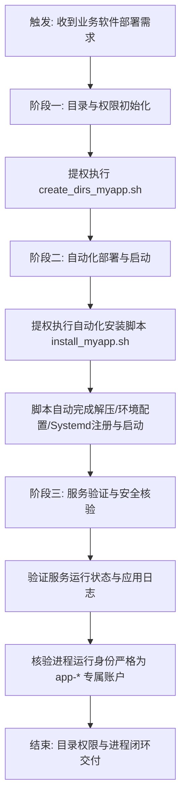

# 《业务软件标准化目录与权限配置操作手册》

## 一、 服务规范（规则与边界）

### 1.1 软件部署架构与环境隔离红线
本规范确立了“系统运行环境”与“业务运行环境”的绝对隔离原则，实现“Write Once, Run Anywhere”的业务系统平移。

*   **系统级保留区禁令**：`/usr/bin`、`/usr/local`、`/etc` 等系统核心目录，仅限用于安装操作系统维持自身运行所需的官方原生 RPM/DEB 包（如 sshd、chrony 等基础组件）。**严禁**将业务软件（如 JDK、Node.js、MySQL、Redis、Kafka 及各类中间件）通过 yum/apt 安装混入其中。
*   **业务专属区（沙箱隔离）**：所有非系统原生软件，一律采用二进制包（Binary）或绿色免编译包的形式，统一部署至 `/opt/apps/[软件名称]` 目录下。所有环境配置必须局部化，严禁污染全局系统变量。

### 1.2 目录基线与 SGID 权限模型
根据生产环境安全基线要求，软件的安装、数据和日志目录必须严格分离，并强制启用 SGID 权限（2750）以确保新建文件自动继承属组权限。

**（1）核心目录分离规范**

| 目录分类 | 路径示例 | 所有者和所属组 | 对应权限 | 访问控制与安全域说明 |
| :--- | :--- | :--- | :--- | :--- |
| **程序与配置文件** | `/opt/apps/[软件名称]` | `root:app-group` | 2750 | 业务软件、二进制包及配置统一安装目录。程序账户(`app-*`)仅有读/执行权限，严禁拥有写权限，防止应用漏洞导致程序被篡改。SGID 确保新建文件继承属组。 |
| **应用数据** | `/opt/data/[软件名称]` | `app-*:yunwei-group` | 2750 | 软件数据存储目录。程序账户具备读写执行权限，用于落盘业务数据。运维组可读。 |
| **应用日志** | `/opt/log/[软件名称]` | `app-*:yunwei-group` | 2750 | 程序运行日志存储目录。程序账户具备写入权限。运维组可查看日志。 |

**（2）应用内部目录结构规范 (`/opt/apps/[软件名称]/`)**

| 子目录规范 | 路径示例 | 所有者和所属组 | 对应权限 | 规范用途说明 |
| :--- | :--- | :--- | :--- | :--- |
| **主程序/依赖包** | `.../lib` 或 `.../bin` | `root:app-group` | 2750 | 存放二进制可执行文件及依赖库。 |
| **独立配置文件** | `.../conf` | `root:app-group` | 2750 | 存放应用的 yaml、xml、ini 等配置文件。 |
| **环境变量脚本** | `.../env` | `root:app-group` | 2750 | **核心**：存放环境定义脚本（如 `env.sh`），启动时动态加载，不污染全局系统。 |
| **启动/停止脚本** | `.../script` | `root:app-group` | 2750 | 存放管理进程生命周期的定制化 shell 脚本。 |

---

## 二、 操作流程（执行流转）

业务软件的标准化二进制部署由于已深度封装，现分为以下三个核心执行阶段：



---

## 三、 操作手册 (SOP)

**执行身份要求**：必须通过堡垒机使用**具有 sudo 权限的运维账户**登录目标主机，执行脚本及命令时使用 `sudo bash` 提权运行。以下 SOP 以部署 **MySQL** 为例。

### 3.1 阶段一：执行目录初始化自动化脚本
*   **脚本名称**：`create_dirs_myapp.sh`
*   **配置变量**：

| 变量名 | 说明 | 明确示例值 (以 mysql 为例) |
| :--- | :--- | :--- |
| `APP_NAME` | 软件名称 (将作为目录名和部分账户名后缀) | `mysql` |
| `APP_USER` | 程序账户名 | `app-mysql` |
| `QIDONG_GROUP` | 启动组名 | `app-group` |
| `YUNWEI_GROUP` | 运维管理组名 | `yunwei-group` |

*   **操作步骤**：
    1. **编辑脚本**：执行 `vim create_dirs_myapp.sh`，将开头的 4 个全局变量准确替换为实际业务信息。
    2. **赋予权限**：执行 `chmod 700 create_dirs_myapp.sh` 确保脚本安全性。
    3. **提权执行**：执行 `sudo bash create_dirs_myapp.sh`，脚本将自动完成前置检查、创建 `/opt/apps`、`/opt/data`、`/opt/log` 等子目录，并赋予 `2750` 权限。
    4. **安全归档**：执行 `mv create_dirs_myapp.sh /opt/archive/`。
    5. **清理历史**：执行 `history -c && history -w` 擦除操作痕迹。

### 3.2 阶段二：执行自动化部署与启动脚本
在初始化完标准目录结构后，不再需要人工解压二进制包、编写 `env.sh` 或注册 Systemd。此过程由配套的部署脚本一键接管。

*   **脚本名称**：`install_mysql.sh` (以业务软件实际提供的安装脚本为准)
*   **操作步骤**：
    1. 确认安装脚本与配套二进制包已上传至主机备份目录。
    2. **赋予权限**：执行 `chmod 700 install_mysql.sh`。
    3. **提权执行**：执行 `sudo bash install_mysql.sh`。脚本在底层将自动完成解压入驻、局部环境变量配置、Systemd 服务文件写入以及进程拉起。
    4. **安全归档**：执行 `mv install_mysql.sh /opt/archive/`。
    5. **清理历史**：执行 `history -c && history -w`。

### 3.3 阶段三：服务验证与安全核验（核心强制检查项）
自动化脚本执行完毕后，运维必须对服务状态及进程权限进行**“双重核验”**，确保其符合系统的安全隔离红线。

*   **操作步骤**：
    1. **验证守护进程状态**：
       使用 systemctl 检查服务是否已成功注册并稳定运行。
       ```bash
       systemctl status mysql.service
       ```
    2. **安全核验：强制检查进程归属账户**：
       **【安全红线】** 严禁业务进程以 `root` 权限运行。必须确认当前进程的属主为该软件对应的专属程序账户（如 `app-mysql`）。
       ```bash
       ps -eo user,pid,cmd | grep mysql
       ```
       *(预期结果：第一列的用户列必须显示为 `app-mysql`，若显示为 `root`，需立即停止服务并打回排查启动脚本。)*
    3. **验证应用日志**：
       检查业务标准日志目录是否有正常输出且无严重报错。
       ```bash
       tail -n 100 /opt/log/mysql/error.log
       ```

---

## 四、 文档版本控制

| 版本      | 更新日期        | 修订内容摘要                                                                                                                                                             | 修订人      |
| :------- | :------------- | :---------------------------------------------------------------------------------------------------------------------------------------------------------------------- | :--------- |
| V2.0     | 2026-04-02     | 初版建立软件目录创建及权限管理架构。                                                                                                                                        | 运维组      |
| V2.1     | 2026-04-23     | 基于材料最小化与强执行红线重构：上浮隔离红线与 SGID 权限规范；补充部署全阶段 Mermaid 流程图；完善解压部署与 Systemd 配置的SOP。                                                    | 运维组      |
| **V2.2** | **2026-04-23** | **接入自动化部署工作流：使用自动化安装脚本替换原人工解压与配置环节；重构第三阶段为“服务验证与安全核验”，并新增防越权红线——强制检查服务进程是否由限定的 `app-*` 程序账户运行。** | **运维组** |